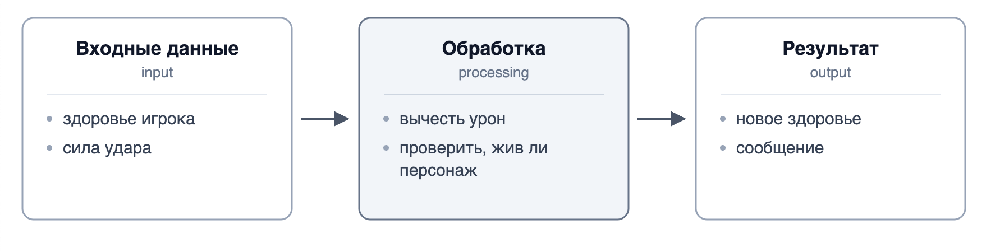
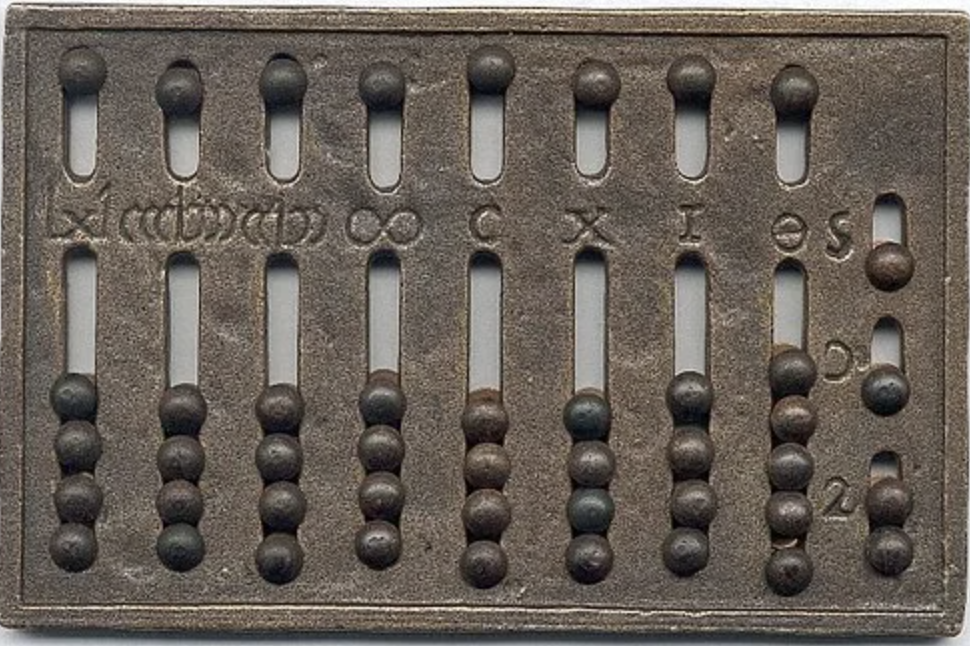
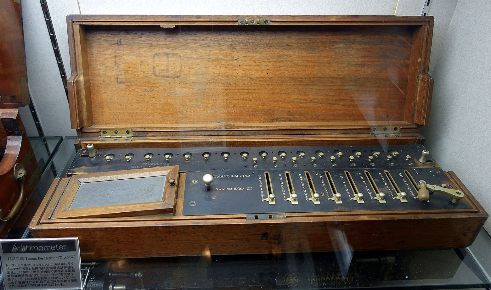

# История программирования. Что такое программирование?

## Содержание

- [История программирования. Что такое программирование?](#история-программирования-что-такое-программирование)
  - [Содержание](#содержание)
  - [Вопросы для самопроверки](#вопросы-для-самопроверки)
  - [Введение в курс](#введение-в-курс)
    - [Для кого этот курс?](#для-кого-этот-курс)
    - [Про что этот курс?](#про-что-этот-курс)
    - [Почему C++?](#почему-c)
    - [Зачем программирование дизайнеру игр?](#зачем-программирование-дизайнеру-игр)
    - [Как изучать материал, чтобы он остался в голове](#как-изучать-материал-чтобы-он-остался-в-голове)
    - [Подытожим](#подытожим)
  - [Как читать материалы курса](#как-читать-материалы-курса)
  - [Задача, исполнитель и точные инструкции](#задача-исполнитель-и-точные-инструкции)
  - [Немного истории про вычислительные устройства](#немного-истории-про-вычислительные-устройства)
    - [От счётов к арифмометру](#от-счётов-к-арифмометру)
    - [Жаккардов станок: поведение, записанное отдельно от машины](#жаккардов-станок-поведение-записанное-отдельно-от-машины)
    - [Аналитическая машина Бэббиджа и заметки Ады Лавлейс](#аналитическая-машина-бэббиджа-и-заметки-ады-лавлейс)
    - [Архитектура фон Неймана и принцип хранимой программы](#архитектура-фон-неймана-и-принцип-хранимой-программы)
    - [Компьютерная эра](#компьютерная-эра)
  - [Языки программирования](#языки-программирования)
    - [Низкоуровневые языки программирования](#низкоуровневые-языки-программирования)
    - [Высокоуровневые языки программирования](#высокоуровневые-языки-программирования)
    - [Поколения языков](#поколения-языков)
    - [Псевдокод](#псевдокод)
  - [Как в компьютере представлены данные](#как-в-компьютере-представлены-данные)
    - [Представление чисел](#представление-чисел)
    - [Представление символов и текста](#представление-символов-и-текста)
  - [Компиляция и интерпретация](#компиляция-и-интерпретация)
    - [Что такое компиляция?](#что-такое-компиляция)
    - [Что такое интерпретация?](#что-такое-интерпретация)
    - [Различия между компиляцией и интерпретацией](#различия-между-компиляцией-и-интерпретацией)
    - [Ошибки при выполнении программы](#ошибки-при-выполнении-программы)
  - [Первая программа!](#первая-программа)
  - [Резюме](#резюме)

## Вопросы для самопроверки

1. Чем алгоритм отличается от программы? Приведите пример алгоритма, который можно записать несколькими разными способами.
2. Почему абак не считается вычислительной машиной, хотя с его помощью выполняют вычисления?
3. Какую идею внёс в развитие вычислительной техники жаккардов станок, если он не выполнял никаких вычислений?
4. Что умела аналитическая машина Бэббиджа, чего не умел ткацкий станок с перфокартами? Почему это принципиально?
5. Сформулируйте принцип хранимой программы. Какие возможности он открыл?
6. Байт содержит значение `01000010`. Какое число он представляет? Какой символ он представляет в кодировке ASCII, если `A` соответствует 65? Как программа определяет, что именно тут хранится?
7. Программа успешно скомпилировалась, запустилась и вывела число 130 вместо ожидаемого 70. Какого рода это ошибка и почему компилятор её не обнаружил?
8. Автор игры на компилируемом языке выпускает её для игроков. Что именно он им передаёт и что при этом остаётся у него?

## Введение в курс

### Для кого этот курс?

Курс написан для студентов первого курса специальности Game Design и рассчитан на первый семестр.

Уровень у всех студентов разный. Кто-то писал код в школе, кто-то видел программирование в роликах на YouTube, а кто-то откроет редактор кода впервые в жизни. Материал составлен из расчёта, что вы имеете минимальные знания в программировании: каждое понятие вводится с нуля, и ничего не считается "очевидным" просто потому, что об этом уже упоминали раньше.

Если опыт у вас всё-таки есть, скучно быть не должно. Объяснения идут дальше, чем "вот такой синтаксис": много места отведено разбору того, почему программа ведёт себя именно так, что хранится в памяти в каждый момент, какие ошибки допускают чаще всего и почему работающий код не всегда хороший код. Школьный курс информатики помогает, но уверенного понимания не гарантирует, и это нормально

Из предварительных знаний нужны только школьная математика и умение пользоваться компьютером.

### Про что этот курс?

Программировать мы будем на C++, но курс не про C++.

Он про то, как решать задачи так, чтобы решение мог выполнить исполнитель, который ни о чём не догадывается. Это отдельный навык, и он не привязан к языку. Человек, который им владеет, переходит на новый язык за пару недель. Человек, который выучил синтаксис, но не научился думать, останавливается на первой же незнакомой задаче.

К концу семестра вы должны уметь взять небольшую задачу и пройти весь путь самостоятельно: понять условие, определить входные данные и ожидаемый результат, придумать алгоритм, записать его в псевдокоде, реализовать на C++, проверить на нескольких наборах данных, найти и исправить ошибку и объяснить своё решение другому человеку.

### Почему C++?

Не потому, что это лучший язык. Лучшего языка не существует, есть подходящий для задачи.

C++ выбран по двум причинам. Во-первых, он заставляет проговаривать вслух то, что другие языки прячут: какого типа значение, что происходит при вычислении, где заканчивается область действия имени. Когда вы учитесь, это плюс, даже если поначалу кажется занудством. Во-вторых, на C++ написана значительная часть игровой индустрии, включая Unreal Engine, так что знакомство с ним вам ещё пригодится.

### Зачем программирование дизайнеру игр?

Вы не обязаны становиться программистом. Но игровая механика по своей природе и есть алгоритм: правила, состояния, условия, счётчики, проверки. Когда вы описываете, при каком условии враг переходит в атаку и что происходит с его здоровьем, вы уже пишете алгоритм, просто словами.

Кроме того, понимание программирования даёт три вполне практические вещи. Вы начинаете чувствовать, какая идея дёшева в реализации, а какая потребует месяцев работы. Вы можете разговаривать с программистами на одном языке и понимать, почему они спорят. И вы можете сами собрать прототип механики, вместо того чтобы описывать её на словах и ждать.

### Как изучать материал, чтобы он остался в голове

Здесь у каждого свой ритм, поэтому дам несколько советов, которые работают у большинства.

1. _Берите по одной теме за раз_. Программирование плохо усваивается штурмом: пропущенное понятие обязательно всплывёт через две недели и сломает всё остальное.
2. _Набирайте код руками и запускайте его_. Не копируйте примеры из файла: пока вы набираете сами, вы замечаете детали, которые глаз при чтении пропускает. Меняйте значения, ломайте программу нарочно, смотрите, что она скажет.
3. _Держите рядом лист бумаги_. Умение вручную пройти программу по шагам, выписывая значения переменных, это главный навык первого семестра. Он же спасает на экзамене, где компилятора не будет.
4. _Прежде чем писать код, скажите словами, что программа должна делать_. Если не получается сформулировать словами, код тем более не получится.
5. _Лабораторные работы делайте самостоятельно, без ИИ_. Как выйдет. Уже после этого можно сравнить своё решение с чужим и посмотреть, что было сделано иначе.
6. _ИИ полезен как тренажёр_. Попросите его придумать вам задачи по текущей теме или объяснить, почему компилятор ругается, и решайте сами. _Готовое решение, вставленное в лабораторную, не даёт вам ничего, кроме оценки_.
7. _Не расстраивайтесь из-за ошибок_. Программа почти никогда не работает с первого раза, и это касается всех, включая преподавателя. Ошибка это не приговор, а сообщение о том, что вы чего-то пока не понимаете.
8. _Объясните тему кому-нибудь_. Лучше всего человеку не из IT. В этот момент моментально становится видно, где вы разобрались, а где просто запомнили слова.
9. _Начните свой маленький проект_. Текстовая игра с выбором действий, простой симулятор боя, генератор случайных подземелий на десять строк. Пусть он получится кривым. Свой проект учит быстрее любой лабораторной, потому что там вы сами решаете, что должно работать.

### Подытожим

Цель курса в том, чтобы к концу семестра вы смотрели на программу не как на набор странных символов, а как на точную запись понятного вам алгоритма. Всё остальное, включая любой другой язык и любой движок, после этого дело техники.

Мне будет приятно, если после этого семестра кто-то из вас поймает то самое чувство, ради которого люди и остаются в программировании: когда штука, которую вы придумали сами, наконец заработала.

Вперед? Вперед!

## Как читать материалы курса

В тексте лекций используется несколько соглашений об оформлении.

**Жирным шрифтом** выделяется новый термин в том месте, где он определяется. Если вы видите жирное слово, значит, здесь вводится понятие, которое будет использоваться дальше.

_Курсивом_ выделяется смысловой акцент: слово или фраза, на которую стоит обратить особое внимание при чтении.

`Моноширинным шрифтом` записываются элементы кода: имена переменных и функций, значения, отдельные операторы, имена файлов и команды. Если в предложении встречается `health`, речь идёт о конкретном имени в программе, а не о слове "здоровье" в обычном смысле.

Крупные фрагменты кода и псевдокода выносятся в отдельные блоки:

```cpp
int health = 100;
```

Отдельные замечания оформляются как выделенные блоки четырёх видов.

> [!NOTE]
> Дополнительное пояснение или уточнение, которое помогает лучше понять тему.

> [!IMPORTANT]
> Мысль, которую нужно запомнить. Обычно это то место, где студенты чаще всего строят неверную модель.

> [!WARNING]
> Предупреждение об ошибке, которая приводит к неправильной работе программы.

> [!TIP]
> Практический совет, облегчающий работу.

Ссылки вида [^1] ведут к списку источников в конце лекции. Схемы нумеруются двумя числами: первое - номер лекции, второе - номер схемы внутри неё. На них ссылаются по номеру, например "на схеме 1.2".

Многие термины даются сразу на двух языках: по-русски и по-английски. Английские названия вам понадобятся, потому что сообщения компилятора, документация и большая часть профессиональной литературы написаны на английском.

## Задача, исполнитель и точные инструкции

Представьте, что вас попросили объяснить другому человеку, как приготовить чай. Скорее всего, вы скажете что-то вроде:

1. вскипяти воду,
2. положи пакетик в чашку,
3. залей кипятком, подожди пару минут.

Этого достаточно, потому что человек догадается об остальном. Он знает, где чайник, понимает, что чашка должна быть пустой, и не станет заливать кипяток мимо.

Теперь представьте, что то же самое нужно объяснить устройству, которое не догадывается ни о чём. Оно выполнит ровно то, что написано, ровно в том порядке, в котором написано, и остановится, если очередное указание окажется бессмысленным. Придётся уточнить, сколько именно воды, что значит "подожди", и что делать, если пакетиков не осталось.

Разница между этими двумя ситуациями и есть главная трудность программирования. Компьютер невероятно быстр и совершенно не сообразителен.

Возьмём пример ближе к вашей специальности.

Дизайнер формулирует правило:

> "враг атакует игрока, когда тот подходит близко".

Человеку понятно. Программисту предстоит ответить на несколько вопросов, прежде чем это правило можно будет реализовать.

1. Что считать расстоянием и как оно измеряется?
2. Какое значение расстояния считается близким?
3. Как часто проверяется это условие?
4. Что происходит, если игрок уже мёртв?
5. Что происходит, если рядом оказались два игрока?

Ни один из этих вопросов не является придиркой. Пока на них нет ответа, правило нельзя выполнить механически.

Введём несколько понятий, которые помогут нам в дальнейшем понимать материал.

**Исполнитель** - тот, кто выполняет указания. Им может быть человек, механическое устройство или процессор компьютера. У любого исполнителя есть набор действий, которые он умеет выполнять, и он не умеет ничего, кроме них.

**Инструкция (instruction)** - одно отдельное указание исполнителю выполнить определённое действие. Например, "вскипяти воду" или "положи пакетик в чашку" или "выведи сообщение на экран".

**Алгоритм (algorithm)** - это набор инструкций или шагов, предназначенных для решения конкретной задачи за ограниченное время.

*Он обладает следующими свойствами*.

- Задача четко определена и включает ясные определения входных и выходных данных.
- Обладает осуществимостью и может быть выполнен за ограниченное количество шагов, времени и памяти.
- Каждый шаг имеет определенное значение, и при одинаковых входных данных и условиях выполнения результат всегда будет одинаковым.


**Программа (program)** - алгоритм, записанный на языке, понятном конкретному исполнителю, в форме, пригодной для выполнения.

_Алгоритм и программа - разные вещи_, и путать их не стоит. Алгоритм существует в вашей голове, на бумаге или в виде схемы. Он не привязан к языку. Программа - это конкретная запись, предназначенная для конкретного исполнителя. Один и тот же алгоритм можно записать на C++, на другом языке или объяснить словами человеку.

Почти любая задача, которую мы будем решать, укладывается в общую схему: программа получает данные, что-то с ними делает и выдаёт результат:



_Рисунок 1.1. Общая схема работы программы._

**Входные данные (input)** - то, что программа получает извне: введённое пользователем число, нажатая клавиша, содержимое файла, положение мыши. Иногда входных данных может не быть вовсе.

**Результат (output)** - то, что программа выдаёт наружу: текст на экране, изменённое изображение, записанный файл, звук.

Между ними находится обработка: последовательность действий, которая превращает одно в другое. Именно эту часть вы и будете придумывать весь семестр, хотя, скорее всего всю вашу профессиональную жизнь вы будете заниматься именно этим.

> [!IMPORTANT]
> Компьютер не понимает, чего вы хотели. Он выполняет то, что вы написали. Большинство ошибок начинающих возникает не потому, что человек не знает синтаксис, а потому, что он не сформулировал задачу до конца.

## Немного истории про вычислительные устройства

### От счётов к арифмометру

Перед тем как переходить к программированию, полезно понять, как люди решали вычислительные задачи до появления компьютеров.

Идея переложить вычисления на устройство намного старше компьютеров. Начнём с абака (en. abacus).

**Абак** - счётное приспособление, в котором числа представлены положением костяшек или камешков. В разных культурах он выглядел по-разному: римский абак, китайский суаньпань, японский соробан, привычные многим русские счёты. Общее у них одно: устройство _хранит_ число, но не вычисляет.



_Рисунок 2.1. Абак._

На это стоит обратить внимание. Абак запоминает текущее состояние вычисления, освобождая человека от необходимости держать промежуточные результаты в голове. Сам же порядок действий, то есть алгоритм, остаётся в голове человека.

В XVII веке начали строить машины, которые выполняли уже само действие. В 1642 году Блез Паскаль собрал механический аппарат, складывавший и вычитавший числа за счёт поворота зубчатых колёс с переносом разряда.

В 1673 году Готфрид Вильгельм Лейбниц построил машину, умевшую также умножать и делить, сводя эти операции к многократному сложению и вычитанию. Обе машины оставались редкими и дорогими экземплярами.

Серийным устройство стало в XIX веке. **Арифмометр** Шарля Ксавье Тома де Кольмара, представленный в 1820 году, выпускался в течение десятилетий и использовался в конторах и инженерных бюро[^4].



_Рисунок 2.2. Арифмометр._

Что изменилось по сравнению с абаком, и что осталось прежним? Изменилось то, что арифметическое действие теперь выполняет механизм: человеку не нужно знать, как складывать столбиком. Осталось прежним то, что _последовательность_ действий по-прежнему задаёт человек. Он крутит ручку, записывает промежуточный результат на бумагу, вводит следующее число. Машина умеет выполнять операцию, но не умеет выполнять алгоритм.

Чтобы двинуться дальше, нужно было научиться задавать машине не одно действие, а порядок действий.

### Жаккардов станок: поведение, записанное отдельно от машины

Следующая идея пришла не из математики, а из ткацкого производства.

Чтобы получить ткань с узором, нужно на каждом ряду поднимать определённый набор нитей. Раньше этим занимался помощник ткача, вручную и по памяти. Смена узора означала долгую и утомительную перенастройку.

В начале XIX века Жозеф Мари Жаккар применил к ткацкому станку механизм управления перфокартами: картонными картами с пробитыми отверстиями.

1. Карты соединялись в ленту и подавались в станок по одной.
2. Там, где в карте было отверстие, крючок проходил насквозь и поднимал нить; там, где отверстия не было, нить оставалась на месте.
3. Каждая карта задавала один ряд узора, а вся лента - весь рисунок.

Идея управлять станком перфорированной лентой появилась ещё раньше, но именно машина Жаккара получила широкое распространение[^4].

Отсюда следует вывод, ради которого мы и вспомнили ткацкий станок. Чтобы изменить узор, машину больше не нужно переделывать. Достаточно поменять стопку карт. _Поведение машины отделилось от самой машины и превратилось в данные, которые можно приготовить заранее, сохранить, скопировать и передать другому._

### Аналитическая машина Бэббиджа и заметки Ады Лавлейс

Английский математик Чарльз Бэббидж занимался задачей, которая в XIX веке была вполне практической: таблицы логарифмов и навигационные таблицы вычислялись людьми вручную и содержали ошибки, а ошибка в навигационной таблице могла стоить корабля. Сначала он спроектировал разностную машину для вычисления значений многочленов. Затем, с 1830-х годов, взялся за куда более общий замысел - **аналитическую машину (Analytical Engine)**[^5].

В её проекте есть части, которые вы узнаете. Был склад (store) для хранения чисел, то есть память. Была мельница (mill), выполнявшая арифметические операции, то есть то, что сегодня называют арифметическим устройством. Порядок работы задавался перфокартами, заимствованными у ткацкого станка. Результаты выводились печатающим механизмом.

Главное отличие от станка Жаккара состояло в том, что машина Бэббиджа могла _менять ход работы в зависимости от результата вычислений_. Она умела перейти к другому месту последовательности карт при выполнении условия и повторить участок вычислений нужное число раз. Это то, что вы позже будете писать как `if` и как цикл. Механическая машина, никогда не построенная при жизни автора, уже содержала обе конструкции.

Рядом с этим проектом стоит имя Ады Лавлейс. В 1843 году она перевела статью итальянского инженера Луиджи Менабреа об аналитической машине и добавила к переводу свои примечания, которые вышли длиннее самой статьи. Это одна из первых опубликованных записей алгоритма для машины, поэтому Лавлейс называют первым программистом, хотя историки спорят, чей вклад здесь больше, её или Бэббиджа.

Там же она заметила, что машина обрабатывает символы, а числа лишь один из возможных смыслов этих символов. Что удалось записать символами, то машина сможет обработать; в пример Лавлейс привела музыку. Для вашей специальности это важно. Компьютер не знает, что такое персонаж или текстура. Здоровье - число, позиция - несколько чисел, цвет пикселя - тоже числа.

> [!IMPORTANT]
> Условие и повторение появились в проекте механической машины задолго до электронных компьютеров. Значит, это идеи программирования, а не особенности языка программирования. В другом языке они будут записаны иначе, но останутся теми же.

### Архитектура фон Неймана и принцип хранимой программы

Первые электронные вычислительные машины середины XX века считали быстро, но программировались тяжело. ENIAC, запущенный в 1945 году, задавали переключателями и перекоммутацией кабелей: переход к другой задаче занимал часы и дни физической работы. Программа была не текстом, а состоянием проводов.

В 1945 году был подготовлен документ "First Draft of a Report on the EDVAC", подписанный именем Джона фон Неймана, в котором описана другая организация машины[^3]. Схожие идеи в то время обсуждались несколькими группами инженеров, включая создателей ENIAC, и авторство отдельных положений до сих пор обсуждается, но описанное в отчёте устройство закрепилось в литературе как **архитектура фон Неймана**.

Её суть в следующем: программа хранится в той же памяти, что и данные, и представлена такими же числами.

Устройство управления по очереди читает из памяти очередную инструкцию, определяет, что она означает, и организует её выполнение. Арифметическое устройство выполняет вычисления. Затем читается следующая инструкция, и всё повторяется. Этот бесконечно повторяющийся круг чтения и выполнения инструкций и есть работа процессора.

Следствия принципа хранимой программы оказались огромными. Программу стало можно загрузить в память как обычные данные, а значит, записать на носитель, скопировать, передать, заменить другой без единого прикосновения к железу.

Первой работающей машиной, выполнившей программу из собственной памяти, стала экспериментальная установка Manchester Baby в 1948 году[^4].

Практически все компьютеры, с которыми вы сталкиваетесь, построены по этой схеме. Внутри современных процессоров множество усовершенствований, но базовая модель осталась той же: инструкции лежат в памяти, процессор читает их по очереди и выполняет.

> [!NOTE]
> Отсюда следует важная для нас вещь. Когда вы позже будете разбирать, как выполняется ваша программа, вы будете рассуждать в терминах "какая инструкция выполняется сейчас" и "какие значения сейчас хранятся в памяти". Это не учебное упрощение. Это и есть модель работы машины.

### Компьютерная эра

Дальнейшая история сводится в основном к смене элементной базы и к росту количественных показателей.

Машины на электронных лампах занимали залы, потребляли десятки киловатт и часто выходили из строя. Транзисторы сделали технику меньше, надёжнее и экономичнее. Интегральные схемы позволили разместить множество транзисторов на одном кристалле.

В 1971 году появился Intel 4004, первый серийный микропроцессор, то есть процессор, целиком помещающийся в одну микросхему[^4]. Дальше последовали персональные компьютеры, а затем игровые консоли, ноутбуки, смартфоны и всё остальное, чем вы пользуетесь ежедневно.

Изменились цифры: тактовая частота, объём памяти, количество ядер, стоимость одного вычисления. Не изменилась модель. Смартфон в вашем кармане - это машина с памятью, в которой лежат инструкции и данные, и с процессором, который читает эти инструкции по очереди.

## Языки программирования

### Низкоуровневые языки программирования

Процессор понимает только числа. **Машинный код (machine code)** - представление программы в виде чисел, каждое из которых означает либо операцию, либо её операнд, в форме, непосредственно выполняемой процессором. Для человека это выглядит как поток чисел вида `144, 235, 10, 195, ...`, в котором нужно помнить, что означает каждое из них и сколько чисел занимает каждая инструкция.

Например, для процессоров семейства x86 число

- `144` означает "ничего не делать",
- `195` - "вернуться из подпрограммы",
- а пара `235, 10` - переход к другому месту программы, где второе число задаёт, насколько далеко нужно перейти[^8]. Число 10 здесь не команда, а операнд предыдущей инструкции.

Ранние программы действительно записывали так. Ошибиться было очень легко, а найти ошибку - очень трудно: сдвиг на одно число превращал программу в бессмыслицу. Кроме того, машинный код разных процессоров не совпадает, поэтому программу приходилось переписывать заново для каждой новой машины.

Первое улучшение состояло в том, чтобы дать инструкциям читаемые имена. Язык ассемблера использует короткие мнемонические обозначения вместо чисел. Схематично программа на нём выглядит примерно так:

```text
LOAD   R1, health
LOAD   R2, damage
SUB    R1, R2
STORE  health, R1
```

Это условная иллюстрация в духе ассемблерных языков, а не код для конкретного процессора: у каждого семейства процессоров свой набор инструкций и своя запись. Смысл здесь такой: взять значение из ячейки `health`, взять значение из ячейки `damage`, вычесть второе из первого, записать результат обратно в `health`. Переводом такого текста в машинный код занимается отдельная программа, **ассемблер**.

Читать это уже можно, но каждая строка по-прежнему соответствует одной машинной инструкции. Чтобы вычесть урон из здоровья, приходится расписывать пересылки между ячейками.

Такие языки программирования называются **низкоуровневыми**, потому что они работают близко к "машинному коду" и к "железу". Для них характерны следующие особенности:

- Команды напрямую управляют памятью, регистрами и процессором;
- Код, написанный под один процессор, обычно не подходит для другого;
- Программы работают быстро и занимают мало места;
- Требуются глубокие знания архитектуры компьютера.

### Высокоуровневые языки программирования

Следующий шаг - **языки высокого уровня (high-level languages)**, в которых запись отражает смысл действия, а не устройство процессора. То же самое вычисление на C++ выглядит так:

```cpp
health = health - damage;
```

Одна строка, в которой видно намерение, и никаких упоминаний регистров. Перевод в машинный код взял на себя **компилятор**.

Первые такие языки появились в конце 1950-х годов:

- _Fortran_ (1957) создавался для научных и инженерных расчётов;
- _COBOL_ (1959) - для обработки деловых данных;
- _ALGOL_ (1958) - для описания алгоритмов;

Идея программ, переводящих текст в машинный код, развивалась в те же годы; одну из первых таких программ, A-0, в начале 1950-х разработала Грейс Хоппер[^4].

В 1972 году Деннис Ритчи создал язык C. На его основе Бьёрн Страуструп с конца 1970-х разрабатывал расширение, получившее в 1983 году название C++ и вышедшее в коммерческий выпуск в 1985 году[^1]. Позже появились Python, Java, C# и множество других языков.

### Поколения языков

Языки принято грубо делить на поколения по уровню абстракции.

| Поколение | Что это                                      | Пример записи               | Кто переводит                |
| --------- | -------------------------------------------- | --------------------------- | ---------------------------- |
| 1GL       | Машинный код                                 | `183, 12, 96`               | Никто, выполняется напрямую  |
| 2GL       | Язык ассемблера                              | `SUB R1, R2`                | Ассемблер                    |
| 3GL       | Языки высокого уровня                        | `health = health - damage;` | Компилятор или интерпретатор |
| 4GL       | Языки, ориентированные на предметную область | `SELECT name FROM players`  | Специализированная система   |

> [!NOTE]
>
> Деление удобно для разговора, но условно. Чёткой границы между третьим и четвёртым поколением нет, и один и тот же язык разные авторы относят к разным поколениям. Пользуйтесь этой таблицей как способом упорядочить представление об уровнях абстракции, а не как строгой классификацией.

Полезнее другой взгляд. Чем выше уровень языка, тем ближе запись к формулировке задачи и тем дальше она от устройства машины. Программу становится проще писать и читать, но вы теряете часть контроля над тем, что именно происходит внутри.

C++ в этом ряду занимает особое положение: он позволяет писать понятный код и при этом сохраняет прямой доступ к низкоуровневым деталям, когда они нужны. Именно поэтому он до сих пор широко применяется там, где важна производительность, в том числе в игровых движках. Мы выбрали его для курса не потому, что он лучший вообще, а потому, что он заставляет явно проговаривать вещи, которые в других языках спрятаны, и это полезно, когда вы учитесь.

> [!IMPORTANT]
> Язык меняет способ записи алгоритма. Он не меняет ни саму задачу, ни алгоритм её решения. Тот, кто научился решать задачи, осваивает новый язык за разумное время. Тот, кто выучил синтаксис, но не научился думать, останется беспомощным при первой же незнакомой задаче.

### Псевдокод

Раз запись алгоритма зависит от языка, а сам алгоритм - нет, удобно иметь способ записывать алгоритм вообще без языка.

**Псевдокод (pseudocode)** - человекочитаемый способ описания алгоритма, который похож на программный код, но не принадлежит конкретному языку программирования и обычно не выполняется компьютером напрямую.

Нет определенного правила, как именно писать псевдокод. Главное - чтобы он был понятен человеку и отражал логику алгоритма.

Например,

```text
input health
input damage

health = health - damage

if health <= 0
    output "Game Over"
endif
```

Прочитать это можно, ничего не зная о C++. Именно в этом смысл. Псевдокод позволяет сосредоточиться на логике решения, обсудить порядок действий с другим человеком и проверить замысел до того, как вы начнёте разбираться с точками с запятой и сообщениями компилятора.

> [!TIP]
>
> Единого официального стандарта псевдокода не существует. Разные учебники и разные преподаватели пишут его немного по-разному, и это нормально. Мы будем придерживаться одного последовательного стиля, чтобы записи были одинаково понятны всем. Подробно им займёмся на следующем занятии.

## Как в компьютере представлены данные

Следующим важным разделом будет рассмотрение того, как в компьютере представлены данные. Эта тема всегда вызывала испуг у новичков, потому что за привычными числами и текстом скрывается сложная структура из нулей и единиц. Мы рассмотрим только основы, чтобы понять, как компьютер хранит и обрабатывает информацию.

Компьютеру для работы нужно хранить значения. Хранит он их в виде электрических состояний, и надёжнее всего различать всего два состояния: _есть напряжение_ или _нет_, намагничено или нет. Различать десять уровней сложнее и гораздо менее устойчиво к помехам. Отсюда двоичность всей вычислительной техники.

**Бит (bit)** - минимальная единица информации, принимающая одно из двух значений, обычно обозначаемых `0` и `1`.

Одного бита хватает на немногое: включено или выключено, жив персонаж или мёртв. Поэтому биты объединяют в группы. **Байт (byte)** - группа битов, обрабатываемая как единое целое; практически на всех современных компьютерах байт состоит из восьми битов:

$$1 \text{ byte} = 8 \text{ bits}$$

### Представление чисел

Числа в компьютере представляются в двоичной системе, где каждый разряд (бит) может принимать значение `0` или `1`. Например, число 13 в десятичной системе записывается в двоичной как `1101`.

Каждый разряд в двоичной системе соответствует степени двойки. В примере выше `1101` можно расшифровать как:

$$1 \cdot 2^3 + 1 \cdot 2^2 + 0 \cdot 2^1 + 1 \cdot 2^0 = 8 + 4 + 0 + 1 = 13$$

### Представление символов и текста

С текстом поступают проще, чем можно подумать: каждому символу сопоставляют число. Такое соответствие называется **кодировкой (encoding)** - набор правил, по которым символы преобразуются в числа и обратно.

В кодировке ASCII, принятой в 1963 году, латинской заглавной букве `A` соответствует число 65, букве `B` - 66, и так далее.

Современный стандарт **Unicode** [^7] - это универсальный стандарт кодирования символов, охватывающий практически все письменности мира. А различные формы представления Unicode, такие как UTF-8, UTF-16 и UTF-32, определяют, как эти символы кодируются в байты.

Например, символ `A` в кодировке UTF-8 представлен одним байтом с числовым значением 65, а символ `€` (евро) представлен тремя байтами с числовыми значениями 226, 130 и 172.

Теперь самое важное в этом разделе. Возьмём один байт со значением `01000001`. Что это?

Это число 65. Это символ `A`. Это яркость одного цветового канала, довольно тёмная. Это может быть часть машинной инструкции. Всё зависит от того, как программа договорилась это значение понимать.

В играх это видно постоянно. Цвет пикселя обычно хранится тремя байтами: по одному на красный, зелёный и синий канал. Позиция объекта - это несколько чисел. Состояние "персонаж жив" помещается в один бит. Текстура - большой список чисел, который становится изображением только потому, что программа знает, как его читать: сколько пикселей в строке, сколько байтов на пиксель, в каком порядке они идут.

## Компиляция и интерпретация

### Что такое компиляция?

Осталось понять, что происходит между моментом, когда вы набрали текст программы, и моментом, когда она заработала.

Текст, который пишет программист, называется **исходным кодом (source code)**. Это обычный текстовый файл. Вы можете открыть его в любом редакторе, прочитать и изменить. Процессор его выполнить не может: он понимает только машинный код, поэтому исходный код нужно как-то преобразовать в машинный код.

**Компилятор (compiler)** - программа, которая читает исходный код целиком, проверяет его и переводит в форму, из которой получается выполняемая программа[^6].

Результат работы компилятора называется - **исполняемый файл (executable)**. Это файл, который процессор может выполнить напрямую, так как он уже содержит машинный код. Запускать её можно сколько угодно раз, и компилятор для этого больше не нужен: пользователю вашей игры не требуется ни компилятор, ни исходный код.

### Что такое интерпретация?

**Интерпретатор (interpreter)** - программа, которая читает исходный код по частям и сразу выполняет прочитанное, не создавая отдельного исполняемого файла. Отдельного этапа перевода перед запуском нет, зато интерпретатор должен быть установлен на каждой машине, где программа запускается.

В данном случае у студента обычно может возникнуть вопрос: "Как интерпретатор выполняет программу, если нет машинного кода?".

Ответ в том, что интерпретатор сам является программой, написанной на машинном коде, и он выполняет инструкции исходного кода, _преобразуя их в машинные команды "на лету"_. Это позволяет запускать программу сразу, без предварительной компиляции, но делает её выполнение обычно медленнее по сравнению с компилируемыми программами.

### Различия между компиляцией и интерпретацией

Рассмотрим сводную таблицу различий между компиляцией и интерпретацией:

|                               | Компиляция                 | Интерпретация                          |
| ----------------------------- | -------------------------- | -------------------------------------- |
| Когда происходит перевод      | Один раз, до запуска       | По ходу выполнения                     |
| Что распространяется          | Исполняемый файл           | Исходный код                           |
| Что нужно пользователю        | Только исполняемый файл    | Установленный интерпретатор            |
| Когда находятся ошибки записи | До запуска, при компиляции | Когда выполнение дойдёт до этой строки |
| Скорость выполнения           | Обычно выше                | Обычно ниже                            |

Граница между этими подходами не такая резкая, как в таблице. Многие языки сначала переводятся в промежуточное представление, которое затем выполняется виртуальной машиной, а часть кода переводится в машинный прямо во время работы программы. Для нас важно другое: C++ - компилируемый язык, и мы будем работать по левому столбцу.

### Ошибки при выполнении программы

При написании программы вы точно столкнётесь с ошибками и начинающие часто считают ошибку признаком того, что программировать у них не получается. Это не так. **Программа почти никогда не работает правильно с первого раза**, и опытный программист отличается от новичка не тем, что не ошибается, а тем, что быстрее находит и исправляет свои ошибки. **Значительная часть работы состоит именно в этом**.

На высоком уровне ошибки удобно разделить по тому, когда они обнаруживаются:

1. **Ошибка компиляции** - возникает до запуска: компилятор не смог перевести исходный код в машинный код и не создал исполняемый файл. Частный случай такой ошибки - **синтаксическая ошибка (syntax error)**, то есть нарушение правил записи языка: пропущенная точка с запятой, незакрытая скобка, опечатка в ключевом слове. Компилятор ловит и другое, например обращение к имени, которое нигде не объявлено.
   - Такие ошибки самые безобидные. Компилятор указывает файл и строку и честно говорит, что именно ему непонятно. Его сообщения поначалу выглядят пугающе, но читать их стоит с самого первого раза: там почти всегда есть ответ. Мы научимся разбираться в этих сообщениях и исправлять ошибки.
2. **Ошибка времени выполнения (runtime error)** возникает уже после запуска. Программа скомпилировалась, начала работать и остановилась аварийно, например при делении на ноль или при обращении к несуществующему элементу данных. _Компилятор её пропустил, потому что текст программы составлен по правилам_, проблема появилась только при конкретных данных.
3. **Логическая ошибка (logic error)** страшнее обеих. Программа компилируется, запускается, доходит до конца и выдаёт неправильный результат. С точки зрения компилятора всё написано корректно и выполняется без ошибок. Просто написано не то, что вы имели в виду. Скажем, вы прибавили урон к здоровью вместо того, чтобы вычесть, и персонаж от каждого удара становится крепче. Для таких случаев хорошей практикой является тщательное **тестирование программы**.

> [!WARNING]
> Компилятор проверяет, что текст программы составлен по правилам языка. Он не проверяет, решает ли ваша программа поставленную задачу. Успешная компиляция не означает правильную программу.

Поиском и исправлением ошибок мы будем заниматься весь семестр, поэтому эти три названия стоит запомнить сразу. Они пригодятся уже на первой лабораторной работе.

## Первая программа!

Вот как выглядит исходный код небольшой программы на C++:

```cpp
#include <iostream>

int main() {
    std::cout << "Hello, player!\n";
    return 0;
}
```

Пока достаточно общего впечатления. Строка `#include <iostream>` подключает средства для ввода и вывода. `int main()` обозначает начало главной части программы: именно отсюда начинается выполнение. Строка со `std::cout` выводит текст на экран. `return 0` сообщает операционной системе, что программа завершилась нормально.

Этот текст сам по себе ничего не делает. Пока он не пройдёт через компилятор, это просто файл с буквами. Разбирать его по частям мы будем позже, когда дойдём до первой программы всерьёз.

## Резюме

1. Программирование - это точная формулировка решения задачи для исполнителя, который ни о чём не догадывается.
2. Алгоритм - конечная последовательность однозначных действий; программа - запись алгоритма для конкретного исполнителя.
3. Почти любая программа устроена как обработка входных данных в результат.
4. Абак хранил состояние вычисления, арифмометр выполнял отдельную операцию, но порядок действий в обоих случаях задавал человек.
5. Жаккардов станок отделил поведение машины от самой машины, записав его на сменном носителе.
6. Аналитическая машина Бэббиджа содержала память, арифметическое устройство, условный переход и повторение, а примечания Ады Лавлейс описали алгоритм для неё и мысль о том, что машина может обрабатывать не только числа.
7. Архитектура фон Неймана ввела принцип хранимой программы: инструкции лежат в памяти вместе с данными, процессор читает и выполняет их по очереди.
8. Языки различаются уровнем абстракции: от машинного кода к ассемблеру и к языкам высокого уровня. Язык меняет запись, а не сам алгоритм.
9. Данные хранятся в виде битов, и смысл битам придаёт то, как программа их интерпретирует. Отсюда возникает понятие типа.
10. Компилятор переводит исходный код в исполняемый файл до запуска, интерпретатор выполняет код по ходу чтения. Ошибку компиляции находит компилятор, ошибка времени выполнения проявляется при работе программы, а логическую ошибку не заметит никто, кроме вас.

[^1]: Stroustrup B. _Programming: Principles and Practice Using C++_. 2nd ed. Addison-Wesley, 2014.

[^2]: Menabrea L. F. _Sketch of the Analytical Engine Invented by Charles Babbage_. With notes upon the memoir by the translator, Ada Augusta, Countess of Lovelace. Scientific Memoirs, Vol. 3. London, 1843.

[^3]: von Neumann J. _First Draft of a Report on the EDVAC_. Moore School of Electrical Engineering, University of Pennsylvania, 1945.

[^4]: Campbell-Kelly M., Aspray W., Ensmenger N., Yost J. R. _Computer: A History of the Information Machine_. 3rd ed. Westview Press, 2014.

[^5]: Swade D. _The Difference Engine: Charles Babbage and the Quest to Build the First Computer_. Viking, 2001.

[^6]: Gaddis T. _Starting Out with C++: From Control Structures through Objects_. 9th ed. Pearson, 2017.

[^7]: The Unicode Consortium. _The Unicode Standard_. https://www.unicode.org/versions/latest/
