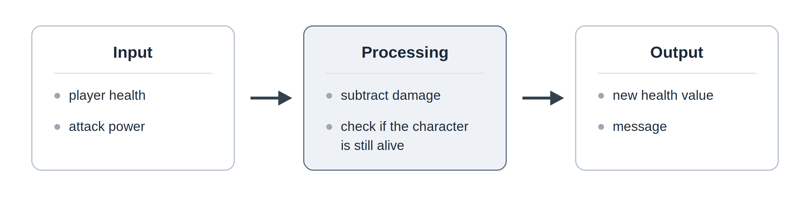

# History of Programming. What Is Programming?

## Table of Contents

- [History of Programming. What Is Programming?](#history-of-programming-what-is-programming)
  - [Table of Contents](#table-of-contents)
  - [Self-Check Questions](#self-check-questions)
  - [Course Introduction](#course-introduction)
    - [Who Is This Course For?](#who-is-this-course-for)
    - [What Is This Course About?](#what-is-this-course-about)
    - [Why C++?](#why-c)
    - [Why Does a Game Designer Need Programming?](#why-does-a-game-designer-need-programming)
    - [How to Study the Material So It Sticks](#how-to-study-the-material-so-it-sticks)
    - [To Sum Up](#to-sum-up)
  - [How to Read the Course Materials](#how-to-read-the-course-materials)
  - [Task, Executor, and Precise Instructions](#task-executor-and-precise-instructions)
  - [A Brief History of Computing Devices](#a-brief-history-of-computing-devices)
    - [From the Abacus to the Arithmometer](#from-the-abacus-to-the-arithmometer)
    - [The Jacquard Loom: Behavior Recorded Separately from the Machine](#the-jacquard-loom-behavior-recorded-separately-from-the-machine)
    - [Babbage's Analytical Engine and Ada Lovelace's Notes](#babbages-analytical-engine-and-ada-lovelaces-notes)
    - [Von Neumann Architecture and the Stored-Program Principle](#von-neumann-architecture-and-the-stored-program-principle)
    - [The Computer Era](#the-computer-era)
  - [Programming Languages](#programming-languages)
    - [Low-Level Programming Languages](#low-level-programming-languages)
    - [High-Level Programming Languages](#high-level-programming-languages)
    - [Language Generations](#language-generations)
    - [Pseudocode](#pseudocode)
  - [How Data Is Represented in a Computer](#how-data-is-represented-in-a-computer)
    - [Number Representation](#number-representation)
    - [Character and Text Representation](#character-and-text-representation)
  - [Compilation and Interpretation](#compilation-and-interpretation)
    - [What Is Compilation?](#what-is-compilation)
    - [What Is Interpretation?](#what-is-interpretation)
    - [Differences Between Compilation and Interpretation](#differences-between-compilation-and-interpretation)
    - [Errors During Program Execution](#errors-during-program-execution)
  - [Your First Program!](#your-first-program)
  - [Summary](#summary)

## Self-Check Questions

1. How does an algorithm differ from a program? Give an example of an algorithm that can be written in several different ways.
2. Why is an abacus not considered a computing machine even though it is used to perform calculations?
3. What idea did the Jacquard loom contribute to the development of computing technology even though it performed no calculations?
4. What could Babbage's Analytical Engine do that a punched-card loom could not? Why is this distinction fundamental?
5. State the stored-program principle. What possibilities did it open up?
6. A byte contains the value `01000010`. What number does it represent? What character does it represent in ASCII if `A` corresponds to 65? How does a program determine what is actually stored there?
7. A program compiled successfully, ran, and printed 130 instead of the expected 70. What kind of error is this, and why did the compiler fail to detect it?
8. A game developer releases a game written in a compiled language. What exactly do they distribute to the players, and what remains with the developer?

## Course Introduction

### Who Is This Course For?

This course is written for first-year Game Design students and is intended for the first semester.

Students come with different levels of experience. Some have written code at school, some have encountered programming in YouTube videos, and some will open a code editor for the first time in their lives. The material assumes only minimal prior knowledge of programming: every concept is introduced from scratch, and nothing is treated as "obvious" simply because it may have been mentioned earlier.

If you do already have some experience, the course should still not be boring. The explanations go beyond "this is the syntax": a great deal of attention is given to why a program behaves the way it does, what is stored in memory at each moment, which mistakes are most common, and why working code is not always good code. A school computer science course helps, but it does not guarantee a confident understanding, and that is perfectly normal.

The only prerequisites are school-level mathematics and the ability to use a computer.

### What Is This Course About?

We will be programming in C++, but this course is not about C++.

It is about learning how to solve problems in such a way that the solution can be carried out by an executor that makes no assumptions. This is a separate skill, and it is not tied to any particular language. Someone who has mastered it can move to a new language in a couple of weeks. Someone who has memorized syntax but has not learned how to think through a problem gets stuck on the first unfamiliar task.

By the end of the semester, you should be able to take a small problem and work through the entire process independently: understand the problem statement, identify the input data and expected result, devise an algorithm, write it in pseudocode, implement it in C++, test it on several sets of data, find and fix an error, and explain your solution to another person.

### Why C++?

Not because it is the best language. There is no single best language; there is only a language that is suitable for a particular task.

C++ was chosen for two reasons. First, it forces you to state explicitly many things that other languages hide: what type a value has, what happens during a computation, and where the scope of a name ends. When you are learning, this is an advantage, even if it may initially feel tedious. Second, a significant part of the game industry is built with C++, including Unreal Engine, so familiarity with the language will be useful to you later.

### Why Does a Game Designer Need Programming?

You do not have to become a programmer. But a game mechanic is, by its very nature, an algorithm: rules, states, conditions, counters, checks. When you describe the condition under which an enemy begins attacking and what happens to its health, you are already writing an algorithm—just in words.

Understanding programming also gives you three very practical advantages. You begin to develop a sense of which idea is inexpensive to implement and which one may require months of work. You can speak the same language as programmers and understand why they disagree. And you can build a prototype of a mechanic yourself instead of describing it in words and waiting for someone else to implement it.

### How to Study the Material So It Sticks

Everyone has their own pace, so here are several recommendations that work for most people.

1. _Take one topic at a time_. Programming is difficult to learn by rushing through it: a concept you skip will inevitably reappear two weeks later and undermine everything that follows.
2. _Type the code yourself and run it_. Do not copy the examples from the file. When you type them by hand, you notice details that your eyes tend to miss while reading. Change the values, deliberately break the program, and see what it tells you.
3. _Keep a sheet of paper nearby_. The ability to trace a program manually, step by step, writing down the values of variables, is the most important skill of the first semester. It will also save you during an exam when no compiler is available.
4. _Before writing code, explain in words what the program is supposed to do_. If you cannot formulate it in words, you certainly will not be able to express it in code.
5. _Do your laboratory assignments independently, without AI_. Do them as well as you can. Only afterward should you compare your solution with someone else's and see what was done differently.
6. _AI is useful as a training tool_. Ask it to create exercises on the current topic or explain why the compiler is reporting an error, then solve the tasks yourself. _A ready-made solution pasted into a laboratory assignment gives you nothing except a grade_.
7. _Do not be discouraged by errors_. A program almost never works on the first attempt, and that applies to everyone, including the instructor. An error is not a verdict; it is a message that there is still something you do not understand.
8. _Explain the topic to someone_. Ideally, explain it to a person outside IT. You will immediately see which parts you genuinely understand and which parts you have merely memorized.
9. _Start a small project of your own_. A text-based game with choices, a simple combat simulator, a ten-line random dungeon generator—anything. It can be rough. Your own project will teach you faster than any laboratory assignment because you decide for yourself what it is supposed to do.

### To Sum Up

The goal of this course is that, by the end of the semester, you will look at a program not as a collection of strange symbols, but as a precise representation of an algorithm that you understand. After that, everything else—including any other language or any game engine—is largely a matter of technique.

I will be glad if, after this semester, some of you experience the feeling that keeps people in programming: the moment when something you came up with yourself finally works.

Ready? Let's go!

## How to Read the Course Materials

The lecture texts use several formatting conventions.

**Bold text** marks a new term at the point where it is defined. If you see a word in bold, it means a concept is being introduced that will be used later.

_Italics_ indicate semantic emphasis: a word or phrase that deserves particular attention while reading.

`Monospace text` is used for code elements: variable and function names, values, individual operators, file names, and commands. If `health` appears in a sentence, it refers to a specific name in a program, not to the ordinary English word "health."

Larger fragments of code and pseudocode are placed in separate blocks:

```cpp
int health = 100;
```

Additional remarks are formatted as highlighted blocks of four types.

> [!NOTE]
> Additional explanation or clarification that helps you understand the topic better.

> [!IMPORTANT]
> An idea you need to remember. This is usually a point where students most often develop an incorrect mental model.

> [!WARNING]
> A warning about an error that causes the program to behave incorrectly.

> [!TIP]
> Practical advice that makes the work easier.

References such as [^1] lead to the list of sources at the end of the lecture. Diagrams are numbered with two numbers: the first is the lecture number, and the second is the diagram number within that lecture. They are referenced by number, for example, "in Figure 1.2."

Many terms are given in two languages at once: Russian and English. You will need the English terms because compiler messages, documentation, and most professional literature are written in English.

## Task, Executor, and Precise Instructions

Imagine that you were asked to explain to another person how to make tea. You would probably say something like:

1. boil the water,
2. put a tea bag in a cup,
3. pour in the boiling water and wait a couple of minutes.

That is enough because a person will infer the rest. They know where the kettle is, understand that the cup should be empty, and will not pour the boiling water outside the cup.

Now imagine that you have to explain the same thing to a device that makes no assumptions at all. It will do exactly what is written, exactly in the order in which it is written, and it will stop if the next instruction makes no sense. You would have to specify exactly how much water to use, what "wait" means, and what to do if there are no tea bags left.

The difference between these two situations is the main difficulty of programming. A computer is incredibly fast and completely incapable of guessing what you mean.

Let us take an example closer to your field.

A designer formulates a rule:

> "the enemy attacks the player when the player gets close."

A person understands what this means. Before the rule can be implemented, however, a programmer has to answer several questions.

1. What counts as distance, and how is it measured?
2. What distance value counts as close?
3. How often is this condition checked?
4. What happens if the player is already dead?
5. What happens if two players are nearby?

None of these questions is nitpicking. Until they have answers, the rule cannot be carried out mechanically.

Let us introduce several concepts that will help us understand the material that follows.

**Executor** — the entity that carries out instructions. It may be a person, a mechanical device, or a computer processor. Every executor has a set of actions it is capable of performing, and it cannot do anything outside that set.

**Instruction** — a single directive telling an executor to perform a particular action. For example, "boil the water," "put a tea bag in the cup," or "display a message on the screen."

**Algorithm** — a set of instructions or steps designed to solve a specific problem within a finite amount of time.

*It has the following properties*.

- The problem is clearly defined and includes clear definitions of the input and output data.
- It is feasible and can be completed within a finite number of steps and a finite amount of time and memory.
- Every step has a definite meaning, and given the same input data and execution conditions, the result will always be the same.

**Program** — an algorithm written in a language understood by a particular executor and in a form suitable for execution.

_An algorithm and a program are different things_, and they should not be confused. An algorithm may exist in your head, on paper, or as a diagram. It is not tied to any particular language. A program is a specific representation intended for a specific executor. The same algorithm can be written in C++, written in another language, or explained to a person in words.

Almost every problem we will solve fits the same general pattern: a program receives data, does something with it, and produces a result:



_Figure 1.1. General program workflow._

**Input** — data that a program receives from outside: a number entered by the user, a key press, the contents of a file, the position of the mouse. Sometimes there may be no input at all.

**Output** — what a program produces externally: text on the screen, a modified image, a written file, or sound.

Between input and output lies processing: the sequence of actions that transforms one into the other. This is the part you will be designing throughout the entire semester, although, in all likelihood, it is also what you will be doing for most of your professional life.

> [!IMPORTANT]
> A computer does not understand what you intended. It executes what you wrote. Most beginner mistakes happen not because someone does not know the syntax, but because they have not fully formulated the problem.

## A Brief History of Computing Devices

### From the Abacus to the Arithmometer

Before moving on to programming, it is useful to understand how people solved computational problems before computers existed.

The idea of transferring calculations to a device is far older than computers. Let us begin with the abacus.

**Abacus** — a calculating device in which numbers are represented by the positions of beads or stones. It took different forms in different cultures: the Roman abacus, the Chinese suanpan, the Japanese soroban, and the Russian abacus familiar to many people. They all have one thing in common: the device _stores_ a number, but it does not perform the calculation itself.


_Figure 2.1. Abacus._

This distinction is worth noticing. The abacus preserves the current state of a calculation, freeing a person from having to keep intermediate results in their head. The order of operations itself—the algorithm—still remains in the person's mind.

In the seventeenth century, people began building machines that could perform the arithmetic operation itself. In 1642, Blaise Pascal built a mechanical device that added and subtracted numbers by turning geared wheels with a carry mechanism between digit positions.

In 1673, Gottfried Wilhelm Leibniz built a machine that could also multiply and divide by reducing those operations to repeated addition and subtraction. Both machines remained rare and expensive devices.

The technology became a mass-produced product in the nineteenth century. The **arithmometer** designed by Charles Xavier Thomas de Colmar, introduced in 1820, was manufactured for decades and used in offices and engineering bureaus[^4].


_Figure 2.2. Arithmometer._

What changed compared with the abacus, and what remained the same? What changed was that the arithmetic operation itself was now performed by a mechanism: a person no longer needed to know how to perform column addition manually. What remained the same was that the _sequence_ of operations was still determined by a person. They turned the handle, wrote down an intermediate result on paper, and entered the next number. The machine could perform an operation, but it could not execute an algorithm.

To move further, people had to learn how to give a machine not just one action, but an entire sequence of actions.

### The Jacquard Loom: Behavior Recorded Separately from the Machine

The next important idea came not from mathematics, but from textile production.

To produce patterned fabric, a particular set of threads has to be raised on each row. In the past, this was done manually and from memory by a weaver's assistant. Changing the pattern required a long and tedious reconfiguration.

At the beginning of the nineteenth century, Joseph Marie Jacquard applied a punched-card control mechanism to the loom: cardboard cards with holes punched into them.

1. The cards were connected into a chain and fed into the loom one by one.
2. Where a card had a hole, a hook passed through it and raised a thread; where there was no hole, the thread remained in place.
3. Each card defined one row of the pattern, while the entire chain defined the complete design.

The idea of controlling a loom with a perforated medium had appeared earlier, but it was Jacquard's machine that became widely adopted[^4].

This leads to the conclusion for which we introduced the loom in the first place. To change the pattern, there was no longer any need to rebuild the machine. It was enough to replace the stack of cards. _The behavior of the machine had been separated from the machine itself and turned into data that could be prepared in advance, stored, copied, and transferred to someone else._

### Babbage's Analytical Engine and Ada Lovelace's Notes

The English mathematician Charles Babbage worked on a problem that was highly practical in the nineteenth century: logarithm tables and navigation tables were calculated manually by people and contained errors, while an error in a navigation table could cost a ship. He first designed the Difference Engine to calculate polynomial values. Then, beginning in the 1830s, he turned to a much more general concept—the **Analytical Engine**[^5].

Its design included components that you will recognize. There was a store for holding numbers—in other words, memory. There was a mill that performed arithmetic operations—what we would now call an arithmetic unit. The sequence of operations was controlled by punched cards borrowed from the idea used in the loom. Results were produced by a printing mechanism.

The main difference from the Jacquard loom was that Babbage's machine could _change the course of its work depending on the result of a calculation_. It could move to another point in the card sequence when a condition was met and repeat part of a calculation the required number of times. These are the ideas you will later write as an `if` statement and a loop. The mechanical machine, never completed during Babbage's lifetime, already contained both constructs in its design.

Ada Lovelace's name is closely associated with this project. In 1843, she translated an article by the Italian engineer Luigi Menabrea about the Analytical Engine and added her own notes, which were longer than the article itself. They contain one of the earliest published descriptions of an algorithm for a machine, which is why Lovelace is often called the first programmer, although historians still debate how the contributions should be divided between her and Babbage.

In the same notes, she observed that the machine operates on symbols, while numbers are only one possible meaning assigned to those symbols. Anything that could be represented symbolically could, in principle, be processed by the machine; Lovelace used music as an example. This is important for your field. A computer does not know what a character or a texture is. Health is a number, position is several numbers, and the color of a pixel is also represented by numbers.

> [!IMPORTANT]
> Conditions and repetition appeared in the design of a mechanical machine long before electronic computers. This means they are programming ideas, not features of a particular programming language. They may be written differently in another language, but the ideas themselves remain the same.

### Von Neumann Architecture and the Stored-Program Principle

The first electronic computing machines of the mid-twentieth century calculated quickly but were difficult to program. ENIAC, which began operation in 1945, was configured using switches and by physically reconnecting cables: moving to a different task could require hours or days of manual work. The program was not text; it was the physical state of the wiring.

In 1945, a document titled _First Draft of a Report on the EDVAC_, bearing John von Neumann's name, described a different organization of the machine[^3]. Similar ideas were being discussed at the time by several groups of engineers, including the creators of ENIAC, and the authorship of individual ideas is still debated. Nevertheless, the organization described in the report became known in the literature as the **von Neumann architecture**.

Its central idea is this: the program is stored in the same memory as the data and is represented by the same kinds of numbers.

The control unit reads the next instruction from memory, determines what it means, and coordinates its execution. The arithmetic unit performs the calculations. Then the next instruction is read, and the process repeats. This continuously repeating cycle of reading and executing instructions is the basic work of the processor.

The consequences of the stored-program principle were enormous. A program could now be loaded into memory just like ordinary data, which meant it could be written to storage media, copied, transferred, and replaced by another program without making any physical changes to the hardware.

The first working machine to execute a program from its own memory was the experimental Manchester Baby in 1948[^4].

Virtually every computer you encounter is built according to this general model. Modern processors contain many improvements, but the basic idea remains the same: instructions are stored in memory, and the processor reads and executes them one after another.

> [!NOTE]
> This leads to an important point for us. Later, when you analyze how your program executes, you will reason in terms of "which instruction is being executed now" and "which values are currently stored in memory." This is not merely a classroom simplification. It is the model of how the machine works.

### The Computer Era

The rest of the story is largely a story of changes in the underlying electronic components and steady growth in quantitative performance measures.

Vacuum-tube machines filled entire rooms, consumed tens of kilowatts of power, and failed frequently. Transistors made computers smaller, more reliable, and more energy-efficient. Integrated circuits made it possible to place many transistors on a single chip.

In 1971, the Intel 4004 appeared, the first commercially produced microprocessor—that is, a processor contained entirely within a single integrated circuit[^4]. Personal computers followed, then game consoles, laptops, smartphones, and everything else you use every day.

The numbers changed: clock speed, memory capacity, the number of cores, and the cost of a single computation. The model did not. The smartphone in your pocket is a machine with memory that contains instructions and data, and a processor that reads those instructions one after another.

## Programming Languages

### Low-Level Programming Languages

A processor understands only numbers. **Machine code** is a representation of a program as numbers, each of which denotes either an operation or one of its operands, in a form that can be executed directly by the processor. To a human, it looks like a stream of numbers such as `144, 235, 10, 195, ...`, where you have to remember what each number means and how many numbers each instruction occupies.

For example, on processors in the x86 family:

- `144` means "do nothing",
- `195` means "return from a subroutine",
- and the pair `235, 10` means to jump to another location in the program, where the second number indicates how far to jump[^8]. The number 10 is not a command here; it is the operand of the preceding instruction.

Early programs really were written this way. It was very easy to make a mistake and very difficult to find one: shifting by a single number could turn the program into nonsense. In addition, the machine code of different processors is not the same, so a program had to be rewritten for every new machine.

The first improvement was to give instructions readable names. Assembly language uses short mnemonic names instead of numbers. Schematically, a program might look like this:

```text
LOAD   R1, health
LOAD   R2, damage
SUB    R1, R2
STORE  health, R1
```

This is a conceptual illustration in the style of assembly languages, not code for a specific processor: each processor family has its own instruction set and syntax. The meaning here is as follows: load the value from the `health` memory location, load the value from the `damage` memory location, subtract the second from the first, and store the result back in `health`. A separate program called an **assembler** translates such text into machine code.

This is already readable, but each line still corresponds to a single machine instruction. To subtract damage from health, you still have to spell out the transfers between memory locations.

Such programming languages are called **low-level languages** because they operate close to machine code and the hardware. They typically have the following characteristics:

- Instructions directly control memory, registers, and the processor;
- Code written for one processor usually does not work on another;
- Programs run quickly and take up little space;
- Deep knowledge of computer architecture is required.

### High-Level Programming Languages

The next step is **high-level languages**, in which the notation reflects the meaning of an action rather than the structure of the processor. The same calculation in C++ looks like this:

```cpp
health = health - damage;
```

One line expresses the intent, with no mention of registers. The **compiler** takes responsibility for translating it into machine code.

The first such languages appeared in the late 1950s:

- _Fortran_ (1957) was created for scientific and engineering calculations;
- _COBOL_ (1959) was created for processing business data;
- _ALGOL_ (1958) was created for describing algorithms;

The idea of programs that translate text into machine code was developing during the same period; one of the earliest such programs, A-0, was created by Grace Hopper in the early 1950s[^4].

In 1972, Dennis Ritchie created the C programming language. Building on C, Bjarne Stroustrup began developing an extension in the late 1970s; it received the name C++ in 1983 and was commercially released in 1985[^1]. Python, Java, C#, and many other languages appeared later.

### Language Generations

Programming languages are commonly divided, roughly, into generations according to their level of abstraction.

| Generation | What It Is                              | Example                       | What Translates It          |
| ---------- | --------------------------------------- | ----------------------------- | --------------------------- |
| 1GL        | Machine code                            | `183, 12, 96`                 | Nothing; executed directly  |
| 2GL        | Assembly language                       | `SUB R1, R2`                  | Assembler                   |
| 3GL        | High-level languages                    | `health = health - damage;`   | Compiler or interpreter     |
| 4GL        | Domain-oriented languages               | `SELECT name FROM players`    | Specialized system          |

> [!NOTE]
>
> This division is convenient for discussion, but it is approximate. There is no strict boundary between the third and fourth generations, and different authors may classify the same language differently. Use this table as a way to organize your understanding of abstraction levels, not as a rigid classification.

Another perspective is more useful. The higher the level of a language, the closer its notation is to the way the problem itself is expressed and the farther it is from the details of the machine. Programs become easier to write and read, but you lose some control over exactly what happens internally.

C++ occupies a special position in this spectrum: it allows you to write readable code while retaining direct access to low-level details when they are needed. That is why it is still widely used in areas where performance matters, including game engines. We chose it for this course not because it is universally the best language, but because it forces you to make explicit many things that other languages hide, and that is useful while you are learning.

> [!IMPORTANT]
> A language changes the way an algorithm is written. It does not change the problem itself or the algorithm used to solve it. Someone who has learned how to solve problems can learn a new language in a reasonable amount of time. Someone who has memorized syntax but has not learned how to think through problems will be helpless when faced with the first unfamiliar task.

### Pseudocode

Because the way an algorithm is written depends on the language while the algorithm itself does not, it is useful to have a way to describe an algorithm without using any programming language at all.

**Pseudocode** is a human-readable way to describe an algorithm. It resembles program code but does not belong to any specific programming language and is usually not executed directly by a computer.

There is no single fixed rule for how pseudocode must be written. The important thing is that it is understandable to a person and accurately reflects the logic of the algorithm.

For example,

```text
input health
input damage

health = health - damage

if health <= 0
    output "Game Over"
endif
```

You can read this without knowing anything about C++. That is the point. Pseudocode lets you focus on the logic of the solution, discuss the sequence of actions with another person, and check your idea before you start dealing with semicolons and compiler messages.

> [!TIP]
>
> There is no single official standard for pseudocode. Different textbooks and different instructors write it somewhat differently, and that is normal. We will use one consistent style so that the notation is equally understandable to everyone. We will examine pseudocode in detail in the next lesson.

## How Data Is Represented in a Computer

The next important section concerns how data is represented inside a computer. This topic has always intimidated beginners because familiar numbers and text are backed by a complex structure of zeros and ones. We will cover only the fundamentals needed to understand how a computer stores and processes information.

A computer needs to store values in order to work. It stores them as physical states, and it is most reliable to distinguish between only two states: _voltage present_ or _voltage absent_, magnetized or not magnetized. Distinguishing ten different levels is more difficult and far less resistant to noise. This is why computing technology is fundamentally binary.

**Bit** — the smallest unit of information, which can take one of two values, conventionally written as `0` and `1`.

A single bit can represent only a little: on or off, character alive or dead. Bits are therefore grouped together. A **byte** is a group of bits treated as a single unit; on virtually all modern computers, one byte consists of eight bits:

$$1 \text{ byte} = 8 \text{ bits}$$

### Number Representation

Numbers in a computer are represented in binary, where each digit (bit) can have the value `0` or `1`. For example, the decimal number 13 is written in binary as `1101`.

Each position in a binary number corresponds to a power of two. In the example above, `1101` can be expanded as:

$$1 \cdot 2^3 + 1 \cdot 2^2 + 0 \cdot 2^1 + 1 \cdot 2^0 = 8 + 4 + 0 + 1 = 13$$

### Character and Text Representation

Text is handled more simply than you might expect: each character is assigned a number. Such a correspondence is called an **encoding**—a set of rules that defines how characters are converted into numbers and back again.

In the ASCII encoding, introduced in 1963, the uppercase Latin letter `A` corresponds to the number 65, `B` corresponds to 66, and so on.

The modern **Unicode** standard[^7] is a universal character-encoding standard that covers virtually all writing systems in the world. Different Unicode encoding forms, such as UTF-8, UTF-16, and UTF-32, define how those characters are represented as bytes.

For example, the character `A` is represented in UTF-8 by a single byte with the numeric value 65, while the `€` (euro) character is represented by three bytes with the numeric values 226, 130, and 172.

Now for the most important point in this section. Consider a single byte with the value `01000001`. What is it?

It is the number 65. It is the character `A`. It is the brightness value of a single color channel—a fairly dark one. It may be part of a machine instruction. Everything depends on how the program has agreed to interpret that value.

You see this constantly in games. A pixel color is usually stored as three bytes: one each for the red, green, and blue channels. An object's position is several numbers. The state "character is alive" can fit into a single bit. A texture is a large list of numbers that becomes an image only because the program knows how to read it: how many pixels there are in each row, how many bytes are used per pixel, and in what order they appear.

## Compilation and Interpretation

### What Is Compilation?

We still need to understand what happens between the moment you type the program text and the moment the program actually starts working.

The text written by a programmer is called **source code**. It is an ordinary text file. You can open it in any editor, read it, and modify it. A processor cannot execute it directly: the processor understands only machine code, so the source code must somehow be transformed into machine code.

A **compiler** is a program that reads the entire source code, checks it, and translates it into a form from which an executable program is produced[^6].

The result produced by the compiler is called an **executable**. It is a file that the processor can execute directly because it already contains machine code. It can be run as many times as necessary without the compiler being needed again: the user of your game does not need either the compiler or the source code.

### What Is Interpretation?

An **interpreter** is a program that reads source code piece by piece and immediately executes what it reads, without creating a separate executable file. There is no separate translation stage before execution, but the interpreter must be installed on every machine where the program is run.

At this point, a student may naturally ask: "How does an interpreter execute a program if there is no machine code?"

The answer is that the interpreter is itself a program written in machine code, and it executes the source-code instructions by _converting them into machine instructions "on the fly"_. This makes it possible to run a program immediately, without compiling it in advance, but it also usually makes execution slower than with compiled programs.

### Differences Between Compilation and Interpretation

The following table summarizes the differences between compilation and interpretation:

|                                  | Compilation                     | Interpretation                          |
| -------------------------------- | ------------------------------- | --------------------------------------- |
| When translation occurs          | Once, before execution          | During execution                        |
| What is distributed              | Executable file                 | Source code                             |
| What the user needs              | Only the executable file        | An installed interpreter                |
| When code-writing errors are found | Before execution, during compilation | When execution reaches that line    |
| Execution speed                  | Usually higher                  | Usually lower                           |

The boundary between these approaches is not as sharp as the table suggests. Many languages are first translated into an intermediate representation that is then executed by a virtual machine, while some parts of the code may be translated into machine code while the program is running. What matters for us is this: C++ is a compiled language, and we will be working according to the left-hand column.

### Errors During Program Execution

When writing programs, you will definitely encounter errors, and beginners often take an error as a sign that they are not capable of programming. That is not the case. **A program almost never works correctly on the first attempt**, and what distinguishes an experienced programmer from a beginner is not that the experienced programmer never makes mistakes, but that they find and fix them faster. **A significant part of programming work consists of exactly this**.

At a high level, errors can be classified according to when they are discovered:

1. A **compilation error** occurs before the program starts: the compiler could not translate the source code into machine code and did not create an executable file. One specific type of compilation error is a **syntax error**, which means that the rules of the language have been violated: a missing semicolon, an unclosed bracket, or a typo in a keyword. The compiler also catches other problems, such as referring to a name that has never been declared.
   - These are the least dangerous errors. The compiler tells you the file and line and, quite directly, what it does not understand. Its messages may look intimidating at first, but you should start reading them from the very beginning: the answer is almost always in there somewhere. We will learn how to understand these messages and fix the errors they describe.
2. A **runtime error** occurs after the program has started. The program compiled, began running, and then terminated abnormally—for example, because of division by zero or an attempt to access a data element that does not exist. _The compiler allowed it because the program text followed the rules of the language_; the problem appeared only with particular data during execution.
3. A **logic error** is more dangerous than either of the previous two. The program compiles, starts, runs to completion, and produces the wrong result. From the compiler's point of view, everything is written correctly and executes without errors. You simply wrote something different from what you intended. For example, you might add damage to health instead of subtracting it, causing the character to become stronger after every hit. In cases like this, thorough **program testing** is good practice.

> [!WARNING]
> The compiler checks whether the program text follows the rules of the language. It does not check whether your program actually solves the problem you were given. Successful compilation does not mean that the program is correct.

We will be finding and fixing errors throughout the semester, so it is worth learning these three names right away. You will need them as early as the first laboratory assignment.

## Your First Program!

Here is the source code of a small C++ program:

```cpp
#include <iostream>

int main() {
    std::cout << "Hello, player!\n";
    return 0;
}
```

For now, a general impression is enough. The `#include <iostream>` line includes the tools needed for input and output. `int main()` marks the beginning of the main part of the program: execution starts here. The line containing `std::cout` prints text to the screen. `return 0` tells the operating system that the program finished successfully.

This text does nothing by itself. Until it passes through a compiler, it is simply a file containing characters. We will examine it piece by piece later, when we begin working with our first program in detail.

## Summary

1. Programming is the precise formulation of a solution to a problem for an executor that makes no assumptions.
2. An algorithm is a finite sequence of unambiguous actions; a program is a representation of an algorithm for a particular executor.
3. Almost every program can be viewed as processing input data into an output result.
4. The abacus stored the state of a calculation, while the arithmometer performed an individual operation, but in both cases the sequence of actions was still determined by a person.
5. The Jacquard loom separated the behavior of a machine from the machine itself by recording that behavior on a replaceable medium.
6. Babbage's Analytical Engine included memory, an arithmetic unit, conditional branching, and repetition, while Ada Lovelace's notes described an algorithm for it and the idea that a machine could process more than just numbers.
7. Von Neumann architecture introduced the stored-program principle: instructions are stored in memory together with data, and the processor reads and executes them one after another.
8. Programming languages differ in their levels of abstraction, from machine code to assembly language to high-level languages. A language changes how an algorithm is written, not the algorithm itself.
9. Data is stored as bits, and those bits acquire meaning through the way a program interprets them. This is where the concept of a type comes from.
10. A compiler translates source code into an executable before the program runs, while an interpreter executes code as it reads it. A compilation error is found by the compiler, a runtime error appears while the program is running, and a logic error may go unnoticed by everyone except you.

[^1]: Stroustrup B. _Programming: Principles and Practice Using C++_. 2nd ed. Addison-Wesley, 2014.

[^2]: Menabrea L. F. _Sketch of the Analytical Engine Invented by Charles Babbage_. With notes upon the memoir by the translator, Ada Augusta, Countess of Lovelace. Scientific Memoirs, Vol. 3. London, 1843.

[^3]: von Neumann J. _First Draft of a Report on the EDVAC_. Moore School of Electrical Engineering, University of Pennsylvania, 1945.

[^4]: Campbell-Kelly M., Aspray W., Ensmenger N., Yost J. R. _Computer: A History of the Information Machine_. 3rd ed. Westview Press, 2014.

[^5]: Swade D. _The Difference Engine: Charles Babbage and the Quest to Build the First Computer_. Viking, 2001.

[^6]: Gaddis T. _Starting Out with C++: From Control Structures through Objects_. 9th ed. Pearson, 2017.

[^7]: The Unicode Consortium. _The Unicode Standard_. https://www.unicode.org/versions/latest/
