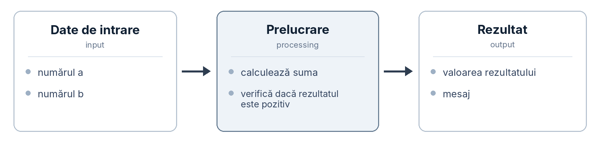

# Istoria programării. Ce este programarea?

## Cuprins

- [Istoria programării. Ce este programarea?](#istoria-programării-ce-este-programarea)
  - [Cuprins](#cuprins)
  - [Întrebări pentru autoevaluare](#întrebări-pentru-autoevaluare)
  - [Introducere în curs](#introducere-în-curs)
    - [Pentru cine este acest curs?](#pentru-cine-este-acest-curs)
    - [Despre ce este cursul?](#despre-ce-este-cursul)
    - [De ce C++?](#de-ce-c)
    - [De ce are nevoie un matematician de programare?](#de-ce-are-nevoie-un-matematician-de-programare)
    - [Cum să învățați materialul](#cum-să-învățați-materialul)
    - [Pe scurt](#pe-scurt)
  - [Cum citim materialele cursului](#cum-citim-materialele-cursului)
  - [Problemă, executant și instrucțiuni exacte](#problemă-executant-și-instrucțiuni-exacte)
  - [Puțină istorie a dispozitivelor de calcul](#puțină-istorie-a-dispozitivelor-de-calcul)
    - [De la abac la aritmometru](#de-la-abac-la-aritmometru)
    - [Războiul de țesut Jacquard: comportamentul separat de mașină](#războiul-de-țesut-jacquard-comportamentul-separat-de-mașină)
    - [Mașina analitică a lui Babbage și notele Adei Lovelace](#mașina-analitică-a-lui-babbage-și-notele-adei-lovelace)
    - [Arhitectura von Neumann și principiul programului memorat](#arhitectura-von-neumann-și-principiul-programului-memorat)
    - [Era calculatoarelor](#era-calculatoarelor)
  - [Limbaje de programare](#limbaje-de-programare)
    - [Limbaje de nivel jos](#limbaje-de-nivel-jos)
    - [Limbaje de nivel înalt](#limbaje-de-nivel-înalt)
    - [Generații de limbaje](#generații-de-limbaje)
    - [Pseudocod](#pseudocod)
  - [Cum sunt reprezentate datele în calculator](#cum-sunt-reprezentate-datele-în-calculator)
    - [Reprezentarea numerelor](#reprezentarea-numerelor)
    - [Reprezentarea caracterelor și a textului](#reprezentarea-caracterelor-și-a-textului)
  - [Compilare și interpretare](#compilare-și-interpretare)
    - [Ce este compilarea?](#ce-este-compilarea)
    - [Ce este interpretarea?](#ce-este-interpretarea)
    - [Diferențe între compilare și interpretare](#diferențe-între-compilare-și-interpretare)
    - [Erori în programe](#erori-în-programe)
  - [Primul program!](#primul-program)
  - [Rezumat](#rezumat)

## Întrebări pentru autoevaluare

1. Prin ce se deosebește un algoritm de un program? Dați un exemplu de algoritm care poate fi descris în mai multe moduri.
2. De ce abacul nu este considerat o mașină de calcul automată, deși este folosit pentru calcule?
3. Ce idee importantă a adus războiul de țesut Jacquard în dezvoltarea tehnicii de calcul, chiar dacă nu efectua calcule?
4. Ce putea face mașina analitică a lui Babbage și nu putea face războiul de țesut cu cartele perforate? De ce este important?
5. Formulați principiul programului memorat. Ce posibilități a deschis?
6. Un octet conține valoarea `01000010`. Ce număr reprezintă? Ce caracter reprezintă în ASCII, dacă `A` are codul 65? Cum știe programul ce semnificație are acea valoare?
7. Programul s-a compilat, a pornit și a afișat `130` în loc de rezultatul așteptat `70`. Ce tip de eroare este și de ce compilatorul nu a detectat-o?
8. Ați creat un program compilat pentru calcule numerice și îl transmiteți unui coleg. Ce fișier îi puteți transmite pentru rulare și ce poate rămâne doar la voi?

## Introducere în curs

### Pentru cine este acest curs?

Cursul este destinat studenților din anul I de la specialitatea **Matematică** și este gândit pentru primul semestru de studiu al programării.

Nivelul inițial poate fi diferit. Unii au scris cod la școală, alții au văzut doar câteva exemple, iar pentru unii acesta va fi primul contact real cu programarea. De aceea, materialul pornește de la bază: termenii importanți sunt explicați atunci când apar, iar lucrurile esențiale nu sunt tratate ca fiind „evidente”.

Dacă aveți deja experiență, veți întâlni totuși lucruri utile. Nu ne limităm la sintaxă. Vom discuta de ce programul se comportă într-un anumit mod, ce valori există în memorie la un moment dat, de ce apar erori și cum putem verifica un rezultat.

Pentru început sunt suficiente matematica de liceu și abilitatea de a lucra cu un calculator.

### Despre ce este cursul?

Vom programa în C++, dar cursul nu este doar despre C++.

Ideea principală este să învățăm să transformăm o problemă într-o succesiune exactă de pași pe care calculatorul îi poate executa. Acest mod de gândire nu depinde de un singur limbaj de programare.

La sfârșitul semestrului ar trebui să puteți lua o problemă relativ simplă și să parcurgeți singuri întregul proces:

1. să înțelegeți cerința;
2. să identificați datele de intrare și rezultatul dorit;
3. să construiți un algoritm;
4. să îl scrieți în pseudocod;
5. să îl implementați în C++;
6. să verificați programul pe mai multe seturi de date;
7. să găsiți și să corectați erori;
8. să explicați soluția altcuiva.

### De ce C++?

Nu pentru că ar exista un „cel mai bun” limbaj. Există limbaje potrivite pentru diferite tipuri de probleme.

C++ este util în procesul de învățare din două motive. În primul rând, ne obligă să exprimăm explicit lucruri pe care alte limbaje le ascund: tipul valorii, modul în care sunt făcute anumite calcule, domeniul de vizibilitate al unui nume și multe aspecte legate de memorie. La început pare mai strict, dar tocmai această strictețe ajută la formarea unei imagini corecte despre program.

În al doilea rând, C++ este folosit de mult timp în calcule de performanță ridicată, simulări, aplicații inginerești, biblioteci numerice și sisteme unde viteza de execuție contează. Pentru un student la Matematică, aceste domenii sunt mult mai apropiate decât par la început.

### De ce are nevoie un matematician de programare?

Programarea nu înlocuiește matematica. Ea vă oferă un instrument pentru a aplica ideile matematice asupra unor volume mari de date sau asupra unor calcule care ar fi prea lungi de făcut manual.

Câteva exemple simple:

- calcularea rapidă a valorilor unei funcții pentru mii de puncte;
- generarea termenilor unei succesiuni;
- verificarea experimentală a unei ipoteze pe multe valori;
- calcul numeric atunci când nu avem sau nu folosim o formulă închisă;
- prelucrarea datelor statistice;
- simularea unor procese;
- lucrul cu vectori, matrice și sisteme de ecuații;
- construirea unor programe care automatizează calcule repetitive.

Matematica răspunde la întrebarea „de ce funcționează metoda?”. Programarea ne ajută să spunem calculatorului, foarte exact, „cum să execute metoda”.

De exemplu, expresia „calculează suma primelor `N` numere naturale” este clară pentru un om. Pentru un program trebuie să precizăm ce valoare are `N`, de unde începe numărătoarea, ce valoare inițială are suma și când se oprește repetarea. Acest nivel de precizie va fi una dintre temele principale ale cursului.

### Cum să învățați materialul

Fiecare persoană are propriul ritm, dar câteva reguli ajută aproape întotdeauna.

1. _Luați câte o temă pe rând._ Dacă nu este clar un concept de bază, el va reapărea mai târziu și va face următoarele teme mai grele.
2. _Scrieți codul cu mâna și rulați-l._ Nu vă limitați la citirea exemplelor. Schimbați valorile și observați ce se întâmplă.
3. _Țineți o foaie lângă voi._ Încercați să executați programul manual, pas cu pas, notând valorile variabilelor.
4. _Înainte de cod, explicați soluția în cuvinte._ Dacă nu puteți spune ce trebuie să facă programul, va fi dificil să îl scrieți corect.
5. _Rezolvați mai întâi singuri lucrările de laborator._ Chiar și o soluție incompletă este mai utilă pentru învățare decât o soluție copiată.
6. _Folosiți IA ca instrument de verificare sau antrenament._ De exemplu, cereți probleme asemănătoare sau explicația unei erori, dar încercați mai întâi să înțelegeți și să rezolvați singuri.
7. _Nu tratați eroarea ca pe un eșec._ Programele conțin des erori. Important este să învățați cum să le localizați și să le corectați.
8. _Explicați tema altcuiva._ Dacă puteți explica simplu, probabil ați înțeles.
9. _Faceți un proiect mic._ De exemplu: un calculator pentru ecuația de gradul al doilea, un program care generează o succesiune, un calculator de medie și dispersie sau o aproximare numerică simplă.

### Pe scurt

Scopul cursului este ca, la sfârșitul semestrului, să priviți programul nu ca pe un șir de simboluri ci ca pe o descriere exactă a unui algoritm pe care îl înțelegeți.

Momentul important apare atunci când o metodă pe care ați formulat-o singuri începe să producă rezultatul corect pentru date diferite. De acolo programarea devine mult mai logică și mai puțin misterioasă.

Mergem mai departe.

## Cum citim materialele cursului

În text sunt folosite câteva convenții de formatare.

**Textul îngroșat** marchează de obicei un termen nou în locul în care este definit.

_Textul cursiv_ marchează o idee sau o frază asupra căreia merită să atrageți atenția.

`Fontul monospațiat` este folosit pentru elemente de cod: nume de variabile și funcții, valori, operatori, nume de fișiere și comenzi. Dacă apare `sum`, ne referim la un nume concret din program.

Fragmentele mai mari de cod sau pseudocod sunt plasate în blocuri separate:

```cpp
int sum = 0;
```

Observațiile speciale sunt marcate în patru moduri.

> [!NOTE]
> O explicație suplimentară sau o precizare utilă.

> [!IMPORTANT]
> O idee care trebuie reținută. De obicei este un loc unde începătorii își formează ușor o imagine greșită.

> [!WARNING]
> Un avertisment despre o greșeală care poate produce un rezultat incorect.

> [!TIP]
> Un sfat practic care simplifică lucrul.

Referințele de forma [^1] duc la lista de surse de la sfârșitul lecției. Schemele sunt numerotate cu două numere: primul este numărul lecției, iar al doilea este numărul schemei din lecție.

Mulți termeni sunt dați și în engleză. Acest lucru este util deoarece mesajele compilatorului, documentația și o mare parte a literaturii tehnice sunt în limba engleză.

## Problemă, executant și instrucțiuni exacte

Imaginați-vă că trebuie să explicați altui om cum se prepară un ceai. Probabil ați spune ceva de tipul:

1. fierbe apa;
2. pune plicul de ceai în cană;
3. toarnă apa și așteaptă câteva minute.

Pentru un om este suficient. El completează singur multe detalii: știe unde este fierbătorul, știe ce este o cană și înțelege aproximativ ce înseamnă „câteva minute”.

Acum imaginați-vă un dispozitiv care nu presupune nimic. El face exact ce este scris, exact în ordinea în care este scris. Dacă o instrucțiune nu este suficient de clară, dispozitivul nu o poate „ghici”.

Aceasta este una dintre dificultățile principale ale programării: calculatorul este foarte rapid, dar instrucțiunile trebuie formulate precis.

Să luăm un exemplu apropiat de matematică.

Cineva spune:

> „Calculează suma numerelor de la 1 până la `N`.”

Pentru om ideea este clară. Pentru program trebuie să precizăm:

1. ce valoare are `N` și de unde o obținem;
2. dacă `N` poate fi zero sau negativ;
3. cu ce valoare începe suma;
4. ce număr adăugăm la fiecare pas;
5. când se oprește repetarea;
6. ce rezultat trebuie afișat.

Aceste întrebări nu sunt detalii inutile. Fără ele, instrucțiunea nu poate fi executată mecanic.

Introducem câteva noțiuni de bază.

**Executantul (executor)** este cel care îndeplinește instrucțiunile. Poate fi un om, un mecanism sau procesorul unui calculator. Fiecare executant are un set de acțiuni pe care le poate realiza.

**Instrucțiunea (instruction)** este o indicație separată care cere executantului să facă o anumită acțiune. De exemplu: „adună două valori”, „citește un număr” sau „afișează rezultatul”.

**Algoritmul (algorithm)** este o succesiune de instrucțiuni sau pași destinată rezolvării unei probleme într-un număr finit de pași.

*Un algoritm are câteva proprietăți importante*:

- problema și datele de intrare/ieșire sunt clar definite;
- pașii pot fi executați într-un timp și cu resurse finite;
- fiecare pas are un sens clar;
- pentru aceleași date și aceleași condiții de execuție, algoritmul trebuie să producă același rezultat.

**Programul (program)** este o descriere a algoritmului într-un limbaj și într-o formă pe care un anumit executant o poate folosi pentru execuție.

_Algoritmul și programul nu sunt același lucru._ Algoritmul poate exista pe hârtie, într-o schemă sau în explicația voastră. Programul este o implementare concretă. Același algoritm poate fi scris în C++, Python sau descris în pseudocod.

Multe probleme pot fi reduse la o schemă simplă: programul primește date, le prelucrează și produce un rezultat.



_Figura 1.1. Schema generală de funcționare a unui program._

**Datele de intrare (input)** sunt valorile pe care programul le primește: un număr introdus de utilizator, un set de măsurători dintr-un fișier, elementele unei matrice etc. Uneori programul poate lucra și fără date introduse din exterior.

**Rezultatul (output)** este ceea ce programul produce: un număr, un text, un tabel, un fișier sau alte date.

Între intrare și ieșire se află prelucrarea: pașii care transformă datele inițiale în rezultat. Aceasta este partea pe care o vom construi în majoritatea problemelor din curs.

> [!IMPORTANT]
> Calculatorul nu știe ce ați vrut să scrieți. El execută ceea ce ați scris. De aceea, o cerință formulată incomplet duce ușor la un program incorect chiar dacă sintaxa este corectă.

## Puțină istorie a dispozitivelor de calcul

### De la abac la aritmometru

Înainte de programare este util să vedem cum au evoluat dispozitivele de calcul.

Ideea de a muta o parte din calcule de la om la un dispozitiv este mult mai veche decât calculatorul modern. Începem cu abacul (en. _abacus_).

**Abacul** este un dispozitiv de calcul în care numerele sunt reprezentate prin poziția unor bile sau pietricele. În culturi diferite au existat forme diferite: abacul roman, suanpanul chinezesc, sorobanul japonez și alte variante. Ideea comună este că dispozitivul _păstrează_ starea calculului, dar nu decide singur ce operație trebuie făcută.


_Figura 1.2. Abac._

Acesta este un detaliu important. Abacul îl ajută pe om să păstreze rezultate intermediare, dar ordinea operațiilor, adică algoritmul, rămâne în mintea omului.

În secolul al XVII-lea au apărut mașini care puteau efectua mecanic operații aritmetice. În 1642, Blaise Pascal a construit un aparat care aduna și scădea folosind roți dințate și mecanisme de transport al cifrelor.

În 1673, Gottfried Wilhelm Leibniz a prezentat o mașină care putea efectua și înmulțiri și împărțiri, reducându-le la operații repetate. Aceste dispozitive erau încă rare și costisitoare.

În secolul al XIX-lea, **aritmometrul** lui Charles Xavier Thomas de Colmar, prezentat în 1820, a devenit un dispozitiv produs timp de mai multe decenii și utilizat în birouri și activități inginerești[^4].


_Figura 1.3. Aritmometru._

Ce s-a schimbat față de abac? Operația aritmetică putea fi realizată de mecanism. Ce a rămas la fel? _Succesiunea_ de operații era în continuare aleasă de om. Mașina putea executa o operație, dar nu un algoritm complet.

Pasul următor a fost să găsim o modalitate de a transmite mașinii nu doar o singură operație, ci și ordinea operațiilor.

### Războiul de țesut Jacquard: comportamentul separat de mașină

Următoarea idee importantă nu a venit direct din matematică, ci din industria textilă.

Pentru a obține o țesătură cu un model, la fiecare rând trebuie ridicat un anumit set de fire. Înainte, acest lucru necesita multă muncă manuală, iar schimbarea modelului presupunea reconfigurarea procesului.

La începutul secolului al XIX-lea, Joseph Marie Jacquard a folosit un mecanism controlat prin **cartele perforate**: bucăți de carton cu găuri în anumite poziții.

1. Cartelele erau unite și introduse pe rând în mecanism.
2. O gaură sau absența ei determina comportamentul mecanismului într-o anumită poziție.
3. Fiecare cartelă descria un rând al modelului, iar întreaga serie descria modelul complet.

Ideea folosirii benzilor sau cartelelor perforate apăruse și mai devreme, dar mecanismul Jacquard s-a răspândit pe scară largă[^4].

Concluzia importantă este următoarea: pentru a schimba modelul nu mai era nevoie să reconstruim mașina. Era suficient să schimbăm setul de cartele. _Comportamentul mașinii a fost separat de construcția ei fizică și a devenit informație ce putea fi păstrată, copiată și transmisă._

### Mașina analitică a lui Babbage și notele Adei Lovelace

Matematicianul englez Charles Babbage lucra la o problemă practică pentru secolul al XIX-lea: tabelele de logaritmi și tabelele de navigație erau calculate manual și conțineau erori. Mai întâi a proiectat mașina diferențială pentru calculul valorilor polinoamelor. Apoi, începând din anii 1830, a lucrat la un proiect mult mai general: **mașina analitică (Analytical Engine)**[^5].

În proiect apar componente ușor de recunoscut astăzi. Exista un „depozit” (_store_) pentru numere, adică memorie. Exista o „moară” (_mill_) pentru operații aritmetice, asemănătoare ideii moderne de unitate de calcul. Ordinea operațiilor era controlată prin cartele perforate, iar rezultatele puteau fi tipărite.

Diferența esențială față de mecanismul Jacquard era că mașina lui Babbage putea _schimba cursul execuției în funcție de rezultatul unui calcul_. Putea trece la altă parte a secvenței și putea repeta un grup de operații. Aceste idei corespund, în programarea modernă, condițiilor și ciclurilor.

Alături de acest proiect apare numele Adei Lovelace. În 1843, ea a tradus un articol al inginerului italian Luigi Menabrea despre mașina analitică și a adăugat note foarte extinse. În ele apare una dintre primele descrieri publicate ale unui algoritm destinat unei mașini. De aceea, Lovelace este adesea numită primul programator, deși istoricii discută în continuare contribuțiile exacte ale ei și ale lui Babbage.

Lovelace a observat și o idee foarte importantă: mașina nu este limitată conceptual la „numere” în sensul obișnuit. Dacă ceva poate fi reprezentat simbolic, acele simboluri pot fi prelucrate după reguli.

Pentru matematică această idee este foarte naturală. Calculatorul poate primi aceiași biți și îi poate interpreta ca numere întregi, numere reale, elemente ale unui vector, coduri de caractere sau părți ale unei structuri mai mari. Sensul vine din modul în care programul interpretează datele.

> [!IMPORTANT]
> Condiția și repetarea au apărut ca idei înaintea calculatoarelor electronice moderne. Ele sunt concepte ale algoritmilor, nu particularități ale unui limbaj de programare.

### Arhitectura von Neumann și principiul programului memorat

Primele calculatoare electronice din mijlocul secolului al XX-lea puteau calcula rapid, dar programarea lor era dificilă. ENIAC, pus în funcțiune în 1945, era configurat cu comutatoare și cabluri, iar trecerea la o altă problemă putea necesita ore sau chiar zile de lucru fizic.

În 1945 a fost elaborat documentul _First Draft of a Report on the EDVAC_, semnat de John von Neumann, care descria o altă organizare a calculatorului[^3]. Idei asemănătoare erau discutate în aceeași perioadă de mai multe echipe de ingineri, iar contribuțiile exacte sunt un subiect istoric mai complex. Totuși, modelul descris a rămas cunoscut în literatură drept **arhitectura von Neumann**.

Ideea principală este că programul este păstrat în memorie împreună cu datele și este reprezentat tot sub formă de valori binare.

Unitatea de control citește o instrucțiune din memorie, determină ce înseamnă și organizează executarea ei. Unitatea aritmetică efectuează calculele. Apoi este citită instrucțiunea următoare și procesul se repetă.

Consecința principiului programului memorat a fost enormă. Programul putea fi încărcat în memorie ca datele, salvat pe un suport, copiat, transmis și înlocuit fără a modifica fizic mașina.

Prima mașină funcțională care a executat un program păstrat în propria memorie a fost instalația experimentală **Manchester Baby** în 1948[^4].

Aproape toate calculatoarele cu care lucrăm folosesc în continuare această idee de bază. Procesoarele moderne sunt mult mai complexe, dar pentru înțelegerea programelor modelul rămâne util: instrucțiunile și datele se află în memorie, iar procesorul execută instrucțiunile.

> [!NOTE]
> Când vom analiza mai târziu execuția unui program, vom întreba „ce instrucțiune se execută acum?” și „ce valori există acum în memorie?”. Aceasta este o simplificare didactică utilă, dar este bazată pe modelul real al funcționării calculatorului.

### Era calculatoarelor

Evoluția ulterioară a schimbat în primul rând tehnologia fizică și performanța.

Calculatoarele cu tuburi electronice ocupau încăperi întregi, consumau multă energie și se defectau des. Tranzistorul a permis dispozitive mai mici și mai fiabile. Circuitele integrate au permis plasarea unui număr mare de tranzistoare pe același cip.

În 1971 a apărut Intel 4004, primul microprocesor comercial produs pe scară largă, adică un procesor realizat într-un singur circuit integrat[^4]. Au urmat calculatoarele personale, laptopurile, telefoanele inteligente și multe alte dispozitive.

S-au schimbat frecvențele, dimensiunea memoriei, numărul de nuclee și costul unui calcul. Modelul de bază însă a rămas: avem memorie pentru instrucțiuni și date și un procesor care execută instrucțiunile.

## Limbaje de programare

### Limbaje de nivel jos

Procesorul execută instrucțiuni codificate numeric. **Codul mașină (machine code)** este reprezentarea unui program prin valori numerice care descriu operații și operanzi într-o formă executabilă direct de procesor.

Pentru un om, un astfel de program poate arăta ca un șir de valori de tipul `144, 235, 10, 195, ...`, unde trebuie să știm ce înseamnă fiecare valoare și cum se grupează instrucțiunile.

De exemplu, în familia x86:

- `144` poate reprezenta instrucțiunea „nu face nimic”;
- `195` poate reprezenta revenirea dintr-o subrutină;
- perechea `235, 10` poate descrie un salt, unde a doua valoare indică deplasarea[^8].

Programele timpurii erau scrise foarte aproape de acest nivel. Era ușor să apară greșeli și dificil să fie găsite. În plus, codul mașină diferă între arhitecturi de procesor.

O îmbunătățire importantă a fost folosirea unor nume scurte pentru instrucțiuni. Limbajul de asamblare folosește mnemonice în locul numerelor. O ilustrație simplificată ar putea arăta astfel:

```text
LOAD   R1, a
LOAD   R2, b
SUB    R1, R2
STORE  result, R1
```

Acesta este doar un exemplu conceptual, nu cod pentru un procesor concret. Sensul este: încarcă valoarea `a`, încarcă valoarea `b`, scade a doua valoare din prima și salvează rezultatul în `result`. Conversia din limbaj de asamblare în cod mașină este făcută de un program numit **asamblor (assembler)**.

Aceste limbaje sunt numite **limbaje de nivel jos**, deoarece lucrează aproape de arhitectura calculatorului.

Caracteristici tipice:

- instrucțiunile lucrează direct cu registre, memorie și procesor;
- codul este puternic legat de arhitectura procesorului;
- putem controla foarte precis modul de execuție;
- sunt necesare cunoștințe mai detaliate despre hardware.

### Limbaje de nivel înalt

Următorul pas îl reprezintă **limbajele de nivel înalt (high-level languages)**. În ele scrierea este mai apropiată de sensul matematic sau logic al operației decât de detaliile procesorului.

Aceeași idee de mai sus poate arăta în C++ astfel:

```cpp
result = a - b;
```

O singură linie exprimă clar intenția. Transformarea ei în instrucțiuni ale procesorului este realizată de **compilator**.

Primele limbaje de nivel înalt importante au apărut în anii 1950:

- _Fortran_ (1957) a fost creat în special pentru calcule științifice și inginerești;
- _COBOL_ (1959) pentru prelucrarea datelor de afaceri;
- _ALGOL_ (1958) pentru descrierea algoritmilor.

Ideea programelor care traduc codul într-o formă executabilă s-a dezvoltat în aceeași perioadă. Unul dintre sistemele timpurii, A-0, a fost dezvoltat de Grace Hopper la începutul anilor 1950[^4].

În 1972, Dennis Ritchie a creat limbajul C. Bjarne Stroustrup a început la sfârșitul anilor 1970 să dezvolte o extensie a limbajului C care a primit numele C++ în 1983 și a ajuns la o versiune comercială în 1985[^1]. Mai târziu au apărut Python, Java, C# și multe alte limbaje.

### Generații de limbaje

Limbajele sunt uneori împărțite, aproximativ, în generații după nivelul de abstractizare.

| Generație | Ce reprezintă                                | Exemplu                       | Cine traduce                     |
| ---------- | -------------------------------------------- | ----------------------------- | ------------------------------- |
| 1GL        | Cod mașină                                   | `183, 12, 96`                 | Nimeni, se execută direct       |
| 2GL        | Limbaj de asamblare                          | `SUB R1, R2`                  | Asamblor                        |
| 3GL        | Limbaje de nivel înalt                       | `result = a - b;`             | Compilator sau interpretor      |
| 4GL        | Limbaje orientate spre un anumit domeniu     | `SELECT value FROM measurements` | Sistem specializat            |

> [!NOTE]
> Această clasificare este utilă pentru orientare, dar nu este o frontieră strictă. În diferite surse același limbaj poate fi clasificat diferit.

Este mai importantă ideea generală: cu cât nivelul limbajului este mai înalt, cu atât scrierea programului este mai apropiată de formularea problemei și mai departe de detaliile hardware.

C++ ocupă o poziție interesantă: permite cod relativ expresiv, dar păstrează accesul la detalii de nivel jos atunci când este nevoie. Acesta este unul dintre motivele pentru care este folosit în aplicații unde performanța este importantă, inclusiv în calcule numerice și biblioteci științifice.

> [!IMPORTANT]
> Limbajul schimbă forma în care scriem algoritmul. Nu schimbă problema și nici logica soluției. Dacă învățați să construiți algoritmi, trecerea la un alt limbaj devine mult mai ușoară.

### Pseudocod

Dacă algoritmul este independent de limbaj, este util să avem un mod de a-l descrie fără să respectăm sintaxa unui limbaj concret.

**Pseudocodul (pseudocode)** este un mod lizibil pentru om de a descrie un algoritm. Seamănă cu un program, dar nu aparține unui limbaj concret și, în mod normal, nu este executat direct de calculator.

Nu există o singură sintaxă oficială pentru pseudocod. Important este să fie clar și consecvent.

Exemplu: vrem să afișăm modulul unui număr.

```text
INPUT x

IF x < 0
    SET x = -x
END IF

OUTPUT x
```

Acest fragment poate fi înțeles fără să cunoaștem C++. Tocmai acesta este scopul pseudocodului: ne concentrăm pe logica soluției înainte de paranteze, puncte și virgule sau mesaje ale compilatorului.

> [!TIP]
> Nu căutați o „gramatică perfectă” a pseudocodului. Folosiți o formă simplă și ușor de citit. În acest curs vom păstra același stil pentru ca exemplele să fie clare pentru toată grupa.

## Cum sunt reprezentate datele în calculator

Un alt subiect important este reprezentarea datelor. La început poate părea complicat, deoarece în spatele numerelor și textului apar biți și octeți. Pentru moment ne interesează doar ideea de bază.

Calculatorul trebuie să păstreze valori. La nivel fizic este convenabil să distingă două stări stabile, de exemplu două niveluri logice. De aici apare folosirea reprezentării binare.

**Bitul (bit)** este unitatea elementară de informație care poate avea două valori, notate de obicei `0` și `1`.

Un singur bit poate reprezenta doar două stări: de exemplu „adevărat/fals” sau „condiția este îndeplinită/nu este îndeplinită”. Pentru date mai complexe, biții sunt grupați.

**Octetul (byte)** este un grup de biți tratat ca o unitate. Pe calculatoarele moderne, un octet are practic întotdeauna opt biți:

$$1 \text{ byte} = 8 \text{ bits}$$

### Reprezentarea numerelor

Numerele sunt reprezentate în sistem binar, unde fiecare poziție poate avea valoarea `0` sau `1`. De exemplu, numărul 13 în baza 10 este `1101` în baza 2.

Fiecare poziție corespunde unei puteri a lui 2:

$$1 \cdot 2^3 + 1 \cdot 2^2 + 0 \cdot 2^1 + 1 \cdot 2^0 = 8 + 4 + 0 + 1 = 13$$

Pentru moment este suficient să înțelegem principiul. Mai târziu vom discuta separat cum sunt reprezentate numerele întregi și numerele reale.

### Reprezentarea caracterelor și a textului

Pentru text, fiecărui caracter i se asociază o valoare numerică. Un astfel de acord se numește **codificare (encoding)**.

În ASCII, standardizat în anii 1960, literei latine mari `A` îi corespunde valoarea 65, literei `B` valoarea 66 și așa mai departe.

Standardul modern **Unicode**[^7] definește coduri pentru caractere dintr-un număr foarte mare de sisteme de scriere. Formate precum UTF-8, UTF-16 și UTF-32 stabilesc cum sunt codificate aceste caractere în octeți.

De exemplu, `A` este reprezentat în UTF-8 printr-un singur octet cu valoarea numerică 65, iar simbolul `€` este reprezentat prin trei octeți cu valorile 226, 130 și 172.

Acum partea cea mai importantă. Avem un octet:

```text
01000001
```

Ce reprezintă?

Poate reprezenta numărul `65`. Poate reprezenta caracterul `A`. Poate fi o parte dintr-o instrucțiune sau dintr-o structură mai mare. Biții singuri nu ne spun sensul; sensul este determinat de modul în care programul îi interpretează.

Pentru un matematician, gândiți-vă la aceasta ca la diferența dintre o valoare și rolul ei într-un model. Aceeași valoare numerică poate fi un coeficient, un indice, o măsurătoare sau o componentă a unui vector. Programul trebuie să știe în ce context o folosește.

## Compilare și interpretare

### Ce este compilarea?

Rămâne să înțelegem ce se întâmplă între momentul în care scriem textul programului și momentul în care programul este executat.

Textul scris de programator se numește **cod sursă (source code)**. Este un fișier text pe care îl putem citi și modifica. Procesorul nu execută direct textul C++, de aceea codul trebuie transformat într-o formă executabilă.

**Compilatorul (compiler)** este un program care analizează codul sursă și îl transformă într-o formă din care se obține un program executabil[^6].

Rezultatul este, în mod obișnuit, un **fișier executabil (executable)** sau un set de fișiere din care poate fi construit programul. După compilare, utilizatorul programului nu are nevoie de codul sursă pentru a rula executabilul.

### Ce este interpretarea?

**Interpretorul (interpreter)** este un program care citește și execută codul prin intermediul unui mediu de rulare, fără ca utilizatorul să obțină neapărat în prealabil un executabil nativ separat în același mod ca la C++.

Poate apărea întrebarea: „Cum execută interpretorul programul dacă procesorul înțelege doar instrucțiuni mașină?”

Interpretorul este el însuși un program executabil. El citește reprezentarea programului și organizează executarea operațiilor necesare. În implementările reale pot exista pași intermediari, bytecode, mașini virtuale și compilare just-in-time.

Pentru început ne interesează doar diferența didactică: la C++ avem un pas explicit de compilare înainte de a rula programul construit.

### Diferențe între compilare și interpretare

O comparație simplificată:

|                                  | Compilare                              | Interpretare / mediu interpretat              |
| -------------------------------- | -------------------------------------- | ---------------------------------------------- |
| Când are loc traducerea principală | Înainte de rularea programului         | În timpul rulării sau prin pași intermediari   |
| Ce distribuim de obicei          | Program executabil / fișiere compilate | Cod sau reprezentare intermediară              |
| Ce trebuie la rulare              | Executabilul și bibliotecile necesare  | Interpretorul / mediul de rulare               |
| Când apar multe erori de sintaxă  | La compilare                           | La analiză sau când este procesată acea parte  |
| Performanța                       | Adesea foarte bună                     | Depinde mult de implementare                   |

În practică granița nu este absolută. Multe limbaje folosesc forme intermediare, mașini virtuale și compilare în timpul execuției. Pentru cursul nostru este suficient să reținem că **C++ este tratat ca limbaj compilat** și vom lucra cu compilatorul.

### Erori în programe

Erorile sunt o parte normală a programării. Un program nou nu funcționează întotdeauna corect de la prima încercare. O abilitate importantă este să învățați să identificați tipul problemei și locul în care apare.

La nivel introductiv, putem împărți erorile astfel:

1. **Eroare de compilare** — apare înainte de rulare. Compilatorul nu poate transforma codul într-un program corect. Un caz comun este **eroarea de sintaxă (syntax error)**: lipsește un punct și virgulă, o paranteză nu este închisă sau un cuvânt-cheie este scris greșit.
   - De obicei compilatorul indică fișierul și linia aproximativă unde a observat problema. Mesajele par complicate la început, dar trebuie citite.
2. **Eroare la execuție (runtime error)** — programul a pornit, dar în timpul execuției apare o situație invalidă. Un exemplu simplu este o operație care încearcă să folosească date într-un mod nepermis; împărțirea la zero este un exemplu clasic în explicațiile introductive, deși comportamentul exact depinde de tipul de date și limbaj.
3. **Eroare logică (logic error)** — programul se compilează și se execută, dar rezultatul este greșit. De exemplu, pentru media a două valori scriem din greșeală `a + b / 2` în loc de `(a + b) / 2`. Compilatorul vede o expresie validă, dar formula nu este cea dorită.

> [!WARNING]
> Compilatorul verifică dacă programul respectă regulile limbajului. El nu poate confirma că formula sau algoritmul ales rezolvă problema matematică cerută.

Vom lucra cu toate aceste tipuri de erori pe parcursul semestrului.

## Primul program!

Un program C++ foarte mic poate arăta astfel:

```cpp
#include <iostream>

int main() {
    std::cout << "Hello, Mathematics!\n";
    return 0;
}
```

Pentru moment ne interesează doar imaginea generală. Linia `#include <iostream>` ne oferă instrumente pentru intrare și ieșire. `int main()` marchează funcția principală, punctul de unde începe execuția programului. `std::cout` afișează textul, iar `return 0` indică sistemului de operare că programul s-a încheiat normal.

Textul nu „lucrează” singur. El trebuie prelucrat de compilator pentru a obține un program care poate fi executat.

## Rezumat

1. Programarea înseamnă formularea exactă a unei soluții într-o formă executabilă de calculator.
2. Algoritmul este o succesiune finită și clară de pași; programul este o implementare concretă a algoritmului.
3. Multe programe pot fi privite ca transformări ale datelor de intrare în rezultate.
4. Abacul păstra starea calculului, iar aritmometrul executa operații; ordinea operațiilor era însă aleasă de om.
5. Sistemul Jacquard a arătat că comportamentul unei mașini poate fi descris separat și stocat pe un suport.
6. Mașina analitică a lui Babbage includea idei de memorie, calcul, condiție și repetare, iar notele Adei Lovelace au descris algoritmi pentru o astfel de mașină.
7. Arhitectura von Neumann a consacrat ideea programului memorat împreună cu datele.
8. Limbajele de programare diferă prin nivelul de abstractizare. Limbajul schimbă forma scrierii, nu logica algoritmului.
9. Datele sunt reprezentate prin biți, iar semnificația lor depinde de interpretarea oferită de program.
10. C++ este un limbaj compilat: codul sursă este analizat și transformat înainte de rulare. Erorile pot fi de compilare, de execuție sau logice.
11. Pentru un student la Matematică, programarea este un instrument pentru automatizarea calculelor, experimente numerice, modelare și prelucrarea datelor.

[^1]: Stroustrup B. _Programming: Principles and Practice Using C++_. 2nd ed. Addison-Wesley, 2014.

[^2]: Menabrea L. F. _Sketch of the Analytical Engine Invented by Charles Babbage_. With notes upon the memoir by the translator, Ada Augusta, Countess of Lovelace. Scientific Memoirs, Vol. 3. London, 1843.

[^3]: von Neumann J. _First Draft of a Report on the EDVAC_. Moore School of Electrical Engineering, University of Pennsylvania, 1945.

[^4]: Campbell-Kelly M., Aspray W., Ensmenger N., Yost J. R. _Computer: A History of the Information Machine_. 3rd ed. Westview Press, 2014.

[^5]: Swade D. _The Difference Engine: Charles Babbage and the Quest to Build the First Computer_. Viking, 2001.

[^6]: Gaddis T. _Starting Out with C++: From Control Structures through Objects_. 9th ed. Pearson, 2017.

[^7]: The Unicode Consortium. _The Unicode Standard_. https://www.unicode.org/versions/latest/

[^8]: Intel Corporation. _Intel 64 and IA-32 Architectures Software Developer's Manual_.
