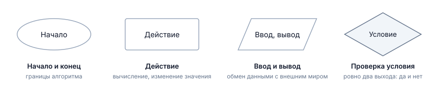
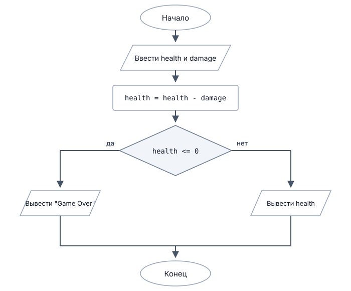
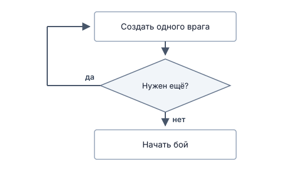
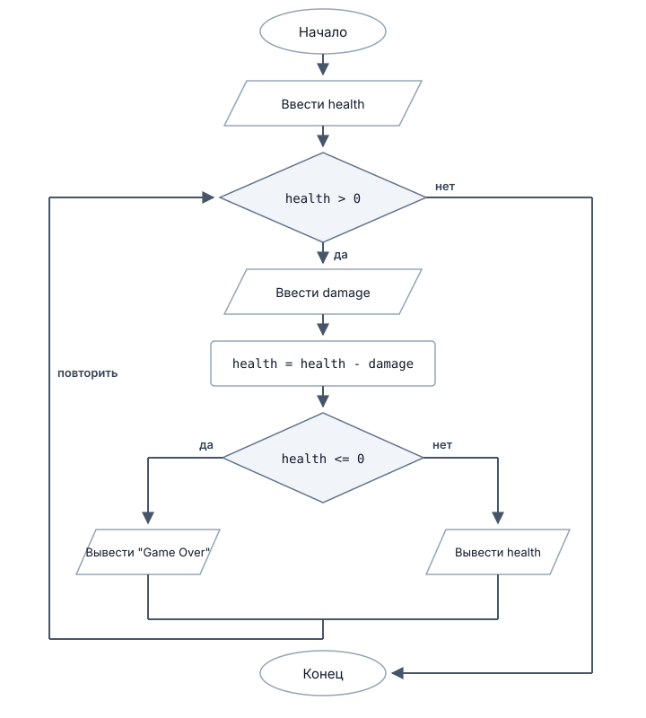
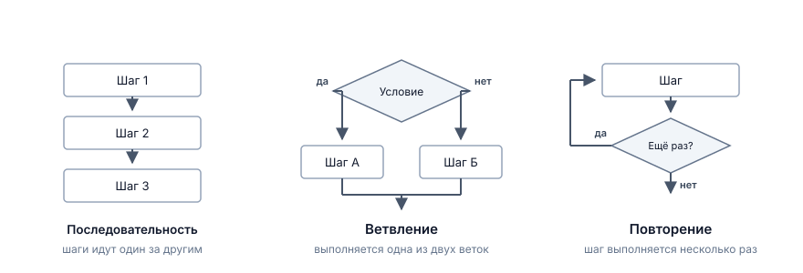
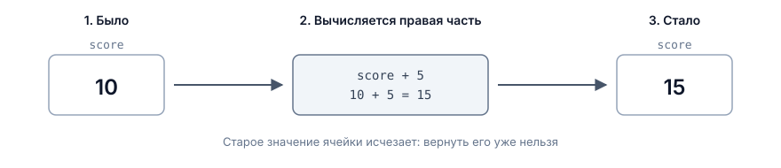

# Как думает программа

## Содержание

- [Как думает программа](#как-думает-программа)
  - [Содержание](#содержание)
  - [Вопросы для самопроверки](#вопросы-для-самопроверки)
  - [О чем мы говорили в прошлой главе?](#о-чем-мы-говорили-в-прошлой-главе)
  - [Что значит выполнить программу](#что-значит-выполнить-программу)
    - [Одна инструкция за раз](#одна-инструкция-за-раз)
    - [Почему порядок шагов меняет результат](#почему-порядок-шагов-меняет-результат)
  - [Что можно назвать алгоритмом](#что-можно-назвать-алгоритмом)
    - [Примеры](#примеры)
  - [Способы описания алгоритма](#способы-описания-алгоритма)
    - [Пример алгоритма](#пример-алгоритма)
    - [Запись словами](#запись-словами)
    - [Псевдокод](#псевдокод)
    - [Блок-схема: обозначения](#блок-схема-обозначения)
    - [Повторение действия](#повторение-действия)
    - [Когда какая запись удобнее?](#когда-какая-запись-удобнее)
    - [Три базовые конструкции](#три-базовые-конструкции)
  - [Состояние программы](#состояние-программы)
    - [Память как набор именованных ячеек](#память-как-набор-именованных-ячеек)
    - [Присваивание](#присваивание)
  - [Ручное выполнение алгоритма](#ручное-выполнение-алгоритма)
    - [Что такое ручное выполнение алгоритма](#что-такое-ручное-выполнение-алгоритма)
    - [Таблица трассировки](#таблица-трассировки)
    - [Как трассировка находит ошибку](#как-трассировка-находит-ошибку)
    - [Как искать ошибку?](#как-искать-ошибку)
    - [На каких данных проверять](#на-каких-данных-проверять)
    - [Почему нельзя проверить всё](#почему-нельзя-проверить-всё)
  - [Где писать и запускать программы](#где-писать-и-запускать-программы)
  - [Резюме](#резюме)

## Вопросы для самопроверки

1. Что выведет алгоритм и почему?

   ```text
   SET a = 5
   SET b = a
   SET a = a + 3
   OUTPUT b
   ```

2. Заполните таблицу трассировки для `coins = 7`:

   ```text
   SET score = 100
   INPUT coins
   SET score = score - coins * 5
   OUTPUT score
   ```

3. Какое свойство алгоритма нарушено в описании "увеличивай счёт, пока игроку не надоест"?
4. Сколько веток ромба выполняется при одном проходе блок-схемы? Может ли не выполниться ни одна?
5. Перепишите в псевдокод: ввести число монет; если монет больше десяти, вывести "Богач", иначе вывести "Нищий".
6. Для условия `IF health <= 0` подберите три значения `health` для проверки и объясните, зачем нужно каждое.
7. Найдите ошибку и объясните, на каких данных она проявится:

   ```text
   INPUT price
   INPUT coins

   SET coins = coins - price

   IF coins < 0
       OUTPUT "Не хватает монет"
   END IF

   OUTPUT coins
   ```

## О чем мы говорили в прошлой главе?

В прошлый раз мы выяснили, что программа лежит в памяти, а процессор читает её инструкции по очереди и выполняет. Сегодня разберёмся, что означает это "выполняет", и научимся главному навыку первого семестра: предсказывать, что сделает программа, ещё до того, как вы её запустили.

Умение выполнить алгоритм в голове или на бумаге отличает человека, который пишет программу, от человека, который наугад меняет символы и надеется, что заработает. Оно же понадобится на каждой лабораторной, потому что найти ошибку можно только тогда, когда вы знаете, каким должно быть правильное поведение.

## Что значит выполнить программу

### Одна инструкция за раз

Исполнитель не видит алгоритм целиком, как вы видите страницу. Он работает иначе:

1. Берёт очередную инструкцию.
2. Выполняет её полностью.
3. Переходит к следующей.
4. Повторяет, пока инструкции не закончатся.

Никакого забегания вперёд, никакого выполнения двух действий сразу, никакой оценки замысла в целом. Даже если из следующей строки очевидно, что предыдущая была лишней, исполнитель выполнит обе.

Возьмём алгоритм возвращения персонажа в лагерь:

1. Убрать оружие.
2. Открыть карту.
3. Выбрать точку лагеря.
4. Идти до точки.
5. Закрыть карту.

Каждый пункт здесь завершённое действие. Пока не выполнен третий, четвёртый не начинается.

### Почему порядок шагов меняет результат

Порядок в алгоритме не оформительская мелочь. Он часть смысла. Сравните две записи:

```text
SET health = 100
SET health = health - 30
OUTPUT health
```

```text
SET health = 100
OUTPUT health
SET health = health - 30
```

Инструкции одни и те же, множество их совпадает полностью. Первый вариант выведет `70`, второй `100`. Разница только в том, когда выполняется вывод.

В игровой логике такие перестановки стоят дороже. Представьте порядок действий при ударе:

- Проверить, жив ли враг, затем нанести урон.
- Нанести урон, затем проверить, жив ли враг.

Первый вариант позволит ударить уже мёртвого противника: проверка прошла до того, как здоровье изменилось. Второй сработает правильно. Формулировка "проверить и ударить" в дизайн-документе выглядит одинаково в обоих случаях, а поведение игры получается разное.

## Что можно назвать алгоритмом

В прошлой лекции мы определили алгоритм как конечную последовательность однозначных действий, предназначенную для решения определённого класса задач. Разберём это определение по частям. У алгоритма выделяют несколько свойств [^1]:

- _Дискретность._ Алгоритм состоит из отдельных завершённых шагов, которые выполняются один за другим. Нельзя выполнить полтора шага или два шага одновременно.
- _Определённость._ Каждый шаг понимается однозначно. Два разных исполнителя, получив одинаковые входные данные, обязаны получить одинаковый результат. Если шаг допускает толкование, это не алгоритм.
- _Конечность._ Алгоритм завершается за конечное число шагов. Процесс, который не заканчивается никогда, задачу не решает.
- _Результативность._ По завершении получается результат. Сообщение "решения не существует" тоже результат, если оно предусмотрено.
- _Наличие входных и выходных данных._ Алгоритм получает входные данные и выдаёт результат. Если алгоритм не получает входных данных, он не может решать задачи, а если не выдаёт результат, то не может быть полезен.

> [!NOTE]
> Набор свойств в разных учебниках немного отличается. Кнут в первом томе "The Art of Computer Programming" перечисляет пять признаков: конечность, определённость, наличие входных данных, наличие выходных данных и эффективность, то есть выполнимость каждого шага за конечное время[^1]. Смысл тот же, разбиение другое.

### Примеры

Посмотрим на три описания и решим, какие из них алгоритмы.

| Описание                                                     | Алгоритм? | Что нарушено                                    |
| ------------------------------------------------------------ | --------- | ----------------------------------------------- |
| Сделай игру интереснее                                       | Нет       | Определённость: непонятно, что именно выполнять |
| Прибавь к здоровью столько, сколько нужно                    | Нет       | Определённость: "сколько нужно" не вычислимо    |
| Дели 1 на 3 и выписывай цифры результата                     | Нет       | Конечность: процесс не заканчивается            |
| Вычти силу удара из здоровья, затем сравни результат с нулём | Да        | Ничего                                          |

Первое описание вполне осмысленно для человека и совершенно бесполезно для машины. Это и есть та разница, о которой шла речь в первой лекции: компьютер не догадывается.

## Способы описания алгоритма

### Пример алгоритма

Рассмотрим пример алгоритма:

> Персонаж получает удар. Известно текущее здоровье персонажа и сила удара. Нужно уменьшить здоровье на силу удара и сообщить, выжил ли персонаж.

Прежде чем что-то записывать, ответим на четыре вопроса. Заведите привычку отвечать на них перед каждой задачей курса:

1. Что дано? Здоровье и сила удара.
2. Что нужно получить? Либо сообщение о смерти персонажа, либо оставшееся здоровье.
3. Какие данные надо хранить? Здоровье, которое изменяется, и силу удара.
4. Есть ли выбор? Да: результат зависит от того, осталось ли здоровье выше нуля.

Четвёртый ответ важнее остальных. Он говорит, что в алгоритме будет развилка.

### Запись словами

Попробуем описать данный алгоритм словами. Важно, чтобы описание было однозначным и не оставляло места для интерпретации. Вот один из вариантов:

1. Получить текущее здоровье персонажа.
2. Получить силу удара.
3. Уменьшить здоровье на силу удара.
4. Если здоровье стало меньше или равно нулю, вывести сообщение "Game Over".
5. Иначе вывести оставшееся здоровье.

Такая запись понятна, и на первых порах ей можно пользоваться. Главный её недостаток - _длина_.

Пять шагов ещё читаются, двадцать превращаются в страницу сплошного текста, а тридцать уже никто не дочитает до конца. Хуже того, в длинном тексте тонет структура: не видно, где развилка, а где повторение. Псевдокод и блок-схема показывают структуру сразу, а список фраз заставляет держать её в голове.

Есть и второй недостаток, помельче: формулировки незаметно допускают неточности. Фраза "уменьшить здоровье" не говорит, куда девается результат.

### Псевдокод

_Псевдокод_ - это способ записи алгоритма, который ближе к языку программирования, но остаётся понятным человеку. Например, для нашего алгоритма это может выглядеть так:

```text
INPUT health
INPUT damage

SET health = health - damage

IF health <= 0
    OUTPUT "Game Over"
ELSE
    OUTPUT health
END IF
```

Мы будем пользоваться небольшим набором конструкций:

- `INPUT имя` - получить значение извне и положить его в ячейку с этим именем.
- `OUTPUT значение` - выдать значение наружу, например, напечатать на экране.
- `SET имя = выражение` - вычислить выражение и записать результат.
- `IF условие ... ELSE ... END IF` - выполнить одну из двух групп действий в зависимости от условия.
- Отступы показывают, что действия относятся к ветке `IF` или `ELSE`.

Единого стандарта псевдокода не существует, разные авторы пишут его по-разному. Мы фиксируем один стиль, чтобы записи читались одинаково всей группой.

> [!TIP]
> Псевдокод пишется для человека. Если вы засомневались, как записать шаг, запишите его понятной фразой на русском языке и двигайтесь дальше. Это лучше, чем застрять на выдуманном синтаксисе.

### Блок-схема: обозначения

**Блок-схема (flowchart)** - графическая запись алгоритма, в которой действия изображаются фигурами, а порядок выполнения показан стрелками.

Форма фигуры говорит о характере шага. В курсе нам хватит четырёх.



_Рисунок 2.1. Основные блоки блок-схемы_

Разберем подробно каждый из блоков:

- _Овал_ - начало и конец алгоритма. Внутри овала пишется слово "Начало" или "Конец". Это единственное его назначение.
- _Прямоугольник_ обозначает действие: вычисление или изменение значения. Это просто какое-то действие, которое выполняется без ветвлений, например, "уменьшить здоровье на силу удара".
- _Параллелограмм_ обозначает ввод или вывод данных. Например, "ввести здоровье" или "вывести оставшееся здоровье". Когда в программу вводятся данные, стрелка идёт в блок, а когда выводятся - из блока.
- _Ромб_ обозначает проверку условия и _всегда_ имеет две стрелки: одну для "да" (_правда_) или "нет" (_ложь_).

Это не все доступные фигуры, но этих четырёх достаточно для большинства простых алгоритмов. Набор фигур описан в стандартах на схемы алгоритмов[^2][^3].

Попробуем записать наш алгоритм в виде блок-схемы. Важно, чтобы схема была однозначной и не оставляла места для интерпретации. Вот один из вариантов:



_Рисунок 2.2. Алгоритм расчёта удара в виде блок-схемы_

Читается схема сверху вниз по стрелкам. Дойдя до ромба, исполнитель вычисляет условие и выбирает один из двух выходов. Обратите внимание на две вещи.

Выполняется ровно одна ветка. Не бывает так, что сработали обе или ни одной.

Сравните рисунок 2.2 с псевдокодом из раздела выше. Это одна и та же логика в двух записях. Ромб соответствует строке `IF`, левая ветка телу `IF`, правая ветка телу `ELSE`, слияние стрелок строке `END IF`.

### Повторение действия

Пока во всех наших схемах стрелки шли только вниз. Если стрелка ведёт назад, к уже выполненному блоку, получается повторение.



_Рисунок 2.3. Повторение на блок-схеме_

Здесь один и тот же блок выполнится столько раз, сколько потребуется, пока ответ на вопрос не станет отрицательным. Так создают, например, пятерых врагов, не рисуя пять одинаковых прямоугольников.

Данная петля называется - _цикл_. У _цикла_ всегда должно быть условие выхода, иначе он будет бесконечным. В нашем примере условие выхода - отрицательный ответ на вопрос в ромбе.

Попробуем добавить в наш алгоритм _цикл_ для повторения удара, пока персонаж жив.

В псевдокоде это будет выглядеть так:

```text
INPUT health
WHILE health > 0
    INPUT damage
    SET health = health - damage

    IF health <= 0
        OUTPUT "Game Over"
    ELSE
        OUTPUT health
    END IF
END WHILE
```

В блок-схеме это будет выглядеть так:



_Рисунок 2.4. Цикл на блок-схеме_

### Когда какая запись удобнее?

| Запись     | Чем хороша                               | Чем неудобна                      |
| ---------- | ---------------------------------------- | --------------------------------- |
| Словами    | Понятна без подготовки                   | Длинная, допускает неточности     |
| Псевдокод  | Компактный, близок к коду, легко править | Нужно договориться о стиле записи |
| Блок-схема | Наглядно видна структура и ветвления     | Громоздкая, тяжело изменять       |

Блок-схема хорошо работает на алгоритме в десяток шагов и на объяснении у доски. Для программы в двести строк она превращается в километровый рисунок, который никто не станет перерисовывать после каждой правки. Поэтому дальше в курсе основной записью будет псевдокод, а блок-схемы появятся там, где важно увидеть структуру.

> [!NOTE]
>
> В первое время я вам настоятельно рекомендую перед началом написания кода сначала описывать алгоритм: словами, псевдокодом или блок-схемой, чтобы понять логику и структуру программы. В дальнейшем, при разработке программ, скорее всего, вы будете сразу писать код, но в начале курса это поможет вам понять, что именно вы делаете и зачем.

### Три базовые конструкции

В ходе рассмотрения блок схем и псевдокода мы успели встретить три разных способа соединить шаги алгоритма:



_Рисунок 2.6. Три базовые конструкции алгоритма_

- **Последовательность** - шаги выполняются один за другим в записанном порядке.
- **Ветвление** - в зависимости от условия выполняется одна из веток.
- **Повторение** (**Цикл**) - группа шагов выполняется несколько раз.

Список короткий, и это не случайность. _Любой алгоритм, каким бы сложным он ни был, складывается из этих трёх конструкций и их вложений друг в друга_.

Утверждение доказано в 1966 году Коррадо Бёмом и Джузеппе Якопини[^6], а построенный на нём подход к написанию программ называется **структурным программированием**. Про этот подход мы поговорим подробнее в 4 главе, а пока просто запомните: если вы умеете работать с тремя базовыми конструкциями, вы умеете строить алгоритмы любой сложности.

Практический смысл здесь такой. Когда вы смотрите на незнакомую задачу и не понимаете, с чего начать, спросите себя всего три вещи:

1. Какие действия выполняются подряд?
2. Где нужно принять решение?
3. Что повторяется?

Ответы на эти вопросы и _есть скелет будущей программы или части программы_. Заодно теперь понятно устройство курса: дальше мы разберём ветвление, потом повторение, и на этом набор конструкций закончится. Всё остальное время уйдёт на то, чтобы научиться собирать из них решения настоящих задач.

## Состояние программы

### Память как набор именованных ячеек

Во время работы алгоритма надо где-то хранить значения: здоровье, силу удара, промежуточные результаты. Представляйте память как набор ячеек. Каждая ячейка обладает двумя свойствами:

- У неё есть имя, по которому к ней обращаются.
- В ней хранится ровно одно значение.

Имя нужно, чтобы не путаться: сказать "положи 100 в ячейку номер 4820096" человек не в состоянии, а сказать "положи 100 в `health`" легко.

У этой ячейки есть общепринятое название - **переменная**. Переменная, потому что её значение может меняться по ходу работы программы.

> [!NOTE]
> Какими бывают значения, сколько места занимает ячейка и что означает объявить переменную в программе, разберём на следующем занятии. Сейчас нам хватает картины "именованная ячейка хранит значение".

С переменной выполняют три действия:

1. Создать переменную с именем и положить в неё первое значение.
2. Прочитать значение, не изменив его.
3. Записать новое значение вместо старого.

Третий пункт стоит проговорить отдельно. Запись уничтожает то, что лежало в переменной раньше. Прежнее значение не сохраняется нигде, и вернуть его нельзя.

### Присваивание

**Присваивание (assignment)** - действие, которое вычисляет значение и записывает его в переменную.

В псевдокоде мы пишем его как `SET имя = выражение`. Выполняется оно строго в два шага:

1. Полностью вычисляется правая часть.
2. Полученное значение записывается в переменную слева.

Правая часть вычисляется первой. Это правило кажется очевидным, пока не встретится запись, где одна и та же переменная стоит с обеих сторон.

Пусть в переменной `score` лежит `10`.



_Рисунок 2.7. Что происходит при выполнении присваивания_

Пошагово:

1. Исполнитель смотрит на правую часть: `score + 5`.
2. Читает текущее значение переменной `score`. Это `10`.
3. Вычисляет `10 + 5`. Получается `15`.
4. Записывает `15` в переменную `score`.
5. Прежнее значение `10` исчезает.

> [!IMPORTANT]
> Присваивание не равенство. Запись `score = score + 5` в математике была бы ложным утверждением, потому что число не может равняться самому себе плюс пять. В программировании это команда: возьми текущее значение переменной, прибавь пять, положи результат обратно. Читайте знак `=` как "положить в", а не как "равно".

**Состоянием программы** называют совокупность всех переменных и их значений в конкретный момент выполнения. Каждое присваивание меняет состояние. Выполнение программы это последовательность состояний, а не только последовательность действий.

## Ручное выполнение алгоритма

### Что такое ручное выполнение алгоритма

**Ручное выполнение** - выполнение алгоритма человеком по шагам, с записью значений всех переменных, без запуска на компьютере.

Зачем это нужно:

- Понять чужой алгоритм.
- Проверить свой замысел до того, как он превратится в код.
- Найти ошибку, когда программа компилируется, но выдаёт не то.
- Ответить на экзамене, где компилятора рядом не будет.

### Таблица трассировки

Значения удобно записывать в таблицу. **Таблица трассировки (trace table)** - таблица, в которой по шагам выписаны значения всех переменных и выведенные данные.

Правила заполнения простые:

1. Один столбец на каждую переменную, плюс столбец для вывода.
2. Одна строка на каждый выполненный шаг.
3. В строке записывается состояние после выполнения шага.
4. Значения, которые не изменились, переписываются без изменений.

Четвёртый пункт кажется лишней работой, но именно он даёт полную картину состояния и не даёт потерять переменную из виду.

Рассмотрим _линейный алгоритм_, который последовательно выполняет инструкции без ветвлений и повторений.

```text
SET score = 0
INPUT coins
SET score = score + coins * 10
SET score = score + 5
OUTPUT score
```

Пусть на вход подали `coins = 3`.

| Шаг | Инструкция                       | `score` | `coins` | Вывод |
| --: | -------------------------------- | ------: | ------: | ----- |
|   1 | `SET score = 0`                  |       0 |         |       |
|   2 | `INPUT coins`                    |       0 |       3 |       |
|   3 | `SET score = score + coins * 10` |      30 |       3 |       |
|   4 | `SET score = score + 5`          |      35 |       3 |       |
|   5 | `OUTPUT score`                   |      35 |       3 | 35    |

На третьем шаге сначала вычисляется `coins * 10`, то есть `30`, затем `0 + 30`, и результат записывается в `score`. Порядок операций тот же, что в математике: умножение выполняется раньше сложения.

Рассмотрим _алгоритм с ветвлением_, который выбирает, что делать в зависимости от условия.

```text
INPUT health
INPUT damage

SET health = health - damage

IF health <= 0
    OUTPUT "Game Over"
ELSE
    OUTPUT health
END IF
```

1. Входные данные: `health = 100`, `damage = 30`:

   | Шаг | Инструкция                     | `health` | `damage` | Вывод         |
   | --: | ------------------------------ | -------: | -------: | ------------- |
   |   1 | `INPUT health`                 |      100 |          |               |
   |   2 | `INPUT damage`                 |      100 |       30 |               |
   |   3 | `SET health = health - damage` |       70 |       30 |               |
   |   4 | `IF health <= 0`               |       70 |       30 | условие ложно |
   |   5 | `OUTPUT health`                |       70 |       30 | 70            |

2. Входные данные: `health = 100`, `damage = 120`:

   | Шаг | Инструкция                     | `health` | `damage` | Вывод           |
   | --: | ------------------------------ | -------: | -------: | --------------- |
   |   1 | `INPUT health`                 |      100 |          |                 |
   |   2 | `INPUT damage`                 |      100 |      120 |                 |
   |   3 | `SET health = health - damage` |      -20 |      120 |                 |
   |   4 | `IF health <= 0`               |      -20 |      120 | условие истинно |
   |   5 | `OUTPUT "Game Over"`           |      -20 |      120 | Game Over       |

Сравните две таблицы. Шаги 1, 2, 3 и 4 одинаковы, различаются только значения. На пятом шаге пути расходятся: в первом прогоне выполняется ветка `ELSE`, во втором ветка `IF`. Ветка выполняется ровно одна, и это видно по таблице.

Заодно таблица показала кое-что, о чём в условии задачи не сказано: здоровье может стать отрицательным. Для сообщения "Game Over" это неважно, а вот если бы мы захотели нарисовать полоску здоровья, значение `-20` пришлось бы обрабатывать отдельно. Ручное выполнение регулярно вытаскивает такие вопросы на поверхность.

### Как трассировка находит ошибку

Рассмотрим следующий _алгоритм_ и _псевдокод_.

Урон вычисляется как сила атаки минус защита, но отрицательным он быть не может. Если защита больше атаки, урон считается нулевым.

Кто-то записал так:

```text
INPUT attack
INPUT defense

IF damage < 0
    SET damage = 0
END IF

SET damage = attack - defense

OUTPUT damage
```

С виду всё на месте: и вычитание есть, и проверка на отрицательное значение. Проверим на данных `attack = 10`, `defense = 15`. Ожидаем `0`.

| Шаг | Инструкция                      | `attack` | `defense` |     `damage` | Вывод                    |
| --: | ------------------------------- | -------: | --------: | -----------: | ------------------------ |
|   1 | `INPUT attack`                  |       10 |           |              |                          |
|   2 | `INPUT defense`                 |       10 |        15 |              |                          |
|   3 | `IF damage < 0`                 |       10 |        15 | значения нет | условие проверить нельзя |
|   4 | `SET damage = attack - defense` |       10 |        15 |           -5 |                          |
|   5 | `OUTPUT damage`                 |       10 |        15 |           -5 | -5                       |

Ошибка видна сразу: проверка стоит раньше вычисления. На третьем шаге в переменной `damage` ещё ничего нет, проверять нечего, а к моменту, когда значение появилось, проверять уже некому.

Правильный порядок:

```text
INPUT attack
INPUT defense

SET damage = attack - defense

IF damage < 0
    SET damage = 0
END IF

OUTPUT damage
```

### Как искать ошибку?

То, чем мы сейчас занимались, называется отладкой.

**Отладка (debugging)** - процесс поиска, локализации и устранения ошибок в программе.

Это отдельная работа, и на неё уходит времени не меньше, чем на написание кода. Порядок действий один и тот же, независимо от размера программы:

1. Что вы ожидали получить?
2. Что получилось на самом деле?
3. На каком шаге результат впервые разошёлся с ожиданием?
4. Какие значения лежали в переменных на этом шаге?
5. Какая ветка условия сработала и почему?

Ответ на третий вопрос и есть место ошибки. Всё, что было до него, работало правильно, и там искать незачем.

> [!TIP]
> Заполняйте таблицу честно, выписывая то, что происходит на самом деле, а не то, что должно происходить по вашему замыслу. Ошибку находит только первый способ. Второй лишь подтверждает, что вы всё ещё уверены в своей правоте.

### На каких данных проверять

Один удачный запуск ничего не доказывает. Исправленный алгоритм на данных `attack = 20`, `defense = 5` даст `15` и в исходном, ошибочном варианте тоже. Ошибка проявляется не на всяких данных.

Поэтому проверяйте минимум три случая:

| Случай    | Пример                        | Что проверяем                         |
| --------- | ----------------------------- | ------------------------------------- |
| Обычный   | `attack = 20`, `defense = 5`  | Нормальную работу                     |
| Граничный | `attack = 10`, `defense = 10` | Поведение ровно на границе условия    |
| Особый    | `attack = 10`, `defense = 15` | Ветку, ради которой писалась проверка |

Граничный случай пропускают чаще всего. Для условия `damage < 0` граница проходит по нулю, и надо понимать, что при `damage = 0` условие ложно и ветка не сработает. Здесь это правильно, а вот в условии `health <= 0` знак выбран другой, и ноль означает смерть персонажа. Разница в один символ, поведение разное.

> [!WARNING]
> Программа, которая один раз выдала правильный ответ, не является правильной программой. Она является программой, которую один раз проверили на одном примере.

Чтобы не гадать, какие значения брать, держите в голове простой порядок действий. Найдите в условии число: именно вокруг него проходит граница. Возьмите три значения - до границы, ровно на границе и после неё. Для условия `health <= 0` это `-1`, `0` и `1`, и одно из трёх обязательно вскроет перепутанный знак. Отдельно проверьте пустоту и ноль: ноль монет, пустой список врагов, ноль повторений цикла. Про эти случаи забывают чаще всего.

Несколько типичных границ:

| Условие или задача    | Граничные значения | Особые значения            |
| --------------------- | ------------------ | -------------------------- |
| `IF health <= 0`      | `0` и `1`          | Отрицательное здоровье     |
| `IF damage < 0`       | `-1` и `0`         | Урон ровно `0`             |
| `IF coins >= price`   | `coins = price`    | `coins = 0`, `price = 0`   |
| `IF level > 10`       | `10` и `11`        | Уровень `1`, максимальный  |
| Перебор списка врагов | Один враг          | Пустой список              |
| Повторить `N` раз     | `N = 1`            | `N = 0`, отрицательное `N` |

### Почему нельзя проверить всё

Здесь возникает естественный вопрос: если три набора данных мало, почему бы не проверить все возможные? Ответ неприятный: их слишком много.

Классический пример приводит _Гленфорд Майерс_ в книге "_The Art of Software Testing_"[^7]. Возьмём программу строк на двадцать: цикл, повторяющийся до двадцати раз, а внутри несколько вложенных условий. Число различных путей выполнения такой программы - порядка ста триллионов. Если проверять по одному пути каждые пять минут, работа заняла бы около миллиарда лет.

Программа при этом совсем небольшая. Дело не в лени и не в нехватке времени: число путей растёт комбинаторно, быстрее любых разумных сроков. Это старая задача, ей больше полувека, и полного решения у неё нет.

Что с этим делают на практике:

- _Проверяют части по отдельности._ Небольшой кусок алгоритма проверить целиком реально, а всю программу сразу нет. Отсюда привычка разбивать задачу на части, каждую из которых можно проверить независимо от остальных.
- _Следят, чтобы каждая ветка выполнилась хотя бы раз._ Если в алгоритме есть `IF`, нужны данные и для ветки "да", и для ветки "нет". Ветка, которую ни разу не выполнили, не проверена вообще, и ошибка в ней остаётся незамеченной до того дня, когда пользователь введёт "неудобные" данные.
- _Проверяют границы,_ о которых шла речь выше, потому что именно там ошибки встречаются чаще всего.

Эту мысль лучше всех сформулировал Эдсгер Дейкстра[^8]: *тестирование может показать наличие ошибок, но никогда не может доказать их отсутствие. Проверка не доказывает правильность программы. Она лишь повышает уверенность в ней, и чем разумнее подобраны данные, тем сильнее*.

## Где писать и запускать программы

Алгоритмы из этой лекции выполняются на бумаге, но скоро понадобится место, где текст программы можно набрать и запустить. Вариантов есть несколько:

- _Текстовый редактор плюс компилятор_, запускаемый командой в терминале. Прозрачно, видно каждый этап, зато всё делается руками.
- _IDE (Integrated Development Environment)_, то есть интегрированная среда разработки: редактор, компилятор, отладчик и средства сборки в одном окне. Из распространённых для C++ это Visual Studio, CLion, Code::Blocks и Visual Studio Code с соответствующими расширениями. IDE подсвечивает синтаксис, подсказывает имена, собирает программу по кнопке и позволяет останавливать выполнение и смотреть значения ячеек прямо во время работы программы.
- _Онлайн-компилятор в браузере_. Ничего не нужно устанавливать, удобно быстро проверить короткий пример, но для полноценной работы над проектом не подходит.

Какую именно среду мы используем, как её установить и настроить, разберём на лабораторных занятиях, там же соберём и запустим первую программу.

> [!NOTE]
>
> Отладчик, встроенный в IDE, делает ровно то, чем мы занимались в разделах 5 и 6: выполняет программу по шагам и показывает значения ячеек. Разница в том, что он делает это за вас. Научиться заполнять таблицу трассировки руками всё равно стоит: тогда вы понимаете, что показывает отладчик, а не просто смотрите на цифры.

## Резюме

1. Исполнитель выполняет ровно одну инструкцию за раз и переходит к следующей, не заглядывая вперёд.
2. Порядок шагов является частью алгоритма: одни и те же действия в разном порядке дают разный результат.
3. Алгоритм обладает свойствами дискретности, определённости, конечности, результативности и наличия входных и выходных данных.
4. Один алгоритм записывается словами, псевдокодом и блок-схемой; меняется форма записи, а не логика.
5. В блок-схеме овал обозначает начало и конец, прямоугольник действие, параллелограмм ввод и вывод, ромб проверку условия с двумя выходами.
6. Последовательность, ветвление и повторение это три конструкции, из которых складывается любой алгоритм.
7. Память представляется набором именованных ячеек, каждая из которых хранит одно значение.
8. Присваивание выполняется в два шага: сначала вычисляется правая часть, затем результат записывается в переменную, а прежнее значение исчезает.
9. Отладка это поиск и устранение ошибок; таблица трассировки показывает состояние программы после каждого шага и позволяет найти шаг, на котором результат разошёлся с ожиданием.
10. Проверять алгоритм нужно минимум на обычном, граничном и особом наборе данных.
11. Полная проверка всех путей выполнения невозможна даже для короткой программы, поэтому части проверяют по отдельности и следят, чтобы каждая ветка выполнилась хотя бы раз.

[^1]: Knuth D. E. _The Art of Computer Programming. Volume 1: Fundamental Algorithms_. 3rd ed. Addison-Wesley, 1997.

[^2]: ISO 5807:1985. _Information processing. Documentation symbols and conventions for data, program and system flowcharts, program network charts and system resources charts_.

[^3]: ГОСТ 19.701-90. _Единая система программной документации. Схемы алгоритмов, программ, данных и систем. Условные обозначения и правила выполнения_.

[^4]: Stroustrup B. _Programming: Principles and Practice Using C++_. 2nd ed. Addison-Wesley, 2014.

[^5]: Gaddis T. _Starting Out with C++: From Control Structures through Objects_. 9th ed. Pearson, 2017.

[^6]: Bohm C., Jacopini G. _Flow Diagrams, Turing Machines and Languages with Only Two Formation Rules_. Communications of the ACM, Vol. 9, No. 5, 1966.

[^7]: Myers G. J., Badgett T., Sandler C. _The Art of Software Testing_. 2nd ed. Wiley, 2004.

[^8]: Dijkstra E. W. _Notes on Structured Programming_. EWD249, Technological University Eindhoven, 1970.
