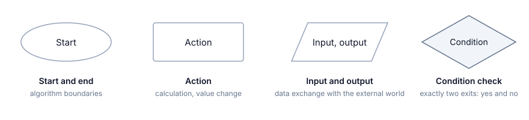
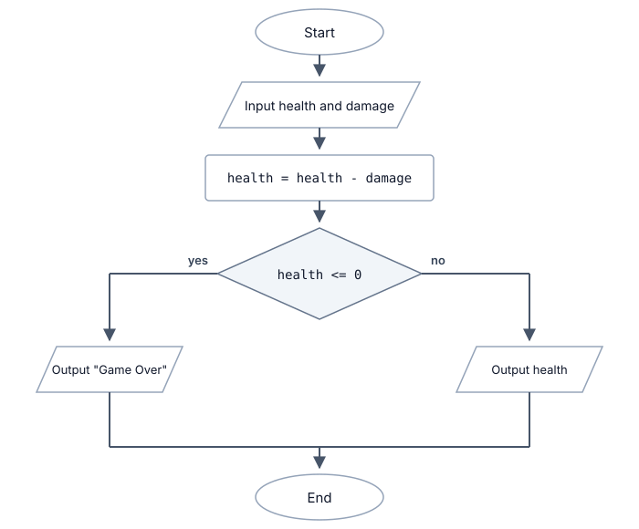
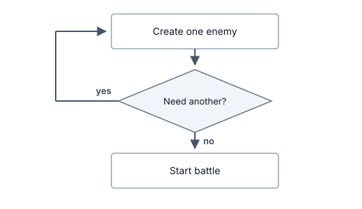
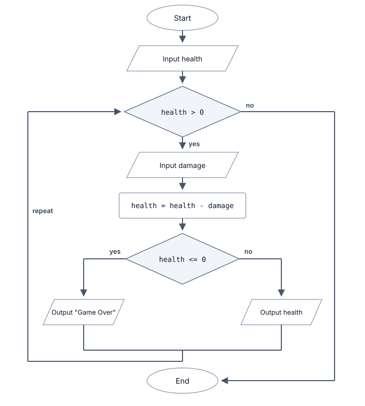
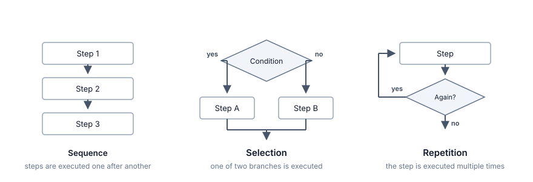
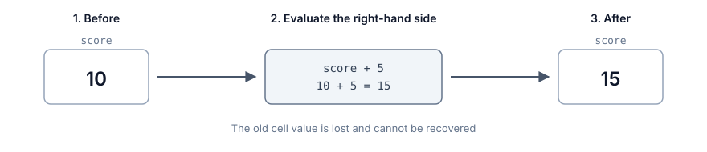

# How a Program Thinks

## Contents

- [How a Program Thinks](#how-a-program-thinks)
  - [Contents](#contents)
  - [Self-Check Questions](#self-check-questions)
  - [What Did We Cover in the Previous Chapter?](#what-did-we-cover-in-the-previous-chapter)
  - [What Does It Mean to Execute a Program?](#what-does-it-mean-to-execute-a-program)
    - [One Instruction at a Time](#one-instruction-at-a-time)
    - [Why the Order of Steps Changes the Result](#why-the-order-of-steps-changes-the-result)
  - [What Can Be Called an Algorithm?](#what-can-be-called-an-algorithm)
    - [Examples](#examples)
  - [Ways to Describe an Algorithm](#ways-to-describe-an-algorithm)
    - [Example Algorithm](#example-algorithm)
    - [Natural-Language Description](#natural-language-description)
    - [Pseudocode](#pseudocode)
    - [Flowcharts: Symbols](#flowcharts-symbols)
    - [Repeating an Action](#repeating-an-action)
    - [When Is Each Representation Useful?](#when-is-each-representation-useful)
    - [The Three Basic Control Structures](#the-three-basic-control-structures)
  - [Program State](#program-state)
    - [Memory as a Set of Named Cells](#memory-as-a-set-of-named-cells)
    - [Assignment](#assignment)
  - [Tracing an Algorithm by Hand](#tracing-an-algorithm-by-hand)
    - [What Does It Mean to Trace an Algorithm by Hand?](#what-does-it-mean-to-trace-an-algorithm-by-hand)
    - [Trace Tables](#trace-tables)
    - [How Tracing Helps Find an Error](#how-tracing-helps-find-an-error)
    - [How Do You Find an Error?](#how-do-you-find-an-error)
    - [What Test Data Should You Use?](#what-test-data-should-you-use)
    - [Why You Cannot Test Everything](#why-you-cannot-test-everything)
  - [Where to Write and Run Programs](#where-to-write-and-run-programs)
  - [Summary](#summary)

## Self-Check Questions

1. What will the following algorithm output, and why?

   ```text
   SET a = 5
   SET b = a
   SET a = a + 3
   OUTPUT b
   ```

2. Complete the trace table for `coins = 7`:

   ```text
   SET score = 100
   INPUT coins
   SET score = score - coins * 5
   OUTPUT score
   ```

3. Which property of an algorithm is violated by the instruction "keep increasing the score until the player gets bored"?
4. How many branches of a decision diamond are executed during a single pass through a flowchart? Can neither branch be executed?
5. Rewrite the following in pseudocode: input the number of coins; if the number of coins is greater than ten, output "Rich", otherwise output "Poor".
6. For the condition `IF health <= 0`, choose three values of `health` to test and explain why each one is useful.
7. Find the error and explain which input values reveal it:

   ```text
   INPUT price
   INPUT coins

   SET coins = coins - price

   IF coins < 0
       OUTPUT "Not enough coins"
   END IF

   OUTPUT coins
   ```

## What Did We Cover in the Previous Chapter?

In the previous chapter, we established that a program is stored in memory and that the processor reads its instructions one by one and executes them. Today, we will look more closely at what "executes" actually means and learn the most important skill of the first semester: predicting what a program will do before you run it.

Being able to execute an algorithm mentally or on paper is what separates someone who writes programs from someone who randomly changes symbols and hopes the program will start working. You will also need this skill in every laboratory assignment, because you can find an error only when you know what the correct behavior is supposed to be.

## What Does It Mean to Execute a Program?

### One Instruction at a Time

An executor does not see the entire algorithm at once the way you see a page. It works differently:

1. Take the next instruction.
2. Execute it completely.
3. Move to the next instruction.
4. Repeat until there are no instructions left.

There is no looking ahead, no executing two actions at the same time, and no judging the overall intent. Even if the next line makes it obvious that the previous one was unnecessary, the executor will still execute both.

Consider an algorithm for returning a character to camp:

1. Put away the weapon.
2. Open the map.
3. Select the camp location.
4. Walk to the selected location.
5. Close the map.

Each item is a complete action. Step four does not begin until step three has been completed.

### Why the Order of Steps Changes the Result

The order of steps in an algorithm is not a matter of formatting. It is part of the algorithm's meaning. Compare these two sequences:

```text
SET health = 100
SET health = health - 30
OUTPUT health
```

```text
SET health = 100
OUTPUT health
SET health = health - 30
```

The instructions themselves are the same; the set of instructions is identical. The first version outputs `70`, while the second outputs `100`. The only difference is _when_ the output occurs.

In game logic, changing the order can have more serious consequences. Imagine the sequence of actions when a character attacks:

- Check whether the enemy is alive, then deal damage.
- Deal damage, then check whether the enemy is alive.

The first version allows the character to attack an enemy that has already died: the check happens before health changes. The second version behaves correctly. A design document might describe both as "check and attack", but the resulting in-game behavior is different.

## What Can Be Called an Algorithm?

In the previous lecture, we defined an algorithm as a finite sequence of unambiguous actions intended to solve a particular class of problems. Let us break this definition down. An algorithm is commonly described by several properties[^1]:

- _Discreteness._ An algorithm consists of separate, complete steps that are executed one after another. You cannot execute one and a half steps or two steps at the same time.
- _Definiteness._ Every step has one unambiguous meaning. Two different executors given the same input data must obtain the same result. If a step allows multiple interpretations, it is not an algorithm.
- _Finiteness._ An algorithm terminates after a finite number of steps. A process that never ends does not solve the task.
- _Effectiveness._ The algorithm produces a result when it finishes. A message such as "no solution exists" is also a result if that outcome is defined by the algorithm.
- _Input and output._ An algorithm receives input data and produces a result. If an algorithm receives no input data, it cannot solve a class of input-dependent tasks; if it produces no result, it cannot be useful for such a task.

> [!NOTE]
> Different textbooks list these properties somewhat differently. In the first volume of _The Art of Computer Programming_, Knuth gives five characteristics: finiteness, definiteness, input, output, and effectiveness, meaning that every operation must be sufficiently basic that it can in principle be carried out exactly and in a finite amount of time[^1]. The underlying idea is the same; only the way it is divided into properties differs.

### Examples

Let us look at four descriptions and decide which of them are algorithms.

| Description                                                              | Algorithm? | What is violated?                                       |
| ------------------------------------------------------------------------ | ---------- | ------------------------------------------------------- |
| Make the game more interesting                                           | No         | Definiteness: it is unclear what exactly must be done   |
| Add as much health as necessary                                          | No         | Definiteness: "as much as necessary" cannot be computed |
| Divide 1 by 3 and keep writing down the digits of the result             | No         | Finiteness: the process never ends                      |
| Subtract the attack power from health, then compare the result with zero | Yes        | Nothing                                                 |

The first description makes perfect sense to a person and is completely useless to a machine. This is exactly the distinction discussed in the first lecture: a computer does not infer what you meant.

## Ways to Describe an Algorithm

### Example Algorithm

Consider the following task:

> A character is hit. The character's current health and the amount of damage are known. Decrease the health by the damage amount and report whether the character survived.

Before writing anything down, answer four questions. Make a habit of answering them before every task in this course:

1. What is given? Health and damage.
2. What must be produced? Either a message saying that the character died or the remaining health.
3. What data must be stored? Health, which changes, and the damage amount.
4. Is there a choice? Yes: the result depends on whether health remains above zero.

The fourth answer is the most important one. It tells us that the algorithm will contain a branch.

### Natural-Language Description

Let us try to describe the algorithm in words. The description must be unambiguous and leave no room for interpretation. One possible version is:

1. Obtain the character's current health.
2. Obtain the damage amount.
3. Decrease health by the damage amount.
4. If health becomes less than or equal to zero, output the message "Game Over".
5. Otherwise, output the remaining health.

This representation is easy to understand, and it is perfectly suitable at first. Its main disadvantage is its _length_.

Five steps are still easy to read. Twenty become a page of continuous text, and thirty are unlikely to be read carefully to the end. More importantly, the structure gets buried in long prose: it becomes difficult to see where a branch begins or where an action repeats. Pseudocode and flowcharts make the structure visible immediately, whereas a list of sentences forces you to keep that structure in your head.

There is also a second, smaller disadvantage: natural-language descriptions can quietly introduce ambiguity. The phrase "decrease health" does not explicitly say where the result should be stored.

### Pseudocode

_Pseudocode_ is a way to write an algorithm in a form that resembles a programming language while remaining easy for people to read. For our algorithm, it may look like this:

```text
INPUT health
INPUT damage

SET health = health - damage

IF health <= 0
    OUTPUT "Game Over"
ELSE
    OUTPUT health
END IF
```

We will use a small set of constructs:

- `INPUT name` - receive a value from outside the algorithm and store it in the cell with that name.
- `OUTPUT value` - send a value outside the algorithm, for example by displaying it on the screen.
- `SET name = expression` - evaluate an expression and store the result.
- `IF condition ... ELSE ... END IF` - execute one of two groups of actions depending on the condition.
- Indentation shows which actions belong to the `IF` branch or the `ELSE` branch.

There is no single official standard for pseudocode; different authors write it differently. We will use one consistent style so that everyone in the group reads the notation in the same way.

> [!TIP]
> Pseudocode is written for people. If you are unsure how to express a step, write it as a clear sentence in English and keep going. That is better than getting stuck on invented syntax.

### Flowcharts: Symbols

A **flowchart** is a graphical representation of an algorithm in which actions are shown as shapes and the execution order is shown with arrows.

The shape of a block indicates the type of step it represents. Four shapes will be enough for this course.



_Figure 2.1. Basic flowchart blocks_

Let us examine each block in more detail:

- An _oval_ marks the beginning and the end of an algorithm. The word "Start" or "End" is written inside it. That is its only purpose.
- A _rectangle_ represents an action: a calculation or a change of value. It is simply an action that is performed without branching, such as "decrease health by the damage amount".
- A _parallelogram_ represents input or output. For example, "input health" or "output remaining health". When data enters the program, the arrow points into the block; when data leaves the program, the arrow points out of the block.
- A _diamond_ represents a condition check and _always_ has two outgoing arrows: one for "yes" (_true_) and one for "no" (_false_).

These are not all the flowchart shapes that exist, but these four are sufficient for most simple algorithms. Standard flowchart symbols are described in the relevant diagramming standards[^2][^3].

Now let us represent our algorithm as a flowchart. The diagram must be unambiguous and leave no room for interpretation. One possible version is:



_Figure 2.2. Damage calculation algorithm as a flowchart_

Read the diagram from top to bottom, following the arrows. When the executor reaches a diamond, it evaluates the condition and chooses one of the two outgoing paths. Notice two things.

Exactly one branch is executed. It is not possible for both branches to run, nor for neither of them to run.

Compare Figure 2.2 with the pseudocode in the previous section. They express exactly the same logic in two different forms. The diamond corresponds to the `IF` line, the left branch corresponds to the body of `IF`, the right branch corresponds to the body of `ELSE`, and the point where the arrows merge corresponds to `END IF`.

### Repeating an Action

So far, all arrows in our diagrams have pointed downward. If an arrow points back to a block that has already been executed, we get repetition.



_Figure 2.3. Repetition in a flowchart_

Here, the same block is executed as many times as necessary until the answer to the question becomes negative. This is how, for example, you can create five enemies without drawing five identical rectangles.

This repetition is called a _loop_. A _loop_ must always have an exit condition; otherwise, it will run forever. In our example, the exit condition is the "no" answer to the question in the diamond.

Let us add a _loop_ to our algorithm so that the character continues taking hits while still alive.

In pseudocode, it looks like this:

```text
INPUT health
WHILE health > 0
    INPUT damage
    SET health = health - damage

    IF health <= 0
        OUTPUT "Game Over"
    ELSE
        OUTPUT health
    END IF
END WHILE
```

In a flowchart, it looks like this:



_Figure 2.4. A loop in a flowchart_

### When Is Each Representation Useful?

| Representation   | Advantages                                   | Disadvantages                     |
| ---------------- | -------------------------------------------- | --------------------------------- |
| Natural language | Easy to understand without prior preparation | Long and may allow ambiguity      |
| Pseudocode       | Compact, close to code, easy to edit         | Requires an agreed notation style |
| Flowchart        | Makes structure and branching visually clear | Bulky and difficult to modify     |

A flowchart works well for an algorithm with roughly ten steps or for explaining something at a whiteboard. For a two-hundred-line program, it turns into a diagram several meters long that nobody wants to redraw after every change. For that reason, pseudocode will be our main representation throughout the rest of the course, while flowcharts will appear when the structure itself is important to see.

> [!NOTE]
>
> At the beginning of the course, I strongly recommend describing your algorithm before you start writing code: use natural language, pseudocode, or a flowchart so that you first understand the program's logic and structure. Later, when developing programs, you will most likely begin writing code directly, but early in the course this habit will help you understand exactly what you are doing and why.

### The Three Basic Control Structures

While looking at flowcharts and pseudocode, we have already encountered three different ways to connect the steps of an algorithm:



_Figure 2.6. The three basic control structures of an algorithm_

- **Sequence** - steps are executed one after another in the order in which they are written.
- **Selection (branching)** - one of several branches is executed depending on a condition.
- **Repetition (loop)** - a group of steps is executed multiple times.

The list is short, and that is not accidental. _Any algorithm, no matter how complex, can be built from these three structures and from structures nested inside one another._

This result was proved in 1966 by Corrado Böhm and Giuseppe Jacopini[^6], and the approach to writing programs based on it is known as **structured programming**. We will discuss this approach in more detail in Chapter 4. For now, remember this: if you know how to work with the three basic structures, you know how to construct algorithms of any complexity.

The practical idea is simple. When you look at an unfamiliar problem and do not know where to start, ask yourself just three questions:

1. Which actions happen one after another?
2. Where does a decision have to be made?
3. What repeats?

The answers to these questions _form the skeleton of the future program, or of one part of it_. This also explains the structure of the course: next we will study selection, then repetition, and after that the set of basic structures is complete. The rest of the course will be about learning how to combine them into solutions to real problems.

## Program State

### Memory as a Set of Named Cells

While an algorithm is running, values such as health, damage, and intermediate results have to be stored somewhere. Think of memory as a set of cells. Each cell has two properties:

- It has a name that is used to refer to it.
- It stores exactly one value.

The name exists so that we do not get lost. Saying "put 100 into cell number 4820096" is impractical for a person, while saying "put 100 into `health`" is easy.

This kind of cell has a standard name: a **variable**. It is called a variable because its value can change while the program is running.

> [!NOTE]
> We will discuss the different kinds of values, how much space a cell occupies, and what it means to declare a variable in a program in the next lesson. For now, the mental model "a named cell stores a value" is enough.

There are three basic operations you can perform with a variable:

1. Create a variable with a name and store its initial value.
2. Read its value without changing it.
3. Store a new value in place of the old one.

The third point deserves special attention. Writing a new value destroys whatever was stored in the variable before. The previous value is not preserved anywhere and cannot be restored unless it was saved elsewhere.

### Assignment

**Assignment** is the operation of evaluating a value and storing it in a variable.

In our pseudocode, we write it as `SET name = expression`. It is carried out in exactly two stages:

1. The right-hand side is evaluated completely.
2. The resulting value is stored in the variable on the left.

The right-hand side is evaluated first. This rule seems obvious until the same variable appears on both sides of the assignment.

Suppose the variable `score` currently contains `10`.



_Figure 2.7. What happens during assignment_

Step by step:

1. The executor looks at the right-hand side: `score + 5`.
2. It reads the current value of `score`, which is `10`.
3. It evaluates `10 + 5`, producing `15`.
4. It stores `15` in the variable `score`.
5. The previous value `10` disappears.

> [!IMPORTANT]
> Assignment is not equality. In mathematics, `score = score + 5` would be a false statement because a number cannot equal itself plus five. In programming, it is a command: take the variable's current value, add five, and store the result back in the variable. Read the `=` sign as "store in", not as "is equal to".

The **state of a program** is the complete set of all variables and their values at a particular moment during execution. Every assignment changes the state. Program execution is therefore a sequence of states, not merely a sequence of actions.

## Tracing an Algorithm by Hand

### What Does It Mean to Trace an Algorithm by Hand?

**Manual tracing** means executing an algorithm yourself, step by step, while recording the values of all variables, without running the program on a computer.

Why this matters:

- To understand someone else's algorithm.
- To check your own idea before turning it into code.
- To find an error when the program compiles but produces the wrong result.
- To answer exam questions when no compiler is available.

### Trace Tables

It is convenient to record values in a table. A **trace table** is a table that shows, step by step, the values of all variables and any data that is output.

The rules are simple:

1. Use one column for each variable, plus a column for output.
2. Use one row for each executed step.
3. In each row, record the program state after that step has been executed.
4. Copy unchanged values into the next row instead of leaving them blank.

The fourth rule may seem like unnecessary work, but it gives you a complete picture of the program state and prevents variables from disappearing from your attention.

Let us begin with a _linear algorithm_, which executes instructions one after another without selection or repetition.

```text
SET score = 0
INPUT coins
SET score = score + coins * 10
SET score = score + 5
OUTPUT score
```

Suppose the input is `coins = 3`.

| Step | Instruction                      | `score` | `coins` | Output |
| ---: | -------------------------------- | ------: | ------: | ------ |
|    1 | `SET score = 0`                  |       0 |         |        |
|    2 | `INPUT coins`                    |       0 |       3 |        |
|    3 | `SET score = score + coins * 10` |      30 |       3 |        |
|    4 | `SET score = score + 5`          |      35 |       3 |        |
|    5 | `OUTPUT score`                   |      35 |       3 | 35     |

At step three, `coins * 10` is evaluated first, giving `30`; then `0 + 30` is evaluated, and the result is stored in `score`. The order of operations is the same as in mathematics: multiplication is performed before addition.

Now consider an _algorithm with selection_, which chooses what to do based on a condition.

```text
INPUT health
INPUT damage

SET health = health - damage

IF health <= 0
    OUTPUT "Game Over"
ELSE
    OUTPUT health
END IF
```

1. Input data: `health = 100`, `damage = 30`:

   | Step | Instruction                    | `health` | `damage` | Output             |
   | ---: | ------------------------------ | -------: | -------: | ------------------ |
   |    1 | `INPUT health`                 |      100 |          |                    |
   |    2 | `INPUT damage`                 |      100 |       30 |                    |
   |    3 | `SET health = health - damage` |       70 |       30 |                    |
   |    4 | `IF health <= 0`               |       70 |       30 | condition is false |
   |    5 | `OUTPUT health`                |       70 |       30 | 70                 |

2. Input data: `health = 100`, `damage = 120`:

   | Step | Instruction                    | `health` | `damage` | Output            |
   | ---: | ------------------------------ | -------: | -------: | ----------------- |
   |    1 | `INPUT health`                 |      100 |          |                   |
   |    2 | `INPUT damage`                 |      100 |      120 |                   |
   |    3 | `SET health = health - damage` |      -20 |      120 |                   |
   |    4 | `IF health <= 0`               |      -20 |      120 | condition is true |
   |    5 | `OUTPUT "Game Over"`           |      -20 |      120 | Game Over         |

Compare the two tables. Steps 1, 2, 3, and 4 are the same; only the values differ. At step five, the execution paths diverge: the first run takes the `ELSE` branch, while the second takes the `IF` branch. Exactly one branch is executed, and the table makes that visible.

The table also revealed something that the problem statement did not mention: health can become negative. That does not matter for the "Game Over" message, but if we wanted to draw a health bar, the value `-20` would have to be handled separately. Manual tracing often brings questions like this to the surface.

### How Tracing Helps Find an Error

Consider the following _algorithm_ and its _pseudocode_.

Damage is calculated as attack power minus defense, but damage cannot be negative. If defense is greater than attack, damage should be treated as zero.

Someone wrote the following:

```text
INPUT attack
INPUT defense

IF damage < 0
    SET damage = 0
END IF

SET damage = attack - defense

OUTPUT damage
```

At first glance, everything appears to be present: the subtraction is there, and there is a check for a negative value. Let us test it with `attack = 10`, `defense = 15`. We expect `0`.

| Step | Instruction                     | `attack` | `defense` | `damage` | Output                        |
| ---: | ------------------------------- | -------: | --------: | -------: | ----------------------------- |
|    1 | `INPUT attack`                  |       10 |           |          |                               |
|    2 | `INPUT defense`                 |       10 |        15 |          |                               |
|    3 | `IF damage < 0`                 |       10 |        15 | no value | condition cannot be evaluated |
|    4 | `SET damage = attack - defense` |       10 |        15 |       -5 |                               |
|    5 | `OUTPUT damage`                 |       10 |        15 |       -5 | -5                            |

The error is immediately visible: the check happens before the calculation. At step three, the variable `damage` does not contain a value yet, so there is nothing to check. By the time the value exists, there is no check left to perform.

The correct order is:

```text
INPUT attack
INPUT defense

SET damage = attack - defense

IF damage < 0
    SET damage = 0
END IF

OUTPUT damage
```

### How Do You Find an Error?

What we have just been doing is called debugging.

**Debugging** is the process of finding, locating, and fixing errors in a program.

Debugging is a task in its own right, and it often takes at least as much time as writing the code itself. The process is the same regardless of the size of the program:

1. What did you expect to get?
2. What did you actually get?
3. At which step did the actual result first diverge from the expected result?
4. What values were stored in the variables at that step?
5. Which branch of a condition was taken, and why?

The answer to the third question identifies the location of the error. Everything before that point behaved correctly, so there is no reason to search there.

> [!TIP]
> Fill in the trace table honestly: write down what actually happens, not what you intended to happen. Only the first approach can reveal an error. The second merely confirms that you are still convinced your original idea was correct.

### What Test Data Should You Use?

One successful run proves nothing. For example, the corrected algorithm produces `15` for `attack = 20`, `defense = 5`, but the original incorrect version also produces `15` for those inputs. Not every error appears for every input.

For that reason, test at least three kinds of cases:

| Case     | Example                       | What it checks                                |
| -------- | ----------------------------- | --------------------------------------------- |
| Typical  | `attack = 20`, `defense = 5`  | Normal behavior                               |
| Boundary | `attack = 10`, `defense = 10` | Behavior exactly at the condition boundary    |
| Special  | `attack = 10`, `defense = 15` | The branch for which the check was introduced |

Boundary cases are the ones people forget most often. For the condition `damage < 0`, the boundary is zero, so you need to understand that when `damage = 0`, the condition is false and the branch is not executed. That is correct here. In the condition `health <= 0`, however, a different comparison operator is used, and zero means that the character is dead. A difference of one symbol changes the behavior.

> [!WARNING]
> A program that produced the correct answer once is not necessarily a correct program. It is a program that has been tested once with one example.

Instead of guessing which values to use, follow a simple procedure. Find the number in the condition: that is where the boundary lies. Choose three values - one below the boundary, one exactly on it, and one above it. For `health <= 0`, those values are `-1`, `0`, and `1`; at least one of them will expose an incorrectly chosen comparison sign. Also test empty and zero cases separately: zero coins, an empty list of enemies, zero loop iterations. These are among the cases people forget most often.

Some common boundaries are shown below:

| Condition or task              | Boundary values | Special values              |
| ------------------------------ | --------------- | --------------------------- |
| `IF health <= 0`               | `0` and `1`     | Negative health             |
| `IF damage < 0`                | `-1` and `0`    | Damage exactly equal to `0` |
| `IF coins >= price`            | `coins = price` | `coins = 0`, `price = 0`    |
| `IF level > 10`                | `10` and `11`   | Level `1`, maximum level    |
| Iterate over a list of enemies | One enemy       | Empty list                  |
| Repeat `N` times               | `N = 1`         | `N = 0`, negative `N`       |

### Why You Cannot Test Everything

A natural question arises here: if three sets of input data are not enough, why not test every possible case? The unpleasant answer is that there are far too many.

A classic example is given by _Glenford Myers_ in _The Art of Software Testing_[^7]. Consider a program of about twenty lines: a loop that may repeat up to twenty times, with several nested conditions inside it. The number of distinct execution paths through such a program can be on the order of one hundred trillion. If you tested one path every five minutes, the process would take roughly a billion years.

And this is still a very small program. The problem is not laziness or a lack of time: the number of possible paths grows combinatorially, far beyond any practical amount of testing. This is an old problem, more than half a century old, and there is no general solution that makes exhaustive testing practical.

In practice, programmers deal with this in several ways:

- _Test parts separately._ A small part of an algorithm can often be tested thoroughly even when the whole program cannot. This is one reason we break a problem into smaller parts that can be checked independently.
- _Make sure every branch is executed at least once._ If an algorithm contains an `IF`, you need input data for both the "yes" and the "no" branches. A branch that has never been executed has not been tested at all, and any error in it remains hidden until a user eventually provides an inconvenient input.
- _Test boundaries,_ as discussed above, because that is where errors occur especially often.

Edsger Dijkstra expressed the idea particularly well[^8]: _testing can show the presence of errors, but it can never prove their absence. Testing does not prove that a program is correct. It only increases our confidence in it, and the better the test data are chosen, the greater that confidence becomes._

## Where to Write and Run Programs

The algorithms in this lecture are executed on paper, but soon you will need an environment in which you can type and run actual program code. There are several options:

- A _text editor plus a compiler_ launched from the terminal. This approach is transparent because you can see every stage, but you have to perform each step manually.
- An _IDE (Integrated Development Environment)_: an editor, compiler, debugger, and build tools in a single application. Common options for C++ include Visual Studio, CLion, Code::Blocks, and Visual Studio Code with the appropriate extensions. An IDE provides syntax highlighting, code completion, one-click builds, and the ability to pause execution and inspect variable values while the program is running.
- An _online compiler in a browser_. Nothing needs to be installed, so it is convenient for quickly checking a short example, but it is not suitable for full-scale project work.

We will decide which environment to use, install and configure it during the laboratory sessions, and build and run our first program there.

> [!NOTE]
>
> The debugger built into an IDE does exactly what we have been doing in the sections on manual tracing and debugging: it executes the program step by step and shows the values stored in variables. The difference is that it does the mechanical work for you. It is still worth learning to fill in a trace table by hand, because then you understand what the debugger is showing instead of merely looking at numbers.

## Summary

1. An executor performs exactly one instruction at a time and then moves to the next one without looking ahead.
2. The order of steps is part of an algorithm: the same actions performed in a different order can produce a different result.
3. An algorithm has the properties of discreteness, definiteness, finiteness, effectiveness, and input/output.
4. The same algorithm can be represented in natural language, pseudocode, or a flowchart; the representation changes, but the logic does not.
5. In a flowchart, an oval represents the start and end, a rectangle represents an action, a parallelogram represents input and output, and a diamond represents a condition check with two outgoing paths.
6. Sequence, selection, and repetition are the three control structures from which any algorithm can be constructed.
7. Memory can be modeled as a set of named cells, each of which stores one value.
8. Assignment happens in two stages: first the right-hand side is evaluated, then the result is stored in the variable, replacing the previous value.
9. Debugging is the process of finding and fixing errors; a trace table shows the program state after every step and helps identify the first step at which actual behavior diverges from the expected behavior.
10. An algorithm should be tested with at least typical, boundary, and special input data.
11. Exhaustively testing every possible execution path is impractical even for a short program, so parts are tested separately and every branch should be executed at least once.

[^1]: Knuth D. E. _The Art of Computer Programming. Volume 1: Fundamental Algorithms_. 3rd ed. Addison-Wesley, 1997.

[^2]: ISO 5807:1985. _Information processing. Documentation symbols and conventions for data, program and system flowcharts, program network charts and system resources charts_.

[^3]: GOST 19.701-90. _Unified System for Program Documentation. Schemes of algorithms, programs, data and systems. Symbols and rules for execution_.

[^4]: Stroustrup B. _Programming: Principles and Practice Using C++_. 2nd ed. Addison-Wesley, 2014.

[^5]: Gaddis T. _Starting Out with C++: From Control Structures through Objects_. 9th ed. Pearson, 2017.

[^6]: Böhm C., Jacopini G. _Flow Diagrams, Turing Machines and Languages with Only Two Formation Rules_. Communications of the ACM, Vol. 9, No. 5, 1966.

[^7]: Myers G. J., Badgett T., Sandler C. _The Art of Software Testing_. 2nd ed. Wiley, 2004.

[^8]: Dijkstra E. W. _Notes on Structured Programming_. EWD249, Technological University Eindhoven, 1970.
