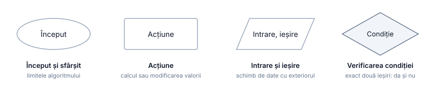
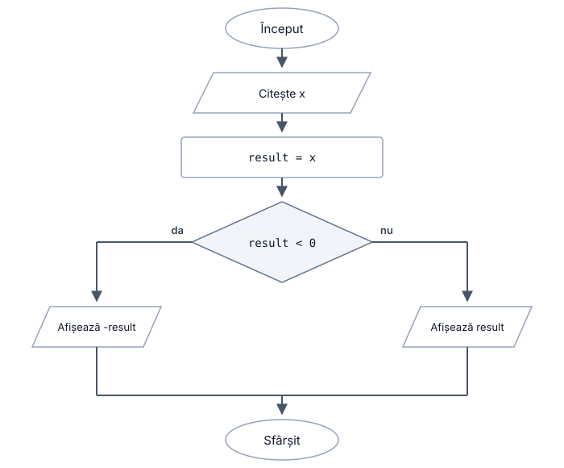
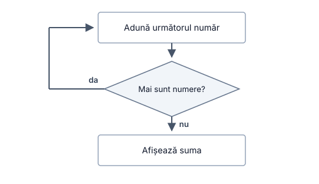
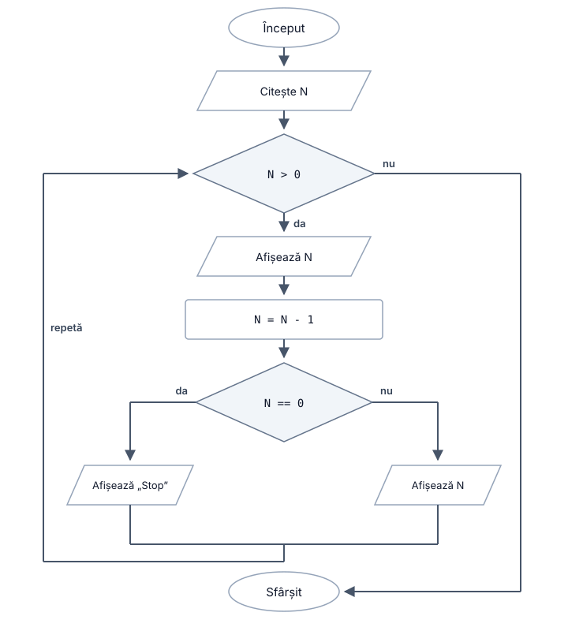
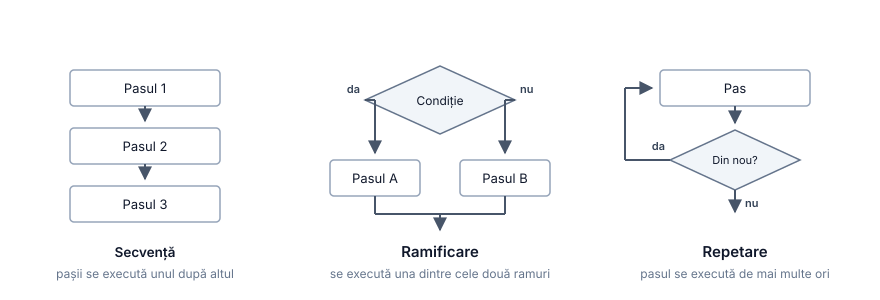
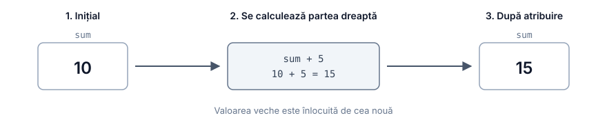

# Cum „gândește” un program

## Cuprins

- [Cum „gândește” un program](#cum-gândește-un-program)
  - [Cuprins](#cuprins)
  - [Întrebări pentru autoevaluare](#întrebări-pentru-autoevaluare)
  - [Ce am discutat în lecția precedentă?](#ce-am-discutat-în-lecția-precedentă)
  - [Ce înseamnă să executăm un program](#ce-înseamnă-să-executăm-un-program)
    - [Câte o instrucțiune pe rând](#câte-o-instrucțiune-pe-rând)
    - [De ce ordinea pașilor schimbă rezultatul](#de-ce-ordinea-pașilor-schimbă-rezultatul)
  - [Ce putem numi algoritm](#ce-putem-numi-algoritm)
    - [Exemple](#exemple)
  - [Moduri de descriere a unui algoritm](#moduri-de-descriere-a-unui-algoritm)
    - [Exemplu de algoritm](#exemplu-de-algoritm)
    - [Descriere în cuvinte](#descriere-în-cuvinte)
    - [Pseudocod](#pseudocod)
    - [Schema logică: simboluri](#schema-logică-simboluri)
    - [Repetarea unei acțiuni](#repetarea-unei-acțiuni)
    - [Când este util fiecare mod de descriere?](#când-este-util-fiecare-mod-de-descriere)
    - [Trei structuri de bază](#trei-structuri-de-bază)
  - [Starea programului](#starea-programului)
    - [Memoria ca un set de celule cu nume](#memoria-ca-un-set-de-celule-cu-nume)
    - [Atribuirea](#atribuirea)
  - [Executarea manuală a algoritmului](#executarea-manuală-a-algoritmului)
    - [Ce este executarea manuală](#ce-este-executarea-manuală)
    - [Tabelul de trasare](#tabelul-de-trasare)
    - [Cum ajută trasarea la găsirea unei erori](#cum-ajută-trasarea-la-găsirea-unei-erori)
    - [Cum căutăm o eroare?](#cum-căutăm-o-eroare)
    - [Pe ce date verificăm programul](#pe-ce-date-verificăm-programul)
    - [De ce nu putem verifica toate cazurile](#de-ce-nu-putem-verifica-toate-cazurile)
  - [Unde scriem și rulăm programele](#unde-scriem-și-rulăm-programele)
  - [Rezumat](#rezumat)

## Întrebări pentru autoevaluare

1. Ce va afișa algoritmul și de ce?

   ```text
   SET a = 5
   SET b = a
   SET a = a + 3
   OUTPUT b
   ```

2. Completați tabelul de trasare pentru `x = 7`:

   ```text
   SET result = 100
   INPUT x
   SET result = result - x * 5
   OUTPUT result
   ```

3. Ce proprietate a algoritmului este încălcată în formularea „adaugă câte 1 până când rezultatul devine suficient de mare”?
4. Câte ramuri ale unui romb din schema logică se execută la o trecere? Pot să nu se execute niciuna?
5. Scrieți în pseudocod: citiți un număr; dacă este mai mare decât `10`, afișați „Mai mare decât 10”, altfel afișați „10 sau mai mic”.
6. Pentru condiția `IF x <= 0`, alegeți trei valori ale lui `x` pentru testare și explicați de ce este utilă fiecare.
7. Găsiți eroarea și explicați pe ce date se manifestă:

   ```text
   INPUT a
   INPUT b

   SET result = a / b

   IF b == 0
       OUTPUT "Împărțire la zero"
   END IF

   OUTPUT result
   ```

## Ce am discutat în lecția precedentă?

În lecția precedentă am stabilit că programul este păstrat în memorie, iar procesorul citește și execută instrucțiunile. Acum vom vedea mai atent ce înseamnă „execută” și vom exersa una dintre cele mai importante deprinderi pentru început: să putem prezice ce face programul înainte de a-l rula.

Această deprindere este importantă în special când lucrăm cu formule și algoritmi matematici. Dacă programul dă un rezultat greșit, trebuie să putem urmări calculele pas cu pas și să vedem unde s-a schimbat ceva față de ceea ce așteptam.

## Ce înseamnă să executăm un program

### Câte o instrucțiune pe rând

Executantul nu „vede” intenția noastră generală. El lucrează pas cu pas:

1. ia instrucțiunea curentă;
2. o execută complet;
3. trece la instrucțiunea următoare;
4. repetă procesul până când programul se termină.

Nu sare înainte pentru a „înțelege” ce voiam să facem. Nu corectează automat un pas doar pentru că următorul arată altfel.

Să luăm un algoritm foarte simplu pentru calcularea valorii expresiei

$$y = (a + b) \cdot c.$$

Putem descrie pașii astfel:

1. citiți `a`;
2. citiți `b`;
3. calculați `a + b`;
4. înmulțiți rezultatul cu `c`;
5. afișați `y`.

Fiecare pas este o acțiune separată. Pasul 4 are sens numai după ce a fost obținut rezultatul de la pasul 3.

### De ce ordinea pașilor schimbă rezultatul

Ordinea nu este un detaliu de formatare. Ea face parte din algoritm.

Comparați două variante:

```text
SET value = 100
SET value = value - 30
OUTPUT value
```

```text
SET value = 100
OUTPUT value
SET value = value - 30
```

Instrucțiunile sunt aproape aceleași, dar primul algoritm afișează `70`, iar al doilea afișează `100`. Diferența este momentul în care se execută `OUTPUT`.

Un exemplu matematic și mai important este împărțirea:

- verificați dacă `b = 0`, apoi calculați `a / b`;
- calculați `a / b`, apoi verificați dacă `b = 0`.

În primul caz prevenim operația invalidă. În al doilea caz verificarea vine prea târziu: programul a încercat deja să facă împărțirea.

> [!IMPORTANT]
> Într-un algoritm, „ce facem” și „în ce ordine facem” sunt la fel de importante.

## Ce putem numi algoritm

În lecția precedentă am definit algoritmul ca o succesiune finită de acțiuni clare pentru rezolvarea unei clase de probleme. Să desfacem această definiție în proprietăți[^1].

- _Discretitudine._ Algoritmul este format din pași separați, care se execută unul după altul.
- _Determinare._ Fiecare pas trebuie să fie formulat suficient de clar încât să nu permită interpretări diferite.
- _Finitudine._ Algoritmul trebuie să se încheie după un număr finit de pași.
- _Rezultativitate._ La final trebuie să existe un rezultat. Mesajul „nu există soluție” poate fi și el un rezultat, dacă este prevăzut de algoritm.
- _Date de intrare și ieșire._ În mod obișnuit algoritmul primește date și produce un rezultat; unele formulări teoretice permit și zero date de intrare.

> [!NOTE]
> Diferite manuale formulează lista proprietăților puțin diferit. Donald Knuth, de exemplu, discută finitudinea, determinarea, intrarea, ieșirea și eficiența în sensul că fiecare pas trebuie să fie executabil într-un timp finit[^1]. Ideea generală rămâne aceeași.

### Exemple

Să verificăm câteva descrieri.

| Descriere                                                    | Algoritm? | Ce problemă există                                      |
| ------------------------------------------------------------ | --------- | ------------------------------------------------------ |
| „Rezolvă ecuația frumos”                                     | Nu        | „frumos” nu definește o operație exactă                |
| „Adaugă cât trebuie”                                         | Nu        | „cât trebuie” nu este definit                          |
| „Împarte 1 la 3 și scrie toate cifrele rezultatului”         | Nu        | Procesul nu se termină                                 |
| „Calculează `a - b`, apoi compară rezultatul cu zero”        | Da        | Pașii sunt clari și finiți                             |

Primele două formulări sunt ușor de înțeles aproximativ de un om, dar sunt insuficiente pentru un calculator. Calculatorul nu completează singur informația lipsă.

## Moduri de descriere a unui algoritm

### Exemplu de algoritm

Vom folosi un exemplu simplu și apropiat de matematică:

> Este dat un număr real `x`. Trebuie să calculăm modulul său `|x|`.

Înainte de a scrie algoritmul, răspundem la patru întrebări.

1. Ce este dat? Numărul `x`.
2. Ce trebuie obținut? Valoarea `|x|`.
3. Ce date trebuie păstrate? Cel puțin valoarea curentă a lui `x`.
4. Există o alegere? Da. Dacă `x < 0`, schimbăm semnul; altfel îl lăsăm neschimbat.

Ultimul punct ne arată că algoritmul conține o **ramificare**.

### Descriere în cuvinte

Algoritmul poate fi scris simplu:

1. Citiți valoarea `x`.
2. Dacă `x` este negativ, înlocuiți `x` cu `-x`.
3. Afișați `x`.

Pentru un algoritm mic, o descriere în cuvinte este foarte comodă.

Problema apare când avem zeci de pași. Textul devine lung și este greu să vedem imediat unde apare o condiție și unde apare o repetare. De aceea folosim pseudocodul și schemele logice.

### Pseudocod

**Pseudocodul** este o formă de descriere a algoritmului care seamănă cu un limbaj de programare, dar rămâne orientată spre citirea de către om.

Pentru modulul unui număr:

```text
INPUT x

IF x < 0
    SET x = -x
END IF

OUTPUT x
```

Vom folosi câteva construcții simple:

- `INPUT nume` — primește o valoare și o păstrează sub acel nume;
- `OUTPUT valoare` — afișează sau transmite o valoare;
- `SET nume = expresie` — calculează expresia și salvează rezultatul;
- `IF condiție ... ELSE ... END IF` — alege una dintre două ramuri în funcție de condiție;
- `WHILE condiție ... END WHILE` — repetă pașii cât timp condiția este adevărată.

Indentarea arată ce instrucțiuni aparțin unei ramuri sau unui ciclu.

> [!TIP]
> Pseudocodul este pentru oameni. Dacă nu știți exact cum să formulați un pas, scrieți-l mai întâi într-o propoziție clară. Logica este mai importantă decât o sintaxă inventată.

### Schema logică: simboluri

**Schema logică (flowchart)** reprezintă grafic un algoritm. Acțiunile sunt desenate prin figuri, iar săgețile arată ordinea execuției.

Pentru început sunt suficiente patru forme.



_Figura 2.1. Blocurile principale ale unei scheme logice_

- _Ovalul_ marchează începutul sau sfârșitul algoritmului.
- _Dreptunghiul_ reprezintă o acțiune: de exemplu „calculează `x = -x`”.
- _Paralelogramul_ reprezintă intrarea sau ieșirea datelor: „citește `x`”, „afișează `x`”.
- _Rombul_ reprezintă o condiție și are două ieșiri: „da/adevărat” și „nu/fals”.

Acestea nu sunt toate simbolurile posibile, dar sunt suficiente pentru majoritatea algoritmilor simpli. Convențiile pentru scheme sunt descrise și în standarde dedicate[^2][^3].

Pentru algoritmul modulului unui număr, schema ar avea logica:

1. început;
2. citește `x`;
3. verifică `x < 0`;
4. dacă da, execută `x = -x`;
5. afișează `x`;
6. sfârșit.

În materialul original, figura următoare folosește aceeași structură de ramificare și poate fi citită ca exemplu de organizare a pașilor:



_Figura 2.2. Exemplu de algoritm cu ramificare_

Schema se citește urmând săgețile. Când ajungem la romb, evaluăm condiția și alegem ieșirea corespunzătoare.

La o singură trecere se execută o singură ramură. Nu se execută simultan ambele ramuri.

### Repetarea unei acțiuni

Până acum, pașii mergeau înainte. Dacă o săgeată revine la un bloc executat anterior, apare o repetare.



_Figura 2.3. Repetarea într-o schemă logică_

O astfel de repetare se numește **ciclu (loop)**. Un ciclu trebuie să aibă o condiție de terminare; altfel poate deveni infinit.

Să luăm o problemă matematică simplă: calculăm suma numerelor naturale de la `1` la `N`.

O variantă în pseudocod:

```text
INPUT N
SET sum = 0
SET i = 1

WHILE i <= N
    SET sum = sum + i
    SET i = i + 1
END WHILE

OUTPUT sum
```

La fiecare pas se adaugă următorul număr la `sum`, iar `i` crește cu `1`. Ciclul se oprește când `i > N`.

Figura originală de mai jos ilustrează aceeași idee generală de revenire și repetare a unui bloc:



_Figura 2.4. Ciclu într-o schemă logică_

### Când este util fiecare mod de descriere?

| Formă            | Avantaje                                        | Dezavantaje                                  |
| ---------------- | ----------------------------------------------- | --------------------------------------------- |
| În cuvinte       | Ușor de înțeles fără pregătire specială        | Devine lung și poate rămâne ambiguu           |
| Pseudocod        | Compact, apropiat de cod, ușor de modificat    | Trebuie să păstrăm un stil consecvent         |
| Schemă logică    | Arată clar structura și ramificările            | Devine voluminoasă pentru programe mari       |

O schemă logică este foarte utilă pentru un algoritm scurt sau pentru explicația la tablă. Pentru sute de linii de cod, schema devine greu de întreținut. De aceea, în continuarea cursului vom folosi mai des pseudocodul.

> [!NOTE]
> La început vă recomand să descrieți algoritmul înainte de a scrie codul: în cuvinte, pseudocod sau schemă logică. Cu experiență, pentru probleme simple veți putea trece direct la cod, dar la început această etapă reduce multe erori.

### Trei structuri de bază

Din exemplele de mai sus apar trei moduri fundamentale de organizare a pașilor:



_Figura 2.5. Trei structuri de bază ale algoritmilor_

- **Secvența** — instrucțiunile se execută una după alta.
- **Ramificarea** — în funcție de o condiție, se alege o ramură.
- **Repetarea (ciclul)** — un grup de instrucțiuni se execută de mai multe ori.

Lista este scurtă, dar foarte importantă. _Algoritmii structurali pot fi construiți prin combinarea și imbricarea acestor structuri._

Rezultatul clasic asociat teoremei Böhm–Jacopini arată că programele de tip structurabil pot fi construite folosind secvență, selecție și iterație[^6]. Pentru cursul nostru, concluzia practică este mai importantă decât formularea teoretică.

Când nu știți cum să începeți o problemă, întrebați:

1. Ce acțiuni trebuie făcute una după alta?
2. Unde trebuie luată o decizie?
3. Ce trebuie repetat?

Aceste trei întrebări oferă adesea scheletul soluției.

## Starea programului

### Memoria ca un set de celule cu nume

În timpul execuției trebuie să păstrăm valori: `x`, `N`, o sumă parțială, un rezultat intermediar și altele.

Pentru început, putem imagina memoria ca pe un set de celule. Fiecare celulă are:

- un nume prin care o identificăm;
- o valoare curentă.

Este mai simplu să spunem „pune valoarea 100 în `sum`” decât să lucrăm direct cu adrese numerice din memorie.

O astfel de valoare cu nume este numită **variabilă**. Numele „variabilă” sugerează că valoarea ei se poate modifica pe parcursul execuției.

> [!NOTE]
> Mai târziu vom discuta tipurile de date, dimensiunea în memorie și declarațiile de variabile. Pentru moment este suficient modelul simplu: „un nume este asociat cu o valoare care poate fi citită și modificată”.

Cu o variabilă facem trei lucruri principale:

1. o creăm și îi dăm o valoare inițială;
2. citim valoarea;
3. scriem o valoare nouă.

Când scriem o valoare nouă, valoarea veche nu mai este valoarea curentă a variabilei.

### Atribuirea

**Atribuirea (assignment)** este operația prin care calculăm o valoare și o salvăm într-o variabilă.

În pseudocod folosim forma:

```text
SET nume = expresie
```

Execuția are două idei principale:

1. se calculează complet expresia din dreapta;
2. rezultatul este scris în variabila din stânga.

Să presupunem că `sum = 10`.



_Figura 2.6. Ce se întâmplă la o atribuire_

Pentru instrucțiunea

```text
SET sum = sum + 5
```

se întâmplă următoarele:

1. se citește valoarea curentă a lui `sum`, adică `10`;
2. se calculează `10 + 5`;
3. se obține `15`;
4. `15` devine noua valoare a lui `sum`.

> [!IMPORTANT]
> Atribuirea nu este egalitate matematică. Expresia `sum = sum + 5` ar fi falsă ca egalitate obișnuită, dar în programare înseamnă „calculează valoarea veche a lui `sum` plus 5 și salvează rezultatul în `sum`”. În acest context, citiți semnul `=` ca pe o operație de atribuire, nu ca pe afirmația matematică „este egal cu”.

**Starea programului** este totalitatea valorilor variabilelor la un anumit moment al execuției. Fiecare atribuire poate schimba această stare.

Pentru un matematician, această idee este importantă deoarece aceeași literă `x` este folosită diferit în matematică și în programare. Într-o ecuație, `x` reprezintă de obicei o valoare necunoscută fixă. Într-un program, variabila `x` poate avea valoarea `2` într-un moment și `3` după o atribuire.

## Executarea manuală a algoritmului

### Ce este executarea manuală

**Executarea manuală** înseamnă să parcurgem algoritmul pas cu pas, fără calculator, și să notăm valorile variabilelor.

De ce este utilă:

- pentru a înțelege un algoritm scris de altcineva;
- pentru a verifica o idee înainte de a scrie codul;
- pentru a găsi o eroare logică;
- pentru a putea explica de ce programul produce un anumit rezultat.

### Tabelul de trasare

Valorile pot fi urmărite într-un **tabel de trasare (trace table)**. În el scriem valorile variabilelor după fiecare pas și, dacă este cazul, rezultatul afișat.

Reguli simple:

1. câte o coloană pentru fiecare variabilă importantă;
2. o coloană pentru ieșire;
3. câte un rând pentru fiecare instrucțiune executată;
4. valorile care nu se schimbă se copiază în rândul următor.

Să analizăm un algoritm liniar:

```text
SET result = 0
INPUT x
SET result = result + x * 10
SET result = result + 5
OUTPUT result
```

Presupunem `x = 3`.

| Pas | Instrucțiune                          | `result` | `x` | Ieșire |
| --: | ------------------------------------- | -------: | --: | -----: |
|   1 | `SET result = 0`                      |        0 |     |        |
|   2 | `INPUT x`                             |        0 |   3 |        |
|   3 | `SET result = result + x * 10`        |       30 |   3 |        |
|   4 | `SET result = result + 5`             |       35 |   3 |        |
|   5 | `OUTPUT result`                       |       35 |   3 |     35 |

La pasul 3 se calculează mai întâi `x * 10`, adică `30`, apoi `0 + 30`. Ordinea operațiilor este aceeași ca în expresiile matematice uzuale: înmulțirea are prioritate față de adunare.

Acum analizăm un algoritm cu ramificare: calculul modulului.

```text
INPUT x

IF x < 0
    SET x = -x
END IF

OUTPUT x
```

1. Date de intrare: `x = 70`:

   | Pas | Instrucțiune | `x` | Ieșire |
   | --: | ------------ | --: | ------ |
   |   1 | `INPUT x`    |  70 |        |
   |   2 | `IF x < 0`   |  70 | condiție falsă |
   |   3 | `OUTPUT x`   |  70 | 70     |

2. Date de intrare: `x = -20`:

   | Pas | Instrucțiune     | `x` | Ieșire |
   | --: | ---------------- | --: | ------ |
   |   1 | `INPUT x`        | -20 |        |
   |   2 | `IF x < 0`       | -20 | condiție adevărată |
   |   3 | `SET x = -x`     |  20 |        |
   |   4 | `OUTPUT x`       |  20 | 20     |

Comparați cele două cazuri. La `x = 70`, corpul condiției nu se execută. La `x = -20`, el se execută și schimbă starea programului.

Acesta este unul dintre motivele pentru care trebuie să testăm programul pe valori diferite: ramuri diferite pot executa instrucțiuni diferite.

### Cum ajută trasarea la găsirea unei erori

Să considerăm o problemă simplă:

> Calculăm diferența `a - b`, dar vrem ca rezultatul final să fie modulul diferenței, adică `|a - b|`.

Cineva scrie:

```text
INPUT a
INPUT b

IF difference < 0
    SET difference = -difference
END IF

SET difference = a - b

OUTPUT difference
```

La prima vedere apar toate elementele: scăderea și verificarea semnului. Dar să testăm cu `a = 10`, `b = 15`. Rezultatul corect ar trebui să fie `5`.

| Pas | Instrucțiune                           | `a` | `b` | `difference` | Ieșire |
| --: | -------------------------------------- | --: | --: | -----------: | ------ |
|   1 | `INPUT a`                              |  10 |     |              |        |
|   2 | `INPUT b`                              |  10 |  15 |              |        |
|   3 | `IF difference < 0`                    |  10 |  15 | nu are valoare | condiția nu poate fi evaluată corect |
|   4 | `SET difference = a - b`               |  10 |  15 |           -5 |        |
|   5 | `OUTPUT difference`                    |  10 |  15 |           -5 | -5     |

Eroarea devine evidentă: verificarea este făcută înainte ca `difference` să fie calculat.

Ordinea corectă:

```text
INPUT a
INPUT b

SET difference = a - b

IF difference < 0
    SET difference = -difference
END IF

OUTPUT difference
```

Acum pentru `a = 10`, `b = 15` obținem `difference = -5`, apoi îl transformăm în `5`.

### Cum căutăm o eroare?

Procesul de găsire și corectare a erorilor se numește **depanare (debugging)**.

O metodă foarte utilă este să răspundem, în ordine, la câteva întrebări:

1. Ce rezultat așteptam?
2. Ce rezultat am primit în realitate?
3. La ce pas apare prima diferență față de așteptare?
4. Ce valori aveau variabilele în acel moment?
5. Ce condiție a fost evaluată și ce ramură s-a executat?

Locul unde rezultatul începe pentru prima dată să difere de ceea ce așteptam este de obicei locul de unde merită să începem investigația.

> [!TIP]
> În tabelul de trasare scrieți ceea ce face programul în realitate, nu ceea ce ați vrut să facă. Altfel tabelul nu mai poate evidenția eroarea.

### Pe ce date verificăm programul

Un singur rezultat corect nu dovedește că programul este corect pentru toate datele.

De exemplu, algoritmul greșit de mai sus poate părea corect pentru `a = 20`, `b = 5`, deoarece `a - b = 15` și nu este nevoie să schimbăm semnul. Eroarea apare numai când `a < b`.

De aceea testăm cel puțin trei tipuri de cazuri:

| Tip de caz | Exemplu              | Ce verificăm                           |
| ----------- | -------------------- | -------------------------------------- |
| Obișnuit    | `a = 20`, `b = 5`   | funcționarea normală                   |
| De frontieră| `a = 10`, `b = 10`  | comportamentul exact la limita condiției |
| Special     | `a = 10`, `b = 15`  | ramura pentru care a fost scrisă verificarea |

Cazurile de frontieră sunt foarte importante. Dacă avem condiția `difference < 0`, valoarea `0` nu intră în ramură. Dacă avem `x <= 0`, valoarea `0` intră în ramură. Un singur simbol schimbă comportamentul.

> [!WARNING]
> Un program care a dat răspunsul corect o singură dată este doar un program verificat pe un singur exemplu.

O regulă simplă pentru condiții numerice: găsiți valoarea de frontieră și verificați o valoare înainte, exact pe frontieră și o valoare după.

Pentru `x <= 0` puteți folosi `-1`, `0`, `1`.

Câteva exemple:

| Condiție sau problemă       | Valori de frontieră | Cazuri speciale                |
| --------------------------- | ------------------- | ------------------------------ |
| `IF x <= 0`                 | `0` și `1`          | `x` negativ                    |
| `IF difference < 0`        | `-1` și `0`         | diferența exact `0`            |
| `IF denominator == 0`      | `0` și valori apropiate | numitorul `0`               |
| `IF n > 10`                | `10` și `11`        | `n = 0`, `n` negativ           |
| Parcurgerea unei liste      | un singur element   | listă goală                    |
| Repetă de `N` ori          | `N = 1`             | `N = 0`, `N` negativ           |

### De ce nu putem verifica toate cazurile

Poate apărea întrebarea: de ce nu testăm pur și simplu toate variantele posibile?

Problema este că numărul cazurilor crește foarte repede. Glenford Myers oferă în _The Art of Software Testing_ exemple clasice în care chiar și un program relativ scurt poate avea un număr enorm de căi posibile de execuție[^7].

Cu ramificări și cicluri imbricate, numărul de combinații poate crește atât de mult încât verificarea tuturor căilor devine practic imposibilă.

În practică facem câteva lucruri:

- _verificăm componente mici separat_; este mai ușor să testăm o funcție simplă decât întregul program;
- _încercăm să executăm fiecare ramură cel puțin o dată_; dacă avem `IF`, trebuie să testăm și cazul adevărat, și cazul fals;
- _verificăm valorile de frontieră_, deoarece multe erori apar exact acolo;
- alegem cazuri care au sens pentru problema matematică, nu doar valori întâmplătoare.

O formulare celebră asociată lui Edsger Dijkstra spune că testarea poate demonstra prezența erorilor, dar nu poate demonstra în general absența lor[^8].

Important pentru noi: testarea nu înlocuiește demonstrația matematică a corectitudinii unui algoritm, dar este esențială pentru verificarea implementării concrete.

## Unde scriem și rulăm programele

Algoritmii din această lecție pot fi executați pe hârtie, dar pentru C++ avem nevoie de un loc unde să scriem, să compilăm și să rulăm codul.

Există câteva variante:

- _Editor text + compilator în terminal._ Este transparent și arată clar fiecare etapă, dar multe comenzi se execută manual.
- _IDE (Integrated Development Environment)._ Este un mediu care combină editorul, instrumentele de compilare, depanatorul și alte funcții. Exemple pentru C++: Visual Studio, CLion, Code::Blocks, Visual Studio Code cu extensiile necesare.
- _Compilator online în browser._ Este comod pentru exemple scurte, mai ales la început, dar mai puțin potrivit pentru proiecte mai mari.

Mediul concret folosit în cadrul laboratorului și modul de instalare vor fi discutate separat la activitățile practice.

> [!NOTE]
> Depanatorul dintr-un IDE face automat o parte din ceea ce am făcut în tabelul de trasare: poate opri programul la un anumit pas și poate arăta valorile variabilelor. Este totuși util să știți să faceți trasarea manual, pentru a înțelege ce vedeți în instrumentul de depanare.

## Rezumat

1. Programul execută instrucțiunile pas cu pas și nu „ghicește” intenția programatorului.
2. Ordinea pașilor face parte din algoritm. Aceleași operații în altă ordine pot produce alt rezultat.
3. Un algoritm trebuie să fie clar, finit și să producă un rezultat pentru problema definită.
4. Același algoritm poate fi descris în cuvinte, pseudocod sau schemă logică.
5. În schema logică, ovalul reprezintă început/sfârșit, dreptunghiul o acțiune, paralelogramul intrare/ieșire, iar rombul o condiție.
6. Secvența, ramificarea și repetarea sunt structurile de bază cu care construim algoritmi.
7. Pentru început, putem imagina memoria ca pe un set de valori cu nume, adică variabile.
8. Atribuirea calculează mai întâi expresia din dreapta și apoi scrie rezultatul în variabila din stânga.
9. Atribuirea din programare nu este aceeași idee ca egalitatea matematică.
10. Starea programului este ansamblul valorilor variabilelor într-un anumit moment.
11. Tabelul de trasare permite executarea manuală și ajută la găsirea primului pas unde rezultatul devine greșit.
12. Este util să testăm cazuri obișnuite, de frontieră și speciale.
13. Nu putem verifica toate căile pentru programe reale; de aceea alegem cazurile de testare în mod inteligent și împărțim problemele în părți mai mici.

[^1]: Knuth D. E. _The Art of Computer Programming. Volume 1: Fundamental Algorithms_. 3rd ed. Addison-Wesley, 1997.

[^2]: ISO 5807:1985. _Information processing. Documentation symbols and conventions for data, program and system flowcharts, program network charts and system resources charts_.

[^3]: ГОСТ 19.701-90. _Единая система программной документации. Схемы алгоритмов, программ, данных и систем. Условные обозначения и правила выполнения_.

[^4]: Stroustrup B. _Programming: Principles and Practice Using C++_. 2nd ed. Addison-Wesley, 2014.

[^5]: Gaddis T. _Starting Out with C++: From Control Structures through Objects_. 9th ed. Pearson, 2017.

[^6]: Böhm C., Jacopini G. _Flow Diagrams, Turing Machines and Languages with Only Two Formation Rules_. Communications of the ACM, Vol. 9, No. 5, 1966.

[^7]: Myers G. J., Badgett T., Sandler C. _The Art of Software Testing_. 2nd ed. Wiley, 2004.

[^8]: Dijkstra E. W. _Notes on Structured Programming_. EWD249, Technological University Eindhoven, 1970.
