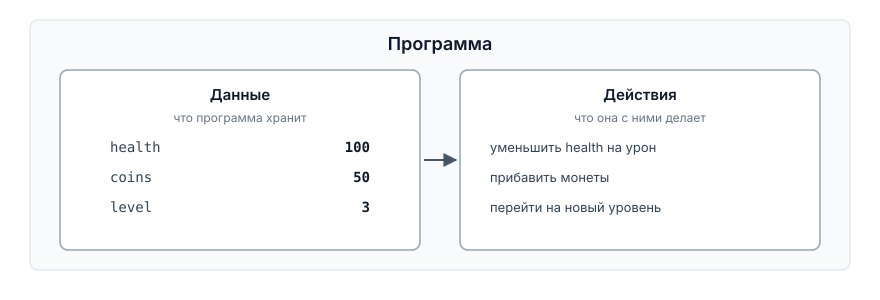
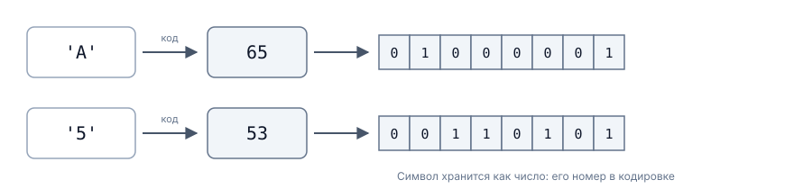

# Данные в программе. Первая программа на C++

## Содержание

- [Данные в программе. Первая программа на C++](#данные-в-программе-первая-программа-на-c)
  - [Содержание](#содержание)
  - [Вопросы для самопроверки](#вопросы-для-самопроверки)
- [О чем мы говорили в прошлой главе?](#о-чем-мы-говорили-в-прошлой-главе)
  - [Что такое программа](#что-такое-программа)
  - [Что такое данные и информация](#что-такое-данные-и-информация)
    - [Откуда в программе появляются данные](#откуда-в-программе-появляются-данные)
    - [Данные существуют только во время работы программы](#данные-существуют-только-во-время-работы-программы)
  - [Как данные представлены в памяти](#как-данные-представлены-в-памяти)
    - [Бит и байт](#бит-и-байт)
    - [Целое число](#целое-число)
    - [Символ](#символ)
    - [Дробные числа](#дробные-числа)
    - [Одно содержимое, разные смыслы](#одно-содержимое-разные-смыслы)
  - [Переменная и литерал](#переменная-и-литерал)
    - [Литерал](#литерал)
    - [Переменная](#переменная)
  - [Типы данных](#типы-данных)
  - [Именованная константа](#именованная-константа)
  - [Ввод и вывод значений](#ввод-и-вывод-значений)
  - [Язык C++](#язык-c)
    - [Немного истории про C++](#немного-истории-про-c)
    - [Зачем мы его изучаем](#зачем-мы-его-изучаем)
  - [Где выполняются программы](#где-выполняются-программы)
    - [Исходный код и исполняемый файл](#исходный-код-и-исполняемый-файл)
    - [Среда разработки](#среда-разработки)
  - [Первая программа на C++](#первая-программа-на-c)
    - [Если забыть точку с запятой](#если-забыть-точку-с-запятой)
  - [Переменные и литералы в C++](#переменные-и-литералы-в-c)
    - [Зачем они нужны](#зачем-они-нужны)
    - [Объявление переменной](#объявление-переменной)
    - [Запись литералов](#запись-литералов)
    - [Имена переменных](#имена-переменных)
    - [Переменная без начального значения](#переменная-без-начального-значения)
    - [Константы в C++](#константы-в-c)
  - [Типы данных в C++](#типы-данных-в-c)
    - [Основные типы данных в C++](#основные-типы-данных-в-c)
    - [Тип решает, как читать биты](#тип-решает-как-читать-биты)
    - [Где типы подводят](#где-типы-подводят)
  - [Ввод и вывод в C++](#ввод-и-вывод-в-c)
    - [Вывод на экран](#вывод-на-экран)
    - [Ввод с клавиатуры](#ввод-с-клавиатуры)
  - [Пример простой программы](#пример-простой-программы)
    - [Программа](#программа)
    - [Проверка программы](#проверка-программы)
  - [Резюме](#резюме)
  - [Библиография](#библиография)

## Вопросы для самопроверки

1. Какое целое число записано битами `00001010`?
2. Чем литерал отличается от именованной константы, а именованная константа от переменной?
3. Один байт содержит `01000001`. Что в нём находится: число 65 или символ `A`? Как программа это определяет?
4. Что выведет программа и почему?

```cpp
int a = 9;
int b = 4;

std::cout << a / b << '\n';
```

5. Какие типы вы выберете для следующих величин и почему: количество патронов, координата персонажа по горизонтали, признак того, что игрок прошёл уровень, символ клавиши движения?
6. Найдите все ошибки:

```cpp
int 2player = 5;
double price = 3,50;
char symbol = "A";
const int MAX = 100;
MAX = 200;
```

7. Чем отличаются значения `7`, `7.0`, `'7'` и `"7"`? Какое из них занимает меньше всего места?
8. Что произойдёт, если объявить `int lives;` и сразу вывести значение переменной? Почему такую ошибку тяжело обнаружить?
9. Заполните таблицу трассировки для `health = 50`, `damage = 15`:

```cpp
int health = 0;
int damage = 0;

std::cin >> health;
std::cin >> damage;

health = health - damage;
health = health + 10;

std::cout << health << '\n';
```

10. Автор вычисляет средний урон за три удара и пишет `int average = (40 + 41 + 42) / 3;`. Для этих значений ответ верный. Что выведет та же программа для ударов `40`, `41` и `43`, и чем результат будет отличаться от настоящего среднего?

# О чем мы говорили в прошлой главе?

Первые две главы были посвящены тому, как программа рассуждает: в каком порядке выполняются шаги, где принимается решение, как меняется состояние. Сегодня мы разберём, с чем программа работает.

Любая игра хранит и изменяет значения. Здоровье, счёт, монеты, координаты персонажа, признак "дверь открыта", нажатая клавиша. Пока не определено, какие значения программа хранит и какого они вида, писать её невозможно.

Лекция состоит из двух частей. В первой мы разбираем понятия: что такое программа, как данные выглядят в памяти, что такое переменная, литерал, тип и константа. Всё это работает одинаково в любом языке программирования, поэтому примеры в первой части записаны псевдокодом. Во второй части те же понятия переводятся на C++, и там мы пишем первую работающую программу.

## Что такое программа

Вспомним, что **программа** это алгоритм, записанный на языке, понятном исполнителю. Простыми словами, это набор инструкций, которые компьютер выполняет шаг за шагом.

Любая программа хранит набор значений и выполняет над ними действия. Иначе говоря, программа это:

$$Программа = Данные + Действия$$

Это деление работает в любом языке программирования.



_Рисунок 3.1. Программа: данные и действия над ними_

## Что такое данные и информация

**Данные (data)** это значения, которые программа получает, хранит, обрабатывает и выдаёт. Одно такое значение называют **значением (value)**.

_Пример_. Число 100, символ `A` и ответ "да" это три разных значения.

Рассмотрим игру: в каждый момент она помнит целый набор значений:

- сколько у персонажа здоровья,
- где он находится,
- что лежит в инвентаре,
- сколько набрано очков,
- какой идёт уровень.

Всё вместе называют **состоянием игры (программы)**. Играть означает менять это состояние: игрок нажал кнопку, персонаж сдвинулся, враг нанёс удар, здоровье уменьшилось.

Правила изменений придумывает дизайнер. Программист превращает их в две вещи:

- описание данных;
- описание действий над ними.

Первая часть важнее, чем кажется, поскольку до того, как определено, какие значения хранятся, описывать действия не над чем.

Вы часто можете встретить определение **информации**, в отличии от данных **информация** - это осмысленные, полезные для человека сведения, которые можно извлечь из данных.

Представим, что у нас есть набор данных о здоровье, местоположении и инвентаре персонажа. Эти данные сами по себе не несут особого смысла для игрока. Но если мы скажем: "_Персонаж ранен и у него мало здоровья_", мы превращаем сырые данные в информацию, полезную для принятия решений.

### Откуда в программе появляются данные

Данными является всё, что можно назвать числом, символом или ответом "да или нет", то есть всё, что можно измерить, посчитать или зафиксировать в памяти компьютера: здоровье, мана, монеты, патроны, номер уровня, очки, координаты, множитель урона, признак открытой двери, нажатая клавиша.

Появиться в программе значение может тремя путями:

1. _Значение записано прямо в тексте программы_. Максимум здоровья равен 100, потому что так решил дизайнер.
2. _Значение приходит извне_. Пользователь ввёл его с клавиатуры, программа прочитала его из файла сохранения, получила от мыши или по сети.
3. _Значение вычислено из других данных_. Остаток монет получается из количества монет и цены предмета. В играх это основной путь, поскольку почти всё, что игрок видит на экране, вычислено из чего-то другого.

### Данные существуют только во время работы программы

Значения хранятся в памяти, а память выделяется программе на время её работы. _После завершения программы значений больше нет_.

Именно поэтому в играх данные сохраняются на носителях, в файлах, базах данных и других постоянных хранилищах, чтобы их можно было восстановить при следующем запуске программы.

## Как данные представлены в памяти

### Бит и байт

Любые данные, с которыми работает компьютер, должны быть представлены в форме, понятной электронным схемам. В цифровых компьютерах для этого используются два логических значения - `0` и `1`.

Наименьшей единицей информации является **бит (bit)**. Один бит может принимать только одно из двух значений:

- `0`
- `1`

С помощью одного бита можно представить состояние, имеющее два возможных варианта: включено или выключено, истина или ложь, жив игровой персонаж или мёртв.

Для представления более сложных данных требуется несколько битов. Поэтому биты объединяют в группы. Основной такой группой является **байт (byte)**.

**Байт** - это последовательность из восьми битов: `00000000`.

Каждый из восьми битов может принимать значение `0` или `1`. Следовательно, один байт позволяет получить:

- 2^8 = 256 различных значений, от `00000000` до `11111111`.

Важно понимать, что байт хранит не само число или символ, а только последовательность битов. Значение этой последовательности зависит от того, как программа её интерпретирует.

Например, комбинация `01000001` может представлять:

- число `65`;
- латинскую букву `A`;
- часть цвета пикселя;
- фрагмент команды или другого значения.

Таким образом, память компьютера хранит байты, а тип данных и программа определяют, что именно означают записанные в них биты.

> [!TIP]
>
> Для измерения больших объёмов памяти используются более крупные единицы:
>
> _1 байт_ = 8 бит
> _1 килобайт (КБ)_ = 1024 байта
> _1 мегабайт (МБ)_ = 1024 килобайта
> _1 гигабайт (ГБ)_ = 1024 мегабайта
> _1 терабайт (ТБ)_ = 1024 гигабайта

### Целое число

Теперь разберем как последовательность битов превращается в число в программе.

Целые числа записываются в **двоичной системе счисления**. В привычной десятичной системе каждый разряд означает степень десяти: число 13 это один десяток и три единицы. В двоичной системе каждый разряд означает степень двойки.

Чтобы прочитать двоичную запись, нужно сложить веса тех разрядов, где стоит единица.

| Вес разряда | 128 |  64 |  32 |  16 |   8 |   4 |   2 |   1 |
| ----------: | --: | --: | --: | --: | --: | --: | --: | --: |
|         Бит |   0 |   0 |   0 |   0 |   1 |   1 |   0 |   1 |

Складываем веса, отмеченные единицами: 8 + 4 + 1 = 13.

Чем больше битов отведено под число, тем больше значений в него помещается:

- 1 байт, то есть 8 битов, даёт 256 значений;
- 2 байта, то есть 16 битов, дают 65 536 значений;
- 4 байта, то есть 32 бита, дают более 4 миллиардов значений.

В общем виде количество значений, которые помещаются в `n` битов, равно:

$$2^n$$

Если часть значений требуется для отрицательных чисел, диапазон делится примерно пополам между отрицательными и положительными.

### Символ

Буквы, цифры и знаки препинания хранить в памяти напрямую невозможно, поскольку в ней находятся только числа. Поэтому каждому символу заранее присвоен номер.

**Кодировка (encoding)** - это соответствие между символами и их номерами.

Наиболее известной кодировкой является **ASCII**, принятая в 1963 году. В ней:

- заглавной латинской букве `A` соответствует число 65;
- букве `B` соответствует число 66;
- цифре `5` соответствует число 53;
- пробелу соответствует число 32.



_Рисунок 3.3. Как символ оказывается в памяти_


_Рисунок 3.4. Таблица кодов ASCII_

Современный стандарт **Unicode** охватывает символы практически всех письменностей мира, включая кириллицу и иероглифы[^6]. Принцип остаётся тем же: символу соответствует номер, а в памяти хранится этот номер.

> [!IMPORTANT]
>
> Обратите особое внимание на цифры. Символ `5` хранится в памяти числом 53, а не пятёркой. _Символ `5` и число 5 это разные значения_, и на этом различии студенты ошибаются чаще всего.

### Дробные числа

Дробные числа устроены намного сложнее, чем целые числа. Под число отводится фиксированное количество битов: часть из них хранит значащие цифры, часть указывает, где находится запятая. Подробное устройство описано в отдельном стандарте[^5] и в этом курсе не рассматривается.

Существенно одно следствие, и о нём нужно помнить с самого начала.

> [!WARNING]
>
> _Дробные числа хранятся приближённо._ Бесконечную дробь невозможно уложить в конечное число битов, так же как `1/3` невозможно точно записать конечной десятичной дробью.

### Одно содержимое, разные смыслы

Вернёмся к наблюдению из подраздела "Бит и байт", поскольку из него следует вся дальнейшая глава. Рассмотрим байт со значением `01000001` и определим, что именно в нём находится.

- Если интерпретировать этот байт как целое число, получаем: 65.
- Если интерпретировать этот байт как символ по кодировке ASCII, получаем: `A`.
- Если интерпретировать этот байт как признак "да или нет", получаем: не ноль, то есть "да".

Биты не сообщают, что они означают, и по содержимому памяти определить это невозможно. Следовательно, _программа обязана заранее знать, как читать каждое значение_. Как именно она это знает, разберём в разделе "Типы данных".

## Переменная и литерал

### Литерал

Начнём с самого простого случая: значение известно заранее и никогда не меняется. Тогда его записывают непосредственно в текст программы.

**Литерал (literal)** - это значение, записанное непосредственно в тексте программы[^4].

_Пример_. В строке псевдокода

```text
SET health = health - 25
```

число 25 является литералом. Оно ниоткуда не читается и не вычисляется, а записано прямо в тексте.

Во время работы программы литерал измениться не может: для этого потребовалось бы изменить саму программу.

### Переменная

Литерала достаточно, пока значение постоянно. Здоровье персонажа так записать нельзя: оно изменяется при каждом ударе, и заранее его не знает никто, включая автора игры.

Для таких данных требуется место, куда значение можно положить, затем прочитать, а затем заменить другим.

**Переменная (variable)** - это именованное место в памяти, где программа хранит значение и может его изменять.

Название отражает суть: _значение в переменной переменчиво_. В прошлой главе мы представляли переменную как ячейку с именем, и эта картина точна.

Имя необходимо, чтобы к ячейке можно было обратиться. Указание "положить 70 в `health`" человек в состоянии дать, а "положить 70 в четвёртую ячейку от начала памяти" уже нет.

С переменной можно выполнять следующие действия:

1. _Создают её и дают имя._
2. _Читают значение_, не изменяя его.
3. _Записывают новое значение_ вместо старого.

Третье действие называется **присваиванием (assignment)**. Главное правило звучит так: _сначала полностью вычисляется значение, которое требуется записать, и лишь затем результат попадает в переменную_. Прежнее значение при этом исчезает.

В псевдокоде присваивание записывается командой `SET`:

```text
SET health = 100

SET health = health - 25
```

Вторая строка выполняется по шагам:

1. Читается текущее значение `health`, то есть 100.
2. Вычисляется `100 - 25`, получается 75.
3. Значение 75 записывается в `health`.
4. Прежнее значение 100 исчезает.

В этой строке `health` является переменной, а 25 литералом.

> [!IMPORTANT]
>
> _Присваивание это не равенство._ Запись `health = health - 25` в математике была бы ложным утверждением. В программе это команда: прочитать значение, вычислить, записать результат обратно.

## Типы данных

Как было сказано заранее, по содержимому памяти невозможно определить, что в ней находится, поэтому необходима договорённость о том, как читать каждое значение. Такая договорённость называется _типом данных_.

**Тип данных (data type)** - это описание того, какие значения можно хранить, как они представлены в памяти и какие действия с ними осмысленны.

Тип отвечает на три вопроса:

1. _Как понимать биты_: как целое число, как дробное, как символ.
2. _Сколько места занимает значение_, а следовательно, какие значения в него поместятся.
3. _Какие действия разрешены_. Два числа можно разделить, деление двух символов лишено смысла.

_Пример_. Если для переменной выбран тип "целое число", то содержимое `01000001` читается как 65, и это значение можно складывать и вычитать. Если выбран тип "символ", то то же содержимое читается как `A`, и вычитать его бессмысленно.

Тип не является свойством самих битов. _Это решение того, кто пишет программу._ Одно и то же содержимое памяти можно прочитать и как число, и как символ; верным будет то прочтение, которое соответствует замыслу.

Поэтому выбор типа относится к проектированию механики, а не к оформлению кода. Выбрав для здоровья целое число, вы тем самым решили, что урона в половину единицы в игре не существует.

## Именованная константа

Кроме переменных в программе могут использоваться значения, которые не изменяются во время работы программы. Такие значения называют _именованными константами_.

**Именованная константа (named constant)** - это имя, связанное со значением, которое не изменяется за время работы программы[^4].

Литерал тоже не изменяется, но у него нет имени. Разница видна на примере. Можно записать "если здоровье больше 100, оставить 100", и оба числа будут литералами. Можно вместо этого один раз объявить константу и далее использовать её имя:

```text
CONST MAX_HEALTH = 100

IF health > MAX_HEALTH
    SET health = MAX_HEALTH
END IF
```

## Ввод и вывод значений

Осталось понять, как значения попадают в программу извне и как программа сообщает результат.

**Ввод (input)** - это получение значения извне: с клавиатуры, из файла, от другого устройства.

**Вывод (output)** - это передача значения наружу: на экран, в файл, на другое устройство.

В псевдокоде эти действия записываются двумя командами, которые мы уже применяли:

```text
INPUT health

OUTPUT health
```

В данном примере:

- `INPUT health` - программа получает значение здоровья от пользователя.
- `OUTPUT health` - программа выводит текущее значение здоровья на экран.

Обратите внимание, что _переменная должна существовать заранее_, иначе полученное значение некуда записывать.

Собрав всё вместе, получаем полный алгоритм из трёх частей: ввод, обработка, вывод.

```text
INPUT health
INPUT damage

SET health = health - damage

OUTPUT health
```

Этот алгоритм мы реализуем на C++ во второй части главы.

## Язык C++

### Немного истории про C++

C++ появился не на пустом месте. Бьёрн Страуструп разрабатывал его на основе языка C, созданного Деннисом Ритчи в 1972 году. Первый коммерческий выпуск состоялся в 1985 году, и с тех пор язык пережил несколько крупных обновлений[^3].

Обновления обозначают по годам: C++11, C++14, C++17, C++20, C++23. Каждая версия описана в **стандарте**, документе, который фиксирует, как язык должен работать[^1].

### Зачем мы его изучаем

Для нашей темы существенны три свойства языка:

1. _Он компилируемый._ Исходный код целиком переводится в исполняемый файл до запуска, поэтому ошибку в записи вы увидите от компилятора, а не от игрока.
2. _Типы указываются явно._ Создавая переменную, вы обязаны написать, что в ней будет храниться. В некоторых языках тип определяется автоматически, и начинающий может долго не задумываться о том, что происходит с битами. C++ такой возможности не даёт, и для обучения это преимущество.
3. _Он близок к машине._ Программист сам решает, сколько места занимают данные. Отсюда и разговор про байты, который в других языках вести не приходится. Это же свойство делает C++ основным языком игровой индустрии: на нём написан Unreal Engine и значительная часть движков.

Следует сказать прямо: _цель курса не язык, а умение программировать_, то есть решать задачи и обрабатывать данные. Язык для нас инструмент. Отдельный курс по C++ будет позже, и там язык изучается как предмет.

> [!NOTE]
>
> Логичный вопрос: если C++ вырос из C, не начать ли с самого C? Язык меньше и до сих пор широко применяется там, где работают близко к железу. Однако его простота оборачивается лишней работой для начинающего: уже в первой программе с вводом и выводом приходится разбираться с темами сложнее всех тем первого семестра. C++ позволяет отложить их на потом.

## Где выполняются программы

### Исходный код и исполняемый файл

Текст программы на C++ хранится в обычном текстовом файле с расширением `.cpp`, например `main.cpp`. Из него компилятор создаёт **исполняемый файл**: `main.exe` под Windows или файл без расширения под Linux и macOS. Исходный код при этом остаётся на месте.

> [!IMPORTANT]
>
> Не путайте два файла:
>
> - `main.cpp` можно открыть и прочитать, но нельзя запустить;
> - `main.exe` можно запустить, но читать в нём нечего, там машинный код.

### Среда разработки

Чтобы программа заработала, необходимо набрать текст, скомпилировать его и запустить результат. **IDE (Integrated Development Environment)**, или интегрированная среда разработки, объединяет инструменты для этого в одном окне:

- редактор, который раскрашивает разные части программы и подсказывает имена;
- компиляция и запуск по кнопке или горячей клавише;
- окно вывода, где видны сообщения компилятора;
- _отладчик_, который останавливает программу и показывает значения переменных.

Для C++ чаще всего применяют:

- Visual Studio;
- CLion;
- Code::Blocks.

> [!NOTE]
>
> Отладчик выполняет то же, что мы делали вручную в таблице трассировки в прошлой главе, только заполняет её сам. Поэтому ручная трассировка не теряет смысла: она объясняет, на что вы смотрите в отладчике.

## Первая программа на C++

Ниже приведена минимальная программа на C++. Она выводит на экран слово `Hello!` и завершается.

```cpp
#include <iostream>

int main() {
    std::cout << "Hello!\n";

    return 0;
}
```

Разберём программу, начиная с середины: первую строку оставим на конец, поскольку она наименее понятна:

- `int main()` обозначает **главную часть программы**. _Выполнение всегда начинается отсюда_, независимо от того, что ещё написано в файле и в каком порядке.
- Фигурные скобки `{` и `}` показывают, где эта часть начинается и заканчивается. Всё, что записано между ними, является инструкциями, которые будут выполнены, причём сверху вниз, по одной, как мы разбирали в прошлой главе.
- `std::cout << "Hello!\n";` выводит текст на экран. Эту запись разберём в разделе "Ввод и вывод в C++".
- `return 0;` сообщает операционной системе, что программа завершилась нормально.
- `#include <iostream>` подключает к программе готовые средства ввода и вывода, а `std::` это обязательная пометка перед именами `cout` и `cin`.

Каждая инструкция заканчивается **точкой с запятой**. Это не украшение: именно по ней компилятор определяет, где закончилась одна инструкция и началась следующая.

> [!NOTE]
>
> В чужом коде часто встречается строка `using namespace std;` в начале файла. Она позволяет писать `cout` и `cin` без пометки `std::`. Такой код не является ошибочным, это другой стиль записи. Мы пишем пометку явно, а смешивать два стиля в одном файле не следует.

### Если забыть точку с запятой

Уберём точку с запятой после вывода и попробуем скомпилировать. Компилятор ответит примерно так:

```text
main.cpp:4:28: error: expected ';' before 'return'
    4 |     std::cout << "Hello!\n"
      |                            ^
      |                            ;
```

Точный вид сообщения зависит от компилятора и его версии, но части всегда одни и те же:

- `main.cpp` - имя файла, в котором обнаружена проблема;
- `4:28` - номер строки и позиция в ней;
- `error` - программа не будет собрана;
- далее идёт суть претензии и сама строка со стрелкой на проблемное место.

Обратите внимание на особенность. Точка с запятой пропущена в четвёртой строке, а обнаружил это компилятор, дойдя до `return`. Поэтому _номер строки в сообщении иногда указывает на строку после настоящей ошибки_, и проверять стоит обе.

> [!TIP]
>
> Сообщений об ошибках может появиться сразу десяток, поскольку одна ошибка нарушает разбор всего дальнейшего текста. Читайте первое сообщение, исправляйте, компилируйте снова. Остальные часто исчезают сами.

## Переменные и литералы в C++

### Зачем они нужны

Повторим главную мысль первой части: _все данные нужно где-то хранить_. Значение, вычисленное программой или полученное от пользователя, само по себе в воздухе не висит. Ему требуется место в памяти, а этому месту требуется имя, чтобы к нему можно было обратиться.

Литерал такой задачи не решает. Он годится только для значений, известных заранее: `100`, `25`, `"Hello!"`. Всё, что меняется по ходу работы, хранится в переменных.

### Объявление переменной

В псевдокоде мы писали `SET health = 100` и не задумывались, откуда взялась ячейка. В C++ переменную необходимо сначала **объявить**.

**Объявление переменной (variable declaration)** - это инструкция, которая сообщает компилятору имя переменной и её тип.

```cpp
int health = 100;
```

Читается это так: создать переменную с именем `health`, которая хранит целое число, и положить в неё значение 100. Слово `int` является обозначением целого числа; остальные обозначения разберём в разделе "Типы данных в C++".

Задание значения при объявлении называется **инициализацией (initialization)**.

Дальше с переменной работают так же, как в псевдокоде:

```cpp
int health = 100;

health = health - 25;
```

После второй строки в переменной находится _75_. Правая часть вычисляется первой, как разобрано в подразделе "Присваивание".

### Запись литералов

В C++ у каждого вида литералов своя запись, и путать их нельзя.

| Вид литерала | Как записывается                 | Примеры               |
| ------------ | -------------------------------- | --------------------- |
| Целый        | Цифры без кавычек                | `0`, `42`, `-7`       |
| Вещественный | С точкой, не с запятой           | `3.14`, `0.5`, `-2.0` |
| Символьный   | Один символ в одинарных кавычках | `'A'`, `'#'`, `'5'`   |
| Строковый    | Текст в двойных кавычках         | `"Game Over"`, `"5"`  |
| Логический   | Два слова языка                  | `true`, `false`       |

_Способ записи определяет смысл значения._ Рассмотрим четыре способа записать пятёрку:

```cpp
5      // целое число
5.0    // дробное число
'5'    // символ
"5"    // текст
```

На экране все четыре дадут одинаковый знак, а внутри программы это четыре разных значения:

- `5` - число пять, с ним можно выполнять вычисления: `5 + 1` даст `6`;
- `5.0` - тоже пять, но с дробной частью, и в памяти оно устроено иначе;
- `'5'` - символ, в памяти находится его код, число 53;
- `"5"` - текст, складывать его нельзя.

### Имена переменных

Имя переменной в C++ называется **идентификатором**. Правила языка следующие:

- имя состоит из латинских букв, цифр и знака подчёркивания;
- начинаться с цифры оно не может;
- регистр важен: `health`, `Health` и `HEALTH` это три разных имени;
- **ключевые слова** использовать нельзя, это слова, за которыми в языке закреплён свой смысл: `int`, `return`, `if` и другие уже заняты.

_Пример_.

```cpp
int health = 100;
int Health = 50; // разные переменные из-за регистра
int _health = 25; // допустимо использовать знак подчёркивания

// так нельзя
int 1health = 100; // имя не может начинаться с цифры
int return = 50; // ключевое слово использовать нельзя
```

### Переменная без начального значения

Инициализировать переменную следует всегда, и вот почему:

```cpp
int health;              // значения нет

std::cout << health;     // значение непредсказуемо
```

Здесь компилятор создал переменную, но ничего в неё не положил. В отведённом ей месте остались биты от предыдущего значения, и что там находится, заранее неизвестно. Программа при этом скомпилируется и запустится, выведет какое-то число, а при следующем запуске выведет другое.

> [!WARNING]
>
> Чтение переменной, которой не присвоили значение, является ошибкой, и стандарт языка не определяет, что произойдёт дальше. Такие ошибки наиболее неприятны, поскольку _проявляются не каждый раз_. Инициализируйте переменные при объявлении.

### Константы в C++

Именованную константу записывают так же, как переменную, но со словом `const`. Любая попытка записать в неё новое значение станет ошибкой компиляции, то есть обнаружится до запуска программы:

```cpp
const int MAX_HEALTH = 100;

MAX_HEALTH = 120;    // ошибка компиляции
```

Значение константе задают сразу, при объявлении: позже присвоить его невозможно, поскольку присваивание запрещено. Имена констант по традиции записывают заглавными буквами с подчёркиваниями, чтобы они отличались от имён переменных.

## Типы данных в C++

**Тип данных** в C++ определяет, какие значения может хранить переменная, сколько места они занимают в памяти и какие операции с ними допустимы.

Тип указывается явно, в объявлении переменной, и компилятор его запоминает. Далее он проверяет каждое действие с этой переменной и сообщает об ошибке до запуска программы, если действие лишено смысла.

_Пример_. Если объявлено `int health = 100;`, то запись `health = health - 25;` компилятор примет, а попытку разделить `health` на символ отвергнет.

### Основные типы данных в C++

В C++ есть несколько основных типов данных, которые используются наиболее часто. Рассмотрим 4 основных типа:

| Вид данных             | Тип в C++ | Примеры значений      | Игровые величины                     | Обычный диапазон значений                        |
| ---------------------- | --------- | --------------------- | ------------------------------------ | ------------------------------------------------ |
| Целые числа            | `int`     | `0`, `100`, `-7`      | Здоровье, монеты, очки, номер уровня | -2 147 483 648 ... 2 147 483 647                 |
| Числа с дробной частью | `double`  | `1.5`, `0.75`, `-2.0` | Координаты, множитель урона, время   | от -1.8e+308 до 1.8e+308, около 15 значащих цифр |
| Один символ            | `char`    | `'A'`, `'#'`, `'5'`   | Нажатая клавиша, знак на карте       | один байт, 256 разных значений                   |
| Признак "да или нет"   | `bool`    | `true`, `false`       | Жив ли персонаж, есть ли ключ, пауза | `false` = 0, `true` = 1                          |

Типов в языке значительно больше, и часть из них мы встретим позже. Этих четырёх достаточно для всего, что будет написано до конца темы.

**`int`** хранит целые числа: положительные, отрицательные и ноль. Дробной части нет вообще, и это не округление, а отсутствие такой возможности. На настольных платформах `int` обычно занимает 4 байта, что и даёт диапазон из таблицы[^2].

**`double`** хранит числа с дробной частью, занимает обычно 8 байт и обеспечивает порядка пятнадцати значащих десятичных цифр[^5]. Существует и менее точный тип `float`, занимающий вдвое меньше места; в игровых движках его применяют постоянно ради экономии памяти, но в учебных программах разумнее использовать `double`.

**`char`** хранит один символ и занимает ровно один байт. В памяти находится код символа, о котором шла речь в подразделе "Символ". Текст из нескольких символов в `char` не поместится; как хранить слова и фразы, разберём позже.

**`bool`** принимает ровно два значения, `true` и `false`, и применяется для признаков состояния. Это литералы, а не текст, кавычки им не нужны. Полностью `bool` раскроется в следующей главе: условие в `if` даёт значение именно этого типа.

> [!NOTE]
>
> Размеры типов стандартом языка жёстко не заданы, кроме `char`, который всегда занимает ровно один байт[^1]. Для остальных типов стандарт указывает лишь минимальные требования, поэтому на другой платформе, например на микроконтроллере, `int` может оказаться меньше четырёх байт.

### Тип решает, как читать биты

Проверим на практике утверждение из подраздела "Одно содержимое, разные смыслы":

```cpp
char symbol = 'A';
int code = 'A';

std::cout << symbol << '\n';   // A
std::cout << code << '\n';     // 65
```

Справа от знака присваивания в обоих случаях находится одно и то же, и в памяти обе переменные хранят одинаковое значение, число 65. На экране появляются разные результаты, поскольку типы разные: `char` выводится как символ, `int` как число.

_Договорённость о том, как читать биты, задаётся типом в объявлении переменной._ Другого места для неё нет.

### Где типы подводят

Рассмотрим три ситуации, в которых программа вычисляет не то, что ожидалось. Все три следуют из того, что тип определяет и способ хранения, и набор разрешённых действий.

_Первая ситуация: деление двух целых чисел даёт целое._

```cpp
int a = 7;
int b = 2;

std::cout << a / b << '\n';    // 3
```

Программа выведет `3`, а не `3.5`. Оба значения целые, следовательно, и результат обязан быть целым, а дробная часть отбрасывается. _Не округляется до `4`, а именно отбрасывается._

Чтобы получить `3.5`, хотя бы одно значение должно быть дробным:

```cpp
double a = 7.0;
int b = 2;

std::cout << a / b << '\n';    // 3.5
```

> [!WARNING]
>
> Это наиболее частая ошибка начинающих при расчёте средних значений и процентов. Средний урон по трём ударам, вычисленный как `(d1 + d2 + d3) / 3` в целых числах, окажется меньше настоящего.

_Вторая ситуация: при записи дробного значения в `int` дробная часть теряется._

```cpp
int damage = 7.9;

std::cout << damage << '\n';    // 7
```

Положить дробное значение в `int` невозможно, поэтому `7.9` превращается в `7`, а не в `8`. Компилятор обычно предупреждает о таком преобразовании, но программу собирает. _Предупреждения следует читать_: они появляются как раз там, где программа делает не то, что задумано.

_Третья ситуация: дробные числа хранятся приближённо._

```cpp
double x = 0.1 + 0.2;

std::cout << x == 0.3 << '\n'; // false
```

Выведите `x`, и увидите `0.3`. При этом сравнение `x == 0.3` окажется ложным, поскольку накопившаяся погрешность не даёт точного равенства.

Вывод: _дробные числа не сравнивают на точное равенство_. Как сравнивать правильно, разберём при изучении условий.

## Ввод и вывод в C++

Для ввода и вывода (по умолчанию - в консоль) в C++ используются объекты `std::cin` и `std::cout`. Они становятся доступны после строки `#include <iostream>`.

### Вывод на экран

Разберём запись вывода по частям:

- `std::cout` - это экран, всё, что вы туда отправите, там и появится;
- `<<` - показывает направление: значение уходит от вас к экрану;
- `"Hello!"` - текст, выводится как есть;
- `\n` - перевод строки, это один символ, хотя записывается двумя знаками.
- Без `\n` следующий вывод продолжится на той же строке.

Несколько значений отправляют подряд, повторяя `<<`:

```cpp
int health = 75;

std::cout << "Health: " << health << '\n';
```

Вывод будет следующим:

```text
Health: 75
```

Текст в кавычках выводится буквально, а `health` без кавычек является именем переменной, поэтому выводится её значение.

> [!WARNING]
>
> Запись `std::cout << "health"` выведет слово health, а запись `std::cout << health` выведет число 75. _Кавычки полностью меняют смысл._

### Ввод с клавиатуры

Для ввода с клавиатуры используется объект `std::cin`. Он работает аналогично `std::cout`, но данные идут от пользователя к программе.

Простейший пример:

```cpp
int health = 0;

std::cout << "Health: ";
std::cin >> health;
```

Программа останавливается и ждёт, пока пользователь введёт значение и нажмёт Enter. Переменную необходимо объявить до чтения, иначе значение некуда записывать: это то же требование, что и в псевдокоде.

> [!TIP]
>
> Перед вводом всегда выводите подсказку. Без неё пользователь увидит пустой экран и не поймёт, чего от него ожидают.

## Пример простой программы

Рассмотрим задачу:

> Персонаж получает удар. Известно текущее здоровье персонажа и сила удара. Требуется уменьшить здоровье на силу удара и вывести результат.

Разберём задачу по четырём вопросам, как учились в прошлой главе:

1. _Что дано?_ Здоровье персонажа и сила удара.
2. _Что требуется получить?_ Оставшееся здоровье.
3. _Какие данные хранить?_ Два целых числа. Половин единицы здоровья в игре нет, значит целые.
4. _Есть ли выбор?_ По условию нет, мы просто вычитаем.

Алгоритм уже записан в разделе "Ввод и вывод значений":

```text
INPUT health
INPUT damage

SET health = health - damage

OUTPUT health
```

### Программа

```cpp
#include <iostream>

int main() {
    int health = 0;
    int damage = 0;

    std::cout << "Health: ";
    std::cin >> health;

    std::cout << "Damage: ";
    std::cin >> damage;

    health = health - damage;

    std::cout << "Health left: " << health << '\n';

    return 0;
}
```

Структура совпадает с псевдокодом строка в строку. Изменилась только запись: вместо `INPUT` появился `std::cin`, вместо `OUTPUT` появился `std::cout`, добавились точки с запятой, а переменные потребовалось объявить заранее и указать их тип.

Разберём программу по шагам:

1. Объявляются две переменные типа `int`, обе инициализированы нулём.
2. Выводится подсказка, затем в `health` читается введённое значение.
3. То же выполняется для `damage`.
4. Выполняется присваивание: вычисляется правая часть, результат записывается в `health`, прежнее значение исчезает.
5. Выводится текст и текущее значение `health`.

### Проверка программы

Одного удачного запуска недостаточно. Проверим программу на трёх наборах данных, как учились в прошлой главе.

| Случай    | `health` | `damage` | Ожидаемый результат |
| --------- | -------: | -------: | ------------------- |
| Обычный   |      100 |       30 | 70                  |
| Граничный |      100 |      100 | 0                   |
| Особый    |      100 |      120 | 100 - 120 = ?       |

Трассировка для обычного случая:

| Шаг | Инструкция                  | `health` | `damage` | Вывод |
| --: | --------------------------- | -------: | -------: | ----- |
|   1 | `int health = 0;`           |        0 |          |       |
|   2 | `int damage = 0;`           |        0 |        0 |       |
|   3 | `std::cin >> health;`       |      100 |        0 |       |
|   4 | `std::cin >> damage;`       |      100 |       30 |       |
|   5 | `health = health - damage;` |       70 |       30 |       |
|   6 | `std::cout << health;`      |       70 |       30 | 70    |

Теперь разберём особый случай. Здоровье равно 100, сила удара 120, и программа выведет `-20`.

С точки зрения языка всё верно: `int` хранит отрицательные числа, вычитание выполнено правильно. С точки зрения игры результат бессмысленный, поскольку отрицательного здоровья не существует. Это **логическая ошибка**, и обнаружила её не программа и не компилятор, а проверка на подходящих данных.

Исправить её одним присваиванием невозможно. Требуется принять решение: если здоровье стало меньше нуля, записать ноль и сообщить, что персонаж погиб. Именно этим мы займёмся в следующей главе: ветвление появится не как очередная конструкция языка, а как ответ на задачу, которую мы уже не смогли решить.

## Резюме

1. Программа состоит из данных, которые она хранит, и действий, которые она с ними выполняет.
2. Значения попадают в программу тремя путями: записаны в тексте программы, получены извне или вычислены из других данных; существуют они только во время работы программы.
3. В памяти любое значение является набором битов, и по самим битам его смысл определить невозможно: одно и то же содержимое читается и как число, и как символ.
4. Литерал это значение, записанное прямо в тексте программы; имени у него нет и изменить его нельзя.
5. Переменная это именованное место в памяти, значение в котором можно читать и изменять.
6. Присваивание сначала вычисляет значение, затем записывает его в переменную, а прежнее значение исчезает.
7. Тип данных задаёт, как читать биты, сколько места занимает значение и какие действия с ним разрешены; выбор типа это решение автора программы.
8. Именованная константа это имя для значения, которое за время работы программы не изменяется.
9. Четырём видам данных курса соответствуют `int`, `double`, `char` и `bool`; переменную требуется объявить и сразу инициализировать.
10. Деление целых даёт целое, дробная часть при записи в `int` теряется, а дробные числа хранятся приближённо и на точное равенство не сравниваются.

## Библиография

[^1]: ISO/IEC 14882:2020. _Programming languages - C++_. International Organization for Standardization, 2020.

[^2]: cppreference. _Fundamental types_. Available at: https://en.cppreference.com/w/cpp/language/types

[^3]: Stroustrup B. _Programming: Principles and Practice Using C++_. 2nd ed. Addison-Wesley, 2014.

[^4]: Gaddis T. _Starting Out with C++: From Control Structures through Objects_. 9th ed. Pearson, 2017.

[^5]: IEEE 754-2019. _IEEE Standard for Floating-Point Arithmetic_. Institute of Electrical and Electronics Engineers, 2019.

[^6]: The Unicode Consortium. _The Unicode Standard_. Available at: https://www.unicode.org/versions/latest/
