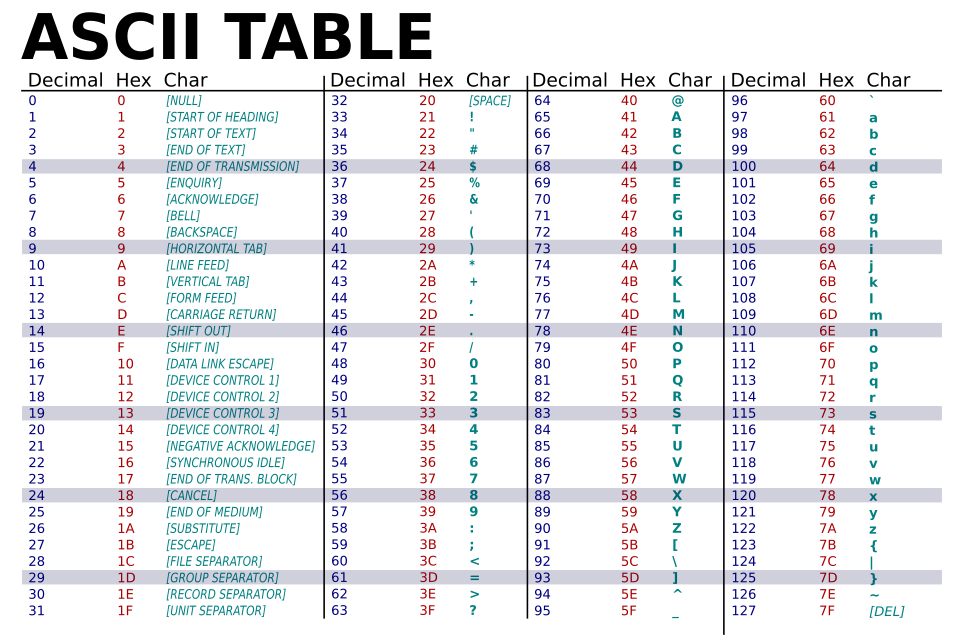
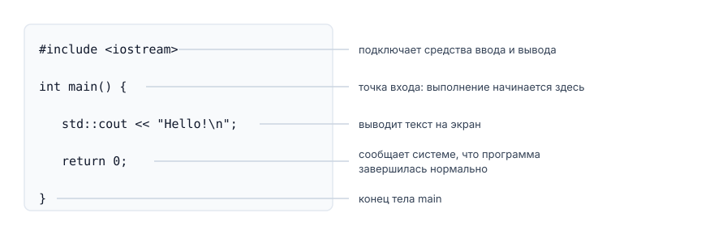

# Данные в программе. Введение в C++

## Содержание

- [Данные в программе. Введение в C++](#данные-в-программе-введение-в-c)
  - [Содержание](#содержание)
  - [Вопросы для самопроверки](#вопросы-для-самопроверки)
  - [О чём мы говорили в прошлой главе?](#о-чём-мы-говорили-в-прошлой-главе)
  - [Что такое данные и информация](#что-такое-данные-и-информация)
  - [Представление информации: бит и байт](#представление-информации-бит-и-байт)
    - [Определение бита и байта](#определение-бита-и-байта)
    - [Несколько байтов](#несколько-байтов)
  - [Что такое программа](#что-такое-программа)
    - [Откуда в программе появляются данные](#откуда-в-программе-появляются-данные)
    - [Ввод и вывод](#ввод-и-вывод)
    - [Данные во время и после работы](#данные-во-время-и-после-работы)
  - [Как данные представлены в памяти](#как-данные-представлены-в-памяти)
    - [Байт](#байт)
    - [Целое число](#целое-число)
    - [Символ](#символ)
    - [Дробное число](#дробное-число)
    - [Логическое значение](#логическое-значение)
  - [Переменная и литерал](#переменная-и-литерал)
    - [Литерал](#литерал)
    - [Переменная](#переменная)
    - [Константы](#константы)
  - [Язык C++](#язык-c)
    - [Немного истории про C++](#немного-истории-про-c)
    - [Зачем мы его изучаем?](#зачем-мы-его-изучаем)
  - [Где писать код на C++](#где-писать-код-на-c)
  - [Пример 1. Первая программа на C++](#пример-1-первая-программа-на-c)
  - [Переменные в C++](#переменные-в-c)
    - [Объявление переменной](#объявление-переменной)
    - [Имена переменных](#имена-переменных)
    - [Константы в C++](#константы-в-c)
    - [Соглашения по именованию переменных и констант](#соглашения-по-именованию-переменных-и-констант)
  - [Типы данных в C++](#типы-данных-в-c)
    - [Определение типа данных](#определение-типа-данных)
    - [Базовые типы данных](#базовые-типы-данных)
    - [Тип int](#тип-int)
    - [Тип char](#тип-char)
    - [Типы float и double](#типы-float-и-double)
    - [Тип bool](#тип-bool)
  - [Ввод и вывод в C++](#ввод-и-вывод-в-c)
  - [Пример 2. Программа с вводом данных](#пример-2-программа-с-вводом-данных)
  - [Резюме](#резюме)
  - [Библиография](#библиография)

## Вопросы для самопроверки

1. Чем данные отличаются от информации? Приведите свой пример.
2. Сколько разных значений помещается в один байт и почему именно столько?
3. Какое целое число записано битами `00001010`?
4. Байт содержит `01000001`. Что в нём лежит: число 65 или символ `A`?
5. Чем литерал отличается от константы, а константа от переменной?
6. Что выведет программа и почему?

```cpp
int a = 9;
int b = 4;

std::cout << a / b << '\n';
```

7. Какие типы вы выберете для этих величин: количество патронов, координата персонажа, признак пройденного уровня, нажатая клавиша?
8. Найдите ошибки:

```cpp
int 2player = 5;
double price = 3,50;
char symbol = "A";
const int MAX = 100;
MAX = 200;
```

9. Чем отличаются `7`, `7.0`, `'7'` и `"7"`?
10. Что произойдёт, если объявить `int lives;` и сразу вывести значение переменной?

## О чём мы говорили в прошлой главе?

Первые две главы были посвящены тому, как программа рассуждает: в каком порядке выполняются шаги, где принимается решение, как меняется состояние. Сегодня мы разберём, с чем программа работает.

Любая игра хранит и изменяет значения. Здоровье, счёт, монеты, координаты персонажа, признак "дверь открыта", нажатая клавиша. Пока не определено, какие значения программа хранит и какого они вида, писать её невозможно.

Лекция состоит из двух частей. В первой мы разбираем понятия: что такое программа, как данные выглядят в памяти, что такое переменная, литерал, тип и константа. Всё это работает одинаково в любом языке программирования, поэтому примеры в первой части записаны псевдокодом. Во второй части те же понятия переводятся на C++, и там мы пишем первую работающую программу.

## Что такое данные и информация

Начнём с простого вопроса: _с чем вообще работает компьютер?_

**Данные (data)** это значения, которые компьютер хранит и обрабатывает. Одно такое значение называют **значением (value)**.

_Пример_. Число 100, символ `A` и ответ "да" это три разных значения.

Данными является всё, что можно посчитать, измерить или записать:

- здоровье, мана, монеты, патроны;
- номер уровня и количество очков;
- координаты персонажа на карте;
- признак "дверь открыта";
- нажатая клавиша.

Рядом с данными часто встречается слово "информация". Разница простая.

**Информация (information)** это осмысленные сведения, которые получаются из данных.

_Пример_. Число 12 само по себе ничего не говорит. Но если сказать "у персонажа осталось 12 единиц здоровья из 100", игрок понимает: дело плохо, пора лечиться. Данные превратились в информацию.

Компьютер работает с данными.

## Представление информации: бит и байт

### Определение бита и байта

Компьютерная память должна различать физические состояния. На базовом уровне их представляют значениями `0` и `1`.

**Бит (bit, binary digit)** - минимальная единица цифрового представления, принимающая одно из двух значений: `0` или `1`.

Одним битом можно записать немного: включено или выключено, жив персонаж или мёртв. Для здоровья, координат и текста требуется больше комбинаций, поэтому биты объединяются в группы.

**Байт (byte)** это группа из восьми битов. Однако в истории компьютерной техники существовали решения с иными размерами байта (например, 6, 32 или 36 бит).

Восемь битов дают `2⁸ = 256` комбинаций - от `00000000` до `11111111`. Если трактовать их как неотрицательные целые числа, получится диапазон от `0` до `255`.

Теперь, можно хранить и обрабатывать больше информации, используя комбинации битов в байтах.

> [!IMPORTANT]
> Байт сам по себе не является числом, буквой или цветом. Это группа битов. Смысл появляется, когда программа интерпретирует биты по определенным правилам.

Одну комбинацию можно интерпретировать как число, кодовую единицу текста или часть цвета. Контекст и тип данных указывают программе, как с ней работать.

### Несколько байтов

Одного байта часто недостаточно. Счет может превышать 255, а координата может быть отрицательной. Тогда несколько байтов рассматриваются как одно значение:

```text
00000000 00000000 00000000 01100100
```

Эта последовательность может представлять число `100`. Пробелы добавлены для чтения. Количество байтов определяет количество возможных комбинаций.

## Что такое программа

**Программа** это алгоритм, записанный на языке, понятном исполнителю. Проще говоря, это набор инструкций, которые компьютер выполняет шаг за шагом.

У любой программы есть две части:

- данные, которые она хранит;
- действия, которые она с этими данными выполняет.

$$Программа = Данные + Действия$$

_Пример_. Игра помнит здоровье персонажа, его координаты и количество монет. Это данные. Когда враг наносит удар, игра уменьшает здоровье. Это действие.

Правила изменений придумывает дизайнер. Программист превращает их в две вещи:

- описание данных;
- описание действий.

Начинают всегда с данных, потому что пока не решено, что программа хранит, описывать действия не над чем.

### Откуда в программе появляются данные

Значение может появиться в программе тремя путями:

1. _Оно записано прямо в тексте программы._ Максимум здоровья равен 100, потому что так решил дизайнер.
2. _Оно пришло извне._ Игрок ввёл его с клавиатуры, программа прочитала его из файла сохранения или получила от мыши.
3. _Оно вычислено из других данных._ Оставшееся здоровье получается из текущего здоровья и силы удара.

### Ввод и вывод

Чтобы получить данные снаружи и показать результат, программе нужны две возможности.

**Ввод (input)** это получение значения _извне_: с клавиатуры, из файла, от другого устройства.

**Вывод (output)** это передача значения _наружу_: на экран, в файл, на другое устройство.

### Данные во время и после работы

Данные хранятся в памяти компьютера. Память выдаётся программе только на время работы, а после её завершения освобождается.

_Это значит, что все значения пропадают, как только программа закрылась._

Именно поэтому в играх есть сохранения. Чтобы здоровье и инвентарь дожили до следующего запуска, программа записывает их в файл, а при старте читает обратно. Само по себе ничего не сохраняется.

## Как данные представлены в памяти

### Байт

Память хранит только байты, а байт это восемь битов. Ни чисел, ни букв в памяти нет.

Отсюда следует важная мысль: _байт сам по себе ничего не означает_. Одна и та же комбинация битов читается по-разному.

_Пример_. Возьмём байт `01000001`:

| Как читать       | Что получится         |
| ---------------- | --------------------- |
| Как целое число  | 65                    |
| Как символ       | `A`                   |
| Как "да или нет" | не ноль, то есть "да" |

Все три ответа правильные. Понять по самим битам, какой из них нужен, невозможно. Поэтому программа должна заранее знать, как читать каждое значение. Как она это знает, разберём в разделе "Типы данных в C++".

Дальше разберем, как в байты укладываются привычные нам виды данных.

### Целое число

Целые числа записывают в **двоичной системе счисления**.

В привычной десятичной системе каждый разряд означает степень десяти: 13 это один десяток и три единицы. В двоичной системе каждый разряд означает степень двойки.

Чтобы прочитать двоичную запись, нужно сложить веса тех разрядов, где стоит `1`.

_Пример_. Байт `00001101`:

| Вес разряда | 128 |  64 |  32 |  16 |   8 |   4 |   2 |   1 |
| ----------: | --: | --: | --: | --: | --: | --: | --: | --: |
|         Бит |   0 |   0 |   0 |   0 |   1 |   1 |   0 |   1 |

Складываем отмеченные веса: 8 + 4 + 1 = 13.

Чем больше байтов отведено под число, тем больше значений в него влезает:

- 1 байт даёт 256 значений;
- 2 байта дают 65 536 значений;
- 4 байта дают больше 4 миллиардов значений.

Часть значений обычно оставляют для отрицательных чисел, поэтому диапазон делится примерно пополам.

### Символ

Букву в памяти хранить нельзя, там лежат только числа. Поэтому каждому символу заранее дали номер.

**Кодировка (encoding)** это таблица соответствия между символами и их номерами.

Самая известная кодировка называется **ASCII**. В ней:

- букве `A` соответствует число 65;
- букве `B` соответствует число 66;
- цифре `5` соответствует число 53;
- пробелу соответствует число 32.



_Рисунок 3.1. Таблица кодов ASCII_

Сегодня чаще используют стандарт **Unicode**, в котором есть символы почти всех языков мира, включая кириллицу и иероглифы[^6]. Работает он по тому же принципу: символу соответствует номер, а в памяти лежит этот номер.

> [!IMPORTANT]
>
> Особенно внимательно посмотрите на цифры. Символ `5` хранится числом 53, а не пятёркой. _Символ `5` и число 5 это разные значения._ На этом путаются чаще всего.

### Дробное число

Дробные числа устроены сложнее целых. Под число отводится несколько байтов: часть битов хранит цифры числа, часть показывает, где стоит запятая. Подробное устройство описано в отдельном стандарте[^5], и мы его разбирать не будем.

Запомнить нужно одно следствие.

> [!WARNING]
>
> _Дробные числа хранятся приближённо._ Точно записать бесконечную дробь в несколько байтов невозможно, как невозможно точно записать `1/3` десятичной дробью.

Из-за этого дробные числа не сравнивают на точное равенство. Например, `0.1 + 0.2` в программе не равно `0.3`, хотя разница видна только в далёких знаках после запятой.

### Логическое значение

Иногда нужно хранить всего два варианта: да или нет, истина или ложь.

**Логическое значение** это значение, у которого есть ровно два варианта: истина или ложь.

_Пример_. Жив ли персонаж, есть ли у игрока ключ, стоит ли игра на паузе.

Для такого значения хватило бы одного бита, но на практике под него отводят целый байт, _потому что память выдаётся байтами_.

## Переменная и литерал

### Литерал

Бывает, что значение известно заранее и никогда не меняется. Тогда его пишут прямо в тексте программы.

**Литерал (literal)** - значение, записанное непосредственно в исходном коде программы[^4].

_Пример_. В строке псевдокода

```text
SET health = health - 25
```

Число 25 - это литерал. Оно ниоткуда не берётся и никак не вычисляется, оно просто написано в программе.

Изменить литерал во время работы программы невозможно. Чтобы его изменить, пришлось бы переписать саму программу.

### Переменная

Литерал годится только для постоянных значений. Здоровье персонажа так не запишешь: оно меняется после каждого удара, и заранее его никто не знает.

Для таких данных нужно место, куда значение можно положить, потом прочитать, а потом заменить другим.

**Переменная (variable)** именованный объект программы, хранящий значение определенного типа, которое можно читать и, если разрешено, изменять.

От литерала переменная отличается двумя вещами.

- Во-первых, у неё есть имя, по которому к ней обращаются.
- Во-вторых, её значение меняется во время работы программы, а литерал остаётся таким, каким записан в тексте.

Кроме значения у переменной есть тип. Тип говорит, какие значения в ней помещаются и что с ними разрешено делать.

Имя нужно, чтобы к этому месту можно было обратиться. Сказать "положи 70 в `health`" человек может, а "положи 70 в четвёртую ячейку памяти" уже нет.

С переменной делают три вещи:

1. _Создают её и дают имя._
2. _Читают значение_, не меняя его.
3. _Записывают новое значение_ вместо старого.

Третье действие называется **присваиванием (assignment)**. Работает оно по простому правилу: _сначала полностью вычисляется новое значение, и только потом оно записывается в переменную_. Старое значение при этом пропадает.

Например,

```text
SET health = 100

SET health = health - 25
```

Вторая строка выполняется по шагам:

1. Программа читает текущее значение `health`, то есть 100.
2. Считает `100 - 25`, получается 75.
3. Записывает 75 в `health`.
4. Старое значение 100 пропадает.

В этой строке `health` это переменная, а 25 это литерал.

### Константы

Бывает и обратный случай: значение объявляют один раз, и меняться оно не должно, например,

- максимум здоровья,
- цена входа в подземелье,
- размер игрового поля.

**Именованная константа (named constant)** это имя для значения, которое не меняется за время работы программы[^4].

Литерал тоже не меняется, но у него нет имени. В этом вся разница.

Команда `CONST` создаёт константу и сразу задаёт ей значение. Присвоить ей что-то позже нельзя, поэтому строка `SET MAX_HEALTH = 120` была бы ошибкой.

Зачем это нужно:

- _Число получает смысл._ Имя `MAX_HEALTH` понятнее, чем число 100, разбросанное по десяти местам программы.
- _Менять значение приходится в одном месте._ Если максимум станет 120, вы правите одну строку.

Три похожих понятия удобно сравнить по двум признакам.

## Язык C++

### Немного истории про C++

C++ появился не на пустом месте. Бьёрн Страуструп создавал его на основе языка C, который Деннис Ритчи разработал в 1972 году. Первый коммерческий выпуск C++ состоялся в 1985 году[^3].

С тех пор язык несколько раз обновляли. Версии обозначают по годам: C++11, C++14, C++17, C++20, C++23. Каждая версия описана в **стандарте**, документе, который говорит, как язык должен работать[^1].

### Зачем мы его изучаем?

Для нашей темы у C++ есть три важных свойства.

1. _Он компилируемый._ Весь текст программы переводится в исполняемый файл до запуска. Значит, об ошибке в записи вам сообщит компилятор, а не игрок.
2. _Типы указываются явно._ Создавая переменную, вы обязаны написать, что в ней будет лежать. Есть языки, где это делается автоматически, и там новичок может долго не задумываться о происходящем. C++ так не даёт, и для учёбы это плюс.
3. _Он "близок" к машине._ Программист сам решает, сколько места занимают данные. Поэтому мы и говорим про байты. Из-за этого же C++ остаётся главным языком игровой индустрии: на нём написан Unreal Engine и много других движков.

Скажем прямо: _цель курса не язык, а умение программировать_. Язык для нас инструмент. Отдельный курс по C++ будет позже, там его изучают как предмет.

## Где писать код на C++

Текст программы на C++ хранится в обычном текстовом файле с расширением `.cpp`, например `main.cpp`.

Компилятор делает из него **исполняемый файл**: `main.exe` в Windows или файл без расширения в Linux и macOS.

> [!IMPORTANT]
>
> Не путайте два файла:
>
> - `main.cpp` можно открыть и прочитать, но нельзя запустить;
> - `main.exe` можно запустить, но читать в нём нечего, там машинный код.

Чтобы всё это делать удобно, используют среду разработки.

**IDE (Integrated Development Environment)** это программа, которая собирает всё нужное в одном окне:

- редактор кода с подсветкой;
- кнопку сборки и запуска;
- окно с сообщениями компилятора;
- отладчик, который умеет остановить программу и показать значения переменных.

Для C++ чаще всего берут:

- [Visual Studio](https://visualstudio.microsoft.com/ru/),
- [CLion](https://www.jetbrains.com/clion/),
- [Code::Blocks](https://www.codeblocks.org/).

Какую среду используем мы и как её настроить, разберём на лабораторном занятии.

## Пример 1. Первая программа на C++

Вот самая маленькая программа на C++. Она выводит на экран слово `Hello!` и заканчивается.

```cpp
#include <iostream>

int main() {
    std::cout << "Hello!\n";

    return 0;
}
```



_Рисунок 3.2. Из чего состоит минимальная программа_

Разберём её по строкам:

- `#include <iostream>` подключает к программе готовые средства ввода и вывода. Без этой строки `std::cout` работать не будет.
- `int main()` это главная часть программы. _Выполнение всегда начинается отсюда_.
- Фигурные скобки `{` и `}` показывают, где эта часть начинается и заканчивается. Всё, что между ними, выполняется сверху вниз, по одной строке.
- `std::cout << "Hello!\n";` выводит текст на экран.
- `return 0;` сообщает операционной системе, что программа завершилась нормально.

Каждая инструкция заканчивается **точкой с запятой**. По ней компилятор понимает, где закончилась одна инструкция и началась следующая.

Если вы забыли поставить точку с запятой в конце инструкции, компилятор выдаст ошибку и программа не скомпилируется:

```
main.cpp:4:28: error: expected ';' before 'return'
    4 |     std::cout << "Hello!\n"
      |                            ^
      |                            ;
```

Точный вид сообщения зависит от компилятора и его версии, но части всегда одни и те же:

- `main.cpp` - имя файла, в котором обнаружена проблема;
- `4:28` - номер строки и позиция в ней;
- `error` - программа не будет собрана;
- далее идёт суть претензии и сама строка со стрелкой на проблемное место.

## Переменные в C++

### Объявление переменной

**Объявление переменной (variable declaration)** это инструкция, которая говорит компилятору имя переменной и её тип.

Структура объявления переменной следующая:

```cpp
<тип> <имя_переменной> [= <значение>];
```

Например,

```cpp
int coins;
```

Эта строка означает: создать переменную с именем `coins`, в которой будет лежать целое число. Слово `int` и есть обозначение целого числа, остальные обозначения разберём в следующем разделе.

Пока в переменной ничего нет. Место в памяти ей уже выделено, но что именно там лежит, неизвестно. Поэтому ей можно присвоить значение позже:

```cpp
coins = 100;
```

Переменную можно сразу инициализировать значением:

```cpp
int coins = 100;
```

Эта строка означает: создать переменную с именем `coins`, в которой будет лежать целое число, и сразу присвоить ей значение `100`.

### Имена переменных

Имя переменной называется **идентификатором**. Правила языка такие:

- имя состоит из латинских букв, цифр и знака подчёркивания;
- начинаться с цифры нельзя;
- большие и маленькие буквы различаются: `health`, `Health` и `HEALTH` это три разных имени;
- нельзя брать _ключевые слова_, то есть слова, у которых в языке свой смысл: `int`, `return`, `if` и другие.

_Пример_.

```cpp
int health = 100;    // хорошо
int playerHealth = 100;    // ещё лучше, сразу понятно, чьё здоровье
int h = 100;    // понятно только автору

int 1health = 100;    // ошибка: имя начинается с цифры
int return = 50;      // ошибка: это ключевое слово
```

Имя должно отвечать на вопрос "что здесь лежит".

### Константы в C++

Константу записывают как переменную, но со словом `const`:

```cpp
const int MAX_HEALTH = 100;

MAX_HEALTH = 120;    // ошибка компиляции
```

Значение константе задают сразу, при объявлении. Позже присвоить ей что-то нельзя, и компилятор скажет об этом до запуска программы.

### Соглашения по именованию переменных и констант

Вы могли заметить, что в примерах переменные записаны с маленькой буквы, а константы большими буквами с подчёркиваниями: `MAX_HEALTH`, `DEFAULT_SPEED`.

Компилятору всё равно, как именно вы пишете имена: любой из этих способов он примет. Но читать код будут люди, поэтому в программировании сложилось несколько устоявшихся стилей записи составных имён.

- `camelCase` - слова пишутся слитно, первое с маленькой буквы, каждое следующее с большой: `playerHealth`, `enemyCount`, `isAlive`.
- `PascalCase` - то же самое, но с большой буквы начинается и первое слово: `PlayerHealth`, `EnemyCount`, `IsAlive`.
- `snake_case` - слова разделяются знаком подчёркивания, все буквы маленькие: `player_health`, `enemy_count`, `is_alive`.
- `UPPER_SNAKE_CASE` - слова разделяются подчёркиванием, все буквы большие: `MAX_HEALTH`, `DEFAULT_SPEED`.
- `kebab-case` - слова разделяются дефисом, все буквы маленькие: `player-health`, `enemy-count`, `is-alive`.

Стиль выбирают не по личному вкусу, а по договорённости: у каждого языка и у каждой команды свои правила, и в одном проекте все пишут одинаково. Плохо не то, что вы выбрали `snake_case` вместо `camelCase`, а то, что в одном файле встречается и так, и так.

В нашем курсе переменные будут использоваться в `camelCase`, константы в `UPPER_SNAKE_CASE`. Такая запись сразу показывает, что перед вами: `playerHealth` изменится по ходу игры, а `MAX_HEALTH` останется прежним.

## Типы данных в C++

### Определение типа данных

Вспомним вывод из раздела про байт: по самим битам нельзя понять, что они означают. Поэтому программа должна знать это заранее.

**Тип данных (data type)** - это характеристика, которая определяет, какие значения может хранить переменная, сколько памяти они занимают и какие операции с ними разрешены.

Тип пишут в объявлении переменной, и компилятор его запоминает. Дальше он проверяет каждое действие с этой переменной и сообщает об ошибке ещё до запуска программы.

### Базовые типы данных

Типов в данных в C++ достаточно много, но для начала рассмотрим основные, с которыми вы будете сталкиваться чаще всего.

| Вид данных          | Тип в C++         | Примеры значений      | Игровые величины                     |
| ------------------- | ----------------- | --------------------- | ------------------------------------ |
| Целые числа         | `int`             | `0`, `100`, `-7`      | Здоровье, монеты, очки, номер уровня |
| Дробные числа       | `double`, `float` | `1.5`, `0.75`, `-2.0` | Координаты, множитель урона, время   |
| Один символ         | `char`            | `'A'`, `'#'`, `'5'`   | Нажатая клавиша, знак на карте       |
| Логическое значение | `bool`            | `true`, `false`       | Жив ли персонаж, есть ли ключ        |

### Тип int

`int` хранит целые числа: положительные, отрицательные и ноль.

```cpp
int health = 100;
int coins = 0;
int score = -50;
```

Дробной части у него нет вообще. Это не округление, а отсутствие такой возможности.

Обычно `int` занимает 4 байта, а значит, помещает числа примерно от минус двух до плюс двух миллиардов[^2]. Для здоровья и монет этого хватает с огромным запасом.

При делении двух целых чисел результат тоже будет целым, а дробная часть просто отбросится. Например, `7 / 2` даст `3`, а не `3.5`. Не округлится до `4`, а именно отбросится. Чтобы получить `3.5`, хотя бы одно число должно быть дробным: `7.0 / 2`.

### Тип char

`char` хранит один символ и занимает ровно один байт.

```cpp
char grade = 'A';
char wall = '#';
```

Здесь важно понять одну вещь, иначе `char` будет казаться странным. _На самом деле `char` хранит не букву, а число._ В памяти лежит код символа: для `'A'` это 65, для `'5'` это 53.

Буквой это число становится только при выводе на экран, переменная типа `char` выводится как символ с соответствующим кодом.

_Пример_. Обе переменные хранят одно и то же число 65, но выводятся по-разному:

```cpp
char symbol = 'A';
int code = 'A';

std::cout << symbol << '\n';   // A
std::cout << code << '\n';     // 65
```

Кстати, если присвоить переменной `char` число, оно будет интерпретироваться как код символа:

```cpp
char letter = 65;
std::cout << letter << '\n';   // A
```

Слово или фразу в `char` записать нельзя, туда помещается ровно один символ. Как хранить текст, разберём позже.

### Типы float и double

`float` и `double` хранят дробные числа. Разница в размере и точности:

| Тип      | Размер  | Примерная точность     |
| -------- | ------- | ---------------------- |
| `float`  | 4 байта | около 7 значащих цифр  |
| `double` | 8 байт  | около 15 значащих цифр |

Например,

```cpp
double playerX = 12.5;
double damageMultiplier = 1.75;
```

В игровых движках обычно берут `float`, потому что он занимает вдвое меньше памяти, а её в играх всегда не хватает. Хотя `double` точнее, в большинстве случаев эта точность избыточна.

> [!WARNING]
>
> Помните, что дробные числа хранятся приближённо. Поэтому их не сравнивают на точное равенство: `0.1 + 0.2` не равно `0.3`.

### Тип bool

`bool` хранит логическое значение и принимает ровно два: `true` и `false`.

```cpp
bool isAlive = true;
bool hasKey = false;
```

`true` и `false` - это слова языка, а не текст, поэтому кавычки им не нужны. Запись `"true"` в кавычках была бы уже текстом, а не логическим значением.

Полностью `bool` пригодится в следующей главе: проверка условия в `if` даёт значение именно этого типа.

## Ввод и вывод в C++

Для ввода и вывода в C++ и используются `std::cin` и `std::cout` соответственно. `std::cin` читает данные с клавиатуры, а `std::cout` выводит данные в консоль.

Пример вывода в C++:

```cpp
#include <iostream>

int main() {
  int health = 75;

  std::cout << "Health: " << health << '\n';
}
```

- `std::cout` используется для вывода данных в консоль.
- `<<` показывает направление: то есть значение переменной отправляется в поток вывода (в данном случае в консоль).
- текст в кавычках выводится как есть;
- `health` без кавычек это имя переменной, поэтому выводится её значение;
- `\n` это перевод строки, один символ, хотя пишется двумя знаками.

> [!NOTE]
>
> Без `\n` следующий вывод продолжится на той же строке.

Пример ввода в C++:

```cpp
#include <iostream>

int main() {
  int health;
  std::cin >> health;
}
```

- `std::cin` используется для ввода данных с клавиатуры.
- `>>` показывает направление: то есть данные из потока ввода (с клавиатуры) записываются в переменную.
- `health` - это имя переменной, поэтому введённое значение будет сохранено именно в неё.

Заметьте, что и первом и втором примере используется `#include <iostream>`, без этой строки `std::cin` и `std::cout` работать не будут, компилятор просто выдаст ошибку.

> [!TIP]
>
> Перед вводом всегда выводите подсказку. Иначе пользователь увидит пустой экран и не поймёт, чего от него хотят.

## Пример 2. Программа с вводом данных

Напишем программу по следующему алгоритму:

> Персонаж получает удар. Известно здоровье персонажа и сила удара. Нужно уменьшить здоровье и вывести результат.

Разберём задачу по вопросам из прошлой главы:

1. _Что дано?_ Здоровье и сила удара.
2. _Что нужно получить?_ Оставшееся здоровье.
3. _Какие данные хранить?_ Два целых числа, потому что половин единицы здоровья в игре нет.

Алгоритм:

```text
INPUT health
INPUT damage

SET health = health - damage

OUTPUT health
```

Программа на C++ будет выглядеть так:

```cpp
#include <iostream>

int main() {
    int health = 0;
    int damage = 0;

    std::cout << "Health: ";
    std::cin >> health;

    std::cout << "Damage: ";
    std::cin >> damage;

    health = health - damage;

    std::cout << "Health left: " << health << '\n';

    return 0;
}
```

Строки идут в том же порядке, что и в алгоритме. Поменялась только запись: вместо `INPUT` появился `std::cin`, вместо `OUTPUT` появился `std::cout`, добавились точки с запятой, а переменные пришлось объявить заранее и указать их тип.

## Резюме

1. Данные это значения, с которыми работает компьютер. Информация это смысл, который человек из них извлекает.
2. Бит принимает одно из двух значений, байт состоит из восьми битов и хранит одно из 256 значений.
3. Программа состоит из данных и действий над данными; данные живут только во время её работы.
4. Значение попадает в программу тремя путями: записано в коде, пришло извне или вычислено из других данных.
5. Байт сам по себе ничего не означает: одни и те же биты читаются и как число, и как символ.
6. Литерал это значение прямо в тексте программы, у него нет имени и он не меняется.
7. Переменная это место в памяти с именем, значение в ней можно читать и менять.
8. Присваивание сначала вычисляет новое значение, потом записывает его, а старое пропадает.
9. Константа это имя для значения, которое не меняется; в C++ её объявляют со словом `const`.
10. Тип данных говорит, как читать биты; в курсе нам хватит `int`, `double`, `char` и `bool`.

## Библиография

[^1]: ISO/IEC 14882:2020. _Programming languages - C++_. International Organization for Standardization, 2020.

[^2]: cppreference. _Fundamental types_. Available at: https://en.cppreference.com/w/cpp/language/types

[^3]: Stroustrup B. _Programming: Principles and Practice Using C++_. 2nd ed. Addison-Wesley, 2014.

[^4]: Gaddis T. _Starting Out with C++: From Control Structures through Objects_. 9th ed. Pearson, 2017.

[^5]: IEEE 754-2019. _IEEE Standard for Floating-Point Arithmetic_. Institute of Electrical and Electronics Engineers, 2019.

[^6]: The Unicode Consortium. _The Unicode Standard_. Available at: https://www.unicode.org/versions/latest/
