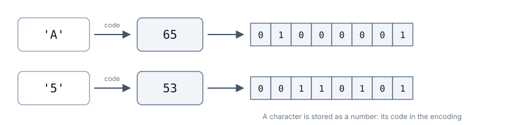
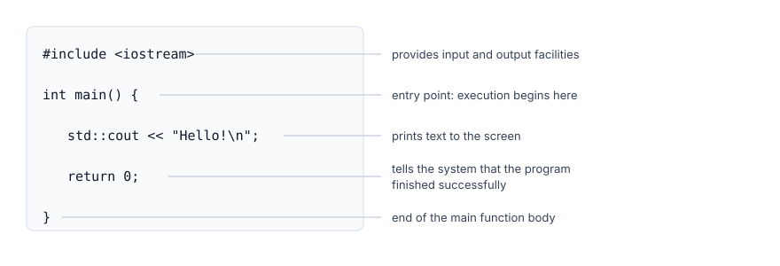
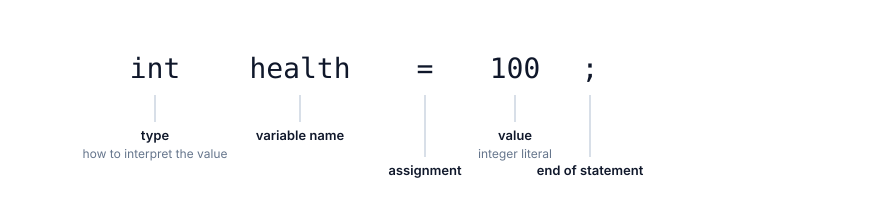

# Data in a Program. Introduction to C++

## Contents

- [Data in a Program. Introduction to C++](#data-in-a-program-introduction-to-c)
  - [Contents](#contents)
  - [Self-check questions](#self-check-questions)
  - [What did we discuss in the previous chapter?](#what-did-we-discuss-in-the-previous-chapter)
  - [What are data and information?](#what-are-data-and-information)
  - [Representing information: bits and bytes](#representing-information-bits-and-bytes)
    - [Defining bits and bytes](#defining-bits-and-bytes)
    - [Multiple bytes](#multiple-bytes)
  - [What is a program?](#what-is-a-program)
    - [Where does data in a program come from?](#where-does-data-in-a-program-come-from)
    - [Input and output](#input-and-output)
    - [Data during and after program execution](#data-during-and-after-program-execution)
  - [How data is represented in memory](#how-data-is-represented-in-memory)
    - [Byte](#byte)
    - [Integer](#integer)
    - [Character](#character)
    - [Floating-point number](#floating-point-number)
    - [Boolean value](#boolean-value)
  - [Variables and literals](#variables-and-literals)
    - [Literal](#literal)
    - [Variable](#variable)
    - [Constants](#constants)
  - [The C++ language](#the-c-language)
    - [A brief history of C++](#a-brief-history-of-c)
    - [Why are we learning it?](#why-are-we-learning-it)
  - [Where to write C++ code](#where-to-write-c-code)
  - [Example 1. Your first C++ program](#example-1-your-first-c-program)
  - [Variables in C++](#variables-in-c)
    - [Declaring a variable](#declaring-a-variable)
    - [Variable names](#variable-names)
    - [Constants in C++](#constants-in-c)
    - [Naming conventions for variables and constants](#naming-conventions-for-variables-and-constants)
  - [Data types in C++](#data-types-in-c)
    - [Defining a data type](#defining-a-data-type)
    - [Basic data types](#basic-data-types)
    - [The int type](#the-int-type)
    - [The char type](#the-char-type)
    - [The float and double types](#the-float-and-double-types)
    - [The bool type](#the-bool-type)
  - [Input and output in C++](#input-and-output-in-c)
  - [Example 2. A program with input](#example-2-a-program-with-input)
  - [Summary](#summary)

## Self-check questions

1. How are data different from information? Give your own example.
2. How many different values fit in one byte, and why exactly that many?
3. What integer is represented by the bits `00001010`?
4. A byte contains `01000001`. What does it contain: the number 65 or the character `A`?
5. How is a literal different from a constant, and how is a constant different from a variable?
6. What will the program output, and why?

```cpp
int a = 9;
int b = 4;

std::cout << a / b << '\n';
```

7. Which types would you choose for these values: the number of bullets, a character's coordinate, whether a level has been completed, and a pressed key?
8. Find the errors:

```cpp
int 2player = 5;
double price = 3,50;
char symbol = "A";
const int MAX = 100;
MAX = 200;
```

9. What is the difference between `7`, `7.0`, `'7'`, and `"7"`?
10. What happens if you declare `int lives;` and immediately output the value of the variable?

## What did we discuss in the previous chapter?

The first two chapters focused on how a program "thinks": the order in which steps are executed, where decisions are made, and how program state changes. Today, we will look at what a program works with.

Every game stores and changes values: health, score, coins, character coordinates, whether a door is open, which key was pressed. Until we define what values the program stores and what kind of values they are, we cannot write the program.

This lecture has two parts. In the first part, we examine the concepts: what a program is, how data looks in memory, and what variables, literals, types, and constants are. These ideas work the same way in any programming language, so the examples in the first part are written in pseudocode. In the second part, we translate the same concepts into C++ and write our first working program.

## What are data and information?

Let us begin with a simple question: _what does a computer actually work with?_

**Data** are values that a computer stores and processes. One such item is called a **value**.

_Example._ The number 100, the character `A`, and the answer "yes" are three different values.

Data include anything that can be counted, measured, or recorded:

- health, mana, coins, bullets;
- level number and score;
- a character's coordinates on the map;
- whether a door is open;
- a pressed key.

The word "information" is often used alongside "data." The distinction is simple.

**Information** is meaningful knowledge obtained from data.

_Example._ The number 12 by itself says nothing. But if we say, "the character has 12 health points left out of 100," the player understands that the situation is bad and it is time to heal. The data has become information.

A computer works with data.

## Representing information: bits and bytes

### Defining bits and bytes

Computer memory must distinguish between physical states. At the most basic level, these states are represented as `0` and `1`.

A **bit (binary digit)** is the smallest unit of digital representation and can have one of two values: `0` or `1`.

One bit can represent very little: on or off, whether a character is alive or dead. Health, coordinates, and text require more combinations, so bits are grouped together.

A **byte** is a group of eight bits. However, throughout the history of computing, systems have existed with different byte sizes, such as 6, 32, or 36 bits.

Eight bits provide `2⁸ = 256` combinations, from `00000000` to `11111111`. If we interpret them as non-negative integers, the range is from `0` to `255`.

Now we can store and process more information by using combinations of bits grouped into bytes.

> [!IMPORTANT]
> A byte by itself is not a number, a letter, or a color. It is a group of bits. Meaning appears when a program interprets those bits according to specific rules.

The same combination can be interpreted as a number, a text code unit, or part of a color. Context and the data type tell the program how to work with it.

### Multiple bytes

One byte is often not enough. A score may exceed 255, and a coordinate may be negative. In that case, several bytes are treated as a single value:

```text
00000000 00000000 00000000 01100100
```

This sequence can represent the number `100`. The spaces are added for readability. The number of bytes determines how many different combinations are possible.

## What is a program?

A **program** is an algorithm written in a language understood by an executor. Put simply, it is a set of instructions that a computer executes step by step.

Every program has two parts:

- the data it stores;
- the actions it performs on that data.

$$Program = Data + Actions$$

_Example._ A game remembers a character's health, coordinates, and number of coins. These are data. When an enemy attacks, the game reduces the character's health. That is an action.

A designer defines the rules for how values change. A programmer turns those rules into two things:

- a description of the data;
- a description of the actions.

You always start with the data, because until you decide what the program stores, there is nothing for the actions to operate on.

### Where does data in a program come from?

A value can enter a program in three ways:

1. _It is written directly in the program's source code._ Maximum health is 100 because the designer decided so.
2. _It comes from outside the program._ The player entered it using the keyboard, the program read it from a save file, or it received it from the mouse.
3. _It is calculated from other data._ Remaining health is calculated from current health and damage.

### Input and output

A program needs two capabilities to receive data from outside and present a result.

**Input** is receiving a value _from outside_: from the keyboard, from a file, or from another device.

**Output** is sending a value _outward_: to the screen, to a file, or to another device.

### Data during and after program execution

Data is stored in computer memory. Memory is allocated to a program only while it is running and is released after the program finishes.

_This means that all values disappear as soon as the program closes._

That is why games have save files. For health and inventory to survive until the next launch, the program writes them to a file and reads them back when it starts. Nothing is saved automatically.

## How data is represented in memory

### Byte

Memory stores only bytes, and a byte is eight bits. There are no numbers or letters in memory.

This leads to an important idea: _a byte means nothing by itself_. The same bit pattern can be read in different ways.

_Example._ Consider the byte `01000001`:

| How to read it        | Result                    |
| --------------------- | ------------------------- |
| As an integer         | 65                        |
| As a character        | `A`                       |
| As "yes or no"       | non-zero, meaning "yes"  |

All three answers are correct. You cannot tell from the bits alone which interpretation is intended. The program therefore has to know in advance how each value should be read. We will see how it knows this in the section "Data Types in C++."

Next, let us look at how familiar kinds of data are stored in bytes.

### Integer

Integers are represented using the **binary numeral system**.

In the familiar decimal system, each digit represents a power of ten: 13 means one ten and three ones. In the binary system, each digit represents a power of two.

To read a binary value, add the weights of the positions that contain `1`.

_Example._ The byte `00001101`:

| Place value | 128 |  64 |  32 |  16 |   8 |   4 |   2 |   1 |
| ----------: | --: | --: | --: | --: | --: | --: | --: | --: |
|         Bit |   0 |   0 |   0 |   0 |   1 |   1 |   0 |   1 |

Add the selected place values: 8 + 4 + 1 = 13.

The more bytes are allocated to a number, the more values it can represent:

- 1 byte provides 256 values;
- 2 bytes provide 65,536 values;
- 4 bytes provide more than 4 billion values.

Some of the values are usually reserved for negative numbers, so the range is split roughly in half.

### Character

A letter cannot be stored directly in memory, because memory contains only numbers. Therefore, each character is assigned a number in advance.

An **encoding** is a mapping between characters and their numeric codes.

The best-known encoding is **ASCII**. In ASCII:

- the letter `A` corresponds to the number 65;
- the letter `B` corresponds to the number 66;
- the digit `5` corresponds to the number 53;
- the space character corresponds to the number 32.



_Figure 3.1. Representing a character in memory_

The ASCII table shows the correspondence between characters and their numeric codes:


_Figure 3.2. ASCII code table_

Today, the **Unicode** standard is used more often. It includes characters from almost every writing system in the world, including Cyrillic and ideographs[^6]. It follows the same general principle: a character corresponds to a number, and that number is what is stored in memory.

> [!IMPORTANT]
>
> Pay particular attention to digits. The character `5` is stored as the number 53, not as the number five. _The character `5` and the number 5 are different values._ This is one of the most common sources of confusion.

### Floating-point number

Fractional numbers are more complicated than integers. Several bytes are allocated to the number: some bits store the digits of the number, while others indicate where the decimal point is. The detailed representation is defined by a separate standard[^5], which we will not study here.

There is one consequence you need to remember.

> [!WARNING]
>
> _Floating-point numbers are stored approximately._ It is impossible to store an infinite fraction exactly in a finite number of bytes, just as it is impossible to write `1/3` exactly as a finite decimal fraction.

Because of this, floating-point values are not compared for exact equality. For example, `0.1 + 0.2` in a program is not exactly equal to `0.3`, although the difference only appears far out in the decimal places.

### Boolean value

Sometimes we need to store only two possibilities: yes or no, true or false.

A **Boolean value** is a value with exactly two possible states: true or false.

_Example._ Whether a character is alive, whether the player has a key, whether the game is paused.

One bit would be enough to represent such a value, but in practice a whole byte is allocated for it, _because memory is allocated in bytes_.

## Variables and literals

### Literal

Sometimes a value is known in advance and never changes. In that case, it is written directly in the program text.

A **literal** is a value written directly in a program's source code[^4].

_Example._ In the pseudocode line

```text
SET health = health - 25
```

the number 25 is a literal. It does not come from anywhere and is not calculated; it is simply written in the program.

A literal cannot be changed while the program is running. To change it, you would have to modify the program itself.

### Variable

A literal works only for fixed values. A character's health cannot be written that way: it changes after every hit, and its future value is not known in advance.

For such data, we need a place where a value can be stored, read later, and then replaced with another value.

A **variable** is a named program object that stores a value of a particular type; that value can be read and, if permitted, changed.

A variable differs from a literal in two ways.

- First, it has a name that can be used to refer to it.
- Second, its value can change while the program is running, whereas a literal remains exactly as it was written in the source code.

A variable also has a type. The type tells us what values can be stored in the variable and what operations are allowed on them.

The name is needed so that we can refer to that storage location. A person can say, "put 70 into `health`," but not realistically, "put 70 into the fourth memory cell."

Three things are done with a variable:

1. _Create it and give it a name._
2. _Read its value_ without changing it.
3. _Write a new value_ in place of the old one.

The third action is called **assignment**. It follows a simple rule: _first, the new value is calculated completely, and only then is it written into the variable_. The old value is lost.

For example,

```text
SET health = 100

SET health = health - 25
```

The second line is executed step by step:

1. The program reads the current value of `health`, which is 100.
2. It calculates `100 - 25`, which gives 75.
3. It writes 75 into `health`.
4. The old value, 100, is lost.

In this line, `health` is a variable and 25 is a literal.

### Constants

There is also the opposite case: a value is defined once and should not change, for example:

- maximum health;
- the price of entering a dungeon;
- the size of the game board.

A **named constant** is a name for a value that does not change while the program is running[^4].

A literal does not change either, but it has no name. That is the entire difference.

The `CONST` command creates a constant and immediately assigns it a value. You cannot assign another value to it later, so the line `SET MAX_HEALTH = 120` would be an error.

Why is this useful?

- _The number gains meaning._ The name `MAX_HEALTH` is clearer than the number 100 scattered across ten different places in the program.
- _The value only needs to be changed in one place._ If the maximum becomes 120, you edit a single line.

Three similar concepts can conveniently be compared by two properties.

## The C++ language

### A brief history of C++

C++ did not appear out of nowhere. Bjarne Stroustrup created it based on the C language, which Dennis Ritchie developed in 1972. The first commercial release of C++ appeared in 1985[^3].

Since then, the language has been updated several times. Versions are named by year: C++11, C++14, C++17, C++20, C++23. Each version is described in a **standard**, a document that specifies how the language must work[^1].

### Why are we learning it?

For our purposes, C++ has three important properties.

1. _It is compiled._ The entire program text is translated into an executable file before the program runs. This means the compiler, not the player, will tell you about errors in the code.
2. _Types are written explicitly._ When you create a variable, you must state what kind of value it will contain. Some languages do this automatically, and a beginner can spend a long time without thinking about what is happening. C++ does not allow that, which is useful for learning.
3. _It is "close" to the machine._ The programmer can control how much space data takes. That is why we talk about bytes. This is also one reason C++ remains a major language in the game industry: Unreal Engine and many other engines are written in it.

Let us be clear: _the goal of this course is not the language itself, but learning how to program_. The language is a tool for us. There will be a separate C++ course later, where the language is studied as a subject in its own right.

## Where to write C++ code

C++ program text is stored in an ordinary text file with the `.cpp` extension, for example `main.cpp`.

A compiler turns it into an **executable file**: `main.exe` on Windows, or a file without an extension on Linux and macOS.

> [!IMPORTANT]
>
> Do not confuse these two files:
>
> - `main.cpp` can be opened and read, but it cannot be run directly;
> - `main.exe` can be run, but there is nothing useful to read in it because it contains machine code.

To make this workflow convenient, programmers use a development environment.

An **IDE (Integrated Development Environment)** is a program that brings everything you need together in one window:

- a code editor with syntax highlighting;
- a build-and-run button;
- a window with compiler messages;
- a debugger that can pause the program and show variable values.

Common choices for C++ include:

- [Visual Studio](https://visualstudio.microsoft.com/ru/),
- [CLion](https://www.jetbrains.com/clion/),
- [Code::Blocks](https://www.codeblocks.org/).

We will discuss which environment we will use, and how to install and configure it, during the lab session.

## Example 1. Your first C++ program

Here is the smallest C++ program. It prints the word `Hello!` to the screen and then finishes.

```cpp
#include <iostream>

int main() {
    std::cout << "Hello!\n";

    return 0;
}
```



_Figure 3.3. The structure of a minimal program_

Let us go through it line by line:

- `#include <iostream>` adds the standard input and output facilities to the program. Without this line, `std::cout` will not work.
- `int main()` is the main part of the program. _Execution always begins here_.
- The braces `{` and `}` mark where this part begins and ends. Everything between them is executed from top to bottom, one line at a time.
- `std::cout << "Hello!\n";` prints text to the screen.
- `return 0;` tells the operating system that the program finished successfully.

Each instruction ends with a **semicolon**. The compiler uses it to determine where one instruction ends and the next one begins.

If you forget the semicolon at the end of an instruction, the compiler reports an error and the program will not compile:

```text
main.cpp:4:28: error: expected ';' before 'return'
    4 |     std::cout << "Hello!\n"
      |                            ^
      |                            ;
```

The exact wording of the message depends on the compiler and its version, but the main parts are always the same:

- `main.cpp` is the name of the file where the problem was found;
- `4:28` is the line number and the position within that line;
- `error` means the program will not be built;
- what follows explains the problem and shows the line with a marker pointing to the problematic location.

## Variables in C++

### Declaring a variable

A **variable declaration** is an instruction that tells the compiler the variable's name and its type.

The structure of a variable declaration is:

```cpp
<type> <variable_name> [= <value>];
```

For example,

```cpp
int coins;
```

This line means: create a variable named `coins` that will contain an integer. The word `int` denotes an integer type; we will examine the other type names in the next section.

At this point, the variable does not yet have a defined value. Memory has already been allocated for it, but what exactly is stored there is unknown. A value can be assigned later:

```cpp
coins = 100;
```

A variable can also be initialized immediately:

```cpp
int coins = 100;
```

This line means: create a variable named `coins` that stores an integer and immediately give it the value `100`.



_Figure 3.4. Parts of a declaration with an initial value_

### Variable names

A variable name is called an **identifier**. The language rules are:

- a name consists of Latin letters, digits, and underscores;
- it cannot begin with a digit;
- uppercase and lowercase letters are different: `health`, `Health`, and `HEALTH` are three different names;
- you cannot use _keywords_, which are words that already have a special meaning in the language, such as `int`, `return`, `if`, and others.

_Example._

```cpp
int health = 100;          // good
int playerHealth = 100;    // even better: it is immediately clear whose health this is
int h = 100;               // clear only to the author

int 1health = 100;         // error: the name begins with a digit
int return = 50;           // error: return is a keyword
```

A name should answer the question, "what is stored here?"

### Constants in C++

A constant is written like a variable, but with the word `const`:

```cpp
const int MAX_HEALTH = 100;

MAX_HEALTH = 120;    // compilation error
```

A constant must be given its value immediately when it is declared. You cannot assign another value to it later, and the compiler will report the problem before the program runs.

### Naming conventions for variables and constants

You may have noticed that the examples use lowercase letters for variables and uppercase letters with underscores for constants: `MAX_HEALTH`, `DEFAULT_SPEED`.

The compiler does not care how you style names: it will accept any of these approaches. But code is read by people, so programming has developed several widely used conventions for writing multi-word names.

- `camelCase` - words are joined together; the first word begins with a lowercase letter and each following word begins with an uppercase letter: `playerHealth`, `enemyCount`, `isAlive`.
- `PascalCase` - the same idea, but the first word also begins with an uppercase letter: `PlayerHealth`, `EnemyCount`, `IsAlive`.
- `snake_case` - words are separated by underscores and all letters are lowercase: `player_health`, `enemy_count`, `is_alive`.
- `UPPER_SNAKE_CASE` - words are separated by underscores and all letters are uppercase: `MAX_HEALTH`, `DEFAULT_SPEED`.
- `kebab-case` - words are separated by hyphens and all letters are lowercase: `player-health`, `enemy-count`, `is-alive`.

The style is not chosen purely according to personal preference. Each language and each team has its own conventions, and everyone within a project should write names consistently. The problem is not choosing `snake_case` instead of `camelCase`; the problem is mixing both styles in the same file without a reason.

In this course, variables will use `camelCase` and constants will use `UPPER_SNAKE_CASE`. This convention immediately tells you what you are looking at: `playerHealth` can change during the game, while `MAX_HEALTH` remains unchanged.

## Data types in C++

### Defining a data type

Recall the conclusion from the section about bytes: the bits alone do not tell us what they mean. The program therefore has to know the interpretation in advance.

A **data type** is a characteristic that determines what values a variable can store, how much memory those values occupy, and what operations are allowed on them.

The type is written in the variable declaration, and the compiler remembers it. From then on, the compiler checks every operation involving that variable and can report an error before the program is run.

### Basic data types

C++ has many data types, but for now we will focus on the basic ones you will encounter most often.

| Kind of data           | C++ type          | Example values          | Game-related examples                    |
| ---------------------- | ----------------- | ----------------------- | ---------------------------------------- |
| Integers               | `int`             | `0`, `100`, `-7`        | Health, coins, score, level number       |
| Floating-point numbers | `double`, `float` | `1.5`, `0.75`, `-2.0`   | Coordinates, damage multiplier, time     |
| One character          | `char`            | `'A'`, `'#'`, `'5'`     | Pressed key, map symbol                  |
| Boolean value          | `bool`            | `true`, `false`         | Whether a character is alive, has a key |

### The int type

`int` stores whole numbers: positive numbers, negative numbers, and zero.

```cpp
int health = 100;
int coins = 0;
int score = -50;
```

It has no fractional part at all. This is not rounding; the type simply does not represent a fractional component.

An `int` usually occupies 4 bytes, which means it can store values of roughly negative two billion to positive two billion[^2]. That is more than enough for health and coin counts in most simple examples.

When two integers are divided, the result is also an integer and the fractional part is simply discarded. For example, `7 / 2` gives `3`, not `3.5`. It is not rounded to `4`; the fractional part is removed. To get `3.5`, at least one of the numbers must be floating-point, for example `7.0 / 2`.

### The char type

`char` stores one character and occupies exactly one byte.

```cpp
char grade = 'A';
char wall = '#';
```

There is one important idea to understand here; otherwise, `char` may seem strange. _A `char` does not actually store a letter. It stores a number._ Memory contains the character code: for `'A'` it is 65, and for `'5'` it is 53.

That number becomes a character only when it is displayed: a variable of type `char` is output as the character corresponding to its code.

_Example._ Both variables below store the same numeric value, 65, but they are displayed differently:

```cpp
char symbol = 'A';
int code = 'A';

std::cout << symbol << '\n';   // A
std::cout << code << '\n';     // 65
```

If you assign a number to a `char` variable, it will be interpreted as a character code:

```cpp
char letter = 65;
std::cout << letter << '\n';   // A
```

You cannot store a word or a phrase in a `char`; it holds exactly one character. We will discuss how to store text later.

### The float and double types

`float` and `double` store floating-point numbers. They differ in size and precision:

| Type     | Size    | Approximate precision     |
| -------- | ------- | ------------------------- |
| `float`  | 4 bytes | about 7 significant digits  |
| `double` | 8 bytes | about 15 significant digits |

For example,

```cpp
double playerX = 12.5;
double damageMultiplier = 1.75;
```

Game engines commonly use `float` because it takes half as much memory, and memory is always a limited resource in games. Although `double` is more precise, that extra precision is unnecessary in many cases.

> [!WARNING]
>
> Remember that floating-point numbers are stored approximately. Therefore, they are not compared for exact equality: `0.1 + 0.2` is not exactly equal to `0.3`.

### The bool type

`bool` stores a Boolean value and has exactly two possible values: `true` and `false`.

```cpp
bool isAlive = true;
bool hasKey = false;
```

`true` and `false` are language keywords, not text, so they do not need quotation marks. Writing `"true"` in quotation marks would make it text rather than a Boolean value.

We will use `bool` more fully in the next chapter: the result of a condition in an `if` statement is a value of this type.

## Input and output in C++

In C++, `std::cin` and `std::cout` are used for input and output respectively. `std::cin` reads data from the keyboard, while `std::cout` sends data to the console.

Example of output in C++:

```cpp
#include <iostream>

int main() {
  int health = 75;

  std::cout << "Health: " << health << '\n';
}
```

- `std::cout` is used to output data to the console.
- `<<` indicates the direction: the value is sent into the output stream, in this case the console.
- text in quotation marks is printed exactly as written;
- `health` without quotation marks is a variable name, so its value is printed;
- `\n` is a newline character: it represents one character even though it is written using two symbols.

> [!NOTE]
>
> Without `\n`, the next output will continue on the same line.

Example of input in C++:

```cpp
#include <iostream>

int main() {
  int health;
  std::cin >> health;
}
```

- `std::cin` is used to read data from the keyboard.
- `>>` indicates the direction: data from the input stream, in this case the keyboard, is written into the variable.
- `health` is the variable name, so the entered value will be stored there.

Notice that both examples use `#include <iostream>`. Without this line, `std::cin` and `std::cout` will not work; the compiler will report an error.

> [!TIP]
>
> Always print a prompt before reading input. Otherwise, the user will see an empty screen and will not know what the program expects.

## Example 2. A program with input

Let us write a program for the following algorithm:

> A character takes a hit. The character's health and the damage amount are known. Reduce the health and output the result.

Let us analyze the task using the questions from the previous chapter:

1. _What is given?_ Health and damage.
2. _What should we obtain?_ The remaining health.
3. _What data should we store?_ Two integers, because this game does not use fractions of a health point.

Algorithm:

```text
INPUT health
INPUT damage

SET health = health - damage

OUTPUT health
```

The C++ program looks like this:

```cpp
#include <iostream>

int main() {
    int health = 0;
    int damage = 0;

    std::cout << "Health: ";
    std::cin >> health;

    std::cout << "Damage: ";
    std::cin >> damage;

    health = health - damage;

    std::cout << "Health left: " << health << '\n';

    return 0;
}
```

The lines appear in the same order as in the algorithm. Only the notation has changed: `INPUT` became `std::cin`, `OUTPUT` became `std::cout`, semicolons were added, and the variables had to be declared in advance with their types specified.

## Summary

1. Data are values that a computer works with. Information is the meaning a person derives from those values.
2. A bit has one of two values; a byte consists of eight bits and can represent one of 256 possible bit patterns.
3. A program consists of data and actions performed on that data; the data exists in memory only while the program is running.
4. A value enters a program in one of three ways: it is written in the code, received from outside, or calculated from other data.
5. A byte has no meaning by itself: the same bits can be interpreted as either a number or a character.
6. A literal is a value written directly in the program text; it has no name and does not change.
7. A variable is a named storage location whose value can be read and changed.
8. Assignment first calculates the new value, then writes it into the variable, replacing the old value.
9. A constant is a name for a value that does not change; in C++, it is declared using the word `const`.
10. A data type tells the program how to interpret bits; for this course, `int`, `double`, `char`, and `bool` are sufficient for now.

[^1]: ISO/IEC 14882:2020. _Programming languages - C++_. International Organization for Standardization, 2020.

[^2]: cppreference. _Fundamental types_. Available at: https://en.cppreference.com/w/cpp/language/types

[^3]: Stroustrup B. _Programming: Principles and Practice Using C++_. 2nd ed. Addison-Wesley, 2014.

[^4]: Gaddis T. _Starting Out with C++: From Control Structures through Objects_. 9th ed. Pearson, 2017.

[^5]: IEEE 754-2019. _IEEE Standard for Floating-Point Arithmetic_. Institute of Electrical and Electronics Engineers, 2019.

[^6]: The Unicode Consortium. _The Unicode Standard_. Available at: https://www.unicode.org/versions/latest/
