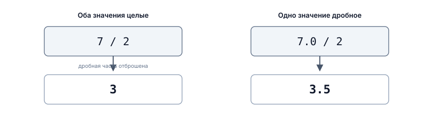
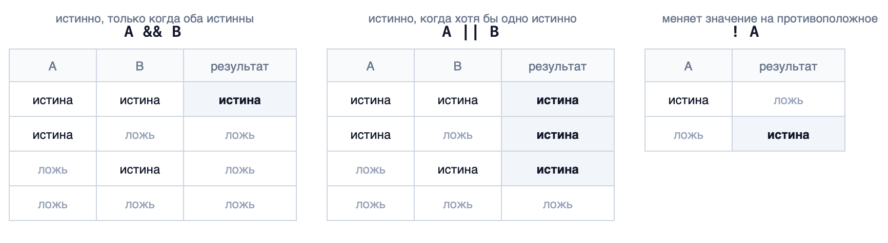

# Выражения и операции

## Содержание

- [Выражения и операции](#выражения-и-операции)
  - [Содержание](#содержание)
  - [Вопросы для самопроверки](#вопросы-для-самопроверки)
  - [О чём мы говорили в прошлой главе?](#о-чём-мы-говорили-в-прошлой-главе)
  - [Определение выражения](#определение-выражения)
    - [Операнды и операции](#операнды-и-операции)
    - [У выражения есть значение и тип](#у-выражения-есть-значение-и-тип)
    - [Выражение и инструкция](#выражение-и-инструкция)
  - [Арифметические операции](#арифметические-операции)
    - [Сложение, вычитание, умножение](#сложение-вычитание-умножение)
    - [Деление целых чисел](#деление-целых-чисел)
    - [Остаток от деления](#остаток-от-деления)
    - [Деление на ноль](#деление-на-ноль)
  - [Порядок выполнения операций](#порядок-выполнения-операций)
    - [Приоритет операций](#приоритет-операций)
    - [Круглые скобки](#круглые-скобки)
  - [Присваивание как операция](#присваивание-как-операция)
    - [Составное присваивание](#составное-присваивание)
    - [Увеличение и уменьшение на единицу (инкремент и декремент)](#увеличение-и-уменьшение-на-единицу-инкремент-и-декремент)
  - [Сравнение значений](#сравнение-значений)
    - [Операторы сравнения](#операторы-сравнения)
    - [Результат сравнения имеет тип bool](#результат-сравнения-имеет-тип-bool)
  - [Логические операции](#логические-операции)
    - [И, ИЛИ, НЕ](#и-или-не)
    - [Таблица истинности](#таблица-истинности)
  - [Полная таблица приоритетов](#полная-таблица-приоритетов)
  - [Преобразование типов в выражениях](#преобразование-типов-в-выражениях)
    - [Целые и дробные числа](#целые-и-дробные-числа)
    - [Потеря дробной части](#потеря-дробной-части)
    - [Как избежать потери дробной части](#как-избежать-потери-дробной-части)
  - [Типичные ошибки](#типичные-ошибки)
  - [Пример. Расчёт урона](#пример-расчёт-урона)
  - [Резюме](#резюме)

## Вопросы для самопроверки

1. Что такое выражение? Приведите три примера выражений разного вида.
2. Чем выражение отличается от инструкции?
3. Что выведет программа и почему?

   ```cpp
   std::cout << 2 + 3 * 4 << '\n';
   std::cout << (2 + 3) * 4 << '\n';
   ```

4. Чему равны `17 / 5` и `17 % 5`? Объясните, откуда берётся каждое из значений.
5. Запишите короткой формой: `score = score + 10;` и `health = health - damage;`.
6. Что окажется в переменной `average` и почему?

   ```cpp
   int a = 7;
   int b = 2;

   double average = a / b;
   ```

7. Чем отличается `=` от `==`? Что произойдёт, если написать `health = 0` там, где нужно было сравнение?
8. Постройте таблицу истинности для условия `hasKey && stamina >= 10` при значениях `hasKey = true`, `stamina = 5`.
9. Почему сравнение `0.1 + 0.2 == 0.3` даёт ложь, хотя на экране обе части выглядят одинаково?
10. Расставьте скобки так, чтобы выражение `a + b / 2` вычисляло среднее двух чисел.

## О чём мы говорили в прошлой главе?

В прошлой главе мы разобрались с данными: что такое значение, переменная, литерал и константа, как они лежат в памяти и зачем каждому значению нужен тип. Мы написали первую программу, которая читает два числа и вычитает одно из другого.

Вычитание в той программе было единственным действием над данными, и мы почти не обсуждали его устройство. Между тем именно из таких действий и состоит вся обработка данных.

Сегодня разберём их целиком: какие операции существуют, в каком порядке они выполняются, как сравнивать значения между собой и что происходит, когда в одном вычислении встречаются числа разных типов.

Эта глава почти полностью практическая, и она понадобится уже в следующей: чтобы программа могла принять решение, ей сначала нужно уметь задавать вопрос о данных.

## Определение выражения

### Операнды и операции

**Выражение (expression)** - это запись, по которой вычисляется значение.

Выражением является и простой литерал, и имя переменной, и сложная запись из нескольких действий:

```cpp
5                              // литерал
health                         // переменная
health - 25                    // вычитание
(attack - defense) * 1.5       // несколько действий
```

Внутри выражения могут находиться операнды и операции.

**Операнд (operand)** - это значение, которое участвует в вычислении.

**Операция, или оператор (operator)** - это действие, которое выполняется над операндами.

Примеры:

```cpp
5 + 3       // сложение
health - 25 // вычитание
attack * 2  // умножение
defense / 2 // деление
```

_Пример_. В выражении `(attack - defense) * multiplier` операндами являются `attack`, `defense` и `multiplier`, а операциями - _вычитание_ и _умножение_.

Операндом может быть _литерал_, _переменная_, _константа_ или _другое выражение_. Последнее и позволяет строить сложные вычисления: результат одной операции становится операндом для следующей. Например, в выражении `(a + b) / 2` результат сложения `a + b` становится операндом для деления на `2`.

### У выражения есть значение и тип

Любое выражение после вычисления даёт ровно одно значение. У этого значения, как и у любого другого в программе, есть тип.

| Выражение    | Значение | Тип      |
| ------------ | -------- | -------- |
| `5`          | `5`      | `int`    |
| `5.0`        | `5.0`    | `double` |
| `100 - 25`   | `75`     | `int`    |
| `10 / 4.0`   | `2.5`    | `double` |
| `'A'`        | `'A'`    | `char`   |
| `health > 0` | `true`   | `bool`   |

Обратите внимание на последнюю строку. Сравнение это тоже операция, и его результатом является логическое значение. Подробно об этом поговорим ниже.

> [!IMPORTANT]
>
> _Тип выражения определяется типами его операндов._ Это не мелочь: именно отсюда берётся большинство неожиданных результатов, с которыми сталкиваются начинающие. Мы разберём их в конце главы.

### Выражение и инструкция

Кроме выражений в программе существуют ещё и инструкции.

Выражение только вычисляет значение. Само по себе оно ничего не меняет и никуда результат не девает:

```cpp
health - 25
```

Эта запись вычислит значение и тут же его выбросит, потому что деть его некуда.

**Инструкция (statement)** - это законченная команда, которую выполняет программа[^4].

```cpp
health = health - 25;
```

Здесь выражение `health - 25` вычисляется, а результат записывается в переменную. Это уже полноценная команда: состояние программы после неё изменилось.

Проще всего запомнить так: _выражение отвечает на вопрос "чему равно", инструкция отвечает на вопрос "что сделать"_.

## Арифметические операции

### Сложение, вычитание, умножение

Эти три операции работают привычным образом и не требуют пояснений.

| Операция  | Знак | Пример   | Результат |
| --------- | ---- | -------- | --------- |
| Сложение  | `+`  | `10 + 3` | `13`      |
| Вычитание | `-`  | `10 - 3` | `7`       |
| Умножение | `*`  | `10 * 3` | `30`      |

Умножение записывается звёздочкой. Точка или знак `x`, как в школьной записи, в программировании не используются.

```cpp
int attack = 20;
int enemies = 3;

int totalDamage = attack * enemies;    // 60
```

### Деление целых чисел

С делением целых чисел есть несколько тонкостей.

Деление записывается знаком `/`. Если _оба_ операнда целые, результат тоже будет целым, а дробная часть отбрасывается.

```cpp
int a = 7;
int b = 2;

std::cout << a / b << '\n';    // 3
std::cout << 5 / 2 << '\n';    // 2
```

Важно понимать, что это не округление, дробная часть просто отбрасывается.



_Рисунок 4.1. Целочисленное деление и обычное_

Справа на схеме видно, что стоит одному из операндов стать дробным, и результат тоже получается дробным. Почему так происходит, разберём в разделе "Когда в выражении встречаются разные типы".

### Остаток от деления

**Остаток от деления** - это операция, которая возвращает остаток от деления одного числа на другое.

Для получения остатка от деления используется оператор `%`:

```cpp
std::cout << 17 / 5 << '\n';    // 3
std::cout << 17 % 5 << '\n';    // 2
```

Читается это так: _в 17 помещается три пятёрки, и остаётся 2_. Вместе `/` и `%` дают полный ответ на вопрос "сколько раз и сколько осталось"

Операция `%` работает только с целыми числами. Для дробных она не имеет смысла и в C++ запрещена.

_Пример_. Перевод времени. Таймер хранит 125 секунд, а показать нужно минуты и секунды:

```cpp
int totalSeconds = 125;

int minutes = totalSeconds / 60;    // 2
int seconds = totalSeconds % 60;    // 5

std::cout << minutes << ":" << seconds << '\n';    // 2:5
```

_Пример_. Остаток удобен, когда нужно что-то делать через равные промежутки. Условие `enemyNumber % 3 == 0` истинно для каждого третьего врага, а `number % 2 == 0` проверяет чётность числа.

### Деление на ноль

Делить на ноль нельзя не только в математике.

Если оба операнда целые, а делитель равен нулю, поведение программы стандартом языка не определено[^1]. На практике программа чаще всего аварийно завершается.

```cpp
int a = 10;
int b = 0;

std::cout << a / b << '\n';    // программа завершится с ошибкой (деление на ноль)
```

Для дробных чисел правила другие: там деление на ноль даёт специальные значения, обозначающие бесконечность[^3]. Программа при этом не падает, но результат оказывается бессмысленным, поэтому полагаться на него тоже не стоит.

## Порядок выполнения операций

### Приоритет операций

Когда в выражении несколько операций, порядок их выполнения определяется приоритетом. Правила совпадают со школьными.

**Приоритет операции (precedence)** - это её старшинство, определяющее, какая операция выполняется раньше.

| Приоритет | Операции    | Что это              |
| --------- | ----------- | -------------------- |
| Выше      | `*` `/` `%` | умножение и деление  |
| Ниже      | `+` `-`     | сложение и вычитание |

Операции одного приоритета выполняются слева направо. Пока в таблице только арифметика: у сравнений и логических операций приоритет тоже есть, но сами эти операции мы разберём ниже, поэтому полную таблицу соберём в конце главы.

_Пример_. Вычислим `2 + 3 * 4`:

1. Умножение имеет более высокий приоритет, поэтому первым выполняется `3 * 4`, получается `12`.
2. Затем выполняется `2 + 12`, получается `14`.

Результат равен `14`, а не `20`.

### Круглые скобки

Круглые скобки меняют порядок: то, что внутри них, вычисляется первым.

_Пример_. Вычислим `(2 + 3) * 4`:

1. Сначала выполняется `2 + 3`, получается `5`.
2. Затем `5 * 4`, получается `20`.

Скобки можно вкладывать друг в друга, тогда вычисление идёт от самых внутренних наружу.

Классическая ошибка новичка связана как раз со скобками. Нужно посчитать среднее двух чисел:

```cpp
double average = a + b / 2;      // неправильно
double average = (a + b) / 2;    // правильно
```

В первой записи делится только `b`, потому что деление выполняется раньше сложения. Для `a = 10` и `b = 20` первая запись даст `20`, а вторая `15`.

> [!TIP]
>
> Скобки ничего не стоят. Если вы хоть немного сомневаетесь в порядке вычисления, поставьте их: выражение станет длиннее на два символа, зато будет однозначным и для компилятора, и для человека, который будет читать ваш код.

## Присваивание как операция

С присваиванием мы уже знакомы. Напомним главное правило: _сначала полностью вычисляется правая часть, и только потом результат записывается в переменную слева_.

```cpp
int health = 100;

health = health - 25;    // в health окажется 75
```

Правая часть здесь это выражение, и всё, что мы разобрали выше, работает в ней обычным образом.

### Составное присваивание

Составное присваивание позволяет сократить запись, когда нужно присвоить переменной результат операции с самой собой.

_Пример_. Вместо `health = health - 25;` можно написать:

```cpp
health -= 25;    // в health окажется 75
```

Есть короткие формы для всех основных арифметических операций:

| Короткая запись | Полная запись | Что делает          |
| --------------- | ------------- | ------------------- |
| `a += 5`        | `a = a + 5`   | увеличить на 5      |
| `a -= 5`        | `a = a - 5`   | уменьшить на 5      |
| `a *= 2`        | `a = a * 2`   | увеличить в 2 раза  |
| `a /= 2`        | `a = a / 2`   | уменьшить в 2 раза  |
| `a %= 3`        | `a = a % 3`   | заменить на остаток |

Обе записи делают ровно одно и то же:

```cpp
health = health - damage;
health -= damage;
```

Знаки пишутся слитно, без пробела между ними.

> [!NOTE]
>
> Пока вы только осваиваете присваивание, полезнее писать полную форму: в ней видно, что переменная сначала читается, а потом записывается. Короткую форму стоит начать использовать, когда полная перестанет вызывать вопросы. В чужом коде вы встретите обе.

### Увеличение и уменьшение на единицу (инкремент и декремент)

Отдельный случай составного присваивания это изменение на единицу. Оно встречается настолько часто, особенно в циклах, что для него придумали ещё более короткую запись.

```cpp
count = count + 1;    // полная форма
count += 1;           // составное присваивание
count++;              // инкремент
```

**Инкремент (`++`)** - увеличивает значение переменной на единицу.

**Декремент (`--`)** - уменьшает значение переменной на единицу.

> [!NOTE]
>
> Оба эти слова могут использоваться в речи программиста для обозначения увеличения или уменьшения значения переменной на единицу. Например, ваш коллега может сказать: "Инкрементируй счётчик" или "Декрементируй жизни", то есть: "увеличь значение на единицу" или "уменьши значение на единицу".

У данных операций есть две формы записи: префиксная и постфиксная.

Постфиксная форма записывается после переменной:

```cpp
count++;    // постфиксный инкремент
count--;    // постфиксный декремент
```

Префиксная форма записывается перед переменной:

```cpp
++count;    // префиксный инкремент
--count;    // префиксный декремент
```

Разница появляется, когда эти формы используются в выражениях.

- _Префиксная форма_ сначала изменяет значение переменной, а потом возвращает его.
- _Постфиксная форма_ сначала возвращает текущее значение переменной, а потом изменяет его.

Например,

```cpp
int a = 5;
int b = ++a;    // префиксный инкремент: a сначала увеличивается до 6, затем b получает значение 6

int c = 5;
int d = c++;    // постфиксный инкремент: d получает текущее значение c (5), затем c увеличивается до 6
```

Как думаете, какой будет результат в следующем коде?

```cpp
int x = 5;
int y = x++ + 2;
int z = ++y + x;

std::cout << "x = " << x << "\n"
          << "y = " << y << "\n"
          << "z = " << z << std::endl;
```

## Сравнение значений

### Операторы сравнения

До сих пор все операции давали числа. Теперь перейдём к операциям, которые отвечают на вопрос, а не считают.

**Операторы сравнения** сравнивают два значения и дают ответ "истина" или "ложь".

| Оператор | Что проверяет    | Пример при `health = 70` | Результат |
| -------- | ---------------- | ------------------------ | --------- |
| `>`      | больше           | `health > 0`             | истина    |
| `<`      | меньше           | `health < 0`             | ложь      |
| `>=`     | больше или равно | `health >= 70`           | истина    |
| `<=`     | меньше или равно | `health <= 0`            | ложь      |
| `==`     | равно            | `health == 70`           | истина    |
| `!=`     | не равно         | `health != 70`           | ложь      |

Знаки `>=`, `<=`, `==` и `!=` состоят из двух символов, которые пишутся слитно.

> [!IMPORTANT]
>
> Обратите особое внимание на равенство. Проверка записывается двумя знаками `==`, а один знак `=` означает присваивание.

### Результат сравнения имеет тип bool

Результатом сравнения является логическое значение, то есть значение типа `bool`, с которым мы познакомились в прошлой главе. У него ровно два варианта: `true` и `false`.

Раз это обычное значение, его можно сохранить в переменную:

```cpp
int health = 70;

bool isAlive = health > 0;

std::cout << isAlive << '\n';    // 1
```

Программа выведет `1`, а не `true`. По умолчанию `std::cout` печатает логическое значение числом: `1` для истины и `0` для лжи.

Такая запись бывает полезна, когда результат проверки нужен в нескольких местах: посчитали один раз, дальше пользуетесь готовым значением.

## Логические операции

### И, ИЛИ, НЕ

Часто одного сравнения мало, несколько сравнений нужно объединять с помощью логических операций.

_Пример_. Сундук открывается, только если у игрока есть ключ _и_ при этом хватает сил. Игра заканчивается, если кончилось здоровье _или_ кончилось время.

Чтобы соединять условия, существуют логические операции.

| Операция | Знак   | Читается | Когда результат истинен            |
| -------- | ------ | -------- | ---------------------------------- |
| И        | `&&`   | и        | когда оба условия истинны          |
| ИЛИ      | `\|\|` | или      | когда истинно хотя бы одно условие |
| НЕ       | `!`    | не       | когда условие ложно                |

Знаки `&&` и `||` состоят из двух одинаковых символов подряд. Одиночные `&` и `|` в C++ тоже существуют, но означают совсем другое - побитовые операции, и мы их рассмотрим позже.

```cpp
bool hasKey = true;
int stamina = 15;

bool canOpen = hasKey && stamina >= 10;    // истина
```

```cpp
int health = 0;
int time = 40;

bool gameOver = health <= 0 || time <= 0;  // истина
```

Операция `!` меняет значение на противоположное:

```cpp
bool isAlive = health > 0;
bool isDead = !isAlive;
```

### Таблица истинности

Поведение логических операций удобно свести в таблицу, в которой перебраны все возможные сочетания.



_Рисунок 4.2. Таблицы истинности_

Из таблицы видно главное отличие:

- операция `&&` строгая, ей нужны обе истины;
- операция `||` мягкая, ей достаточно одной.

Проверим на примере. Пусть `hasKey = true`, а `stamina = 5`:

| Часть условия               | Значение |
| --------------------------- | -------- |
| `hasKey`                    | истина   |
| `stamina >= 10`             | ложь     |
| `hasKey && stamina >= 10`   | ложь     |
| `hasKey \|\| stamina >= 10` | истина   |

## Полная таблица приоритетов

Теперь, когда все нужные нам операции разобраны, соберём их приоритеты в одну таблицу[^2].

| Приоритет    | Операции                        | Пояснение                          |
| ------------ | ------------------------------- | ---------------------------------- |
| 1, выше всех | `a++` `a--`                     | постфиксные инкремент и декремент   |
| 2            | `++a` `--a` `!`                 | префиксные инкремент и декремент, отрицание |
| 3            | `*` `/` `%`                     | умножение, деление, остаток        |
| 4            | `+` `-`                         | сложение и вычитание               |
| 5            | `<` `<=` `>` `>=`               | сравнения по величине              |
| 6            | `==` `!=`                       | равенство и неравенство            |
| 7            | `&&`                            | логическое И                       |
| 8            | `\|\|`                          | логическое ИЛИ                     |
| 9, ниже всех | `=` `+=` `-=` `*=` `/=` `%=`    | присваивание                       |

Благодаря такому порядку условие `health <= 0 || time <= 0` работает так, как ожидается: сначала выполняются оба сравнения, потом их результаты соединяются через `||`. Скобки здесь не нужны, хотя и не мешают.

Обратите внимание на две крайние строки таблицы.

Наверху стоят инкремент и декремент, причём постфиксная форма выше префиксной. Именно поэтому мы договорились не использовать их внутри сложных выражений: разобраться в такой записи тяжело даже опытному программисту.

Внизу стоит присваивание, и оно выполняется последним. Это как раз то, о чём мы говорили в разделе про сравнение: в записи `bool isAlive = health > 0;` сначала целиком вычисляется правая часть, и только потом результат попадает в переменную. Скобки вокруг сравнения не нужны, потому что оно и так выполняется раньше присваивания.

А вот когда в одном условии смешиваются `&&` и `||`, скобки лучше ставить:

```cpp
hasKey && stamina >= 10 || isAdmin      // работает, но читается плохо
(hasKey && stamina >= 10) || isAdmin    // то же самое, но понятно
```

## Преобразование типов в выражениях

### Целые и дробные числа

Что произойдёт, если сложить `int` и `double`? Типы разные, а операция одна.

В таком случае C++ приводит операнды к общему типу: целое значение временно превращается в дробное, и вычисление идёт по правилам дробных чисел. Результат тоже получается дробным.

```cpp
std::cout << 7 / 2 << '\n';      // 3,   оба операнда целые
std::cout << 7.0 / 2 << '\n';    // 3.5, один операнд дробный
std::cout << 7 / 2.0 << '\n';    // 3.5, один операнд дробный
```

Само по себе превращение временное: переменная своего типа не меняет, меняется только значение внутри вычисления.

```cpp
int a = 7;
double b = 2.0;

double result = a / b;    // 3.5, переменная a осталась типа int
```

### Потеря дробной части

Обратное направление работает иначе. Если дробное значение записать в переменную типа `int`, дробная часть теряется.

```cpp
int damage = 7.9;

std::cout << damage << '\n';    // 7
```

Из-за этого возникает ошибка, которую мы рассмотрели ранее: даже если результат деления должен быть дробным, если оба операнда целые, дробная часть теряется.

```cpp
int a = 7;
int b = 2;

double average = a / b;

std::cout << average << '\n';    // 3, а не 3.5
```

Казалось бы, переменная объявлена как `double`, откуда взялась тройка? Дело в порядке действий. Сначала вычисляется правая часть `a / b`, и оба операнда там целые, поэтому результат равен `3`. И только потом эта готовая тройка записывается в дробную переменную, превращаясь в `3.0`. Дробная часть исчезла ещё до присваивания.

> [!IMPORTANT]
>
> _Тип переменной слева не влияет на вычисление справа._ Сначала полностью вычисляется выражение, и только потом результат записывается. Если вам нужен дробный результат, дробным должно быть само вычисление.

### Как избежать потери дробной части

Чтобы избежать потери дробной части при делении, нужно убедиться, что хотя бы один из операндов имеет тип `double`.

Один из способов - использование литерала с плавающей точкой.

```cpp
int a = 7;
int b = 2;

double result2 = a / 2.0;                       // 3.5, литерал с плавающей точкой
```

Есть и другие способы преобразования одного типа данных в другой, они будут рассмотрены в отдельном курсе по C++.

## Типичные ошибки

Соберём вместе то, на чём чаще всего спотыкаются.

- _Одно равно вместо двух._ Запись `health = 0` присваивает, а не сравнивает. Это самая частая ошибка, и обнаружить её тяжело, потому что программа компилируется.

- _Целочисленное деление там, где нужен дробный результат._ Средние значения, проценты и доли почти всегда требуют преобразования типа. Если результат подозрительно круглый или равен нулю, проверьте типы операндов в первую очередь.

- _Забытые скобки._ Выражение `a + b / 2` не считает среднее, а `1 + 2 * 3` не равно `9`. Скобки стоят два символа и экономят часы отладки.

- _Деление на ноль._ Если делитель вычисляется или приходит от пользователя, он может оказаться нулём. Компилятор об этом не предупредит.

- _Сравнение дробных на равенство._ Оператор `==` для `double` почти всегда даёт не тот ответ, которого вы ждёте.

- _Одиночные `&` и `|` вместо `&&` и `||`._ Программа скомпилируется, но будет работать не так, как задумано[^5].

## Пример. Расчёт урона

Соберём главу в одной программе.

> Персонаж атакует врага. Урон вычисляется как разность атаки и защиты, умноженная на множитель критического удара. Известны атака, защита, множитель и здоровье врага. Нужно вывести нанесённый урон и оставшееся здоровье врага.

Разберём задачу по вопросам из прошлых глав.

1. _Что дано?_ Атака, защита, множитель, здоровье врага.
2. _Что нужно получить?_ Урон и оставшееся здоровье.
3. _Какие данные хранить?_ Атака, защита и здоровье целые, потому что половин единиц в игре нет. Множитель дробный: критический удар может быть в полтора раза сильнее.

Формула урона:

$$Урон = (Атака - Защита) \times Множитель$$

Алгоритм:

```text
INPUT attack
INPUT defense
INPUT multiplier
INPUT enemyHealth

SET damage = (attack - defense) * multiplier

SET enemyHealth = enemyHealth - damage

OUTPUT damage
OUTPUT enemyHealth
```

Программа:

```cpp
#include <iostream>

int main() {
    int attack = 0;
    int defense = 0;
    double multiplier = 0.0;
    int enemyHealth = 0;

    std::cout << "Attack: ";
    std::cin >> attack;

    std::cout << "Defense: ";
    std::cin >> defense;

    std::cout << "Multiplier: ";
    std::cin >> multiplier;

    std::cout << "Enemy health: ";
    std::cin >> enemyHealth;

    double damage = (attack - defense) * multiplier;

    enemyHealth = enemyHealth - damage;

    std::cout << "Damage: " << damage << '\n';
    std::cout << "Enemy health left: " << enemyHealth << '\n';

    return 0;
}
```

Как вы думаете, почему в выражении `double damage = (attack - defense) * multiplier;` скобки являются обязательными?

## Резюме

1. Выражение это запись, по которой вычисляется значение; оно состоит из операндов и операций.
2. У каждого выражения есть значение и тип, а тип определяется типами операндов.
3. Выражение вычисляет значение, а инструкция выполняет действие и заканчивается точкой с запятой.
4. При делении двух целых чисел дробная часть отбрасывается, а получить её отдельно позволяет операция `%`.
5. Операции выполняются по приоритету: сначала `*`, `/` и `%`, затем `+` и `-`; скобки меняют порядок.
6. Составное присваивание `a += 5` это короткая запись для `a = a + 5`, а `a++` увеличивает значение на единицу.
7. Сравнение это операция, результат которой имеет тип `bool`; равенство проверяется двумя знаками `==`.
8. Логические операции `&&`, `||` и `!` соединяют условия; их поведение описывается таблицей истинности.
9. Если в выражении встречаются `int` и `double`, целое временно превращается в дробное, и результат получается дробным.


[^1]: ISO/IEC 14882:2020. _Programming languages - C++_. International Organization for Standardization, 2020.

[^2]: cppreference. _C++ operator precedence_. Available at: https://en.cppreference.com/w/cpp/language/operator_precedence

[^3]: IEEE 754-2019. _IEEE Standard for Floating-Point Arithmetic_. Institute of Electrical and Electronics Engineers, 2019.

[^4]: Stroustrup B. _Programming: Principles and Practice Using C++_. 2nd ed. Addison-Wesley, 2014.

[^5]: Gaddis T. _Starting Out with C++: From Control Structures through Objects_. 9th ed. Pearson, 2017.
