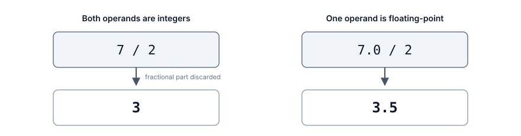
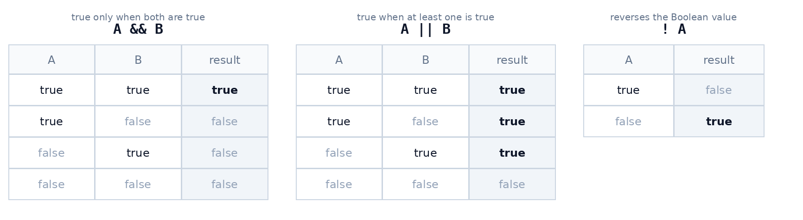

# Expressions and Operations

## Contents

- [Expressions and Operations](#expressions-and-operations)
  - [Contents](#contents)
  - [Self-Check Questions](#self-check-questions)
  - [What Did We Cover in the Previous Chapter?](#what-did-we-cover-in-the-previous-chapter)
  - [Defining an Expression](#defining-an-expression)
    - [Operands and Operators](#operands-and-operators)
    - [An Expression Has a Value and a Type](#an-expression-has-a-value-and-a-type)
    - [Expressions and Statements](#expressions-and-statements)
  - [Arithmetic Operations](#arithmetic-operations)
    - [Addition, Subtraction, and Multiplication](#addition-subtraction-and-multiplication)
    - [Integer Division](#integer-division)
    - [The Remainder Operation](#the-remainder-operation)
    - [Division by Zero](#division-by-zero)
  - [The Order of Operations](#the-order-of-operations)
    - [Operator Precedence](#operator-precedence)
    - [Parentheses](#parentheses)
  - [Assignment as an Operation](#assignment-as-an-operation)
    - [Compound Assignment](#compound-assignment)
    - [Increasing and Decreasing by One (Increment and Decrement)](#increasing-and-decreasing-by-one-increment-and-decrement)
  - [Comparing Values](#comparing-values)
    - [Comparison Operators](#comparison-operators)
    - [The Result of a Comparison Has Type bool](#the-result-of-a-comparison-has-type-bool)
  - [Logical Operations](#logical-operations)
    - [AND, OR, and NOT](#and-or-and-not)
    - [Truth Tables](#truth-tables)
  - [The Complete Precedence Table](#the-complete-precedence-table)
  - [Type Conversions in Expressions](#type-conversions-in-expressions)
    - [Integers and Floating-Point Numbers](#integers-and-floating-point-numbers)
    - [Losing the Fractional Part](#losing-the-fractional-part)
    - [How to Avoid Losing the Fractional Part](#how-to-avoid-losing-the-fractional-part)
  - [Common Mistakes](#common-mistakes)
  - [Example: Calculating Damage](#example-calculating-damage)
  - [Summary](#summary)

## Self-Check Questions

1. What is an expression? Give three examples of different kinds of expressions.
2. How does an expression differ from a statement?
3. What will the program print, and why?

   ```cpp
   std::cout << 2 + 3 * 4 << '\n';
   std::cout << (2 + 3) * 4 << '\n';
   ```

4. What are the values of `17 / 5` and `17 % 5`? Explain how each value is obtained.
5. Rewrite `score = score + 10;` and `health = health - damage;` using compound assignment.
6. What value will be stored in `average`, and why?

   ```cpp
   int a = 7;
   int b = 2;

   double average = a / b;
   ```

7. What is the difference between `=` and `==`? What happens if you write `health = 0` where a comparison was intended?
8. Construct a truth table for the condition `hasKey && stamina >= 10` when `hasKey = true` and `stamina = 5`.
9. Why does the comparison `0.1 + 0.2 == 0.3` evaluate to false even though both sides look the same when printed?
10. Add parentheses so that the expression `a + b / 2` calculates the average of two numbers.

## What Did We Cover in the Previous Chapter?

In the previous chapter, we explored data: values, variables, literals, and constants, how they are stored in memory, and why every value needs a type. We wrote our first program, which reads two numbers and subtracts one from the other.

Subtraction was the only operation performed on the data in that program, and we barely discussed how it works. Yet all data processing is made up of operations like these.

Today, we will examine them in detail: which operations are available, the order in which they are performed, how to compare values, and what happens when numbers of different types appear in the same calculation.

This chapter is almost entirely practical, and we will need it in the very next chapter: before a program can make a decision, it must be able to ask a question about its data.

## Defining an Expression

### Operands and Operators

An **expression** is a piece of code that is evaluated to produce a value.

A simple literal, a variable name, and a more complex combination of operations are all expressions:

```cpp
5                              // literal
health                         // variable
health - 25                    // subtraction
(attack - defense) * 1.5       // several operations
```

An expression may contain operands and operators.

An **operand** is a value used in a calculation.

An **operator** specifies an operation performed on its operands.

Examples:

```cpp
5 + 3       // addition
health - 25 // subtraction
attack * 2  // multiplication
defense / 2 // division
```

_Example_. In the expression `(attack - defense) * multiplier`, the operands are `attack`, `defense`, and `multiplier`, and the operations are _subtraction_ and _multiplication_.

An operand can be a _literal_, a _variable_, a _constant_, or _another expression_. The last possibility allows us to build complex calculations: the result of one operation becomes an operand of the next. For example, in `(a + b) / 2`, the result of the addition `a + b` becomes an operand of division by `2`.

### An Expression Has a Value and a Type

When evaluated, an expression produces exactly one value. Like any other value in a program, that value has a type.

| Expression   | Value  | Type     |
| ------------ | ------ | -------- |
| `5`          | `5`    | `int`    |
| `5.0`        | `5.0`  | `double` |
| `100 - 25`   | `75`   | `int`    |
| `10 / 4.0`   | `2.5`  | `double` |
| `'A'`        | `'A'`  | `char`   |
| `health > 0` | `true` | `bool`   |

Notice the last row. A comparison is also an operation, and its result is a Boolean value. We will discuss this in detail below.

> [!IMPORTANT]
>
> _The type of an expression is determined by the types of its operands._ This is no minor detail: it explains most of the unexpected results beginners encounter. We will examine them towards the end of the chapter.

### Expressions and Statements

In addition to expressions, a program also contains statements.

An expression simply computes a value. By itself, the following expression changes nothing and does not store the result anywhere:

```cpp
health - 25
```

This computes a value that is then discarded, because there is nowhere for the result to go.

A **statement** is a complete command executed by a program[^4].

```cpp
health = health - 25;
```

Here, the expression `health - 25` is evaluated, and its result is stored in a variable. This is now a complete command: the program's state has changed after it runs.

A simple way to remember the distinction is: _an expression answers “what is the value?”, while a statement answers “what should be done?”_.

## Arithmetic Operations

### Addition, Subtraction, and Multiplication

These three operations work in the familiar way and need no further explanation.

| Operation      | Symbol | Example  | Result |
| -------------- | ------ | -------- | ------ |
| Addition       | `+`    | `10 + 3` | `13`   |
| Subtraction    | `-`    | `10 - 3` | `7`    |
| Multiplication | `*`    | `10 * 3` | `30`   |

Multiplication is written with an asterisk. The dot or `x` used in school mathematics is not used for multiplication in programming.

```cpp
int attack = 20;
int enemies = 3;

int totalDamage = attack * enemies;    // 60
```

### Integer Division

There are a few subtleties to dividing integers.

Division is written with `/`. If _both_ operands are integers, the result is also an integer, and the fractional part is discarded.

```cpp
int a = 7;
int b = 2;

std::cout << a / b << '\n';    // 3
std::cout << 5 / 2 << '\n';    // 2
```

It is important to understand that this is not rounding: the fractional part is simply discarded.



_Figure 4.1. Integer division and floating-point division_

The right-hand side of the diagram shows that as soon as one operand is a floating-point number, the result is also a floating-point number. We will explain why in the section “Type Conversions in Expressions”.

### The Remainder Operation

The **remainder operation** returns the remainder when one number is divided by another.

The `%` operator is used to obtain the remainder:

```cpp
std::cout << 17 / 5 << '\n';    // 3
std::cout << 17 % 5 << '\n';    // 2
```

Read this as follows: _17 contains three groups of five, with 2 left over_. Together, `/` and `%` give the complete answer to “how many times, and how much is left over?”

The `%` operation works only with integers. It is not defined for floating-point operands in C++.

_Example_. Converting time. A timer stores 125 seconds, but we need to display minutes and seconds:

```cpp
int totalSeconds = 125;

int minutes = totalSeconds / 60;    // 2
int seconds = totalSeconds % 60;    // 5

std::cout << minutes << ":" << seconds << '\n';    // 2:5
```

_Example_. The remainder is useful when something needs to happen at regular intervals. The condition `enemyNumber % 3 == 0` is true for every third enemy, while `number % 2 == 0` checks whether a number is even.

### Division by Zero

Division by zero is not just a problem in mathematics.

If both operands are integers and the divisor is zero, the language standard does not define the program's behavior[^1]. In practice, the program will usually terminate abnormally.

```cpp
int a = 10;
int b = 0;

std::cout << a / b << '\n';    // the program will terminate with an error (division by zero)
```

The rules for floating-point numbers are different: division by zero produces special values representing infinity[^3]. The program does not crash in this case, but the result is meaningless for our calculation, so it should not be relied on either.

## The Order of Operations

### Operator Precedence

When an expression contains several operations, their order is determined by precedence. The rules match those taught in school.

**Operator precedence** is the relative priority that determines which operation is performed first.

| Precedence | Operators   | Meaning                     |
| ---------- | ----------- | --------------------------- |
| Higher     | `*` `/` `%` | multiplication and division |
| Lower      | `+` `-`     | addition and subtraction    |

Operations at the same precedence level are performed from left to right. For now, the table includes only arithmetic: comparison and logical operators also have precedence, but we will introduce those operations below and assemble the complete table towards the end of the chapter.

_Example_. Evaluate `2 + 3 * 4`:

1. Multiplication has higher precedence, so `3 * 4` is performed first, giving `12`.
2. Then `2 + 12` is performed, giving `14`.

The result is `14`, not `20`.

### Parentheses

Parentheses change the order: the expression inside them is evaluated first.

_Example_. Evaluate `(2 + 3) * 4`:

1. First, `2 + 3` is performed, giving `5`.
2. Then `5 * 4` is performed, giving `20`.

Parentheses can be nested, in which case evaluation proceeds from the innermost pair outwards.

A classic beginner's mistake involves parentheses. Suppose we need to calculate the average of two numbers:

```cpp
double average = a + b / 2;      // incorrect
double average = (a + b) / 2;    // correct
```

In the first version, only `b` is divided, because division is performed before addition. For `a = 10` and `b = 20`, the first version gives `20`, while the second gives `15`.

> [!TIP]
>
> Parentheses cost nothing. If you have even the slightest doubt about the order of evaluation, add them: the expression will be two characters longer, but it will be unambiguous both to the compiler and to the person reading your code.

## Assignment as an Operation

We are already familiar with assignment. Recall the main rule: _the right-hand side is fully evaluated first, and only then is the result stored in the variable on the left_.

```cpp
int health = 100;

health = health - 25;    // health will contain 75
```

The right-hand side is an expression, and everything discussed above applies to it in the usual way.

### Compound Assignment

Compound assignment provides a shorter notation when a variable is assigned the result of an operation involving its own value.

_Example_. Instead of `health = health - 25;`, we can write:

```cpp
health -= 25;    // health will contain 75
```

There are short forms for all the main arithmetic operations:

| Short form | Full form   | Effect                     |
| ---------- | ----------- | -------------------------- |
| `a += 5`   | `a = a + 5` | increase by 5              |
| `a -= 5`   | `a = a - 5` | decrease by 5              |
| `a *= 2`   | `a = a * 2` | multiply by 2              |
| `a /= 2`   | `a = a / 2` | divide by 2                |
| `a %= 3`   | `a = a % 3` | replace with the remainder |

Both forms do exactly the same thing:

```cpp
health = health - damage;
health -= damage;
```

The symbols are written together, with no space between them.

> [!NOTE]
>
> While you are still learning assignment, the full form is more useful: it makes it clear that the variable is read first and written afterwards. Start using the short form when the full form no longer raises questions. You will encounter both in other people's code.

### Increasing and Decreasing by One (Increment and Decrement)

A special case of compound assignment is changing a value by one. This occurs so often, especially in loops, that an even shorter notation was introduced for it.

```cpp
count = count + 1;    // full form
count += 1;           // compound assignment
count++;              // increment
```

**Increment (`++`)** increases the value of a variable by one.

**Decrement (`--`)** decreases the value of a variable by one.

> [!NOTE]
>
> Programmers may use these words to describe increasing or decreasing a variable's value by one. For example, a colleague might say “increment the counter” or “decrement the lives”, meaning “increase the value by one” or “decrease the value by one”.

These operators have two forms: prefix and postfix.

The postfix form is written after the variable:

```cpp
count++;    // postfix increment
count--;    // postfix decrement
```

The prefix form is written before the variable:

```cpp
++count;    // prefix increment
--count;    // prefix decrement
```

The difference appears when these forms are used in expressions.

- The _prefix form_ first changes the variable's value and then returns it.
- The _postfix form_ first returns the variable's current value and then changes it.

For example:

```cpp
int a = 5;
int b = ++a;    // prefix increment: a is first increased to 6, then b receives 6

int c = 5;
int d = c++;    // postfix increment: d receives the current value of c (5), then c is increased to 6
```

What do you think the following code will print?

```cpp
int x = 5;
int y = x++ + 2;
int z = ++y + x;

std::cout << "x = " << x << "\n"
          << "y = " << y << "\n"
          << "z = " << z << std::endl;
```

## Comparing Values

### Comparison Operators

So far, all our operations have produced numbers. We will now move on to operations that answer a question rather than perform an arithmetic calculation.

**Comparison operators** compare two values and produce the answer “true” or “false”.

| Operator | What it checks           | Example when `health = 70` | Result |
| -------- | ------------------------ | -------------------------- | ------ |
| `>`      | greater than             | `health > 0`               | true   |
| `<`      | less than                | `health < 0`               | false  |
| `>=`     | greater than or equal to | `health >= 70`             | true   |
| `<=`     | less than or equal to    | `health <= 0`              | false  |
| `==`     | equal to                 | `health == 70`             | true   |
| `!=`     | not equal to             | `health != 70`             | false  |

The operators `>=`, `<=`, `==`, and `!=` each consist of two characters written together.

> [!IMPORTANT]
>
> Pay particular attention to equality. An equality test uses two equals signs, `==`, while a single equals sign, `=`, means assignment.

### The Result of a Comparison Has Type bool

The result of a comparison is a Boolean value, that is, a value of type `bool`, which we introduced in the previous chapter. There are exactly two possibilities: `true` and `false`.

Since this is an ordinary value, it can be stored in a variable:

```cpp
int health = 70;

bool isAlive = health > 0;

std::cout << isAlive << '\n';    // 1
```

The program prints `1`, not `true`. By default, `std::cout` prints a Boolean value as a number: `1` for true and `0` for false.

This can be useful when the result of a check is needed in several places: evaluate it once, then reuse the stored value.

## Logical Operations

### AND, OR, and NOT

Often, a single comparison is not enough: several comparisons need to be combined using logical operations.

_Example_. A chest opens only if the player has a key _and_ enough stamina. The game ends if health runs out _or_ time runs out.

Logical operations allow us to combine conditions.

| Operation | Symbol | Read as | When the result is true             |
| --------- | ------ | ------- | ----------------------------------- |
| AND       | `&&`   | and     | when both conditions are true       |
| OR        | `\|\|` | or      | when at least one condition is true |
| NOT       | `!`    | not     | when the condition is false         |

The operators `&&` and `||` each consist of two identical characters in a row. Single `&` and `|` operators also exist in C++, but mean something quite different: bitwise operations, which we will cover later.

```cpp
bool hasKey = true;
int stamina = 15;

bool canOpen = hasKey && stamina >= 10;    // true
```

```cpp
int health = 0;
int time = 40;

bool gameOver = health <= 0 || time <= 0;  // true
```

The `!` operator reverses the Boolean value:

```cpp
bool isAlive = health > 0;
bool isDead = !isAlive;
```

### Truth Tables

The behavior of logical operations can be summarized in a table that lists every possible combination.



_Figure 4.2. Truth tables_

The table highlights the main difference:

- `&&` is strict: it requires both values to be true;
- `||` is more permissive: one true value is enough.

Let us check an example. Suppose `hasKey = true` and `stamina = 5`:

| Part of the condition       | Value |
| --------------------------- | ----- |
| `hasKey`                    | true  |
| `stamina >= 10`             | false |
| `hasKey && stamina >= 10`   | false |
| `hasKey \|\| stamina >= 10` | true  |

## The Complete Precedence Table

Now that we have covered all the operations we need, we can collect their precedence levels in one table[^2].

| Precedence | Operators                    | Explanation                              |
| ---------- | ---------------------------- | ---------------------------------------- |
| 1, highest | `a++` `a--`                  | postfix increment and decrement          |
| 2          | `++a` `--a` `!`              | prefix increment and decrement, negation |
| 3          | `*` `/` `%`                  | multiplication, division, remainder      |
| 4          | `+` `-`                      | addition and subtraction                 |
| 5          | `<` `<=` `>` `>=`            | relational comparisons                   |
| 6          | `==` `!=`                    | equality and inequality                  |
| 7          | `&&`                         | logical AND                              |
| 8          | `\|\|`                       | logical OR                               |
| 9, lowest  | `=` `+=` `-=` `*=` `/=` `%=` | assignment                               |

Because of this ordering, the condition `health <= 0 || time <= 0` works as expected: the two comparisons are performed first, and their results are then combined using `||`. Parentheses are unnecessary here, although they do no harm.

Notice the first and last rows of the table.

Increment and decrement are at the top, with the postfix form having higher precedence than the prefix form. This is why we agreed not to use them within complex expressions: such code is difficult to follow even for an experienced programmer.

Assignment is at the bottom and is performed last. This is exactly what we discussed in the comparison section: in `bool isAlive = health > 0;`, the right-hand side is fully evaluated first, and only then is the result stored in the variable. Parentheses around the comparison are unnecessary because it already takes precedence over assignment.

However, when `&&` and `||` are mixed in the same condition, it is better to use parentheses:

```cpp
hasKey && stamina >= 10 || isAdmin      // works, but is hard to read
(hasKey && stamina >= 10) || isAdmin    // the same expression, but easier to understand
```

## Type Conversions in Expressions

### Integers and Floating-Point Numbers

What happens if we add an `int` and a `double`? The types are different, but there is only one operation.

In this case, C++ converts the operands to a common type: the integer value is temporarily converted to a floating-point value, and the calculation follows the rules of floating-point arithmetic. The result is also a floating-point value.

```cpp
std::cout << 7 / 2 << '\n';      // 3,   both operands are integers
std::cout << 7.0 / 2 << '\n';    // 3.5, one operand is floating-point
std::cout << 7 / 2.0 << '\n';    // 3.5, one operand is floating-point
```

The conversion itself is temporary: the variable's type does not change; only the value used in the calculation is converted.

```cpp
int a = 7;
double b = 2.0;

double result = a / b;    // 3.5; the variable a still has type int
```

### Losing the Fractional Part

Conversion in the opposite direction works differently. If a floating-point value is stored in a variable of type `int`, its fractional part is lost.

```cpp
int damage = 7.9;

std::cout << damage << '\n';    // 7
```

This leads to the mistake we considered earlier: even if a division is intended to produce a fractional result, the fractional part is lost when both operands are integers.

```cpp
int a = 7;
int b = 2;

double average = a / b;

std::cout << average << '\n';    // 3, not 3.5
```

The variable is declared as `double`, so where did the three come from? The answer lies in the order of operations. First, the right-hand side, `a / b`, is evaluated. Both operands are integers, so the result is `3`. Only then is that already-computed three stored in a floating-point variable, becoming `3.0`. The fractional part was lost before assignment took place.

> [!IMPORTANT]
>
> _The type of the variable on the left does not affect the calculation on the right._ The expression is fully evaluated first, and only then is the result stored. If you need a fractional result, the calculation itself must use floating-point arithmetic.

### How to Avoid Losing the Fractional Part

To avoid losing the fractional part during division, make sure that at least one operand has type `double`.

One way to do this is to use a floating-point literal.

```cpp
int a = 7;
int b = 2;

double result2 = a / 2.0;                       // 3.5; a floating-point literal
```

There are other ways to convert one data type to another; they will be covered in a separate C++ course.

## Common Mistakes

Let us collect the most common stumbling blocks.

- _One equals sign instead of two._ The expression `health = 0` assigns a value rather than comparing values. This is the most common mistake, and it is difficult to detect because the program compiles.

- _Integer division where a fractional result is needed._ Averages, percentages, and proportions almost always require a type conversion. If the result is suspiciously round or equals zero, check the operand types first.

- _Missing parentheses._ The expression `a + b / 2` does not calculate an average, and `1 + 2 * 3` does not equal `9`. Parentheses cost two characters and save hours of debugging.

- _Division by zero._ If the divisor is calculated or supplied by the user, it may turn out to be zero. The compiler will not warn you about this.

- _Testing floating-point numbers for equality._ The `==` operator applied to `double` values almost always gives a different answer from the one you expect.

- _Single `&` and `|` instead of `&&` and `||`._ The program will compile, but it will not behave as intended[^5].

## Example: Calculating Damage

Let us bring the chapter together in a single program.

> A character attacks an enemy. Damage is calculated as the difference between attack and defense, multiplied by the critical-hit multiplier. The attack, defense, multiplier, and enemy's health are known. Print the damage dealt and the enemy's remaining health.

Let us analyze the task using the questions from the previous chapters.

1. _What is given?_ Attack, defense, multiplier, and enemy health.
2. _What do we need to obtain?_ Damage and remaining health.
3. _What data should we store?_ Attack, defense, and health are integers because the game does not use fractional units for them. The multiplier is a floating-point number: a critical hit may be one and a half times as strong.

The damage formula:

$$\text{Damage} = (\text{Attack} - \text{Defense}) \times \text{Multiplier}$$

The algorithm:

```text
INPUT attack
INPUT defense
INPUT multiplier
INPUT enemyHealth

SET damage = (attack - defense) * multiplier

SET enemyHealth = enemyHealth - damage

OUTPUT damage
OUTPUT enemyHealth
```

The program:

```cpp
#include <iostream>

int main() {
    int attack = 0;
    int defense = 0;
    double multiplier = 0.0;
    int enemyHealth = 0;

    std::cout << "Attack: ";
    std::cin >> attack;

    std::cout << "Defense: ";
    std::cin >> defense;

    std::cout << "Multiplier: ";
    std::cin >> multiplier;

    std::cout << "Enemy health: ";
    std::cin >> enemyHealth;

    double damage = (attack - defense) * multiplier;

    enemyHealth = enemyHealth - damage;

    std::cout << "Damage: " << damage << '\n';
    std::cout << "Enemy health left: " << enemyHealth << '\n';

    return 0;
}
```

Why do you think parentheses are required in `double damage = (attack - defense) * multiplier;`?

## Summary

1. An expression is a piece of code that is evaluated to produce a value; it consists of operands and operators.
2. Every expression has a value and a type, and its type is determined by the types of its operands.
3. An expression computes a value, while a statement performs an action and ends with a semicolon.
4. When two integers are divided, the fractional part is discarded; the `%` operation obtains the remainder separately.
5. Operations follow precedence: `*`, `/`, and `%` come before `+` and `-`; parentheses change the order.
6. Compound assignment `a += 5` is a short form of `a = a + 5`, while `a++` increases the value by one.
7. A comparison is an operation whose result has type `bool`; equality is tested with two equals signs, `==`.
8. The logical operators `&&`, `||`, and `!` combine or negate conditions; their behavior is described by truth tables.
9. When `int` and `double` appear in an expression together, the integer value is temporarily converted to a floating-point value, and the result is a floating-point value.

[^1]: ISO/IEC 14882:2020. _Programming languages - C++_. International Organization for Standardization, 2020.

[^2]: cppreference. _C++ operator precedence_. Available at: https://en.cppreference.com/w/cpp/language/operator_precedence

[^3]: IEEE 754-2019. _IEEE Standard for Floating-Point Arithmetic_. Institute of Electrical and Electronics Engineers, 2019.

[^4]: Stroustrup B. _Programming: Principles and Practice Using C++_. 2nd ed. Addison-Wesley, 2014.

[^5]: Gaddis T. _Starting Out with C++: From Control Structures through Objects_. 9th ed. Pearson, 2017.
