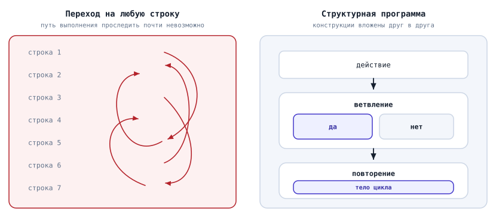
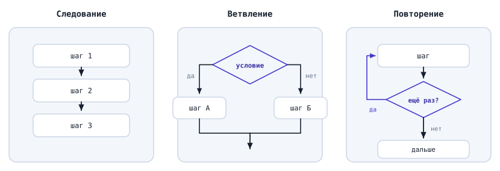
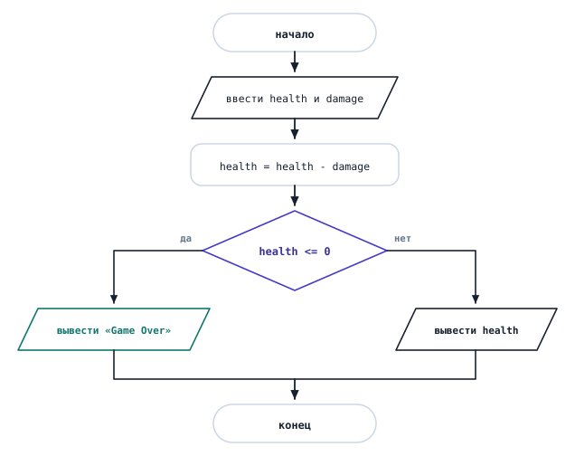
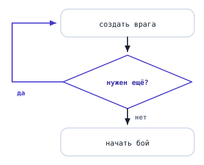
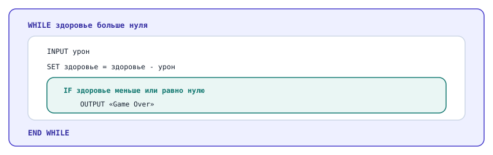
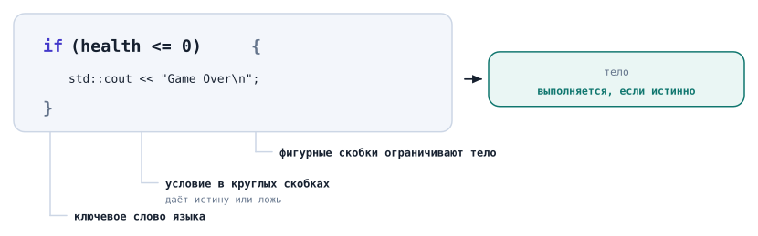
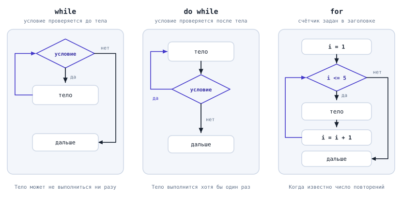

# Структурное программирование. Ветвления и циклы

## Содержание

- [Структурное программирование. Ветвления и циклы](#структурное-программирование-ветвления-и-циклы)
  - [Содержание](#содержание)
  - [Вопросы для самопроверки](#вопросы-для-самопроверки)
  - [О чём мы говорили в прошлой главе?](#о-чём-мы-говорили-в-прошлой-главе)
  - [Парадигмы программирования](#парадигмы-программирования)
    - [Парадигма и язык это разные вещи](#парадигма-и-язык-это-разные-вещи)
  - [Почему программы превращаются в кашу](#почему-программы-превращаются-в-кашу)
    - [Как писали программы раньше](#как-писали-программы-раньше)
    - [Спагетти-код](#спагетти-код)
    - [Откуда взялось структурное программирование](#откуда-взялось-структурное-программирование)
  - [Что такое структурное программирование](#что-такое-структурное-программирование)
    - [Три базовые конструкции](#три-базовые-конструкции)
    - [Один вход и один выход](#один-вход-и-один-выход)
  - [Следование](#следование)
  - [Ветвление](#ветвление)
    - [Что такое условие](#что-такое-условие)
    - [Откуда берётся условие](#откуда-берётся-условие)
    - [Полное и неполное ветвление](#полное-и-неполное-ветвление)
    - [Выбор из нескольких вариантов](#выбор-из-нескольких-вариантов)
  - [Повторение](#повторение)
    - [Зачем нужен цикл](#зачем-нужен-цикл)
    - [Условие выхода](#условие-выхода)
    - [Бесконечный цикл](#бесконечный-цикл)
    - [Цикл со счётчиком](#цикл-со-счётчиком)
  - [Как конструкции соединяются между собой](#как-конструкции-соединяются-между-собой)
    - [Блок](#блок)
    - [Вложенность](#вложенность)
  - [Как разобрать задачу на конструкции](#как-разобрать-задачу-на-конструкции)
  - [Структурное программирование в C++](#структурное-программирование-в-c)
    - [Блок в фигурных скобках](#блок-в-фигурных-скобках)
    - [Условие в C++](#условие-в-c)
    - [Ветвление: `if` и `else`](#ветвление-if-и-else)
    - [Несколько ветвлений: `else if`](#несколько-ветвлений-else-if)
    - [Составные условия](#составные-условия)
    - [Повторение: три вида циклов](#повторение-три-вида-циклов)
    - [Цикл while](#цикл-while)
    - [Цикл do while](#цикл-do-while)
    - [Цикл for](#цикл-for)
    - [Какой цикл выбрать](#какой-цикл-выбрать)
    - [Оформление кода](#оформление-кода)
  - [Пример 1. Чиним программу про урон](#пример-1-чиним-программу-про-урон)
  - [Пример 2. Бой до победы](#пример-2-бой-до-победы)
  - [Типичные ошибки](#типичные-ошибки)
  - [Резюме](#резюме)

## Вопросы для самопроверки

1. Назовите три базовые конструкции структурного программирования и объясните, для чего нужна каждая.
2. Что означает правило "один вход и один выход" и почему оно делает программу понятнее?
3. Сколько веток выполнится при одном проходе через ветвление? Может ли не выполниться ни одна?
4. Что выведет программа и почему?

   ```cpp
   int health = 0;

   if (health > 0) {
       std::cout << "Alive\n";
   } else {
       std::cout << "Dead\n";
   }
   ```

5. Чем отличается `=` от `==`? Что произойдёт, если перепутать их в условии?
6. Сколько раз выполнится тело цикла в каждом случае?

   ```cpp
   int i = 1;
   while (i <= 3) {
       std::cout << i << '\n';
       i = i + 1;
   }
   ```

   ```cpp
   int i = 10;
   do {
       std::cout << i << '\n';
       i = i + 1;
   } while (i <= 3);
   ```

7. Почему у цикла обязательно должно быть условие выхода? Приведите пример цикла, который никогда не закончится.
8. Перепишите этот псевдокод на C++:

   ```text
   INPUT coins

   IF coins >= 50
       OUTPUT "Можно купить меч"
   ELSE
       OUTPUT "Не хватает монет"
   END IF
   ```

9. Найдите ошибку и объясните, к чему она приведёт:

   ```cpp
   int enemies = 5;

   while (enemies > 0) {
       std::cout << "Enemy spawned\n";
   }
   ```

10. Какой цикл вы выберете для задачи "создать ровно 10 врагов" и какой для задачи "бить врага, пока он жив"? Обоснуйте выбор.

## О чём мы говорили в прошлой главе?

В прошлой главе мы разобрали выражения и операции: как записываются вычисления, в каком порядке они выполняются, как сравнить два значения и как соединить несколько условий в одно. Теперь программа умеет задать вопрос о данных и получить ответ "истина" или "ложь".

Осталось научить её на этот ответ реагировать. Вспомните программу из главы про данные: она вычитала урон из здоровья и честно вывела `-20`, когда урон оказался больше здоровья. С точки зрения языка ошибки нет, а с точки зрения игры получилась бессмыслица: отрицательного здоровья не бывает.

Чтобы это исправить, программе нужно уметь принимать решение: если здоровье стало меньше нуля, поступить по-другому. А ещё ей часто нужно уметь повторять одно и то же действие много раз, не переписывая его вручную.

Сегодня мы разберём, как устроены программы, которые умеют и то, и другое. Сначала поговорим о самой идее, а потом запишем её на C++.

## Парадигмы программирования

Прежде чем говорить о сегодняшней теме, стоит разобраться с одним словом, которое вы будете встречать постоянно: в описании языков, в учебниках, в требованиях к вакансиям.

Представьте, что двум людям дали один и тот же набор деталей и попросили собрать шкаф. Детали одинаковые, инструкция одна, но:

- один соберёт его последовательно, шаг за шагом по списку,
- а другой сначала соберёт отдельно дверцы, отдельно полки, отдельно каркас, а потом соединит готовые части.

Результат в обоих случаях шкаф, а подход к работе разный.

С программами то же самое. Одну и ту же задачу можно решить не только разными алгоритмами, но и разными способами организовать саму программу.

**Парадигма программирования (programming paradigm)** - это общий подход к тому, как устроена программа: из каких частей она собирается и как эти части связаны между собой.

Обратите внимание на слово _подход_. Парадигма это не язык программирования и не набор команд, которые нужно выучить. Это способ думать о программе и разбивать её на части.

### Парадигма и язык это разные вещи

Легко решить, что каждому языку соответствует своя парадигма. Это не так.

Язык может поддерживать сразу несколько подходов, и тогда программист выбирает тот, который лучше подходит к задаче. C++ как раз такой: на нём можно писать и в одном стиле, и в другом, и смешивать их в одной программе.

Поэтому вопрос "какая парадигма у C++" поставлен неправильно. Правильный вопрос звучит так: _в какой парадигме написана вот эта конкретная программа_.

## Почему программы превращаются в кашу

### Как писали программы раньше

Первые языки программирования разрешали одну вещь, которая сегодня кажется странной: из любой строки программы можно было перейти на любую другую строку.

Программист писал что-то вроде "дальше выполняй строку 47", и выполнение прыгало туда. Такая команда существует и сейчас, она называется `goto`, но в современном программировании её почти не используют, и мы её изучать не будем.

На первый взгляд это удобно. Хочешь пропустить кусок программы, прыгаешь дальше. Хочешь повторить, прыгаешь назад. Никаких специальных конструкций учить не нужно.

Проблемы начались, когда программы выросли.

### Спагетти-код

Представьте программу на пятьсот строк, в которой сто таких прыжков. Чтобы понять, что происходит в строке 200, нужно выяснить, откуда в неё вообще можно попасть. А попасть в неё можно, например, из строк 30, 118 и 342, причём в каждом случае с разными значениями переменных.

**Спагетти-код (spaghetti code)** - это программа, в которой ход выполнения настолько запутан, что проследить его практически невозможно.

Название говорит само за себя: линии переходов в такой программе переплетены, как макароны в тарелке.



_Рисунок 5.1. Программа без правил и структурная программа_

Чем это плохо на практике:

- Программу почти невозможно прочитать, в том числе автору через месяц.
- Ошибку тяжело найти, потому что непонятно, каким путём программа дошла до неправильного значения.
- Изменить что-то страшно: правка в одном месте ломает другое, и предсказать это заранее нельзя.
- Такую программу невозможно объяснить другому человеку, а значит, над ней тяжело работать командой.

> [!NOTE]
>
> Это не выдуманная проблема из учебника. В 1960-е годы её обсуждали всерьёз: программы становились всё больше, а способов удержать их в порядке не было. Кризис так и называли, кризис программного обеспечения.

### Откуда взялось структурное программирование

В 1968 году голландский учёный Эдсгер Дейкстра опубликовал короткую заметку с говорящим названием: "_Оператор goto считается вредным_"[^1]. Основная мысль была такой: чем больше в программе произвольных переходов, тем труднее человеку понять, что она делает.

Ещё раньше, в 1966 году, итальянские математики Коррадо Бём и Джузеппе Якопини доказали, что любую программу можно записать, используя всего три способа соединения действий, и произвольные переходы для этого не нужны[^2].

Из этих двух идей и выросло _структурное программирование_.

## Что такое структурное программирование

**Структурное программирование (structured programming)** - это способ писать программы, при котором любой алгоритм собирается всего из трёх конструкций, вложенных друг в друга.

Смысл в том, чтобы отказаться от свободы прыгать куда угодно ради возможности понимать собственную программу.

### Три базовые конструкции

Этих конструкций три, и вы уже встречали их все.

**Следование (sequence)** - действия выполняются одно за другим, в том порядке, в котором записаны.

**Ветвление (selection)** - в зависимости от условия выполняется одна группа действий или другая.

**Повторение (iteration)** - группа действий выполняется несколько раз.



_Рисунок 5.2. Три базовые конструкции_

Список короткий, и это не случайность. Именно это и доказали Бём и Якопини: больше ничего не нужно. Любой алгоритм, от расчёта урона до работы поисковой системы, складывается из этих трёх конструкций и их вложений друг в друга.

> [!IMPORTANT]
>
> Запомните этот список. Когда вы смотрите на незнакомую задачу и не понимаете, с чего начать, вам нужно ответить всего на три вопроса: _что здесь выполняется подряд_, _где нужно принять решение_ и _что повторяется_. Ответы и будут скелетом будущей программы.

### Один вход и один выход

У всех трёх конструкций есть общее свойство, ради которого всё и затевалось.

_В конструкцию можно войти только в одном месте и выйти только в одном месте._

Посмотрите на ветвление. Мы входим в него сверху, выполняем одну из веток, и после ветвления оказываемся в одной и той же точке, какая бы ветка ни сработала. Прыгнуть в середину ветки снаружи нельзя, выскочить из середины куда-то вбок тоже нельзя.

Благодаря этому программу можно читать сверху вниз, не держа в голове десяток возможных путей. Каждая конструкция ведёт себя как одно большое действие:

- _что-то_ приняла на входе,
- _что-то_ сделала внутри,
- отдала управление дальше.

## Следование

Самая простая конструкция. Действия записаны друг за другом и выполняются в том же порядке.

```text
INPUT health
INPUT damage

SET health = health - damage

OUTPUT health
```

Ничего нового здесь нет: все программы, которые мы писали до сих пор, были именно такими.

Стоит только помнить, что _порядок действий является частью алгоритма_, а не оформлением. Сравните два фрагмента:

```text
SET health = 100
SET health = health - 30

OUTPUT health
```

```text
SET health = 100

OUTPUT health

SET health = health - 30
```

Строки одинаковые, а результат разный: первый фрагмент выведет `70`, второй `100`. Во втором случае вывод произошёл раньше, чем изменилось значение.

_Пример_. В игре это выглядит так. Если сначала проверить, жив ли враг, а потом нанести урон, то можно ударить уже мёртвого противника: проверка прошла до того, как здоровье изменилось. Если поменять порядок, всё заработает правильно. В дизайн-документе обе формулировки выглядят одинаково, а поведение игры получается разное.

## Ветвление

### Что такое условие

Ветвление нужно там, где программа должна выбрать один из вариантов.

_Пример_. Персонаж получил удар. Если здоровье упало до нуля или ниже, нужно показать "Game Over". Если нет, нужно показать оставшееся здоровье.

Чтобы сделать выбор, программе нужно на что-то опереться. Этим "чем-то" и является условие.

**Условие (condition)** - это вопрос о данных, на который можно ответить только "_истина_" или "_ложь_".

Такой ответ нам уже знаком: это логическое значение, то есть значение типа `bool`, у которого ровно два варианта, `true` и `false`. Условие как раз и даёт значение этого типа.

_Пример_. Если в переменной `health` лежит `70`, то:

- условие "здоровье меньше или равно нулю" даёт `false`;
- условие "здоровье больше нуля" даёт `true`.

### Откуда берётся условие

Чаще всего условие получается сравнением двух значений. Операторы сравнения `>`, `<`, `>=`, `<=`, `==` и `!=` мы разобрали в прошлой главе, и здесь они работают ровно так же.

Условия можно соединять логическими операциями `&&`, `||` и `!`, которые мы тоже разобрали в прошлой главе. Составное условие вида `hasKey && stamina >= 10` подходит для ветвления точно так же, как простое.

### Полное и неполное ветвление

Ветвление бывает двух видов.

**Неполное ветвление** выполняет группу действий, если условие истинно, и не делает ничего, если оно ложно.

```text
INPUT health

IF health <= 0
    OUTPUT "Game Over"
END IF
```

**Полное ветвление** выполняет одну группу действий, если условие истинно, и другую, если оно ложно.

```text
INPUT health

IF health <= 0
    OUTPUT "Game Over"
ELSE
    OUTPUT health
END IF
```



_Рисунок 5.3. Ветвление на блок-схеме_

На блок-схеме ветвление изображают ромбом. У ромба ровно два выхода, подписанных "да" и "нет".

Запомните два правила, которые видно на схеме.

- _Выполняется ровно одна ветка._ Не бывает так, чтобы сработали обе. При неполном ветвлении, если условие ложно, не выполняется ни одна ветка, и программа просто идёт дальше.
- _После ветвления пути снова сходятся._ Дальше программа продолжается общим путём, независимо от того, какая ветка выполнялась. Это и есть тот самый один выход, о котором мы говорили выше.

### Выбор из нескольких вариантов

Иногда вариантов больше двух.

_Пример_. Нужно показать состояние персонажа: "Здоров", если здоровье выше 70, "Ранен", если от 1 до 70, и "Мёртв", если 0 или меньше.

Такой выбор собирают из нескольких ветвлений, поставленных друг за другом:

```text
INPUT health

IF health <= 0
    OUTPUT "Мёртв"
ELSE IF health <= 70
    OUTPUT "Ранен"
ELSE
    OUTPUT "Здоров"
END IF
```

Читается это сверху вниз: программа проверяет условия по очереди и останавливается на первом, которое оказалось истинным. Остальные условия после этого уже не проверяются.

Поэтому порядок условий важен. Если поменять первые две строки местами, персонаж с нулевым здоровьем попадёт в ветку "Ранен", потому что условие `health <= 70` для нуля тоже истинно.

## Повторение

### Зачем нужен цикл

Допустим, в начале уровня нужно создать пять врагов. Пока мы умеем только следование, придётся написать так:

```text
OUTPUT "Враг создан"
OUTPUT "Враг создан"
OUTPUT "Враг создан"
OUTPUT "Враг создан"
OUTPUT "Враг создан"
```

Работает, но никуда не годится. Если врагов станет двадцать, придётся дописать пятнадцать строк. Если строка создания врага изменится, править придётся все пять копий, и легко забыть одну. А если количество врагов вообще заранее неизвестно и зависит от уровня сложности, такой способ просто не сработает.

**Повторение, или цикл (loop)** - это конструкция, которая выполняет одну и ту же группу действий несколько раз.

```text
SET count = 0

WHILE count < 5
    OUTPUT "Враг создан"
    SET count = count + 1
END WHILE
```

Действие записано один раз, а выполнится пять раз.

Группа действий внутри цикла называется **телом цикла**. Один проход по телу называют **итерацией**.



_Рисунок 5.4. Повторение на блок-схеме_

На блок-схеме цикл узнаётся по стрелке, которая ведёт назад, к уже выполненному блоку.

### Условие выхода

У цикла обязательно есть условие, которое решает, выполнять тело ещё раз или заканчивать. Это тоже некоторое логическое выражение, которое оценивается как истинное или ложное.

В примере выше это `count < 5`. Программа проверяет его перед каждой итерацией:

| Итерация | `count` до | Условие `count < 5` | Что происходит     | `count` после |
| -------- | ---------: | ------------------- | ------------------ | ------------: |
| 1        |          0 | истинно             | враг создан        |             1 |
| 2        |          1 | истинно             | враг создан        |             2 |
| 3        |          2 | истинно             | враг создан        |             3 |
| 4        |          3 | истинно             | враг создан        |             4 |
| 5        |          4 | истинно             | враг создан        |             5 |
| 6        |          5 | ложно               | цикл заканчивается |             5 |

Обратите внимание на последнюю строку. Условие проверяется и в шестой раз, но тело уже не выполняется, и программа идёт дальше.

### Бесконечный цикл

Теперь уберём из тела цикла одну строку:

```text
SET count = 0

WHILE count < 5
    OUTPUT "Враг создан"
END WHILE
```

Переменная `count` больше не увеличивается, значит, условие `count < 5` останется истинным навсегда. Программа будет создавать врагов, пока её не остановят принудительно.

**Бесконечный цикл (infinite loop)** - это цикл, условие выхода которого никогда не становится ложным.

> [!WARNING]
>
> Внутри цикла обязательно должно происходить что-то, что рано или поздно сделает условие ложным. Чаще всего это изменение переменной, которая участвует в условии. Если такого изменения нет, программа зависнет.

Бесконечный цикл не всегда ошибка. В играх главный цикл специально работает, пока игрок не закроет игру. Но это осознанное решение, а не забытая строка.

### Цикл со счётчиком

В примере с врагами мы завели переменную `count` и использовали её только для того, чтобы считать проходы. Такая переменная называется **счётчиком**.

Цикл со счётчиком устроен всегда одинаково и состоит из трёх частей:

1. _Начальное значение_: `SET count = 0`.
2. _Условие продолжения_: `count < 5`.
3. _Изменение счётчика_: `SET count = count + 1`.

Эта схема встречается так часто, что почти во всех языках для неё сделали отдельную запись. В C++ мы увидим её под именем `for`.

## Как конструкции соединяются между собой

### Блок

До сих пор мы говорили "группа действий". У этого понятия есть название.

**Блок** - это группа инструкций, которая рассматривается как одно целое.

Телом ветвления и телом цикла всегда является блок. Блок может состоять из одной инструкции, из десяти или вообще из другой конструкции.

Именно поэтому три конструкции дают так много возможностей: там, где стоит одно действие, можно поставить целый блок.

### Вложенность

**Вложенность** - это размещение одной конструкции внутри другой.

_Пример_. Персонаж получает удары, пока жив. После каждого удара нужно проверить, не погиб ли он.

```text
INPUT health

WHILE health > 0
    INPUT damage
    SET health = health - damage

    IF health <= 0
        OUTPUT "Game Over"
    END IF
END WHILE
```

Здесь ветвление находится внутри повторения.



_Рисунок 5.5. Ветвление внутри повторения_

Обратите внимание на важное правило: _внутренняя конструкция целиком помещается во внешнюю_. Она не может начаться внутри цикла, а закончиться где-то за его пределами. Блоки либо вложены друг в друга, либо идут друг за другом, но никогда не пересекаются наполовину.

Показывают вложенность отступами. Каждый новый уровень сдвигается вправо, обычно на четыре пробела. Отступы не меняют работу алгоритма, но без них понять структуру почти невозможно.

Сравните:

```text
WHILE health > 0
INPUT damage
SET health = health - damage
IF health <= 0
OUTPUT "Game Over"
END IF
END WHILE
```

Это тот же самый алгоритм, но прочитать его тяжело. Поэтому отступы ставят всегда, даже в черновике.

## Как разобрать задачу на конструкции

Теперь у нас есть готовый инструмент для разбора любой задачи. Прочитав условие, задайте себе три вопроса.

1. _Что выполняется подряд?_ Это следование.
2. _Где нужно принять решение?_ Это ветвление, и там появится условие.
3. _Что повторяется?_ Это цикл, и у него нужно найти условие выхода.

Разберём игровую механику.

> Игрок заходит в комнату с сундуком. Если у него есть ключ, сундук открывается и игрок получает монеты. Если ключа нет, показывается сообщение. После этого игрок идёт дальше по коридору, и так повторяется, пока комнаты не закончатся.

Ответы на вопросы:

1. Подряд идут: войти в комнату, что-то сделать с сундуком, пойти дальше.
2. Решение принимается в одном месте: есть ключ или нет.
3. Повторяется весь набор действий, для каждой комнаты. Условие выхода: комнаты закончились.

Отсюда сразу получается скелет алгоритма:

```text
WHILE есть ещё комнаты
    войти в комнату

    IF у игрока есть ключ
        открыть сундук
        добавить монеты
    ELSE
        OUTPUT "Сундук заперт"
    END IF

    перейти в следующую комнату
END WHILE
```

Пока это не программа: здесь остались фразы на русском языке, которые ещё предстоит расписать. Но структура решения уже видна, и дальше её можно уточнять по частям.

> [!TIP]
>
> Начинайте именно со скелета, а не с первой строки кода. Когда структура ясна, каждая оставшаяся строка превращается в маленькую отдельную задачу.

## Структурное программирование в C++

Всё, о чём мы говорили, существует в любом языке программирования. Теперь посмотрим, как эти конструкции записываются в C++.

### Блок в фигурных скобках

Блок в C++ ограничивается фигурными скобками `{` и `}`.

```cpp
{
    std::cout << "Первая строка\n";
    std::cout << "Вторая строка\n";
}
```

С одним блоком мы уже работали, даже не называя его так. Тело функции `main`, с которого начинаются все наши программы, это тоже блок:

```cpp
int main() {
    // здесь блок
    return 0;
}
```

### Условие в C++

Условие в C++ записывается теми же операциями, которые мы разобрали в прошлой главе: сравнениями `>`, `<`, `>=`, `<=`, `==`, `!=` и логическими `&&`, `||`, `!`. Результат имеет тип `bool`, и именно его проверяет ветвление.

Ничего нового в самих условиях нет. Новое только то, куда они попадают, и с этого начнём.

> [!WARNING]
>
> Самая частая ошибка новичка в C++ выглядит так:
>
> ```cpp
> if (health = 0) {    // ошибка: одно равно вместо двух
> ```
>
> Здесь вместо проверки происходит присваивание: в переменную `health` записывается ноль. Программа при этом скомпилируется, но будет работать неправильно, а `health` окажется испорчено. Проверяйте себя: _сравнение это всегда два знака равно_.

### Ветвление: `if` и `else`

Неполное ветвление записывается ключевым словом `if`:

_Синтаксис_:

```cpp
if (условие) {
    // тело ветвления
}
```

_Пример_:

```cpp
if (health <= 0) {
    std::cout << "Game Over\n";
}
```



_Рисунок 5.6. Части записи `if`_

Разберём запись по частям:

- `if` это ключевое слово языка, с него начинается ветвление;
- условие пишется в **круглых** скобках сразу после `if`, и эти скобки обязательны;
- тело пишется в **фигурных** скобках и выполняется, только если условие истинно;
- после закрывающей фигурной скобки точка с запятой не ставится.

Полное ветвление добавляет слово `else`:

_Синтаксис_:

```cpp
if (условие) {
    // тело ветвления
} else {
    // тело ветвления, если условие ложно
}
```

_Пример_:

```cpp
if (health <= 0) {
    std::cout << "Game Over\n";
} else {
    std::cout << "Health left: " << health << '\n';
}
```

Слово `else` переводится как "иначе". Его блок выполняется, когда условие оказалось ложным.

Сравните с псевдокодом, логика не изменилась совсем:

```text
IF health <= 0
    OUTPUT "Game Over"
ELSE
    OUTPUT health
END IF
```

Ещё одна частая ошибка это лишняя точка с запятой:

```cpp
if (health <= 0);    // точка с запятой здесь лишняя
{
    std::cout << "Game Over\n";
}
```

Компилятор поймёт это так: тело `if` пустое, а блок со `std::cout` просто идёт следом и выполняется всегда. Программа соберётся без ошибок и будет печатать "_Game Over_" при любом здоровье.

### Несколько ветвлений: `else if`

Выбор из нескольких вариантов записывается цепочкой:

_Синтаксис_:

```cpp
if (условие1) {
    // тело ветвления
} else if (условие2) {
    // тело ветвления
} else {
    // тело ветвления, если все условия ложны
}
```

Пример использования:

```cpp
int health = 0;
std::cin >> health;

if (health <= 0) {
    std::cout << "Dead\n";
} else if (health <= 70) {
    std::cout << "Wounded\n";
} else {
    std::cout << "Healthy\n";
}
```

Программа проверяет условия сверху вниз и выполняет тело первого истинного. Остальные после этого пропускаются, даже если они тоже истинны.

Последний `else` без условия не обязателен. Он срабатывает, когда ни одно из условий не подошло.

### Составные условия

Логические операции `&&`, `||` и `!` из прошлой главы работают внутри `if` как обычно. Условие может быть составным, и скобки вокруг него при этом не меняются: они по-прежнему одни, внешние.

_Пример_. Сундук открывается, только если у игрока есть ключ и при этом хватает сил:

```cpp
if (hasKey && stamina >= 10) {
    std::cout << "Chest opened\n";
}
```

_Пример_. Игра заканчивается, если здоровье кончилось или кончилось время:

```cpp
if (health <= 0 || time <= 0) {
    std::cout << "Game Over\n";
}
```

Если в одном условии смешиваются `&&` и `||`, ставьте скобки: так читателю сразу видно, что с чем соединяется.

### Повторение: три вида циклов

В C++ есть три записи для повторения. Делают они одно и то же, но подходят для разных ситуаций.



_Рисунок 5.7. Три вида циклов в C++_

### Цикл while

`while` переводится как "пока". Условие проверяется _перед_ каждым проходом.

_Синтаксис_:

```cpp
while (условие) {
    // тело цикла
}
```

_Пример_:

```cpp
int count = 0;

while (count < 5) {
    std::cout << "Enemy spawned\n";
    count = count + 1;
}
```

Запись устроена так же, как у `if`: ключевое слово, условие в круглых скобках, тело в фигурных.

Проследим выполнение по шагам:

| Шаг | `count` | Условие `count < 5` | Что выполняется             |
| --: | ------: | ------------------- | --------------------------- |
|   1 |       0 | истинно             | вывод, `count` становится 1 |
|   2 |       1 | истинно             | вывод, `count` становится 2 |
|   3 |       2 | истинно             | вывод, `count` становится 3 |
|   4 |       3 | истинно             | вывод, `count` становится 4 |
|   5 |       4 | истинно             | вывод, `count` становится 5 |
|   6 |       5 | ложно               | цикл заканчивается          |

Программа выведет сообщение пять раз.

Важная особенность `while`: если условие ложно с самого начала, _тело не выполнится ни разу_.

```cpp
int count = 10;

while (count < 5) {
    std::cout << "Этого вы не увидите\n";
}
```

### Цикл do while

Иногда тело нужно выполнить хотя бы один раз, а решение о повторении принять уже после. Для этого есть `do while`, в котором условие проверяется _после_ прохода.

_Синтаксис_:

```cpp
do {
    // тело цикла
} while (условие);
```

_Пример_:

```cpp
int damage = 0;

do {
    std::cout << "Damage: ";
    std::cin >> damage;
} while (damage <= 0);
```

В этом примере пользователь вводит урон. Если введено значение меньше или равно нулю, программа снова спрашивает урон. Тело цикла выполнится хотя бы один раз, даже если изначально `damage` равен нулю.

Обратите внимание на две детали записи:

- тело идёт сразу после слова `do`;
- после закрывающей фигурной скобки пишется `while (условие);`, и здесь точка с запятой обязательна.

Сравним поведение на одинаковых данных:

```cpp
int i = 10;

while (i <= 3) {
    std::cout << i << '\n';
    i = i + 1;
}
```

Не выведет ничего: условие ложно сразу.

```cpp
int i = 10;

do {
    std::cout << i << '\n';
    i = i + 1;
} while (i <= 3);
```

Выведет `10`: тело выполнилось один раз, и только потом программа проверила условие и вышла.

### Цикл for

Самый часто используемый цикл в C++ — это `for`.

Цикл `for` предназначен для случая, когда известно, сколько раз нужно повторить. Он собирает все три части счётчика в одну строку.

_Синтаксис_:

```cpp
for (инициализация; условие; шаг) {
    // тело цикла
}
```

- `инициализация` выполняется один раз перед началом цикла;
- `условие` проверяется перед каждой итерацией; если оно ложно, цикл завершается;
- `шаг` выполняется после каждой итерации тела цикла.

_Пример_:

```cpp
for (int enemy = 1; enemy <= 5; enemy = enemy + 1) {
    std::cout << "Enemy " << enemy << " spawned\n";
}
```

В круглых скобках через точку с запятой записаны три части:

1. `int enemy = 1` - создание счётчика и его начальное значение. Выполняется один раз, перед первым проходом.
2. `enemy <= 5` - условие продолжения. Проверяется перед каждым проходом.
3. `enemy = enemy + 1` - изменение счётчика. Выполняется после каждого прохода.

Программа выведет:

```text
Enemy 1 spawned
Enemy 2 spawned
Enemy 3 spawned
Enemy 4 spawned
Enemy 5 spawned
```

Тот же самый цикл можно записать через `while`:

```cpp
int enemy = 1;

while (enemy <= 5) {
    std::cout << "Enemy " << enemy << " spawned\n";
    enemy = enemy + 1;
}
```

Работают оба варианта одинаково. Разница в том, что в `for` все три части счётчика стоят рядом, и забыть про изменение счётчика намного труднее.

> [!NOTE]
>
> Счётчик, объявленный внутри `for`, существует только внутри этого цикла[^3]. После закрывающей скобки обратиться к переменной `enemy` уже нельзя. Почему это так устроено, разберём, когда дойдём до области видимости.

### Какой цикл выбрать

На первый взгляд может показаться, что выбор цикла критичен для правильности программы, но это не так. Любую задачу можно решить любым из трёх циклов. Разница лишь в удобстве чтения и поддержке кода.

В современном программировании чаще всего выбирают цикл `for`. Например, в языке Go других циклов просто нет: `for` используется и как классический цикл с счётчиком, и как цикл `while`. Поэтому программисты привыкают к `for` и в других языках, даже когда можно было бы использовать `while` или `do while`.

На практике чаще всего вы будете использовать цикл `for`, даже в тех случаях, когда можно было бы применить `while` или `do while`.

### Оформление кода

Правила языка и правила оформления это разные вещи. Компилятору всё равно, как расставлены переносы строк и пробелы, но читать код будут люди[^4].

В курсе договоримся так:

- тело блока сдвигается вправо на четыре пробела;
- открывающая фигурная скобка остаётся в конце строки с `if`, `while` или `for`;
- закрывающая скобка стоит на отдельной строке, на том же уровне, что и начало конструкции;
- фигурные скобки ставятся всегда, даже если тело состоит из одной инструкции.

Последний пункт стоит пояснить. C++ разрешает опустить скобки, если в теле ровно одна инструкция:

```cpp
if (health <= 0)
    std::cout << "Game Over\n";
```

Такая запись работает, но опасна. Когда позже понадобится добавить в тело вторую строку, легко забыть про скобки:

```cpp
if (health <= 0)
    std::cout << "Game Over\n";
    std::cout << "Score: " << score << '\n';    // выполняется всегда
```

Отступ подсказывает, что обе строки относятся к `if`, а на самом деле вторая выполняется при любом здоровье. Чтобы такого не случалось, мы всегда ставим скобки.

## Пример 1. Чиним программу про урон

Вернёмся к задаче из главы про данные, на которой мы остановились.

> Персонаж получает удар. Известно текущее здоровье и сила удара. Нужно уменьшить здоровье, но не ниже нуля, и сообщить, выжил ли персонаж.

Разберём задачу по трём вопросам.

1. _Что подряд?_ Ввести здоровье, ввести урон, вычесть.
2. _Где решение?_ После вычитания: здоровье могло уйти в минус.
3. _Что повторяется?_ Ничего, удар всего один.

Алгоритм:

```text
INPUT health
INPUT damage

SET health = health - damage

IF health <= 0
    SET health = 0
    OUTPUT "Game Over"
ELSE
    OUTPUT health
END IF
```

Программа:

```cpp
#include <iostream>

int main() {
    int health = 0;
    int damage = 0;

    std::cout << "Health: ";
    std::cin >> health;

    std::cout << "Damage: ";
    std::cin >> damage;

    health = health - damage;

    if (health <= 0) {
        health = 0;
        std::cout << "Game Over\n";
    } else {
        std::cout << "Health left: " << health << '\n';
    }

    return 0;
}
```

Проверим программу на трёх наборах данных.

| Случай    | `health` | `damage` | Что выведет       |
| --------- | -------: | -------: | ----------------- |
| Обычный   |      100 |       30 | `Health left: 70` |
| Граничный |      100 |      100 | `Game Over`       |
| Особый    |      100 |      120 | `Game Over`       |

Отрицательное здоровье больше не появляется: в ветке `if` мы записали в `health` ноль.

Отдельно стоит посмотреть на граничный случай. Урон ровно 100, здоровье становится ровно 0, и условие `health <= 0` истинно, поэтому программа выводит "Game Over". Это правильно: нулевое здоровье означает смерть.

А вот если бы мы написали условие как `health < 0`, персонаж с нулевым здоровьем считался бы живым. Разница в один символ, поведение игры разное.

> [!TIP]
>
> Границу условия проверяйте всегда. Для условия `health <= 0` интересны три значения: `1`, `0` и `-1`. Проверив их, вы точно знаете, где проходит граница.

## Пример 2. Бой до победы

Теперь задача, в которой нужны обе конструкции сразу.

> У врага есть здоровье. Игрок бьёт его, пока враг жив. Каждый удар наносит одинаковый урон. Нужно вывести номер удара и оставшееся здоровье врага после каждого удара, а в конце сообщить, сколько ударов понадобилось.

Разберём по вопросам.

1. _Что подряд?_ Ввести здоровье врага и силу удара.
2. _Где решение?_ Нужно решать, продолжать бить или нет.
3. _Что повторяется?_ Сам удар и вывод результата.

Условие выхода: здоровье врага стало меньше или равно нулю. Заранее неизвестно, сколько ударов потребуется, значит, берём `while`.

Алгоритм:

```text
INPUT enemyHealth
INPUT damage

SET hits = 0

WHILE enemyHealth > 0
    SET enemyHealth = enemyHealth - damage
    SET hits = hits + 1

    OUTPUT hits, enemyHealth
END WHILE

OUTPUT hits
```

Программа:

```cpp
#include <iostream>

int main() {
    int enemyHealth = 0;
    int damage = 0;
    int hits = 0;

    std::cout << "Enemy health: ";
    std::cin >> enemyHealth;

    std::cout << "Damage: ";
    std::cin >> damage;

    while (enemyHealth > 0) {
        enemyHealth = enemyHealth - damage;
        hits = hits + 1;

        std::cout << "Hit " << hits << ", enemy health: " << enemyHealth << '\n';
    }

    std::cout << "Enemy defeated in " << hits << " hits\n";

    return 0;
}
```

Проследим выполнение для `enemyHealth = 100` и `damage = 30`:

| Проверка условия | `enemyHealth` до | Условие `> 0` | `enemyHealth` после | `hits` |
| ---------------- | ---------------: | ------------- | ------------------: | -----: |
| 1                |              100 | истинно       |                  70 |      1 |
| 2                |               70 | истинно       |                  40 |      2 |
| 3                |               40 | истинно       |                  10 |      3 |
| 4                |               10 | истинно       |                 -20 |      4 |
| 5                |              -20 | ложно         |                 -20 |      4 |

Программа выведет:

```text
Hit 1, enemy health: 70
Hit 2, enemy health: 40
Hit 3, enemy health: 10
Hit 4, enemy health: -20
Enemy defeated in 4 hits
```

Заметьте, что в выводе снова появилось отрицательное здоровье. Для подсчёта ударов это неважно, но игроку такое показывать не стоит. Добавим ветвление внутрь цикла:

```cpp
while (enemyHealth > 0) {
    enemyHealth = enemyHealth - damage;
    hits = hits + 1;

    if (enemyHealth < 0) {
        enemyHealth = 0;
    }

    std::cout << "Hit " << hits << ", enemy health: " << enemyHealth << '\n';
}
```

Теперь ветвление вложено в повторение, ровно как на рисунке 5.5. Последняя строка вывода станет `Hit 4, enemy health: 0`.

> [!WARNING]
>
> Проверьте, что будет, если пользователь введёт нулевой урон. Здоровье врага перестанет уменьшаться, условие `enemyHealth > 0` останется истинным навсегда, и программа зависнет в бесконечном цикле. Как не пустить такие данные в программу, разберём, когда научимся проверять ввод.

## Типичные ошибки

Соберём вместе ошибки, которые встречаются чаще всего.

_Одно равно вместо двух._ В условии `if (health = 0)` происходит присваивание, а не сравнение, поэтому ветка срабатывает совсем не тогда, когда нужно.

_Лишняя точка с запятой._ Запись `if (health <= 0);` создаёт пустое тело, а следующий блок выполняется всегда. То же самое верно для `while (i < 5);`, только там получится бесконечный цикл.

_Забытое изменение счётчика._ Если внутри `while` не менять переменную из условия, цикл не закончится никогда.

_Ошибка на единицу._ Цикл `for (int i = 1; i <= 5; i = i + 1)` выполнится пять раз, а `for (int i = 1; i < 5; i = i + 1)` только четыре. Такую ошибку называют off-by-one, и ловится она трассировкой.

_Неправильный знак на границе._ Условия `health <= 0` и `health < 0` ведут себя одинаково почти всегда и по-разному ровно в одной точке, при нуле.

_Отступы без скобок._ Отступ показывает структуру человеку, но не компилятору. Если тело не взято в фигурные скобки, к конструкции относится только первая строка.

## Резюме

1. Произвольные переходы между строками превращают программу в спагетти-код, который невозможно прочитать и отладить.
2. Структурное программирование строит любой алгоритм из трёх конструкций: следование, ветвление и повторение.
3. У каждой конструкции один вход и один выход, поэтому программу можно читать сверху вниз.
4. Условие это вопрос о данных с ответом "истина" или "ложь"; чаще всего его получают сравнением.
5. При ветвлении выполняется ровно одна ветка, а при неполном ветвлении может не выполниться ни одна.
6. Цикл повторяет тело, пока истинно условие выхода; если условие никогда не станет ложным, цикл окажется бесконечным.
7. Блоки вкладываются друг в друга целиком и никогда не пересекаются наполовину; вложенность показывают отступами.
8. Разбор задачи начинают с трёх вопросов: что идёт подряд, где принимается решение, что повторяется.
9. В C++ ветвление записывается через `if` и `else`, а повторение через `while`, `do while` и `for`.
10. `for` берут, когда число повторений известно, `while` когда неизвестно, `do while` когда тело должно выполниться хотя бы раз.

[^1]: Dijkstra E. W. _Go To Statement Considered Harmful_. Communications of the ACM, Vol. 11, No. 3, 1968.

[^2]: Bohm C., Jacopini G. _Flow Diagrams, Turing Machines and Languages with Only Two Formation Rules_. Communications of the ACM, Vol. 9, No. 5, 1966.

[^3]: ISO/IEC 14882:2020. _Programming languages - C++_. International Organization for Standardization, 2020.

[^4]: Stroustrup B. _Programming: Principles and Practice Using C++_. 2nd ed. Addison-Wesley, 2014.

[^5]: Gaddis T. _Starting Out with C++: From Control Structures through Objects_. 9th ed. Pearson, 2017.
