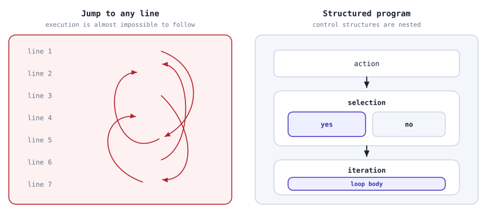
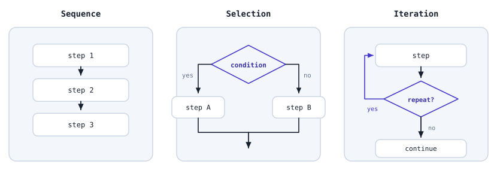
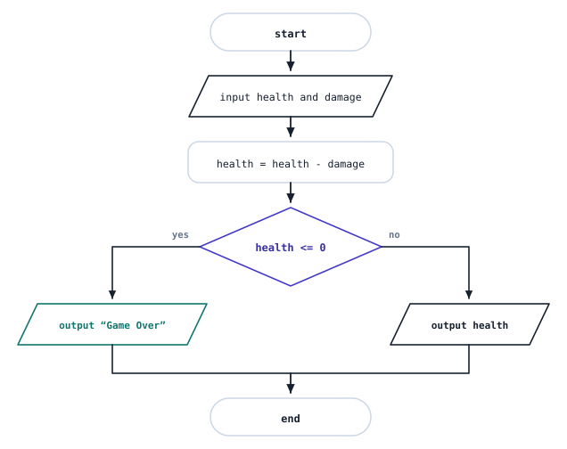
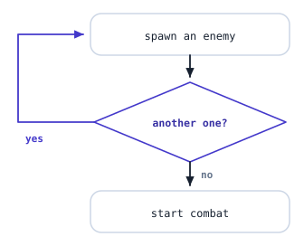
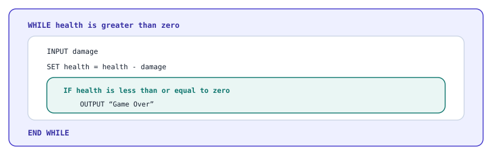
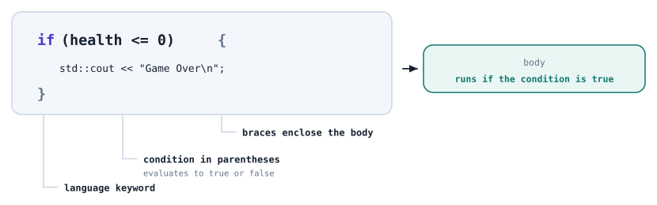
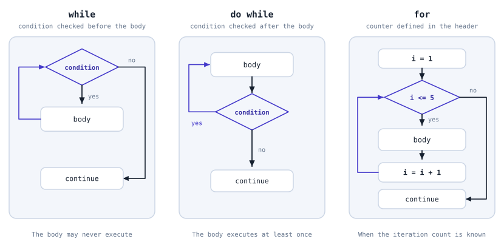

# Structured Programming: Selection and Loops

## Contents

- [Structured Programming: Selection and Loops](#structured-programming-selection-and-loops)
  - [Contents](#contents)
  - [Self-Check Questions](#self-check-questions)
  - [What Did We Cover in the Previous Chapter?](#what-did-we-cover-in-the-previous-chapter)
  - [Programming Paradigms](#programming-paradigms)
    - [A Paradigm and a Language Are Different Things](#a-paradigm-and-a-language-are-different-things)
  - [Why Programs Become a Tangled Mess](#why-programs-become-a-tangled-mess)
    - [How Programs Used to Be Written](#how-programs-used-to-be-written)
    - [Spaghetti Code](#spaghetti-code)
    - [The Origins of Structured Programming](#the-origins-of-structured-programming)
  - [What Is Structured Programming?](#what-is-structured-programming)
    - [Defining Structured Programming and Control Structures](#defining-structured-programming-and-control-structures)
    - [The Three Basic Control Structures](#the-three-basic-control-structures)
    - [Single Entry, Single Exit](#single-entry-single-exit)
  - [Sequence](#sequence)
  - [Selection](#selection)
    - [What Is a Condition?](#what-is-a-condition)
    - [Where Conditions Come From](#where-conditions-come-from)
    - [One-Way and Two-Way Selection](#one-way-and-two-way-selection)
    - [Choosing Between Several Alternatives](#choosing-between-several-alternatives)
  - [Iteration](#iteration)
    - [Why We Need Loops](#why-we-need-loops)
    - [The Termination Condition](#the-termination-condition)
    - [Infinite Loops](#infinite-loops)
    - [Counter-Controlled Loops](#counter-controlled-loops)
  - [How Control Structures Fit Together](#how-control-structures-fit-together)
    - [Blocks](#blocks)
    - [Nesting](#nesting)
  - [Breaking a Task Down into Control Structures](#breaking-a-task-down-into-control-structures)
  - [Structured Programming in C++](#structured-programming-in-c)
    - [Blocks in Braces](#blocks-in-braces)
    - [Conditions in C++](#conditions-in-c)
    - [Selection: `if` and `else`](#selection-if-and-else)
    - [Multiple Branches: `else if`](#multiple-branches-else-if)
    - [Selection by Value: switch](#selection-by-value-switch)
    - [A Short Form: the Ternary Operator](#a-short-form-the-ternary-operator)
    - [Compound Conditions](#compound-conditions)
    - [Iteration: Three Types of Loops](#iteration-three-types-of-loops)
    - [The while Loop](#the-while-loop)
    - [The do while Loop](#the-do-while-loop)
    - [The for Loop](#the-for-loop)
    - [Which Loop Should You Choose?](#which-loop-should-you-choose)
    - [Code Formatting](#code-formatting)
  - [Example 1: Fixing the Damage Program](#example-1-fixing-the-damage-program)
  - [Example 2: Fighting Until Victory](#example-2-fighting-until-victory)
  - [Common Mistakes](#common-mistakes)
  - [Summary](#summary)

## Self-Check Questions

1. Name the three basic control structures of structured programming and explain the purpose of each.
2. What does the “single entry, single exit” rule mean, and why does it make a program easier to understand?
3. How many branches are executed on a single pass through a selection structure? Is it possible for none to be executed?
4. What will the program print, and why?

   ```cpp
   int health = 0;

   if (health > 0) {
       std::cout << "Alive\n";
   } else {
       std::cout << "Dead\n";
   }
   ```

5. What is the difference between `=` and `==`? What happens if you confuse them in a condition?
6. How many times will the loop body execute in each case?

   ```cpp
   int i = 1;
   while (i <= 3) {
       std::cout << i << '\n';
       i = i + 1;
   }
   ```

   ```cpp
   int i = 10;
   do {
       std::cout << i << '\n';
       i = i + 1;
   } while (i <= 3);
   ```

7. Why must a loop have a termination condition? Give an example of a loop that never ends.
8. Rewrite this pseudocode in C++:

   ```text
   INPUT coins

   IF coins >= 50
       OUTPUT "You can buy a sword"
   ELSE
       OUTPUT "Not enough coins"
   END IF
   ```

9. Find the mistake and explain what it will cause:

   ```cpp
   int enemies = 5;

   while (enemies > 0) {
       std::cout << "Enemy spawned\n";
   }
   ```

10. Which loop would you choose for “create exactly 10 enemies”, and which for “attack the enemy while it is alive”? Justify your choices.

## What Did We Cover in the Previous Chapter?

In the previous chapter, we explored expressions and operations: how to write calculations, the order in which they are performed, how to compare two values, and how to combine several conditions into one. A program can now ask a question about its data and obtain the answer “true” or “false”.

All that remains is to teach it to respond to that answer. Recall the program from the chapter on data: it subtracted damage from health and dutifully printed `-20` when the damage exceeded the health. There is no error from the language's perspective, but the result makes no sense in the game: health cannot be negative.

To fix this, the program needs to make a decision: if health falls below zero, handle it differently. It also often needs to repeat the same action many times without having that action written out manually each time.

Today, we will examine how programs that do both are organized. We will first discuss the idea itself and then express it in C++.

## Programming Paradigms

Before discussing today's topic, it is worth clarifying a word you will encounter constantly: in language descriptions, textbooks, and job requirements.

Imagine that two people are given the same set of parts and asked to assemble a wardrobe. The parts are identical and the instructions are the same, but:

- one person assembles it sequentially, following the list step by step;
- the other first assembles the doors, shelves, and frame separately, then joins the completed parts.

Both approaches produce a wardrobe, but the way the work is organized differs.

The same is true of programs. A single task can be solved using different algorithms and different ways of organizing the program itself.

A **programming paradigm** is a general approach to organizing a program: the parts it is built from and the relationships between those parts.

Notice the word _approach_. A paradigm is not a programming language or a set of commands to memorize. It is a way of thinking about a program and dividing it into parts.

### A Paradigm and a Language Are Different Things

It is easy to assume that each language has its own particular paradigm. This is not the case.

A language may support several approaches, allowing the programmer to choose the one that best suits the task. C++ is such a language: you can use different styles and combine them within a single program.

Therefore, “What is the paradigm of C++?” is not the right question. The right question is: _Which paradigm does this particular program use?_

## Why Programs Become a Tangled Mess

### How Programs Used to Be Written

Early programming languages allowed something that seems strange today: execution could jump from any line of a program to any other line.

The programmer would write something like “execute line 47 next”, and execution would jump there. This command still exists and is called `goto`, but it is rarely used in modern programming, and we will not study it.

At first glance, this seems convenient. To skip part of the program, jump forward. To repeat something, jump backwards. There are no special control structures to learn.

The problems began when programs grew larger.

### Spaghetti Code

Imagine a five-hundred-line program containing a hundred such jumps. To understand what happens on line 200, you first need to work out all the ways execution can reach it. For example, it might be reached from lines 30, 118, and 342, with different variable values in each case.

**Spaghetti code** is a program whose control flow is so tangled that it is almost impossible to follow.

The name speaks for itself: the paths between parts of the program are intertwined like spaghetti on a plate.



_Figure 5.1. An unstructured program and a structured program_

Why this is a problem in practice:

- The program is almost impossible to read, even for its author a month later.
- Bugs are difficult to find because it is unclear how the program arrived at the incorrect value.
- Changes are daunting: an edit in one place breaks something elsewhere, and this cannot be predicted in advance.
- Such a program cannot be explained to another person, making teamwork difficult.

> [!NOTE]
>
> This is not an imaginary textbook problem. It was seriously debated in the 1960s: programs were growing larger, but there were no effective ways to keep them organized. It became known as the software crisis.

### The Origins of Structured Programming

In 1968, the Dutch computer scientist Edsger Dijkstra published a short note with a telling title: “_Go To Statement Considered Harmful_”[^1]. Its central idea was that the more arbitrary jumps a program contains, the harder it is for a person to understand what it does.

Earlier, in 1966, the Italian mathematicians Corrado Böhm and Giuseppe Jacopini had proved that any program could be written using only three ways of combining actions, without arbitrary jumps[^2].

_Structured programming_ grew out of these two ideas.

## What Is Structured Programming?

### Defining Structured Programming and Control Structures

**Structured programming** is an approach in which any algorithm is built from just three control structures nested within one another.

The idea is to give up the freedom to jump anywhere in exchange for being able to understand your own program.

We should explain “control structure” now, as the term will appear dozens of times below.

An individual action is a single step of an algorithm: read a number, subtract damage, or print a message. By itself, an action neither makes decisions nor repeats anything; it simply executes when its turn comes.

A **control structure** is a way of combining actions. It does not itself perform the work; it determines the order and conditions under which the actions inside it are executed.

This is why only a few control structures are needed, while each can contain any number of actions.

### The Three Basic Control Structures

There are three of these structures, and you have already encountered all of them.

**Sequence** means that actions are executed one after another, in the order in which they are written.

**Selection** means that one group of actions or another is executed depending on a condition.

**Iteration** means that a group of actions is executed repeatedly.



_Figure 5.2. The three basic control structures_

The list is short, and this is no coincidence. This is precisely what Böhm and Jacopini proved: nothing else is needed. Any algorithm, from calculating damage to operating a search engine, can be built from these three structures and their nesting.

> [!IMPORTANT]
>
> Remember this list. When faced with an unfamiliar task and unsure where to start, ask just three questions: _What happens in sequence?_, _Where must a decision be made?_, and _What is repeated?_ The answers form the skeleton of your future program.

### Single Entry, Single Exit

All three structures share a property that was the reason for introducing them in the first place.

_A control structure can be entered at only one point and exited at only one point._

Consider selection. We enter it at the top, execute one branch, and reach the same point afterwards, whichever branch was taken. We cannot jump into the middle of a branch from outside, or jump sideways out of its middle.

This allows us to read a program from top to bottom without keeping a dozen possible paths in mind. Each structure behaves like one large action:

- it receives _something_ at its entry;
- it does _something_ inside;
- it passes control onwards.

## Sequence

This is the simplest structure. Actions are written one after another and executed in that same order.

```text
INPUT health
INPUT damage

SET health = health - damage

OUTPUT health
```

There is nothing new here: all the programs we have written so far have worked this way.

Just remember that _the order of actions is part of the algorithm_, not a matter of formatting. Compare these two fragments:

```text
SET health = 100
SET health = health - 30

OUTPUT health
```

```text
SET health = 100

OUTPUT health

SET health = health - 30
```

The lines are the same, but the results differ: the first fragment prints `70`, while the second prints `100`. In the second case, the output occurs before the value changes.

_Example_. Consider this in a game. If you first check whether an enemy is alive and then deal damage, you may end up hitting an already-dead opponent: the check happened before the health changed. Reverse the order, and the behavior will be correct. The two descriptions may look alike in a design document, yet the game behaves differently.

## Selection

### What Is a Condition?

Selection is needed whenever a program must choose between alternatives.

_Example_. A character has been hit. If health has fallen to zero or below, display “Game Over”. Otherwise, display the remaining health.

To make a choice, the program needs something to base it on. That “something” is a condition.

A **condition** is a question about data whose answer can only be “_true_” or “_false_”.

We are already familiar with this kind of answer: it is a Boolean value, a value of type `bool`, with exactly two possibilities, `true` and `false`. A condition produces a value of this type.

_Example_. If the variable `health` contains `70`, then:

- the condition “health is less than or equal to zero” gives `false`;
- the condition “health is greater than zero” gives `true`.

### Where Conditions Come From

Most often, a condition is obtained by comparing two values. We covered the comparison operators `>`, `<`, `>=`, `<=`, `==`, and `!=` in the previous chapter, and they work exactly the same way here.

Conditions can be combined using the logical operators `&&`, `||`, and `!`, which we also covered in the previous chapter. A compound condition such as `hasKey && stamina >= 10` works in a selection structure just as a simple condition does.

### One-Way and Two-Way Selection

There are two forms of selection.

**One-way selection** executes a group of actions if the condition is true and does nothing if it is false.

```text
INPUT health

IF health <= 0
    OUTPUT "Game Over"
END IF
```

**Two-way selection** executes one group of actions if the condition is true and a different group if it is false.

```text
INPUT health

IF health <= 0
    OUTPUT "Game Over"
ELSE
    OUTPUT health
END IF
```



_Figure 5.3. Selection in a flowchart_

Selection is shown as a diamond in a flowchart. The diamond has exactly two exits, labeled “yes” and “no”.

Remember the two rules illustrated by the diagram.

- _Exactly one branch is executed._ Both branches cannot run on the same pass. With one-way selection, if the condition is false, no branch is executed, and the program simply continues.
- _The paths merge again after selection._ The program then continues along a shared path, regardless of which branch ran. This is the single exit discussed above.

### Choosing Between Several Alternatives

Sometimes there are more than two alternatives.

_Example_. Display the character's status: “Healthy” if health is above 70, “Wounded” if it is from 1 to 70, and “Dead” if it is zero or below.

This choice is built from several selection structures arranged in a chain:

```text
INPUT health

IF health <= 0
    OUTPUT "Dead"
ELSE IF health <= 70
    OUTPUT "Wounded"
ELSE
    OUTPUT "Healthy"
END IF
```

Read this from top to bottom: the program checks the conditions in order and stops at the first one that is true. The remaining conditions are not checked afterwards.

The order of the conditions therefore matters. If the first two tests are swapped, a character with zero health will enter the “Wounded” branch, because `health <= 70` is also true for zero.

## Iteration

### Why We Need Loops

Suppose we need to create five enemies at the beginning of a level. If sequence is the only structure we know, we must write:

```text
OUTPUT "Enemy spawned"
OUTPUT "Enemy spawned"
OUTPUT "Enemy spawned"
OUTPUT "Enemy spawned"
OUTPUT "Enemy spawned"
```

This works, but it is not a good solution. If there are twenty enemies, we must add fifteen more lines. If the enemy-creation line changes, all five copies must be edited, and it is easy to miss one. If the number of enemies is not known in advance and depends on the difficulty level, this approach will not work at all.

**Iteration**, implemented by a **loop**, is a control structure that executes the same group of actions repeatedly.

```text
SET count = 0

WHILE count < 5
    OUTPUT "Enemy spawned"
    SET count = count + 1
END WHILE
```

The action is written once but executes five times.

The group of actions inside a loop is called the **loop body**. A single pass through the body is called an **iteration**.



_Figure 5.4. Iteration in a flowchart_

A loop can be recognized in a flowchart by an arrow leading back to a block that has already been executed.

### The Termination Condition

A loop has a condition that determines whether to execute its body again or stop. This is also a Boolean expression that evaluates to true or false.

In the example above, it is `count < 5`. The program checks it before each iteration:

| Iteration | `count` before | Condition `count < 5` | What happens       | `count` after |
| --------- | -------------: | --------------------- | ------------------ | ------------: |
| 1         | 0              | true                  | enemy spawned      | 1             |
| 2         | 1              | true                  | enemy spawned      | 2             |
| 3         | 2              | true                  | enemy spawned      | 3             |
| 4         | 3              | true                  | enemy spawned      | 4             |
| 5         | 4              | true                  | enemy spawned      | 5             |
| 6         | 5              | false                 | loop ends          | 5             |

Notice the last row. The condition is checked a sixth time, but the body no longer runs, and the program continues.

### Infinite Loops

Now remove one line from the loop body:

```text
SET count = 0

WHILE count < 5
    OUTPUT "Enemy spawned"
END WHILE
```

The variable `count` no longer increases, so `count < 5` will remain true forever. The program will keep creating enemies until it is forcibly stopped.

An **infinite loop** is a loop whose continuation condition never becomes false.

> [!WARNING]
>
> Something must happen inside the loop that will eventually make the condition false. Most often, this means changing a variable used in the condition. Without such a change, the program will become stuck.

An infinite loop is not always a mistake. In games, the main loop deliberately keeps running until the player closes the game. This is an intentional design decision, rather than a forgotten line.

### Counter-Controlled Loops

In the enemy example, we introduced `count` solely to count the passes through the loop. A variable used this way is called a **counter**.

A counter-controlled loop follows the same pattern and consists of three parts:

1. _Initial value_: `SET count = 0`.
2. _Continuation condition_: `count < 5`.
3. _Counter update_: `SET count = count + 1`.

This pattern occurs so often that almost every language provides dedicated syntax for it. In C++, we will encounter it as `for`.

## How Control Structures Fit Together

### Blocks

So far, we have been saying “a group of actions”. This concept has a name.

A **block** is a group of statements treated as a single unit.

The body of a selection structure or a loop is a block. It can consist of one statement, ten statements, or another control structure.

This is why the three structures offer so many possibilities: wherever a single action can appear, an entire block can be placed instead.

### Nesting

**Nesting** means placing one control structure inside another.

_Example_. A character receives hits while alive. After each hit, we need to check whether the character has died.

```text
INPUT health

WHILE health > 0
    INPUT damage
    SET health = health - damage

    IF health <= 0
        OUTPUT "Game Over"
    END IF
END WHILE
```

Here, selection is placed inside iteration.



_Figure 5.5. Selection nested inside iteration_

Notice an important rule: _the inner structure fits entirely inside the outer structure_. It cannot begin inside a loop and end somewhere outside it. Blocks are either nested or placed one after another; they never partially overlap.

Nesting is shown through indentation. Each new level is shifted to the right, usually by four spaces. Indentation does not change how the algorithm works, but without it the structure is almost impossible to understand.

Compare:

```text
WHILE health > 0
INPUT damage
SET health = health - damage
IF health <= 0
OUTPUT "Game Over"
END IF
END WHILE
```

This is the same algorithm, but it is difficult to read. That is why indentation should always be used, even in a rough draft.

## Breaking a Task Down into Control Structures

We now have a tool for analyzing any task. After reading the problem statement, ask yourself three questions.

1. _What happens in sequence?_ This is sequence.
2. _Where must a decision be made?_ This is selection, and it will require a condition.
3. _What is repeated?_ This is a loop, and we need to identify its termination condition.

Let us analyze a game mechanic.

> The player enters a room containing a chest. If the player has a key, the chest opens and the player receives coins. If there is no key, a message is displayed. The player then continues along the corridor, and this repeats until there are no rooms left.

The answers are:

1. The sequence is: enter the room, do something with the chest, and move on.
2. There is one decision: whether the player has a key.
3. The entire group of actions repeats for each room. The termination condition is that there are no rooms left.

This immediately gives us the skeleton of the algorithm:

```text
WHILE there are more rooms
    enter the room

    IF the player has a key
        open the chest
        add coins
    ELSE
        OUTPUT "The chest is locked"
    END IF

    move to the next room
END WHILE
```

This is not yet a program: it still contains plain-language phrases that need to be expanded into specific instructions. However, the structure of the solution is already clear, and we can refine it piece by piece.

> [!TIP]
>
> Start with the skeleton, rather than the first line of code. Once the structure is clear, each remaining line becomes a small, separate task.

## Structured Programming in C++

Everything we have discussed is available in any programming language. Now let us see how these structures are written in C++.

### Blocks in Braces

A block in C++ is enclosed in braces, `{` and `}`.

```cpp
{
    std::cout << "First line\n";
    std::cout << "Second line\n";
}
```

We have already worked with a block without calling it one. The body of the `main` function, where all our programs begin, is also a block:

```cpp
int main() {
    // this is a block
    return 0;
}
```

### Conditions in C++

A condition in C++ uses the same operations we covered in the previous chapter: comparisons `>`, `<`, `>=`, `<=`, `==`, and `!=`, and logical operations `&&`, `||`, and `!`. The result has type `bool`, and this is what the selection structure tests.

There is nothing new about the conditions themselves. What is new is where they appear, and that is where we will begin.

> [!WARNING]
>
> The most common beginner's mistake in C++ looks like this:
>
> ```cpp
> if (health = 0) {    // error: one equals sign instead of two
> ```
>
> This performs an assignment instead of a test: zero is stored in `health`. The program still compiles, but behaves incorrectly, and the value of `health` is overwritten. Check your code: _an equality comparison always uses two equals signs_.

### Selection: `if` and `else`

One-way selection is written using the keyword `if`:

_Syntax_:

```cpp
if (condition) {
    // branch body
}
```

_Example_:

```cpp
if (health <= 0) {
    std::cout << "Game Over\n";
}
```



_Figure 5.6. The parts of an `if` statement_

Let us examine the parts:

- `if` is a language keyword that introduces the selection structure;
- the condition is written in **parentheses** immediately after `if`, and these parentheses are required;
- the body is written in **braces** and executes only if the condition is true;
- no semicolon is placed after the closing brace.

Two-way selection adds the keyword `else`:

_Syntax_:

```cpp
if (condition) {
    // branch body
} else {
    // branch body if the condition is false
}
```

_Example_:

```cpp
if (health <= 0) {
    std::cout << "Game Over\n";
} else {
    std::cout << "Health left: " << health << '\n';
}
```

The keyword `else` means “otherwise”. Its block executes when the condition is false.

Compare this with the pseudocode: the logic has not changed at all.

```text
IF health <= 0
    OUTPUT "Game Over"
ELSE
    OUTPUT health
END IF
```

Another common mistake is an extra semicolon:

```cpp
if (health <= 0);    // the semicolon here is unnecessary
{
    std::cout << "Game Over\n";
}
```

The compiler interprets this as an empty `if` body followed by a separate block containing `std::cout`, which always executes. The program builds without errors and prints “_Game Over_” regardless of the health value.

### Multiple Branches: `else if`

A choice between several alternatives is written as a chain:

_Syntax_:

```cpp
if (condition1) {
    // branch body
} else if (condition2) {
    // branch body
} else {
    // branch body if all conditions are false
}
```

Example of use:

```cpp
int health = 0;
std::cin >> health;

if (health <= 0) {
    std::cout << "Dead\n";
} else if (health <= 70) {
    std::cout << "Wounded\n";
} else {
    std::cout << "Healthy\n";
}
```

The program checks the conditions from top to bottom and executes the body of the first true condition. The others are then skipped, even if they are also true.

The final `else`, which has no condition, is optional. It runs when none of the conditions is satisfied.

### Selection by Value: switch

Consider a chain in which the same variable is compared with different values:

```cpp
int choice = 0;
std::cin >> choice;

if (choice == 1) {
    std::cout << "New game\n";
} else if (choice == 2) {
    std::cout << "Load game\n";
} else if (choice == 3) {
    std::cout << "Exit\n";
} else {
    std::cout << "Unknown option\n";
}
```

The logic is simple, but the code is lengthy, and the same pattern, `choice == X`, repeats on every line. C++ provides a dedicated structure for this situation: `switch`.

_Syntax_

```cpp
switch (variable) {
    case value1:
        // branch body
        break;
    case value2:
        // branch body
        break;
    // ...
    default:
        // branch body if no value matches
        break;
}
```

_Example_

```cpp
int choice = 0;
std::cin >> choice;

switch (choice) {
    case 1:
        std::cout << "New game\n";
        break;
    case 2:
        std::cout << "Load game\n";
        break;
    case 3:
        std::cout << "Exit\n";
        break;
    default:
        std::cout << "Unknown option\n";
        break;
}
```

Let us examine the parts:

1. The value being tested appears in parentheses after `switch`.
2. The `case` labels follow, each with its own value.
3. The program finds the label whose value matches the value being tested and jumps to it.
4. The `default` label provides a branch for all other values. It is optional, but without it, an unhandled value causes nothing to happen.
5. The keyword `break` ends the `switch`: execution continues after the closing brace.

A `break` is required here, and forgetting it is the most common beginner's mistake. Without it, execution does not stop at the end of the branch: it continues into the next branch without checking that branch's value.

Look at what happens without `break`:

```cpp
switch (choice) {
    case 1:
        std::cout << "New game\n";
    case 2:
        std::cout << "Load game\n";
        break;
}
```

In this example, if `choice` is 1, the output is:

```
New game
Load game
```

Execution has “fallen through” into the next branch because there was no `break`.

A `switch` has limitations that you should know about in advance.

Only integer and character values can be tested: `int` and `char` work, but `double` does not. The `case` label values must be known in advance: `case 1:` is allowed, but `case health:` is not. Ranges cannot be tested this way either: there is no syntax such as `case health > 10:` for a range test.

### A Short Form: the Ternary Operator

Sometimes the entire selection structure simply chooses one of two values:

```cpp
int bonus = 0;

if (level >= 10) {
    bonus = 100;
} else {
    bonus = 50;
}
```

Five lines just to store a single number in a variable. The _ternary operator_ is used for this situation.

The **ternary operator** has three parts: a condition, a value for when the condition is true, and a value for when it is false. “Ternary” means “consisting of three parts”.

_Syntax_:

```cpp
int value = (condition) ? trueValue : falseValue;
```

_Example_:

```cpp
int bonus = (level >= 10) ? 100 : 50;
```

Read it from left to right: _if `level >= 10`, use 100; otherwise, use 50_.

The ternary operator forms an _expression_, not a statement. It produces a value, like `a + b`, rather than serving as a command. It can therefore appear wherever a value is expected: to the right of `=`, in output, or inside another expression.

```cpp
std::cout << (health > 0 ? "Alive" : "Dead") << '\n';
```

This cannot be done with `if`: an `if` is a statement, does not produce a value, and cannot be placed inside a `std::cout` expression.

Parentheses around the condition are optional, but make the expression noticeably easier to read, especially when the condition is compound. Parentheses around the entire ternary expression in the output example are required: without them, the compiler will parse the line differently from what you expect.

> [!TIP]
>
> Use the ternary operator only when each branch is a single, short value. As soon as a branch requires a second action, return to `if` and `else`.

Nested ternary operators deserve a separate warning:

```cpp
int price = isMember ? (level >= 10 ? 50 : 70) : 100;
```

This line is valid and will work. However, understanding it takes longer than reading an ordinary five-line selection structure, and finding a bug in it is particularly unpleasant. _Shorter does not mean clearer_.

### Compound Conditions

The logical operators `&&`, `||`, and `!` from the previous chapter work as usual inside `if`. The condition may be compound, but its surrounding parentheses remain the same: a single outer pair.

_Example_. A chest opens only if the player has a key and enough stamina:

```cpp
if (hasKey && stamina >= 10) {
    std::cout << "Chest opened\n";
}
```

_Example_. The game ends if health runs out or time runs out:

```cpp
if (health <= 0 || time <= 0) {
    std::cout << "Game Over\n";
}
```

If `&&` and `||` appear together in one condition, use parentheses so that the reader can immediately see how the parts are combined.

### Iteration: Three Types of Loops

C++ offers three loop forms. They serve the same purpose but suit different situations.



_Figure 5.7. The three types of loops in C++_

### The while Loop

The keyword `while` expresses “as long as”. The condition is checked _before_ every pass.

_Syntax_:

```cpp
while (condition) {
    // loop body
}
```

_Example_:

```cpp
int count = 0;

while (count < 5) {
    std::cout << "Enemy spawned\n";
    count = count + 1;
}
```

The syntax is organized like `if`: a keyword, a condition in parentheses, and a body in braces.

Let us trace the execution step by step:

| Step | `count` | Condition `count < 5` | What executes               |
| ---: | ------: | --------------------- | --------------------------- |
| 1    | 0       | true                  | output; `count` becomes 1   |
| 2    | 1       | true                  | output; `count` becomes 2   |
| 3    | 2       | true                  | output; `count` becomes 3   |
| 4    | 3       | true                  | output; `count` becomes 4   |
| 5    | 4       | true                  | output; `count` becomes 5   |
| 6    | 5       | false                 | loop ends                   |

The program prints the message five times.

An important property of `while`: if the condition is false from the start, _the body never executes_.

```cpp
int count = 10;

while (count < 5) {
    std::cout << "You will not see this\n";
}
```

### The do while Loop

Sometimes the body needs to execute at least once, with the decision to repeat made afterwards. This is what `do while` provides: it checks the condition _after_ each pass.

_Syntax_:

```cpp
do {
    // loop body
} while (condition);
```

_Example_:

```cpp
int damage = 0;

do {
    std::cout << "Damage: ";
    std::cin >> damage;
} while (damage <= 0);
```

In this example, the user enters the damage. If the value is zero or below, the program asks for damage again. The loop body executes at least once, even if `damage` is initially zero.

Notice two details of the syntax:

- the body immediately follows `do`;
- the closing brace is followed by `while (condition);`, and the semicolon is required here.

Let us compare the behavior with the same initial data:

```cpp
int i = 10;

while (i <= 3) {
    std::cout << i << '\n';
    i = i + 1;
}
```

This prints nothing: the condition is false from the start.

```cpp
int i = 10;

do {
    std::cout << i << '\n';
    i = i + 1;
} while (i <= 3);
```

This prints `10`: the body executes once, and only then does the program check the condition and exit the loop.

### The for Loop

The most commonly used loop in C++ is `for`.

The `for` loop is intended for cases where the number of repetitions is known. It brings all three parts of the counter pattern together on one line.

_Syntax_:

```cpp
for (initialization; condition; update) {
    // loop body
}
```

- `initialization` runs once before the loop begins;
- `condition` is checked before each iteration; if it is false, the loop ends;
- `update` runs after each execution of the loop body.

_Example_:

```cpp
for (int enemy = 1; enemy <= 5; enemy = enemy + 1) {
    std::cout << "Enemy " << enemy << " spawned\n";
}
```

The parentheses contain three parts separated by semicolons:

1. `int enemy = 1` creates the counter and gives it an initial value. It runs once, before the first pass.
2. `enemy <= 5` is the continuation condition. It is checked before each pass.
3. `enemy = enemy + 1` updates the counter. It runs after each pass.

The program prints:

```text
Enemy 1 spawned
Enemy 2 spawned
Enemy 3 spawned
Enemy 4 spawned
Enemy 5 spawned
```

The same loop can be written using `while`:

```cpp
int enemy = 1;

while (enemy <= 5) {
    std::cout << "Enemy " << enemy << " spawned\n";
    enemy = enemy + 1;
}
```

Both versions behave the same way. The difference is that `for` keeps all three parts of the counter pattern together, making it much harder to forget the counter update.

> [!NOTE]
>
> A counter declared inside `for` exists only within that loop[^3]. After the closing brace, the variable `enemy` can no longer be accessed. We will explain why when we reach the topic of scope.

### Which Loop Should You Choose?

At first glance, the choice of loop may seem crucial to program correctness, but it is not. Any task can be solved using any of the three loop forms. The difference is in readability and maintainability.

In modern programming, `for` is often the preferred choice. For example, Go has no other loop statement: `for` serves both as a classic counter-controlled loop and as a `while` loop. Programmers therefore become accustomed to using `for` in other languages too, even where `while` or `do while` could be used.

In practice, you will most often use `for`, even in cases where `while` or `do while` would also work.

### Code Formatting

Language rules and formatting rules are different things. The compiler does not care how line breaks and spaces are arranged, but people will read the code[^4].

We will use the following conventions in this course:

- indent the body of a block by four spaces;
- keep the opening brace at the end of the line containing `if`, `while`, or `for`;
- place the closing brace on a separate line, aligned with the beginning of the structure;
- always use braces, even when the body contains only one statement.

The last point needs explanation. C++ allows braces to be omitted when the body contains exactly one statement:

```cpp
if (health <= 0)
    std::cout << "Game Over\n";
```

This works, but it is risky. When a second line is added to the body later, it is easy to forget the braces:

```cpp
if (health <= 0)
    std::cout << "Game Over\n";
    std::cout << "Score: " << score << '\n';    // always executes
```

The indentation suggests that both lines belong to the `if`, but the second actually executes regardless of the health value. We always use braces to prevent this.

## Example 1: Fixing the Damage Program

Let us return to the task from the chapter on data, where we left off.

> A character receives a hit. The current health and the damage dealt are known. Decrease health without allowing it to fall below zero, and report whether the character survived.

Let us analyze the task using the three questions.

1. _What happens in sequence?_ Read health, read damage, and subtract.
2. _Where is the decision?_ After subtraction: health may have become negative.
3. _What is repeated?_ Nothing; there is only one hit.

The algorithm:

```text
INPUT health
INPUT damage

SET health = health - damage

IF health <= 0
    SET health = 0
    OUTPUT "Game Over"
ELSE
    OUTPUT health
END IF
```

The program:

```cpp
#include <iostream>

int main() {
    int health = 0;
    int damage = 0;

    std::cout << "Health: ";
    std::cin >> health;

    std::cout << "Damage: ";
    std::cin >> damage;

    health = health - damage;

    if (health <= 0) {
        health = 0;
        std::cout << "Game Over\n";
    } else {
        std::cout << "Health left: " << health << '\n';
    }

    return 0;
}
```

Let us test the program with three sets of data.

| Case      | `health` | `damage` | Output            |
| --------- | -------: | -------: | ----------------- |
| Normal    | 100      | 30       | `Health left: 70` |
| Boundary  | 100      | 100      | `Game Over`       |
| Special   | 100      | 120      | `Game Over`       |

Negative health no longer appears: the `if` branch stores zero in `health`.

The boundary case deserves particular attention. The damage is exactly 100, health becomes exactly zero, and `health <= 0` is true, so the program prints “Game Over”. This is correct: zero health means death.

If we had written `health < 0`, however, a character with zero health would be considered alive. One character changes the game's behavior.

> [!TIP]
>
> Always test the boundary of a condition. For `health <= 0`, the three useful values are `1`, `0`, and `-1`. Testing them tells you exactly where the boundary lies.

## Example 2: Fighting Until Victory

Now consider a task that needs both structures at once.

> An enemy has health. The player attacks it while it is alive. Each hit deals the same amount of damage. Print the hit number and the enemy's remaining health after each hit, and finally report how many hits were needed.

Let us analyze it using the questions.

1. _What happens in sequence?_ Read the enemy's health and the damage per hit.
2. _Where is the decision?_ Decide whether to continue attacking.
3. _What is repeated?_ The hit itself and the output of the result.

The termination condition is that the enemy's health has fallen to zero or below. We do not know in advance how many hits will be needed, so we choose `while`.

The algorithm:

```text
INPUT enemyHealth
INPUT damage

SET hits = 0

WHILE enemyHealth > 0
    SET enemyHealth = enemyHealth - damage
    SET hits = hits + 1

    OUTPUT hits, enemyHealth
END WHILE

OUTPUT hits
```

The program:

```cpp
#include <iostream>

int main() {
    int enemyHealth = 0;
    int damage = 0;
    int hits = 0;

    std::cout << "Enemy health: ";
    std::cin >> enemyHealth;

    std::cout << "Damage: ";
    std::cin >> damage;

    while (enemyHealth > 0) {
        enemyHealth = enemyHealth - damage;
        hits = hits + 1;

        std::cout << "Hit " << hits << ", enemy health: " << enemyHealth << '\n';
    }

    std::cout << "Enemy defeated in " << hits << " hits\n";

    return 0;
}
```

Let us trace execution for `enemyHealth = 100` and `damage = 30`:

| Condition check  | `enemyHealth` before | Condition `> 0` | `enemyHealth` after | `hits` |
| ---------------- | -------------------: | --------------- | ------------------: | -----: |
| 1                | 100                  | true            | 70                  | 1      |
| 2                | 70                   | true            | 40                  | 2      |
| 3                | 40                   | true            | 10                  | 3      |
| 4                | 10                   | true            | -20                 | 4      |
| 5                | -20                  | false           | -20                 | 4      |

The program prints:

```text
Hit 1, enemy health: 70
Hit 2, enemy health: 40
Hit 3, enemy health: 10
Hit 4, enemy health: -20
Enemy defeated in 4 hits
```

Notice that negative health appears in the output again. This does not matter for counting hits, but it should not be shown to the player. Let us add selection inside the loop:

```cpp
while (enemyHealth > 0) {
    enemyHealth = enemyHealth - damage;
    hits = hits + 1;

    if (enemyHealth < 0) {
        enemyHealth = 0;
    }

    std::cout << "Hit " << hits << ", enemy health: " << enemyHealth << '\n';
}
```

Selection is now nested inside iteration, exactly as in Figure 5.5. The final hit line becomes `Hit 4, enemy health: 0`.

> [!WARNING]
>
> Check what happens if the user enters zero damage. The enemy's health will stop decreasing, `enemyHealth > 0` will remain true forever, and the program will become stuck in an infinite loop. We will discuss how to prevent such data from entering the program when we learn to validate input.

## Common Mistakes

Let us collect the most common mistakes.

_One equals sign instead of two._ The condition `if (health = 0)` performs an assignment rather than a comparison, so the branch does not run when intended.

_An extra semicolon._ Writing `if (health <= 0);` creates an empty body, and the following block always executes. The same applies to `while (i < 5);`, except that this produces an infinite loop.

_Forgetting the counter update._ If the variable used in the condition is not changed inside `while`, the loop will never end.

_An off-by-one error._ The loop `for (int i = 1; i <= 5; i = i + 1)` runs five times, while `for (int i = 1; i < 5; i = i + 1)` runs only four times. This is called an off-by-one error, and tracing execution helps detect it.

_The wrong operator at a boundary._ The conditions `health <= 0` and `health < 0` behave the same almost everywhere and differently at exactly one point: zero.

_Indentation without braces._ Indentation shows the structure to a person, but not to the compiler. If the body is not enclosed in braces, only the first statement belongs to the structure.

## Summary

1. Arbitrary jumps between lines turn a program into spaghetti code that is impossible to read and debug.
2. Structured programming builds any algorithm from three structures: sequence, selection, and iteration.
3. Each structure has a single entry and a single exit, allowing the program to be read from top to bottom.
4. A condition is a question about data with the answer “true” or “false”; it is most often obtained through a comparison.
5. Selection executes exactly one branch; with one-way selection, it is possible for no branch to execute.
6. A loop repeats its body while the continuation condition is true; if the condition never becomes false, the loop is infinite.
7. Blocks fit entirely inside one another and never partially overlap; indentation shows the nesting.
8. Start analyzing a task with three questions: What happens in sequence? Where is a decision made? What is repeated?
9. In C++, selection is written with `if` and `else`, and iteration with `while`, `do while`, and `for`.
10. Use `for` when the number of repetitions is known, `while` when it is unknown, and `do while` when the body must execute at least once.

[^1]: Dijkstra E. W. _Go To Statement Considered Harmful_. Communications of the ACM, Vol. 11, No. 3, 1968.

[^2]: Bohm C., Jacopini G. _Flow Diagrams, Turing Machines and Languages with Only Two Formation Rules_. Communications of the ACM, Vol. 9, No. 5, 1966.

[^3]: ISO/IEC 14882:2020. _Programming languages - C++_. International Organization for Standardization, 2020.

[^4]: Stroustrup B. _Programming: Principles and Practice Using C++_. 2nd ed. Addison-Wesley, 2014.

[^5]: Gaddis T. _Starting Out with C++: From Control Structures through Objects_. 9th ed. Pearson, 2017.

