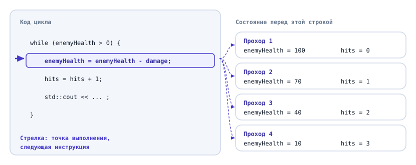
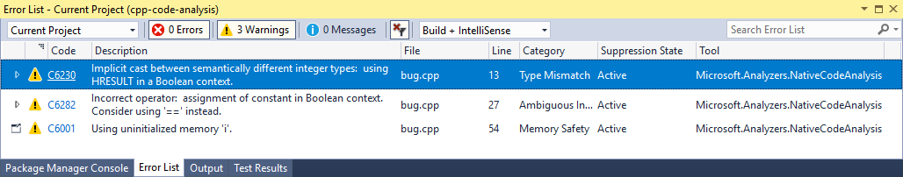
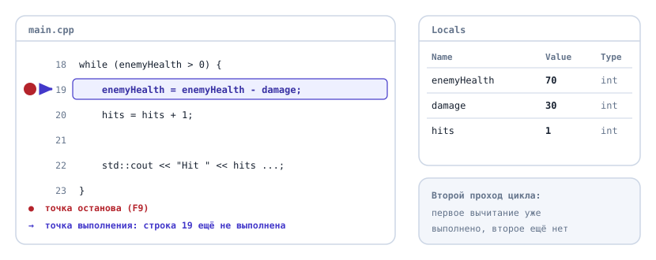
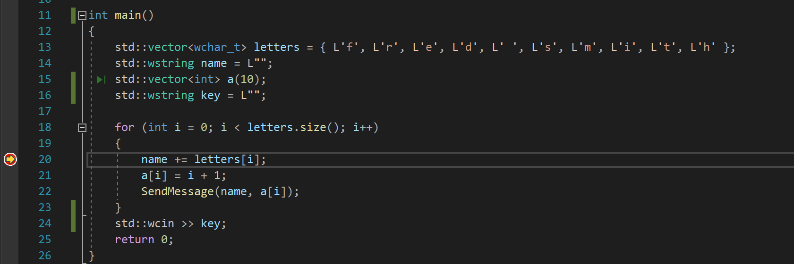
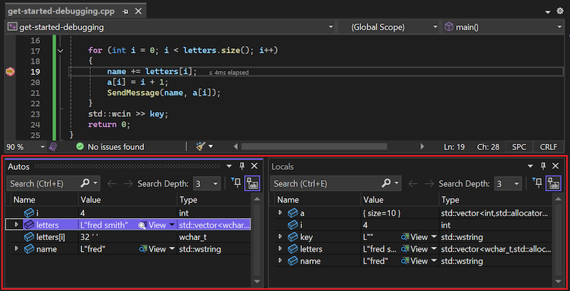
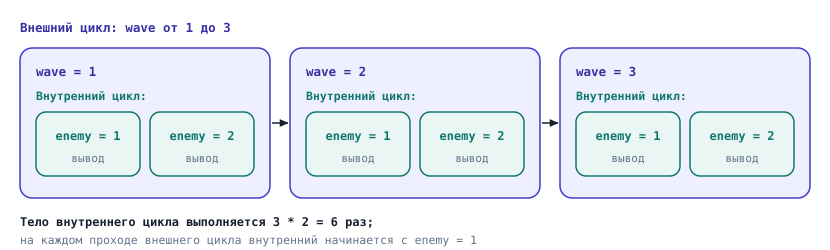
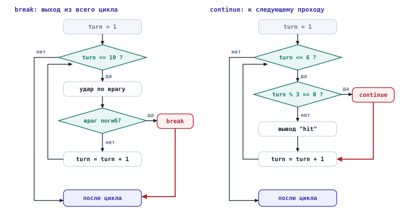

# Как выполняется программа. Ошибки и отладка

## Содержание

- [Как выполняется программа. Ошибки и отладка](#как-выполняется-программа-ошибки-и-отладка)
  - [Содержание](#содержание)
  - [Вопросы для самопроверки](#вопросы-для-самопроверки)
  - [О чём мы говорили в прошлой главе?](#о-чём-мы-говорили-в-прошлой-главе)
  - [Где сейчас находится программа](#где-сейчас-находится-программа)
    - [Одна строка, много состояний](#одна-строка-много-состояний)
    - [Точка выполнения](#точка-выполнения)
  - [Ошибки и предупреждения компилятора](#ошибки-и-предупреждения-компилятора)
    - [Несколько ошибок сразу](#несколько-ошибок-сразу)
    - [Предупреждения](#предупреждения)
  - [Что идёт не так во время работы](#что-идёт-не-так-во-время-работы)
    - [Неопределённое поведение](#неопределённое-поведение)
    - [Переменная без начального значения](#переменная-без-начального-значения)
    - [Программа не останавливается](#программа-не-останавливается)
    - [Сводная таблица](#сводная-таблица)
  - [Как искать логическую ошибку](#как-искать-логическую-ошибку)
    - [Сначала воспроизвести](#сначала-воспроизвести)
    - [Отладочный вывод](#отладочный-вывод)
    - [Сужаем область поиска](#сужаем-область-поиска)
    - [Одно изменение за раз](#одно-изменение-за-раз)
  - [Отладчик](#отладчик)
    - [Точка останова](#точка-останова)
    - [Выполнение по шагам](#выполнение-по-шагам)
    - [Окна с переменными](#окна-с-переменными)
    - [Отладчик и таблица трассировки](#отладчик-и-таблица-трассировки)
  - [Вложенные циклы](#вложенные-циклы)
    - [Цикл внутри цикла](#цикл-внутри-цикла)
    - [Ошибка: счётчик не сбрасывается](#ошибка-счётчик-не-сбрасывается)
  - [Досрочный выход из цикла: break и continue](#досрочный-выход-из-цикла-break-и-continue)
    - [Инструкция break](#инструкция-break)
    - [Инструкция continue](#инструкция-continue)
    - [break и правило одного выхода](#break-и-правило-одного-выхода)
    - [break выходит только из одного цикла](#break-выходит-только-из-одного-цикла)
  - [Проверка ввода](#проверка-ввода)
  - [Пример. Отлаживаем арену](#пример-отлаживаем-арену)
  - [Типичные ошибки](#типичные-ошибки)
  - [Резюме](#резюме)

## Вопросы для самопроверки

1. Почему для цикла недостаточно сказать "программа сейчас на строке 12"? Что ещё нужно знать, чтобы описать момент выполнения?

2. Компилятор выдал две ошибки: одну на строке 5, другую на строке 7. С какой из них начинать и почему?

3. Чем предупреждение компилятора отличается от ошибки компиляции? Соберётся ли программа, если в ней есть только предупреждения?

4. Что может вывести эта программа? Почему нельзя ответить точно?

   ```cpp
   int score;
   score = score + 10;
   std::cout << score << '\n';
   ```

5. Программа выдаёт неправильный результат. Что нужно сделать до того, как начинать исправлять код?

6. Что такое точка останова и чем шаг с обходом отличается от команды "продолжить"?

7. Сколько раз выполнится строка с выводом?

   ```cpp
   for (int wave = 1; wave <= 4; wave = wave + 1) {
       for (int enemy = 1; enemy <= 3; enemy = enemy + 1) {
           std::cout << wave << ' ' << enemy << '\n';
       }
   }
   ```

8. Чем `break` отличается от `continue`? Почему `continue` в цикле `while` может привести к бесконечному циклу?

9. Почему для проверки ввода удобен цикл `do while`, а не `while`?

## О чём мы говорили в прошлой главе?

В прошлой главе программы научились принимать решения и повторять действия. Вместе с этим у них появилась способность ошибаться гораздо интереснее, чем раньше.

Вспомните пример "Бой до победы" из пятой главы. С уроном `30` программа считала удары правильно, а с нулевым уроном не останавливалась: здоровье врага не уменьшалось, и цикл повторялся бесконечно. Мы тогда пообещали вернуться к этому случаю.

Сам по себе разговор об ошибках не новый. В первой главе мы разделили их на три вида: ошибки компиляции, ошибки времени выполнения и логические ошибки. Во второй главе научились заполнять таблицу трассировки и искать шаг, на котором результат впервые расходится с ожиданием. Но тогда программы были короткими и шли строго сверху вниз.

Теперь в программах есть циклы, и одна строка может выполниться сто раз подряд. Заполнять таблицу трассировки на сто строк руками уже тяжело. В этой главе мы разберём, как устроено выполнение программы с циклами, какие ошибки в ней встречаются и какими инструментами их искать. Заодно доделаем то, что осталось от пятой главы: вложенные циклы, досрочный выход из цикла и проверку ввода.

## Где сейчас находится программа

### Одна строка, много состояний

Во второй главе мы назвали _состоянием программы_ совокупность всех переменных и их значений в конкретный момент выполнения. Пока программа шла сверху вниз, момент выполнения было легко назвать: "после третьей строки". Каждая строка выполнялась один раз, и номер строки однозначно определял, что уже сделано.

С циклом это перестаёт работать. Возьмём цикл из примера "Бой до победы":

```cpp
while (enemyHealth > 0) {
    enemyHealth = enemyHealth - damage;
    hits = hits + 1;
}
```

При `enemyHealth = 100` и `damage = 30` строка с вычитанием выполнится четыре раза. Фраза "программа на строке с вычитанием" описывает сразу четыре разных момента:

- в первый раз `enemyHealth` равно `100`,
- во второй `70`,
- в третий `40`,
- в четвёртый `10`.

Чтобы понять, какой из них имеется в виду, одной строки мало: нужны ещё значения переменных.

### Точка выполнения

**Точка выполнения (execution point)** - инструкция, которую программа выполнит следующей.

Теперь момент выполнения можно описать полностью:

- _где_ находится программа.
- _что_ лежит в её переменных.

Точка выполнения отвечает на первый вопрос, значения переменных на второй.



_Рисунок 6.1. Точка выполнения и состояние на каждом проходе цикла_

На рисунке 6.1 точка выполнения четыре раза оказывается на одной и той же строке, а переменные каждый раз другие. Это и есть главная трудность программ с циклами: строка, которая правильно сработала на первом проходе, может ошибиться на четвёртом.

Пока программа работает так, как задумано, следить за точкой выполнения незачем. Это нужно, когда что-то пошло не так. Ошибки бывают трёх видов, и начнём с тех, которые находит компилятор.

## Ошибки и предупреждения компилятора

### Несколько ошибок сразу

Как читать одно сообщение компилятора, мы разобрали в третьей главе: имя файла, номер строки, позиция в строке и суть претензии. На практике сообщений часто бывает несколько, и здесь есть свои правила.

Рассмотрим пример. В программе забыта одна точка с запятой:

```cpp
#include <iostream>

int main() {
    int health = 100
    int damage = 30;

    health = health - damage;
    std::cout << health << '\n';

    return 0;
}
```

Компилятор GCC (GNU Compiler Collection), один из самых распространённых компиляторов C++, выдаёт на неё две ошибки:

```text
main.cpp:5:5: error: expected ',' or ';' before 'int'
    5 |     int damage = 30;
      |     ^~~
main.cpp:7:23: error: 'damage' was not declared in this scope
    7 |     health = health - damage;
      |                       ^~~~~~
```

Здесь видны сразу две особенности.

- _Строка в сообщении не та, где ошибка._ Точка с запятой пропущена в строке 4, а компилятор указывает на строку 5. Он читает текст по порядку и обнаруживает, что инструкция не закончилась, только когда встречает следующее слово `int`. Поэтому, если указанная строка выглядит правильной, смотрите строку выше.
- _Вторая ошибка вызвана первой._ Из-за пропущенной точки с запятой компилятор не смог разобрать объявление `damage`, поэтому в строке 7 считает эту переменную необъявленной. Стоит исправить строку 4, и обе ошибки исчезнут.

Отсюда порядок работы с сообщениями:

1. Начинайте с первой ошибки в списке.
2. Если указанная строка выглядит правильной, проверьте строку перед ней.
3. Исправив первую ошибку, соберите программу заново, прежде чем браться за остальные.

> [!TIP]
> Одна пропущенная скобка может дать десяток сообщений об ошибках. Не пугайтесь длинного списка: чаще всего настоящая ошибка одна, и она первая.

### Предупреждения

Кроме ошибок компилятор умеет выдавать сообщения другого рода.

**Предупреждение (warning)** - сообщение компилятора о записи, которая допустима по правилам языка, но выглядит рискованной и часто означает ошибку[^1].

Главное отличие от ошибки: при предупреждении программа собирается и запускается. Компилятор не уверен, что вы ошиблись, поэтому только сообщает о подозрении.

Вспомните самую частую ошибку из пятой главы, одно равно вместо двух:

```cpp
if (health = 0) {
    std::cout << "Game Over\n";
}
```

Это правильная запись с точки зрения языка: в условии стоит присваивание, и программа скомпилируется. Но GCC с включёнными предупреждениями сообщает:

```text
main.cpp:7:16: warning: suggest parentheses around assignment used as truth value [-Wparentheses]
    7 |     if (health = 0) {
      |         ~~~~~~~^~~
```

Сообщение устроено так же, как сообщение об ошибке, только вместо `error` стоит `warning`. Компилятор говорит: здесь присваивание используется как условие, и это подозрительно. В квадратных скобках указано название проверки, которая сработала.

В Visual Studio ошибки и предупреждения собираются в отдельном окне Error List[^2]. Каждое сообщение там занимает строку таблицы, как на рисунке 6.2:

- значок показывает, ошибка это или предупреждение,
- в столбце `Code` стоит номер сообщения, например C4706,
- в столбце `Description` написана суть претензии,
- в столбцах `File` и `Line` указаны файл и строка.



_Рисунок 6.2. Окно Error List в Visual Studio. Источник: Microsoft, CC BY 4.0[^2]_

Многие предупреждения компилятор показывает, только если его об этом попросить. В IDE это делается в настройках проекта: там есть параметр, который задаёт, насколько придирчиво компилятор проверяет код.

Рассмотрим пример. В Visual Studio этот параметр называется Warning Level и находится в свойствах проекта, в разделе C/C++, General:

- По умолчанию стоит уровень 3.
- Предупреждение о присваивании в условии (номер C4706) появляется только на уровне 4[^2][^3].

Поэтому в этом курсе уровень предупреждений стоит поднять до 4.

> [!IMPORTANT]
>
> В этом курсе действует правило: программа должна собираться без предупреждений. Предупреждение, на которое не обратили внимания сегодня, завтра превращается в логическую ошибку, которую придётся искать час.

Если хочется, чтобы компилятор не позволял нарушать это правило, его можно попросить считать любое предупреждение ошибкой. Тогда программа с предупреждением просто не соберётся. В Visual Studio для этого есть свойство Treat Warnings as Errors в том же разделе настроек[^2].

## Что идёт не так во время работы

### Неопределённое поведение

Ошибки времени выполнения мы определили в первой главе: программа собралась, запустилась и аварийно остановилась. А в четвёртой главе встретили пример: деление целого числа на ноль, поведение которого стандарт языка не определяет. У таких ситуаций есть общее название.

**Неопределённое поведение (undefined behavior, UB)** - ситуация, для которой стандарт C++ не задаёт никакого результата[^4]. Программа с неопределённым поведением может:

- аварийно завершиться,
- выдать странное значение,
- работать так, будто всё в порядке.

Последний вариант самый коварный. Программа с неопределённым поведением может годами работать правильно на одном компьютере и сломаться на другом или после обновления компилятора. При этом компилятор не обязан предупреждать о неопределённом поведении, хотя простые случаи часто замечает[^4].

Поэтому слова "у меня работает" ничего не доказывают, если в программе есть неопределённое поведение. Запуском его не проверить, его можно только не допустить.

### Переменная без начального значения

Самый частый у новичков источник неопределённого поведения выглядит безобидно:

```cpp
int totalDamage;
int hit = 0;

std::cin >> hit;
totalDamage = totalDamage + hit;
```

Переменная `totalDamage` объявлена, но не получила начального значения. Многие ожидают, что в ней окажется ноль. На самом деле в ней лежит неопределённое значение, то есть то, что случайно оказалось в этом месте памяти, и чтение такого значения является неопределённым поведением[^5]. Программа может вывести `25`, а может `-1953702117`, и результат зависит от компилятора и его настроек.

Компилятор с включёнными предупреждениями такой случай замечает:

```text
main.cpp:8:17: warning: 'totalDamage' is used uninitialized [-Wuninitialized]
    8 |     totalDamage = totalDamage + hit;
      |     ~~~~~~~~~~~~^~~~~~~~~~~~~~~~~~~
```

Visual Studio сообщает о том же предупреждением C4700. Если в свойствах проекта включены дополнительные проверки безопасности (свойство SDL checks), это предупреждение превращается в ошибку, и программа не соберётся[^7]. Поэтому, если вы попробуете этот пример в Visual Studio и увидите ошибку вместо предупреждения, проверьте это свойство.

Лекарство простое: задавайте переменной значение сразу при объявлении, как мы делали с третьей главы.

```cpp
int totalDamage = 0;
```

> [!NOTE]
> В новой версии стандарта 2026 года, C++26, такое чтение перестало считаться неопределённым поведением и получило отдельное название, ошибочное поведение (erroneous behavior)[^5]. Последствия стали предсказуемее, но программа от этого правильной не стала: значение в переменной по-прежнему не то, которое вы задумали.

### Программа не останавливается

Вернёмся к примеру "_Бой до победы_" с нулевым уроном. Программа не падает и не сообщает об ошибке. Она бесконечно печатает строки `enemy health: 100` и не заканчивается. Если бы в цикле не было вывода на каждом ударе, программа просто молчала бы, и со стороны это выглядело бы как зависание.

> [!TIP]
>
> Если программа работает намного дольше, чем должна, считайте, что она зациклилась, и остановите её: закройте окно консоли или нажмите в Visual Studio красную кнопку Stop Debugging на панели инструментов[^8].

Это не ошибка времени выполнения: ничего запрещённого не происходит, программа делает ровно то, что написано. Значит, это _логическая ошибка_.

### Сводная таблица

Соберём вместе три вида ошибок из первой главы и предупреждения.

| Признак              | Ошибка компиляции                           | Предупреждение                             | Ошибка времени выполнения                | Логическая ошибка                                                  |
| -------------------- | ------------------------------------------- | ------------------------------------------ | ---------------------------------------- | ------------------------------------------------------------------ |
| Когда обнаруживается | При сборке                                  | При сборке                                 | Во время работы                          | Во время работы или при проверке на разных данных                  |
| Что вы видите        | Сообщение `error`, программа не запускается | Сообщение `warning`, программа запускается | Программа аварийно завершается           | Программа работает, но результат неверный или она не заканчивается |
| Кто сообщает         | Компилятор                                  | Компилятор                                 | Только сообщение об аварийном завершении | Никто                                                              |
| Пример               | Пропущенная точка с запятой                 | `if (health = 0)`                          | Деление целого числа на ноль             | Нулевой урон, и цикл не заканчивается                              |

Неопределённого поведения в таблице нет отдельным столбцом, потому что это не вид ошибки, а её причина. Оно может проявиться:

- как ошибка времени выполнения,
- как логическая ошибка,
- вообще никак до поры до времени.

## Как искать логическую ошибку

Порядок поиска мы составили ещё во второй главе:

1. Что ожидали?
2. Что получили?
3. На каком шаге результат впервые разошёлся с ожиданием?

В программе с циклами трудность в третьем вопросе: шагов могут быть сотни.

### Сначала воспроизвести

Прежде чем что-то исправлять, нужно научиться вызывать ошибку по желанию.

**Воспроизвести ошибку (reproduce a bug)** - найти входные данные, на которых ошибка проявляется каждый раз.

Без этого нельзя проверить исправление: если ошибка появлялась "иногда", то после правки непонятно, исчезла она или просто не проявилась в этот раз[^9][^10].

Возьмём для дальнейших опытов пример "_Бой до победы_": программа печатает только итоговое число ударов.

```cpp
while (enemyHealth > 0) {
    enemyHealth = enemyHealth - damage;
    hits = hits + 1;
}

std::cout << "Enemy defeated in " << hits << " hits\n";
```

Именно такая программа при нулевом уроне выглядит зависшей. Попробуем её с разными данными:

| `enemyHealth` | `damage` | Что произошло         |
| ------------- | -------- | --------------------- |
| 100           | 30       | 4 удара, всё верно    |
| 100           | 1        | 100 ударов, всё верно |
| 100           | 0        | Не заканчивается      |
| 100           | -5       | Не заканчивается      |
| 1             | 0        | Не заканчивается      |

Из таблицы видно:

- при любом положительном здоровье программа не заканчивается,
- когда урон меньше или равен нулю.

Обратите внимание на последнюю строку. Ошибка проявляется и при здоровье `100`, и при здоровье `1`, но проследить по шагам проще второй случай: в нём меньше значений и меньше проходов цикла. Поэтому, найдя данные, на которых программа ошибается, попробуйте уменьшить числа и убрать лишнее, пока ошибка ещё повторяется. Чем меньше данных, тем короче путь, который придётся проверить. Это один из главных приёмов отладки[^9].

### Отладочный вывод

Теперь нужно увидеть, что происходит внутри цикла. Самый простой способ работает в любой среде.

**Отладочный вывод (debug output)** - временные строки вывода, которые показывают значения переменных в выбранном месте программы.

Добавим одну строку в начало тела цикла:

```cpp
while (enemyHealth > 0) {
    std::cout << "[debug] enemyHealth = " << enemyHealth
              << ", damage = " << damage << '\n';

    enemyHealth = enemyHealth - damage;
    hits = hits + 1;
}
```

С данными `100` и `0` программа печатает:

```text
[debug] enemyHealth = 100, damage = 0
[debug] enemyHealth = 100, damage = 0
[debug] enemyHealth = 100, damage = 0
...
```

Значение `enemyHealth` не меняется от прохода к проходу. Значит, условие `enemyHealth > 0` никогда не станет ложным. Причина найдена: при нулевом уроне вычитание ничего не меняет, а при отрицательном здоровье врага даже растёт.

> [!WARNING]
> Отладочный вывод временный. Когда ошибка найдена, уберите его. Пометка `[debug]` в начале строки помогает не перепутать его с обычным выводом и потом быстро найти все такие строки.

На самом деле, чаще всего разработчики используют именно этот подход: добавляют отладочный вывод, чтобы понять, что происходит внутри программы, а затем удаляют его, когда ошибка найдена.

### Сужаем область поиска

Если программа длинная и непонятно даже, в какой её части ошибка, помогает приём деления пополам.

1. Поставьте отладочный вывод примерно в середину программы.
2. Если значения в этом месте правильные, ошибка ниже. Если уже неправильные, ошибка выше.
3. Повторите то же самое с половиной, в которой осталась ошибка.

С каждым шагом область поиска сокращается вдвое[^8].

Рассмотрим пример.

1. Программа сначала читает здоровье и урон,
2. затем считает новое здоровье,
3. затем выводит результат, и результат неверный.

Поставим отладочный вывод после расчёта. Если здоровье там уже неправильное, ошибка в вводе или в расчёте, а вывод можно не проверять. Если правильное, ошибка в части с выводом.

### Одно изменение за раз

Когда причина найдена, хочется исправить заодно всё, что кажется подозрительным. Этого лучше не делать.

Вносите одно изменение и сразу проверяйте его на тех же данных, на которых ошибка воспроизводилась. Если изменить три вещи одновременно и результат станет правильным, вы не узнаете, какая из них помогла и не сломали ли две другие что-нибудь новое[^10].

Проверьте исправление и на тех данных, где программа работала раньше. Исправление, которое чинит один случай и ломает другой, тоже ошибка.

## Отладчик

У отладочного вывода есть недостатки:

- нужно заранее угадать, какие переменные печатать и в каком месте,
- каждый раз приходится менять текст программы и собирать её заново,
- потом нужно не забыть всё убрать.

Для коротких программ это терпимо, но чем программа больше, тем дольше такой цикл "добавил вывод, собрал, запустил, посмотрел".

Во второй и третьей главах мы упоминали, что в IDE есть инструмент, который делает это без изменения программы.

**Отладчик (debugger)** - программа, которая запускает вашу программу под наблюдением: может приостановить её в нужном месте, выполнять по одной инструкции и показывать значения переменных[^9].

Проще говоря, отладчик заполняет таблицу трассировки за вас. Вы только выбираете, на какие моменты выполнения смотреть.

Ниже команды и окна описаны на примере Visual Studio. В других средах для C++, например в CLion, Code::Blocks и Visual Studio Code, есть похожие команды, но их названия и клавиши могут отличаться.

### Точка останова

**Точка останова (breakpoint)** - отметка на строке программы, дойдя до которой отладчик приостанавливает выполнение[^11]. Сама строка при этом ещё не выполнена: программа замирает прямо перед ней.

В Visual Studio работа с точкой останова выглядит так:

1. Поставьте курсор на нужную строку и нажмите F9. Слева от строки появится красный круг. Повторное нажатие F9 снимает точку останова[^10].
2. Запустите программу не как обычно, а под отладчиком, клавишей F5.
3. Если программа ждёт ввода, введите данные в консоли, как при обычном запуске.
4. Программа работает в обычном режиме, пока не дойдёт до первой точки останова, и там останавливается[^9].

### Выполнение по шагам

**Шаг с обходом (step over)** - команда, которая выполняет одну инструкцию и снова останавливает программу на следующей[^9]. В Visual Studio это клавиша F10.

**Продолжить (continue)** - команда, которая запускает программу дальше в обычном режиме до следующей точки останова[^11]. В Visual Studio это та же клавиша F5.

**Шаг с заходом (step into)** - команда, которая тоже выполняет программу по одной инструкции, но умеет заходить внутрь вызываемых частей программы[^9]. В Visual Studio это клавиша F11. Отличие от шага с обходом проявится, когда мы начнём разбивать программу на отдельные именованные части, функции. Тогда мы к этой команде и вернёмся, а пока достаточно шага с обходом.

| Действие                           | Клавиша в Visual Studio | Что происходит                                           |
| ---------------------------------- | ----------------------- | -------------------------------------------------------- |
| Поставить или снять точку останова | F9                      | На строке появляется или исчезает отметка                |
| Начать отладку                     | F5                      | Программа выполняется до первой точки останова           |
| Шаг с обходом                      | F10                     | Выполняется одна инструкция, программа снова остановлена |
| Продолжить                         | F5                      | Программа выполняется до следующей точки останова        |

Текущая точка выполнения в редакторе отмечается стрелкой слева от строки. Это та самая инструкция, которая выполнится следующей.

### Окна с переменными

Здесь участвуют две программы: ваша и отладчик. С момента запуска по F5 и до конца работы вашей программы идёт отладка, и всё это время отладчик работает. Ваша программа в это время то выполняется, то стоит на паузе: на точке останова или после шага.

Значения переменных отладчик показывает в специальных окнах[^11]:

- окна открываются только во время отладки[^14], обычно под редактором кода,
- значения в них можно читать, когда ваша программа стоит на паузе.

Если какого-то окна не видно, его можно открыть через меню Debug, пункт Windows. Чаще всего нужны три окна:

- _Locals_. Все переменные, доступные в том месте программы, где она остановилась.
- _Autos_. Переменные, которые используются рядом с текущей инструкцией.
- _Watch_. Переменные или целые выражения, которые вы выбрали сами. В это окно можно написать, например, `enemyHealth > 0` и видеть значение условия на каждом шаге.



_Рисунок 6.3. Что показывает отладчик, когда программа остановлена_

На рисунке 6.3 программа остановлена на строке с вычитанием:

- красный круг отмечает точку останова,
- стрелка показывает точку выполнения,
- окно Locals показывает состояние программы в этот момент.

Так это выглядит в настоящей Visual Studio. Код на снимках взят из документации Microsoft, его содержание сейчас неважно: смотрите на отметки слева от номеров строк и на окна внизу.



_Рисунок 6.4. Программа остановлена на точке останова. Источник: Microsoft, CC BY 4.0[^15]_

На рисунке 6.4 точка останова и точка выполнения совпали на строке 20, поэтому жёлтая стрелка нарисована прямо внутри красного круга.



_Рисунок 6.5. Окна Autos и Locals во время отладки. Источник: Microsoft, CC BY 4.0[^15]_

На рисунке 6.5 окна Autos и Locals показывают для каждой переменной:

- имя (Name),
- текущее значение (Value),
- тип (Type).

Значение также можно увидеть, если навести указатель мыши на переменную в коде[^15].

### Отладчик и таблица трассировки

Теперь попробуем применить отладчик к нашему примеру "Бой до победы" из пятой главы.

1. Ставим точку останова на строку `enemyHealth = enemyHealth - damage;`.
2. Запускаем отладку клавишей F5 и вводим в консоли `100` и `30`.
3. Программа останавливается перед первым вычитанием. В окне Locals мы видим: `enemyHealth = 100`, `damage = 30`, `hits = 0`.
4. Нажимаем F10. Вычитание выполнено, и теперь `enemyHealth = 70`.
5. Нажимаем F5. Программа проходит остаток тела, проверяет условие, начинает новый проход и снова останавливается перед вычитанием.

Если на каждой остановке записывать значения из окна Locals, получится таблица:

| Остановка | `enemyHealth` | `damage` | `hits` |
| --------- | ------------- | -------- | ------ |
| 1         | 100           | 30       | 0      |
| 2         | 70            | 30       | 1      |
| 3         | 40            | 30       | 2      |
| 4         | 10            | 30       | 3      |

Это та же таблица трассировки, что и в пятой главе, только значения в ней мы не вычисляли сами, а увидели в окне Locals. Если они расходятся с вашей ручной таблицей, ошибка либо в программе, либо в вашем понимании программы. Поэтому ручную трассировку стоит уметь делать и дальше: без неё вы не знаете, какие значения ожидать.

Теперь запустим отладку с данными `100` и `0`. На каждой остановке окно Locals показывает `enemyHealth = 100`, а `hits` растёт: `0`, `1`, `2`, `3` и дальше. Удары считаются, но здоровье врага не меняется, и условие цикла всегда истинно. Мы пришли к тому же выводу, что и с отладочным выводом, но не изменили в программе ни строчки.

Как исправить бесконечный цикл при нулевом уроне, разберём в разделе о проверке ввода.

## Вложенные циклы

### Цикл внутри цикла

В пятой главе мы вкладывали ветвление внутрь цикла. Вкладывать можно и цикл в цикл.

_Рассмотрим задачу_. В начале уровня приходят три волны врагов, в каждой волне по два врага. Нужно:

1. вывести номер каждой волны и
2. каждого врага в ней.

**Вложенный цикл (nested loop)** - цикл, который находится в теле другого цикла.

```cpp
for (int wave = 1; wave <= 3; wave = wave + 1) {
    std::cout << "Wave " << wave << '\n';

    for (int enemy = 1; enemy <= 2; enemy = enemy + 1) {
        std::cout << "  Enemy " << enemy << " spawned\n";
    }
}
```

Программа выведет:

```text
Wave 1
  Enemy 1 spawned
  Enemy 2 spawned
Wave 2
  Enemy 1 spawned
  Enemy 2 spawned
Wave 3
  Enemy 1 spawned
  Enemy 2 spawned
```

У такой пары циклов есть свои названия.

**Внешний цикл (outer loop)** - цикл, который содержит другой цикл, здесь это цикл по `wave`.

**Внутренний цикл (inner loop)** - цикл, который находится в теле внешнего, здесь это цикл по `enemy`.

Главное правило вложенных циклов: _на каждом проходе внешнего цикла внутренний цикл выполняется целиком, от начала до конца_.



_Рисунок 6.6. Проходы внешнего и внутреннего цикла_

На рисунке 6.6 видно, что внутренний цикл каждый раз начинается заново с `enemy = 1`. Поэтому тело внутреннего цикла выполняется `3 * 2 = 6` раз: число проходов внешнего цикла умножается на число проходов внутреннего.

Проследим выполнение по таблице:

| Шаг | `wave` | `enemy` | Вывод             |
| --- | ------ | ------- | ----------------- |
| 1   | 1      |         | `Wave 1`          |
| 2   | 1      | 1       | `Enemy 1 spawned` |
| 3   | 1      | 2       | `Enemy 2 spawned` |
| 4   | 2      |         | `Wave 2`          |
| 5   | 2      | 1       | `Enemy 1 spawned` |
| 6   | 2      | 2       | `Enemy 2 spawned` |
| 7   | 3      |         | `Wave 3`          |
| 8   | 3      | 1       | `Enemy 1 spawned` |
| 9   | 3      | 2       | `Enemy 2 spawned` |

После шага 3 счётчик `enemy` становится равным `3`, условие `enemy <= 2` оказывается ложным, и внутренний цикл заканчивается. Управление возвращается во внешний цикл: `wave` увеличивается до `2`, и всё повторяется.

В шагах 1, 4 и 7 ячейка `enemy` пуста. Счётчик `enemy` объявлен во внутреннем цикле, то есть в круглых скобках после слова `for`. Пока внутренний цикл не начался, переменной `enemy` ещё нет, поэтому ячейка пуста. Она появляется заново при каждом запуске внутреннего цикла и исчезает, когда он заканчивается.

### Ошибка: счётчик не сбрасывается

Тот же алгоритм можно записать через `while`. Посмотрите на эту версию:

```cpp
int wave = 1;
int enemy = 1;

while (wave <= 3) {
    std::cout << "Wave " << wave << '\n';

    while (enemy <= 2) {
        std::cout << "  Enemy " << enemy << " spawned\n";
        enemy = enemy + 1;
    }

    wave = wave + 1;
}
```

Программа компилируется без предупреждений, но выводит:

```text
Wave 1
  Enemy 1 spawned
  Enemy 2 spawned
Wave 2
Wave 3
```

Во второй и третьей волне врагов нет. Найдём причину отладчиком. Поставим точку останова на строку `std::cout << "Wave " << wave << '\n';`, которая выполняется один раз в начале каждой волны, добавим в окно Watch выражение `enemy <= 2` и будем нажимать F5.

| Остановка | `wave` | `enemy` | Условие `enemy <= 2` |
| --------- | ------ | ------- | -------------------- |
| 1         | 1      | 1       | истинно              |
| 2         | 2      | 3       | ложно                |
| 3         | 3      | 3       | ложно                |

На второй остановке видно: внешний цикл начал вторую волну, а `enemy` всё ещё равно `3`, как осталось после первой. Счётчик внутреннего цикла объявлен снаружи, поэтому никто не возвращает его к единице.

Чтобы исправить программу, нужно перед внутренним циклом каждый раз возвращать счётчик к единице обычным присваиванием.

```cpp
int wave = 1;
int enemy = 1;

while (wave <= 3) {
    std::cout << "Wave " << wave << '\n';

    enemy = 1;

    while (enemy <= 2) {
        std::cout << "  Enemy " << enemy << " spawned\n";
        enemy = enemy + 1;
    }

    wave = wave + 1;
}
```

> [!TIP]
> Это ещё одна причина, по которой для счётчиков удобен `for`: начальное значение счётчика записано в заголовке цикла, и при каждом новом запуске внутреннего цикла оно задаётся заново.

## Досрочный выход из цикла: break и continue

До сих пор цикл заканчивался только одним способом: условие становилось ложным. Иногда удобнее закончить цикл или текущий проход раньше.

### Инструкция break

Инструкцию `break` мы уже встречали в `switch`, где она завершала выбор. В цикле она делает то же самое: _немедленно завершает цикл_, и выполнение продолжается с первой инструкции после него[^16].

Рассмотрим задачу:

- бой длится не больше 10 ходов,
- каждый ход игрок наносит врагу урон,
- если враг погиб раньше, бой заканчивается.

```cpp
int enemyHealth = 100;
int damage = 30;

for (int turn = 1; turn <= 10; turn = turn + 1) {
    enemyHealth = enemyHealth - damage;
    std::cout << "Turn " << turn << ", enemy health: " << enemyHealth << '\n';

    if (enemyHealth <= 0) {
        std::cout << "Enemy defeated\n";
        break;
    }
}

std::cout << "Battle over\n";
```

Программа выведет:

```text
Turn 1, enemy health: 70
Turn 2, enemy health: 40
Turn 3, enemy health: 10
Turn 4, enemy health: -20
Enemy defeated
Battle over
```

На четвёртом ходу условие `enemyHealth <= 0` стало истинным, выполнился `break`, и ходы с пятого по десятый не выполнялись. Без `break` игрок продолжал бы бить уже побеждённого врага до десятого хода.

Ту же задачу можно решить и без `break`, перенеся проверку в условие цикла:

```cpp
for (int turn = 1; turn <= 10 && enemyHealth > 0; turn = turn + 1) {
    enemyHealth = enemyHealth - damage;
    std::cout << "Turn " << turn << ", enemy health: " << enemyHealth << '\n';
}
```

Обе записи правильные. В первой отдельно видно, что происходит при победе, и туда легко добавить сообщение. Во второй все причины окончания цикла собраны в одном месте.

### Инструкция continue

`continue` не завершает цикл, а _завершает только текущую иттерацию_[^17]. После `continue` происходит следующее:

1. Оставшаяся часть тела пропускается.
2. В цикле `for` выполняется шаг счётчика из заголовка. В `while` такого шага нет, поэтому этот пункт пропускается.
3. Проверяется условие цикла, и если оно истинно, начинается следующий проход.

Рассмотрим задачу. Враг блокирует каждый третий удар. В такой ход урон не наносится.

```cpp
for (int turn = 1; turn <= 6; turn = turn + 1) {
    if (turn % 3 == 0) {
        std::cout << "Turn " << turn << ": blocked\n";
        continue;
    }

    std::cout << "Turn " << turn << ": hit\n";
}
```

Условие `turn % 3 == 0` проверяет, делится ли номер хода на три без остатка: операцию `%` мы разбирали в четвёртой главе. Например, `1 % 3` равно `1`, `2 % 3` равно `2`, а `3 % 3` и `6 % 3` равны `0`. Программа выведет:

```text
Turn 1: hit
Turn 2: hit
Turn 3: blocked
Turn 4: hit
Turn 5: hit
Turn 6: blocked
```

На третьем и шестом ходу после сообщения `blocked` выполнился `continue`, и строка с `hit` была пропущена.

На рисунке 6.7 оба случая показаны рядом. `break` ведёт сразу за пределы цикла. `continue` ведёт к шагу счётчика, после которого снова проверяется условие.



_Рисунок 6.7. Куда передают управление `break` и `continue`_

Этот пример можно записать и без `continue`, через `if` и `else`. Для короткого тела так даже понятнее. `continue` выигрывает, когда после проверки идёт длинное тело: вместо того чтобы прятать его целиком в ветку `else`, особый случай отсекают в начале прохода.

С `continue` в цикле `while` легко получить бесконечный цикл. Перепишем тот же пример через `while`:

```cpp
int turn = 1;

while (turn <= 6) {
    if (turn % 3 == 0) {
        std::cout << "Turn " << turn << ": blocked\n";
        continue;
    }

    std::cout << "Turn " << turn << ": hit\n";
    turn = turn + 1;
}
```

Программа выведет `Turn 1: hit`, `Turn 2: hit`, а затем будет бесконечно печатать `Turn 3: blocked`. Изменение счётчика стоит в конце тела, и `continue` пропускает его вместе с остальной частью тела: `turn` навсегда остаётся равным `3`.

> [!WARNING]
> Используя `continue` в `while`, проверьте, что счётчик меняется до него.

### break и правило одного выхода

Ранее мы говорили, что у каждой конструкции структурного программирования один вход и один выход. Строго говоря, `break` и `continue` это правило нарушают. `break` даёт циклу второй выход, а `continue` даёт второй выход из тела очередного прохода.

Один `break` на виду читается легко. Но если в цикле несколько `break` и `continue` в разных местах, программа снова начинает напоминать спагетти-код: чтобы понять, где закончится цикл, приходится проверять каждый выход.

Практическое правило такое: используйте `break` и `continue`, когда они делают цикл понятнее, и старайтесь, чтобы их было не больше одного-двух на цикл.

### break выходит только из одного цикла

Во вложенных циклах `break` завершает только тот цикл, внутри которого записан, то есть самый внутренний[^16]. Внешний цикл продолжает работу.

Рассмотрим пример. Игрок сражается с волнами врагов, и каждый враг отнимает у игрока 40 единиц здоровья. Если игрок погиб, бой должен закончиться.

```cpp
int playerHealth = 100;

for (int wave = 1; wave <= 3; wave = wave + 1) {
    for (int enemy = 1; enemy <= 2; enemy = enemy + 1) {
        playerHealth = playerHealth - 40;
        std::cout << "Wave " << wave << ", enemy " << enemy
                  << ", player health: " << playerHealth << '\n';

        if (playerHealth <= 0) {
            break;
        }
    }
}

std::cout << "Game over\n";
```

Программа выведет:

```text
Wave 1, enemy 1, player health: 60
Wave 1, enemy 2, player health: 20
Wave 2, enemy 1, player health: -20
Wave 3, enemy 1, player health: -60
Game over
```

Игрок погиб во второй волне, но третья волна всё равно началась. `break` завершил внутренний цикл второй волны, а внешний цикл перешёл к третьей. В третьей волне первый же враг снова отнял здоровье, условие `playerHealth <= 0` опять оказалось истинным, и `break` сразу завершил внутренний цикл. Поэтому от третьей волны в выводе только одна строка.

Чтобы закончить и внешний цикл, условие гибели нужно проверить и в нём. Например, добавить его в условие внешнего цикла:

```cpp
for (int wave = 1; wave <= 3 && playerHealth > 0; wave = wave + 1) {
    // ...
}
```

Теперь после выхода из внутреннего цикла внешний проверит условие, увидит, что игрок погиб, и тоже закончится. Программа выведет:

```text
Wave 1, enemy 1, player health: 60
Wave 1, enemy 2, player health: 20
Wave 2, enemy 1, player health: -20
Game over
```

## Проверка ввода

Теперь вернёмся к примеру "Бой до победы" и избавимся в нём от бесконечного цикла: не будем пускать в программу урон, который меньше или равен нулю.

**Проверка ввода (input validation)** - проверка введённых данных до того, как программа начнёт с ними работать.

Самый простой способ - спрашивать урон до тех пор, пока пользователь не введёт подходящее значение. Похожий цикл нам уже встречался в пятой главе, когда мы разбирали `do while`: спросить нужно хотя бы один раз, а решение о повторе принимается после ввода. Теперь доведём его до настоящей проверки ввода, добавив сообщение об ошибке. В программе боя этот цикл нужно поставить вместо простого ввода урона, перед циклом `while (enemyHealth > 0)`.

```cpp
int damage = 0;

do {
    std::cout << "Damage (greater than 0): ";
    std::cin >> damage;

    if (damage <= 0) {
        std::cout << "Damage must be greater than 0\n";
    }
} while (damage <= 0);
```

Если пользователь введёт `0`, а потом `-5`, а потом `30`, программа выведет:

```text
Damage (greater than 0): 0
Damage must be greater than 0
Damage (greater than 0): -5
Damage must be greater than 0
Damage (greater than 0): 30
```

После этого цикла в переменной `damage` гарантированно лежит число больше нуля. Значит, в цикле боя здоровье врага всегда уменьшается, и бесконечный цикл из пятой главы больше невозможен.

Сообщение об ошибке здесь обязательно: без него пользователь снова и снова видел бы тот же вопрос и не понимал бы, что сделал не так.

> [!NOTE]
> Эта проверка защищает от неправильных чисел, но не от ввода букв вместо числа. Если ввести `abc`, то `std::cin`:
>
> - не сможет прочитать число,
> - запишет в `damage` ноль,
> - перестанет читать дальнейший ввод.
>
> Наш цикл в этом случае будет бесконечно повторять вопрос и сообщение об ошибке. Обработка такого ввода требует средств, которых мы ещё не изучали, поэтому пока считаем, что пользователь вводит числа.

## Пример. Отлаживаем арену

Соберём всё изученное в одном примере: найдём и исправим ошибку в целой программе. Условия задачи такие:

> - На арене три волны.
> - В каждой волне один враг со 100 единицами здоровья.
> - Игрок вводит силу удара, которая должна быть больше нуля.
> - Программа сообщает о каждой пройденной волне.
> - В конце программа выводит, сколько всего ударов понадобилось на всю арену.

Вот программа, написанная для этой задачи:

```cpp
#include <iostream>

int main() {
    int waves = 3;
    int damage = 0;

    const int ENEMY_HEALTH = 100;

    do {
        std::cout << "Damage (greater than 0): ";
        std::cin >> damage;
    } while (damage <= 0);

    int totalHits = 0;

    for (int wave = 1; wave <= waves; wave = wave + 1) {
        int health = ENEMY_HEALTH;
        totalHits = 0;

        while (health > 0) {
            health = health - damage;
            totalHits = totalHits + 1;
        }

        std::cout << "Wave " << wave << " cleared\n";
    }

    std::cout << "Total hits: " << totalHits << '\n';

    return 0;
}
```

Сообщение об ошибке ввода здесь опущено, чтобы программа была короче. Строка `int health = ENEMY_HEALTH;` нужна потому, что у каждой волны враг начинает со 100 единиц здоровья: в начале волны программа делает копию начального здоровья и уменьшает уже её.

Программа собирается без предупреждений. Запустим её с уроном `30`.

| Что ожидали                                                                                                                 | Что получили                                                                          |
| --------------------------------------------------------------------------------------------------------------------------- | ------------------------------------------------------------------------------------- |
| На одного врага уходит 4 удара: после них здоровье врага равно `70`, `40`, `10` и `-20`. Волн три, значит, всего 12 ударов. | Wave 1 cleared <br /> Wave 2 cleared <br /> Wave 3 cleared <br /> Total hits: 4<br /> |

Волны проходятся, но итог в три раза меньше ожидаемого.

_Воспроизводим и упрощаем._ Меняем значение `waves` и смотрим на итог:

| `waves` | Ожидали | Получили |
| ------- | ------- | -------- |
| 1       | 4       | 4        |
| 2       | 8       | 4        |
| 3       | 12      | 4        |

С одной волной все верно, но начиная со второй волны итог перестаёт расти и всегда равен числу ударов одной волны. Значит, удары внутри волны считаются правильно, а счёт теряется где-то на переходе от одной волны к другой. Область поиска сузилась до начала тела внешнего цикла.

_Смотрим отладчиком._ Оставляем `waves = 2`, ставим точку останова на строку `int health = enemyHealth;` и запускаем отладку. В таблице записаны значения из окна Locals в момент каждой остановки, то есть перед выполнением строки, на которой стоит жёлтая стрелка.

| Остановка или шаг | `wave` | `health` | `totalHits` |
| ----------------- | ------ | -------- | ----------- |
| Остановка 1       | 1      | ?        | 0           |
| F5, остановка 2   | 2      | ?        | 4           |
| F10               | 2      | 100      | 4           |
| F10               | 2      | 100      | 0           |

> [!TIP]
>
> Знак вопроса в столбце `health` означает, что строка с объявлением этой переменной ещё не выполнена и значения у неё нет. Отладчик может показать в этой ячейке какое-то число, например оставшееся с прошлого прохода, но доверять ему нельзя, как и любой переменной без начального значения.

На второй остановке `totalHits` равно `4`, как и должно быть после первой волны. Но после второго нажатия F10 значение становится равным `0`. Это и есть первое место, где состояние разошлось с ожиданием: строка `totalHits = 0;` внутри внешнего цикла обнуляет счётчик в начале каждой волны.

_Вносим одно изменение._ Удаляем строку `totalHits = 0;` из тела цикла. Начальное значение уже задано при объявлении перед циклом.

_Проверяем на тех же данных и на новых:_

| `damage` | Ожидали | Получили |
| -------- | ------- | -------- |
| 30       | 12      | 12       |
| 100      | 3       | 3        |
| 150      | 3       | 3        |
| 1        | 300     | 300      |

Второй и третий наборы проверяют границу: удар ровно в 100 единиц убивает врага с первого раза, и более сильный удар тоже. Последний набор проверяет большое значение счётчика. Все результаты совпали с ожиданием.

## Типичные ошибки

- _Исправление ошибок компиляции не с первой._ Вторая и последующие ошибки часто вызваны первой. Исправьте её и соберите программу заново.

- _Игнорирование предупреждений._ Программа с предупреждением собирается, но предупреждение часто указывает на настоящую ошибку, например `=` вместо `==` в условии.

- _Переменная без начального значения._ Запись `int total;` не кладёт в переменную ноль. Чтение такой переменной даёт непредсказуемый результат.

- _Исправление без воспроизведения._ Если вы не знаете, на каких данных ошибка проявляется, вы не сможете проверить, что исправили её.

- _Несколько изменений сразу._ Если поменять три вещи одновременно, непонятно, какая из них помогла и не появилась ли новая ошибка.

- _Счётчик внутреннего цикла объявлен снаружи и не сбрасывается._ Внутренний цикл выполнится только на первом проходе внешнего.

- _Сброс итогового счётчика внутри цикла._ Переменная, которая должна накапливать значение за все проходы, обнуляется в начале каждого прохода.

- _`continue` перед изменением счётчика в `while`._ Счётчик перестаёт меняться, и цикл становится бесконечным.

- _Ожидание, что `break` завершит все циклы._ Он завершает только самый внутренний цикл, внешний продолжает работу.

## Резюме

1. Момент выполнения описывают точка выполнения, то есть следующая инструкция, и значения всех переменных; в цикле одна строка выполняется много раз в разных состояниях.
2. Ошибки компиляции исправляют, начиная с первой: остальные часто вызваны ею, а указанная строка может стоять после настоящей ошибки.
3. Предупреждение не мешает сборке, но часто указывает на настоящую ошибку; программа должна собираться без предупреждений.
4. Неопределённое поведение не имеет предсказуемого результата и не всегда проявляется сразу. Его легко получить, если прочитать переменную без начального значения.
5. Логическую ошибку ищут по порядку: воспроизвести на минимальных данных, найти первое место, где состояние разошлось с ожиданием, исправить одну вещь и проверить снова.
6. Отладочный вывод и отладчик отвечают на один вопрос: что лежит в переменных в выбранный момент выполнения.
7. Отладчик останавливает программу на точке останова, выполняет её по шагам и показывает значения переменных, то есть заполняет таблицу трассировки за вас.
8. Во вложенных циклах внутренний цикл выполняется целиком на каждом проходе внешнего, поэтому число проходов перемножается.
9. `break` завершает самый внутренний цикл, `continue` завершает текущий проход; их стоит использовать, когда они делают цикл понятнее.
10. Проверка ввода через `do while` не пускает в программу данные, на которых она работает неправильно.

[^1]: GNU Project (n.d.). _Warning Options_. Using the GNU Compiler Collection (GCC). Available at: https://gcc.gnu.org/onlinedocs/gcc/Warning-Options.html

[^2]: Microsoft (n.d.). _Find and fix code errors_. Microsoft Learn. Изображение из репозитория MicrosoftDocs/visualstudio-docs, лицензия CC BY 4.0. Available at: https://learn.microsoft.com/en-us/visualstudio/ide/find-and-fix-code-errors

[^3]: Microsoft (n.d.). _/w, /W0, /W1, /W2, /W3, /W4, /w1, /w2, /w3, /w4, /Wall, /wd, /we, /wo, /Wv, /WX (Warning level)_. Microsoft Learn. Available at: https://learn.microsoft.com/en-us/cpp/build/reference/compiler-option-warning-level

[^4]: Microsoft (n.d.). _Compiler Warning (level 4) C4706_. Microsoft Learn. Available at: https://learn.microsoft.com/en-us/cpp/error-messages/compiler-warnings/compiler-warning-level-4-c4706

[^5]: cppreference.com (n.d.). _Undefined behavior_. Available at: https://en.cppreference.com/w/cpp/language/ub

[^6]: cppreference.com (n.d.). _Default-initialization_. Available at: https://en.cppreference.com/w/cpp/language/default_initialization

[^7]: Microsoft (n.d.). _/sdl (Enable Additional Security Checks)_. Microsoft Learn. Available at: https://learn.microsoft.com/en-us/cpp/build/reference/sdl-enable-additional-security-checks

[^8]: Microsoft (n.d.). _First look at the Visual Studio debugger_. Microsoft Learn. Available at: https://learn.microsoft.com/en-us/visualstudio/debugger/debugger-feature-tour

[^9]: Zeller, A. (2009). _Why Programs Fail: A Guide to Systematic Debugging_. 2nd ed. Morgan Kaufmann. Available at: https://www.oreilly.com/library/view/why-programs-fail/9780123745156/

[^10]: Agans, D. J. (2006). _Debugging: The 9 Indispensable Rules for Finding Even the Most Elusive Software and Hardware Problems_. AMACOM. Available at: https://www.harpercollinsleadership.com/9780814474570/debugging

[^11]: Microsoft (2026). _Overview of the Visual Studio debugger_. Microsoft Learn. Available at: https://learn.microsoft.com/en-us/visualstudio/debugger/getting-started-with-the-debugger

[^12]: Microsoft (2026). _Get started with breakpoints in the Visual Studio debugger_. Microsoft Learn. Available at: https://learn.microsoft.com/en-us/visualstudio/debugger/get-started-with-breakpoints

[^13]: Microsoft (2026). _Tutorial: Learn to debug C# code using Visual Studio_. Microsoft Learn. Available at: https://learn.microsoft.com/en-us/visualstudio/get-started/csharp/tutorial-debugger

[^14]: Microsoft (2026). _Inspect variables and return values in the Visual Studio debugger_. Microsoft Learn. Available at: https://learn.microsoft.com/en-us/visualstudio/debugger/autos-and-locals-windows

[^15]: Microsoft (n.d.). _Tutorial: Debug C++ code with Visual Studio_. Microsoft Learn. Изображения из репозитория MicrosoftDocs/visualstudio-docs, лицензия CC BY 4.0. Available at: https://learn.microsoft.com/en-us/visualstudio/debugger/getting-started-with-the-debugger-cpp

[^16]: cppreference.com (n.d.). _break statement_. Available at: https://en.cppreference.com/w/cpp/language/break

[^17]: cppreference.com (n.d.). _continue statement_. Available at: https://en.cppreference.com/w/cpp/language/continue
