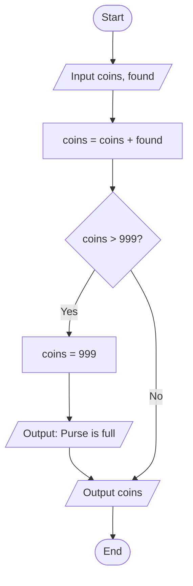

# Lab 1. An Algorithm in Pseudocode and a Flowchart

## Objective

Learn to turn a description of a game mechanic or a game calculation into an algorithm, write that algorithm as pseudocode and a flowchart, and check that it is correct by executing it by hand with a trace table.

## Note

Tasks marked `[extra]` are optional and count toward a higher grade.

## Task

Each student writes two algorithms:

- one for a game mechanic from _Part A_ and
- one for a game calculation from _Part B_.

Your task numbers depend on the last digit of your number in the group list. If the last digit is `d`, you do tasks `d` and `10 + d`. For example, a student with number 7 or 17 does tasks 7 and 17. The digit `0` means tasks 10 and 20.

The task descriptions do not list the inputs. Finding them in the text is part of the task. Use this rule:

- If a value is given as a number in the text, such as "the potion restores 20 health", it is a fixed game rule and is not an input.
- If a value is not given as a number, such as "the character's health", it is an input.

All input values are non-negative whole numbers. A yes-or-no answer is entered as a number: `1` means "yes" and `0` means "no". You do not need to handle invalid input.

Do Steps 1-4 for each of your two tasks.

### Step 1. Analyze the problem

Before writing any steps, work out what you are given and what you need to produce.

1. Find the inputs in the description. Give each value a variable name and explain in one phrase what it means.
2. List what the algorithm must output.

Use the same names in all the steps that follow.

### Step 2. The algorithm in pseudocode

Write the algorithm in pseudocode. Each line should describe one action, and the executor must not have to guess anything. Use the commands from Lecture 2 or you can use your own consistent notation.

You can place one condition inside another. If the description says that two conditions must both be true, write one `IF` inside the other.

This lab does not require loops.

### Step 3. The flowchart

Draw a flowchart of the same algorithm. Use the four blocks from Lecture 2:

- An oval for start and end.
- A rectangle for an action.
- A parallelogram for input and output.
- A diamond for a condition. A diamond has exactly two exits: "Yes" and "No".

Every path through the flowchart must reach the "End" block.

You can draw the flowchart in [draw.io](https://app.diagrams.net) or by hand on paper. Export a draw.io flowchart as PNG, or take a photo of a paper drawing. The photo must be sharp, with every label readable. Insert the image into the report.

### Step 4. Check the algorithm

1. Prepare at least three sets of input data:
   - a _normal case_ with typical values;
   - a _boundary case_, where a value sits exactly on the edge of a condition;
   - a _special case_, for example with a zero value.

   Together, the data sets must go through every branch of the algorithm at least once. Tasks with several conditions usually need more than three sets.

2. For each data set, work out the expected result before tracing, using only the task description.
3. Execute the pseudocode by hand and fill in a trace table.
4. Compare the traced result with the expected one.

If the results differ, find the step where they started to differ, fix both the pseudocode and the flowchart, and check it again. In the report, briefly describe the mistake you found and how you fixed it. A mistake that you found and fixed does not lower your grade.

### Step 5. Change the rules `[extra]`

Do this for one of your two tasks.

1. Swap two steps of the algorithm so that the result changes. Use a trace table to show which input data now give a wrong result.
2. Invent one new rule for the task, for example "on Mondays the merchant gives a 5-coin discount". Describe the rule in one sentence and update the pseudocode and the flowchart.

## Example

This example uses a mechanic that is not in the list. It is simpler than the listed tasks and only shows how to lay out the work.

> _Coin purse._ The character finds coins and puts them in a purse. The purse holds at most 999 coins. If there would be more, the extra coins are lost and the game prints "Purse is full". At the end, the game prints the number of coins in the purse.

**Problem analysis.** Inputs: `coins` - how many coins were in the purse, `found` - how many coins were found. The number 999 is given in the description, so it is a game rule, not an input. Output: the message "Purse is full" if the purse overflowed, and the final value of `coins`.

**Pseudocode.**

```text
INPUT coins
INPUT found

SET coins = coins + found

IF coins > 999
    SET coins = 999
    OUTPUT "Purse is full"
END IF

OUTPUT coins
```

**Flowchart.**



**Data sets.**

| Case     | `coins` | `found` | Expected result        |
| -------- | ------: | ------: | ---------------------- |
| Normal   |     100 |      50 | `150`                  |
| Boundary |     980 |      19 | `999`, no message      |
| Overflow |     990 |      20 | "Purse is full", `999` |
| Special  |       0 |       0 | `0`                    |

**Trace for `coins = 990`, `found = 20`.** A dash means nothing has been stored in that cell yet.

| Step | Instruction                 | `coins` | `found` | Output        |
| ---: | --------------------------- | ------: | ------: | ------------- |
|    1 | `INPUT coins`               |     990 |       - |               |
|    2 | `INPUT found`               |     990 |      20 |               |
|    3 | `SET coins = coins + found` |    1010 |      20 |               |
|    4 | `IF coins > 999`: true      |    1010 |      20 |               |
|    5 | `SET coins = 999`           |     999 |      20 |               |
|    6 | `OUTPUT "Purse is full"`    |     999 |      20 | Purse is full |
|    7 | `OUTPUT coins`              |     999 |      20 | 999           |

The result matches the expected one. Your report needs a table like this for every data set.

## Tasks

### Part A. Game mechanics

#### Task 1. Healing potion

The character drinks a potion. A small potion restores 20 health and a large one restores 50. The player chooses the potion with a number: `1` for small, `2` for large. The character may have been poisoned earlier, for example by a venomous enemy. The poison level is known before the character drinks the potion, and if it is greater than 0, the potion first cures the poison: the poison level becomes 0 and the amount of health restored is reduced by 10. Health cannot go above the maximum. If the character's health is 0, the potion has no effect: the game prints "The potion has no effect", and neither health nor poison changes. At the end, the game prints health and the poison level.

#### Task 2. Merchant

An item costs some number of coins. A customer who has made 5 or more purchases from this merchant gets a 10-coin discount, and a customer with 10 or more purchases gets a 25-coin discount instead. The discounted price cannot drop below 1 coin. If the character has enough coins, the price is paid and the game prints "Purchase complete". If the character does not have enough coins, but has at least 1 coin and is short by 5 coins or less, the merchant gives in: the character hands over all their coins and the game prints "The merchant agreed". In every other case the game prints "Not enough coins". At the end, the game prints the character's coins.

#### Task 3. Hitting an enemy

When the hit starts, the enemy's health is greater than 0. The character rolls a twenty-sided die, and the player enters the result, a number from 1 to 20. If the roll is 1, the hit misses: damage is 0 and the game prints "Miss". Otherwise damage equals the character's attack minus the enemy's defense, but is at least 1. If the roll is 20, this damage is doubled and the game prints "Critical hit". Damage is subtracted from the enemy's health. If the enemy's health becomes 0 or less, it is set to 0 and the game prints "Enemy defeated". At the end, the game prints the enemy's health.

#### Task 4. Experience and level

The maximum level is 10. If the character is already at level 10, no experience is added and the game prints "Maximum level". Otherwise the reward is added to experience. To reach the next level, the character needs experience of at least the current level multiplied by 100. If there is enough experience, the level goes up by 1, this threshold is subtracted from experience, and the game prints "Level up". If the character has now reached level 10, experience is set to 0. One reward can give at most one level. At the end, the game prints the level and the experience.

#### Task 5. Spike trap

The trap deals 40 damage. If the character's armor is 25 or more, the damage is reduced to 20. If the character has a shield, meaning shield durability is greater than 0, the shield takes the hit: damage is subtracted from shield durability. If shield durability is less than the damage, durability is set to 0, the remaining damage is subtracted from health, and the game prints "Shield broken". If there is no shield, all the damage is subtracted from health. If health becomes 0 or less, it is set to 0 and the game prints "Character died". At the end, the game prints health and shield durability.

#### Task 6. Locked door

The door can be opened with a key, with a lockpick, or by paying the guard 50 coins. The character tries these options in exactly this order and uses the first one available. If the character has a key, one key is used and the game prints "Door opened with a key". If there are no keys but there is a lockpick, the character tries to pick the lock. With agility of 15 or more, the door opens, the lockpick is not used up, and the game prints "Door opened with a lockpick". With lower agility, the lockpick breaks, the number of lockpicks goes down by 1, and the game prints "Lockpick broke". No coins are spent in this case. If there are no keys and no lockpicks but there are 50 coins or more, 50 coins are spent and the game prints "Door opened for coins". Otherwise the game prints "Door is locked". At the end, the game prints the number of keys, lockpicks, and coins.

#### Task 7. Fireball

The Fireball spell costs 30 mana and deals 45 damage to the enemy. If the enemy resists fire, the damage is reduced to 15. If there is enough mana, the mana is spent and the damage is subtracted from the enemy's health. If the enemy's health becomes 0 or less, it is set to 0 and the game prints "Enemy defeated". If there is not enough mana, the spell fails: the game prints "Not enough mana" and the character regains 10 mana. Mana cannot go above 100. At the end, the game prints the character's mana and the enemy's health.

#### Task 8. Round timer

A round lasts at most 120 seconds. If the character picked up an hourglass, 15 seconds are added to the remaining time, but the time cannot go above 120. Then the time spent on an action is subtracted from the remaining time. If the character's health is below 30, the character is wounded and acts more slowly, so twice the action time is subtracted. If the remaining time becomes 0 or less, it is set to 0 and the game prints "Time is up". Otherwise, if 10 seconds or less remain, the game prints "Hurry up". At the end, the game prints the remaining time.

#### Task 9. Level reward

If the player finished the level without taking any damage, a 200-point bonus is added to the score. The final score then decides the chest: 1000 points or more gives a gold chest, 500 points or more gives a silver chest, and anything else gives a wooden chest. The game prints the chest type. If the final score is higher than the high score, the high score is replaced with the final score and the game prints "New high score". At the end, the game prints the final score and the high score.

#### Task 10. Falling

A fall from a height of up to and including 3 meters deals no damage. From a greater height, damage equals the difference between the height and 3 meters, multiplied by 10. If the character lands in water, this difference is multiplied by 2 instead of 10. Damage is subtracted from health. If health becomes 0 or less, it is set to 0 and the game prints "Character died". Otherwise, if the damage was greater than 50, the game prints "Character stunned". At the end, the game prints health.

### Part B. Game calculations

In these tasks the game computes something with a formula: movement, damage, fuel use. The formula is always given, and you do not need to understand why it looks the way it does. Your job is to turn it into exact steps and handle the special cases from the description. The computer does not know physics either: it just carries out the calculations step by step.

Letters in the formulas are only there to keep them short. In your algorithm you can give the variables clearer names.

Each task includes a worked example with concrete numbers. It shows the order of the calculations. Use it to check your own work.

Division can give a fractional result. In your trace tables, write such values to two decimal places.

#### Task 11. Falling object

A game recalculates the position of objects many times per second. One such update is called a _frame_. In this task you describe one frame of an object falling.

Height `h` shows how high the object is above the ground. Speed `v` shows how many units the object drops per frame. First, gravity speeds the object up, and speed increases by 10: `v = v + 10`. Then the object drops by the new speed: `h = h - v`. If height becomes 0 or less, the object is on the ground: height and speed are both set to 0 and the game prints "Object landed". At the end, the game prints height and speed.

_Worked example_ for `h = 100`, `v = 20`:

1. `v = 20 + 10 = 30`.
2. `h = 100 - 30 = 70`.
3. Height `70` is greater than 0, so the object is still in the air.
4. Output: height `70`, speed `30`.

#### Task 12. Car braking

A car is driving in a straight line and the player has released the gas. Speed `v` shows how many meters the car travels per frame. Distance `s` shows how many meters the car has already traveled. Friction `f` slows the car down every frame.

In one frame, speed decreases by friction: `v = v - f`. Speed cannot drop below 0: if it is negative after the subtraction, it is set to 0. Then the distance increases by the new speed: `s = s + v`. If speed is 0, the game prints "The car stopped". At the end, the game prints speed and distance.

_Worked example_ for `v = 25`, `f = 4`, `s = 100`:

1. `v = 25 - 4 = 21`.
2. Speed `21` is not below 0, so it stays.
3. `s = 100 + 21 = 121`.
4. Speed is not 0, so there is no message.
5. Output: speed `21`, distance `121`.

#### Task 13. Time to target

A character is running to a meeting point, and the game shows how many seconds of running are left. Distance to the point `d` is in meters, speed `v` is in meters per second. Travel time equals distance divided by speed: `t = d / v`.

You cannot divide by zero. If speed is 0, the character is standing still: time is not calculated, the game prints "The character will not get there", and nothing else happens. Otherwise, time is calculated and printed. It is then compared with the time left in the round `r`: if travel time is not greater than `r`, the game prints "Will make it", otherwise "Will not make it".

_Worked example_ for `d = 150`, `v = 20`, `r = 10`:

1. Speed `20` is not 0, so division is allowed.
2. `t = 150 / 20 = 7.5`.
3. Output: `7.5`.
4. `7.5` is not greater than `10`, output: "Will make it".

#### Task 14. Bouncing ball

A ball hits the floor at speed `v` and loses part of its speed. Bounciness `e` is a percentage that shows how much speed is kept: at 100 the ball bounces back at the same speed, at 0 it does not bounce at all. Speed after the hit: `v = v * e / 100`.

If the new speed is below 5, the ball stops bouncing: speed is set to 0 and the game prints "The ball stopped". Otherwise the bounce counter `n` goes up by 1 and the game prints "Bounce". At the end, the game prints speed and the number of bounces.

_Worked example_ for `v = 40`, `e = 60`, `n = 3`:

1. `40 * 60 = 2400`.
2. `v = 2400 / 100 = 24`.
3. Speed `24` is not below 5, so the ball bounces.
4. `n = 3 + 1 = 4`, output: "Bounce".
5. Output: speed `24`, bounces `4`.

#### Task 15. Experience bar

An experience bar 200 pixels wide is drawn above the character. The character has `x` experience and needs `m` experience for the next level. The value `m` is always greater than 0.

First, the game calculates what percentage of the bar is filled: `p = x * 100 / m`. The bar cannot be more than 100 percent full: if `p` is greater than 100, it is set to 100. Then the game calculates the width of the filled part in pixels: `w = p * 200 / 100`. If the bar is 90 percent full or more, the game prints "Almost a new level". At the end, the game prints the percentage and the filled width.

_Worked example_ for `x = 150`, `m = 400`:

1. `150 * 100 = 15000`.
2. `p = 15000 / 400 = 37.5`.
3. `37.5` is not greater than 100, so it stays.
4. `37.5 * 200 = 7500`.
5. `w = 7500 / 100 = 75`.
6. `37.5` is below 90, so there is no message.
7. Output: percentage `37.5`, width `75`.

#### Task 16. Explosion damage

A bomb explodes near the character. The closer the character is to the center of the explosion, the more damage they take. Maximum damage at the center is `D`, the blast radius is `R` meters, and the distance from the character to the center is `d` meters. The radius is always greater than 0.

If the distance is not less than the radius, the blast does not reach the character: damage is 0 and the game prints "Character is outside the blast". Otherwise damage is calculated as `u = D * (R - d) / R`. The part in parentheses is calculated first. Damage is subtracted from health. If health becomes 0 or less, it is set to 0 and the game prints "Character died". At the end, the game prints damage and health.

_Worked example_ for `D = 80`, `R = 10`, `d = 4` and health `100`:

1. Distance `4` is less than radius `10`, so the character is hit.
2. `10 - 4 = 6`.
3. `80 * 6 = 480`.
4. `u = 480 / 10 = 48`.
5. Health: `100 - 48 = 52`, greater than 0.
6. Output: damage `48`, health `52`.

#### Task 17. Enough fuel

The player sends a truck to a nearby town. The town is `d` kilometers away and the tank holds `b` liters of fuel. Consumption `c` shows how many liters the truck uses per 100 kilometers. Consumption is always greater than 0.

First, the game calculates how much fuel the trip needs: `n = d * c / 100`. If the tank holds at least that much fuel, it is used: `b = b - n`, and the game prints "The truck arrived". Otherwise the truck drives until the fuel runs out. The distance it covers is `k = b * 100 / c`. The game prints "Out of fuel" and the distance `k`, and then the fuel in the tank is set to 0. At the end, the game prints the amount of fuel in the tank.

_Worked example_ for `d = 250`, `c = 8`, `b = 30`:

1. `250 * 8 = 2000`.
2. `n = 2000 / 100 = 20`.
3. `30` is not less than `20`, so there is enough fuel.
4. `b = 30 - 20 = 10`, output: "The truck arrived".
5. Output: fuel `10`.

#### Task 18. Player rank

After a three-round tournament, the player gets a rank. Call the scores for the first, second, and third rounds `a`, `b`, and `c`. The rank depends on the average score: `s = (a + b + c) / 3`. The scores are added first, and then the sum is divided by 3.

If the average is 80 or more, the game prints "Master". If the average is 50 or more, the game prints "Player". Otherwise the game prints "Beginner". Also, if the third-round score is higher than the first-round score, the game prints "Improving". At the end, the game prints the average.

_Worked example_ for `a = 70`, `b = 85`, `c = 90`:

1. `70 + 85 = 155`.
2. `155 + 90 = 245`.
3. `s = 245 / 3 = 81.67`.
4. `81.67` is not less than 80, output: "Master".
5. `90` is greater than `70`, output: "Improving".
6. Output: average `81.67`.

#### Task 19. Button click

The game menu has a rectangular button. A position on the screen is given in pixels by two numbers: `x` is counted from the left edge of the screen to the right, and `y` from the top edge down.

The top-left corner of the button is at `bx`, `by`. The button's width is `w` and its height is `h`. So the right edge of the button is at `bx + w` and the bottom edge is at `by + h`. The cursor at `x`, `y` is on the button if `x` is not less than the left edge and not greater than the right edge, and `y` is not less than the top edge and not greater than the bottom edge.

A button can be disabled. If the player clicks outside the button, the game prints "Missed". If the player clicks a disabled button, the game prints "Button is disabled". If the player clicks an enabled button, the game prints "Button pressed".

_Worked example_ for `bx = 100`, `by = 50`, `w = 120`, `h = 40`, a cursor at `x = 150`, `y = 70`, and an enabled button:

1. Right edge: `100 + 120 = 220`.
2. Bottom edge: `50 + 40 = 90`.
3. `150` is not less than `100` and not greater than `220`, so the click is inside horizontally.
4. `70` is not less than `50` and not greater than `90`, so the click is inside vertically.
5. The button is enabled, output: "Button pressed".

#### Task 20. Enemy spots the player

In a side-view game, characters move left and right. A character's position is its distance in meters from the left edge of the level. The enemy stands at `e`, the player at `p`, and the enemy can see `r` meters around itself.

The distance between the enemy and the player is the larger position minus the smaller one. If `p` is not less than `e`, then `d = p - e`, otherwise `d = e - p`. If the distance is 2 or less, the game prints "Enemy attacks". Otherwise, if the distance is not greater than the sight range, the game prints "Player spotted". Otherwise the game prints "All quiet". At the end, the game prints the distance.

_Worked example_ for `e = 40`, `p = 25`, `r = 20`:

1. `25` is less than `40`, so `d = 40 - 25 = 15`.
2. `15` is greater than 2, so the enemy does not attack.
3. `15` is not greater than `20`, output: "Player spotted".
4. Output: distance `15`.

## Report

Write the report in Microsoft Word using the template [`report-template-en.docx`](./report-template-en.docx) and submit it as a single `.docx` file. Fill in the title page. Text in square brackets is a hint: replace it with your own text and delete the hints.

For each of your two tasks, the report contains:

1. The task number, its title, and its description.
2. The problem analysis.
3. The pseudocode.
4. The flowchart.
5. The data sets with expected results and the trace tables.
6. A description of any mistakes you found and fixed.

Any completed `[extra]` tasks and the conclusions go at the end of the report.

The report is graded on:

- whether the algorithm is correct for all data sets;
- whether the inputs are identified correctly;
- whether the pseudocode and the flowchart match each other, with the same order of steps and the same names;
- the choice of data sets, especially the boundary cases;
- whether the trace tables are correct.

## Review questions

1. Which properties of an algorithm does the instruction "deal enough damage to the enemy" break?
2. Why can the assignment `SET health = health - damage` not be read as a mathematical equation?
3. How can you tell inputs apart from fixed game rules when reading a task description?
4. How is a boundary case different from a normal case, and why should it be checked separately?
5. How can a trace table help you find the step where an algorithm started to go wrong?
6. Pick two steps in one of your tasks whose order matters. What changes if you swap them?
7. Why should you check that the divisor is not zero before dividing? In which Part B task does this matter?
